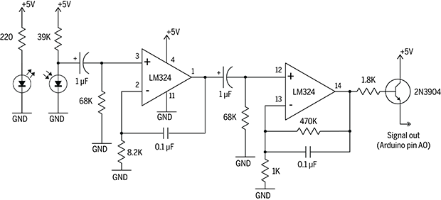
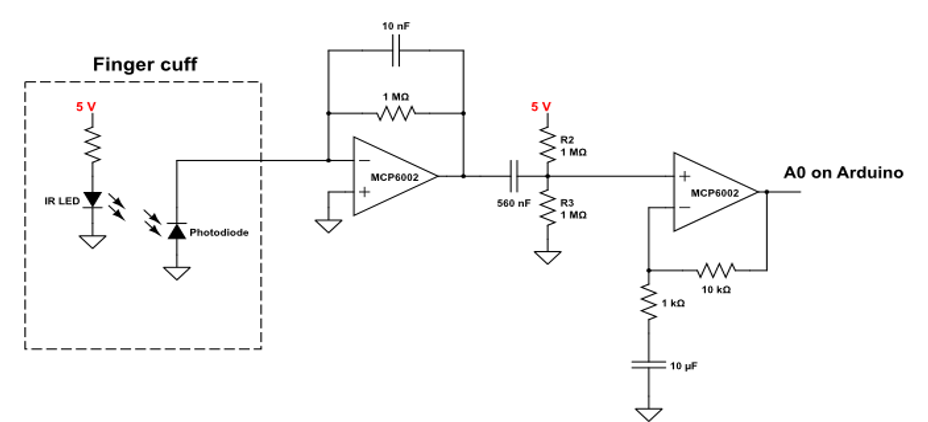
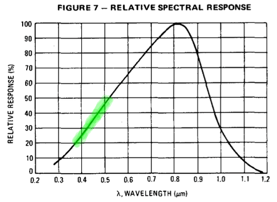
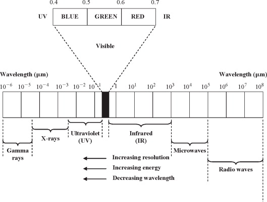
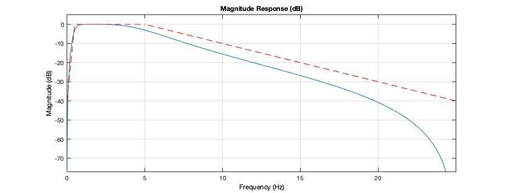

# DIY Sensor de Pulso IR

Já foram realizados 2 testes: [Sensor Pulsação - Teste #1](QRD1114.html) e [Sensor Pulsação - Teste #2](QRD1114_teste2.html), ambos usando o QRD1114 (disponível em quantidade no Almoxarifado do curso). Nenhum deles geraram resultados promissores. Partindo então para outra abordagem usando outro sensor/circuito.

Neste caso, um novo teste é realizado usando o MRD500.

**Diagrama elétrico**

Baseado na solução proposta por [Makezine: Infrared Pulse Sensor](https://makezine.com/projects/ir-pulse-sensor/) (acessado em 03/10/2024):



Noque os Amp.Op.s LM324 atuam como amplificadores e já contêm filtros passa-faixa para tratar o sinal de entrada capturado via led (diodo) foto-detector.

Já [Instructables: DiY Arduino Pulse Sensor]() (acessado em 03/10/2024), propõe outro circuito:



Mas neste caso, o foto-detector nem está "polarizado".

## Testes

Foi montada apenas a seção de entrada do circuito proposto por  [Makezine: Infrared Pulse Sensor](https://makezine.com/projects/ir-pulse-sensor/), usando o **MRD500** no lugar no led detector de IR e um led emissor de luz **verde**! (lembrar de [Sensor de Pulso](senssor_pulso.html)).

O [Data sheet da Motorola](https://s3-us-west-2.amazonaws.com/oww-files-public/1/11/MRD500.pdf) (fabricante do MRD500) recomenda a seguinte ligação elétrica para seu foto-detector:


Note que o mesmo é usado de "modo reverso", isto é, a corrente que circula pelo circuito (modo reverso) é proporcional a intensidade luminosa recebida. É capaz de circular 1,2 $\mu A/mW/cm^2$ Min (segundo informaçoes do Data Sheet). Este diodo suporta tensão reversa máxima de 100 Volts.

Segue **pinagem do MRD500** (foto-diodo):


A curva de resposta deste diodo segue abaixo:


Nota-se que ele trabalha melhor com tensões reversas $\ge$ 10 Volts. Mas vamos aplicar 5 Volts. Isto resulta numa corrente reversa no intervalo [0,9   43] $\mu A$. Ou seja, se fosse usado o resistor de "carga" sugerido de 50 $\Omega$, teríamos uma tensão de saída oscilando na faixa de [0,000 045  0,00215] Volts. Razão pela qual temos que aumentar consideravelmente o valor deste resistor. Se fosse usado um resistor de 10 K$\Omega$ obteremos uma resposta na faixa de [0,009   0,43] Volts. Aumentando este resistor para 1 M$\Omega$ obteriámos uma tensão de saída na faixa de [0,9   43] Volts. Então percebemos que é melhor tentar com um resistor série de 100 K$\Omega$ ( $5 \text{ Volts}/43  \times 10^{-6} \text{ A} = 116,28 \;K\Omega$ ), pode-se então esperar uma tensão variando na faixa de 90 mVolts até 4,3 Volts.

$R_s=$ 100 K$\Omega$ (marrom, preto, amarelo, dourado).

Note também que a sensibilidade desde sensor varia conforme o comprimento de onda da luz incidente sobre o mesmo:



Note que o mesmo é mais sensível para a faixa de visível do vermelho indo para o infra-vermelho:



**Mas** vamos usar um **led verde** porque esta cor é melhor absorvida pela hemoglobina do sangue. Um led verde comum emite no comprimento de onda na faixa de [395  530] nm, que infelizmente não coincide com a melhor faixa de sensibilidade deste sensor.

## Teste 1

Em função de componentes prontamente disponíveis no momento deste teste, foram usados 2 resistotes em série de 10 K$\Omega$, o que faria a tensão na saída do foto-diodo variar na faixa de 18 mV até 0,86 V. Considerando que a tensão de referência do A/D do Arduíno é de 5 Volts e que o mesmo é de 10-bits, significa valores excursionando na faixa de: 22 até 28. 

**Valores práticos obtidos** 

Na prática o valor médio medido ficou na faixa dos 25, o que equivale a uma tensão de 122 mV $(25\cdot 5/1024)$, com consequentemente uma corrente reversa circulando de 2,44 mA.

Modificando o código já usado em testes anteriores (ver [Sensor Pulsação - Teste #1](QRD1114.html)) para realizar uma captura de dados (teste) **mas** a uma taxa de amostragem aproximada de 5 Hz, ou $T=1/5=$ 200 ms (variável `TS` = 200), foi obtido o seguinte gráfico:


Obs.: nos últimos 3 à 4 segundos da captura, o sensor está lendo dados com o dedo sendo retirado (a idéia era perceber como os valores variam neste caso).

**Continuando...**

Aparentemente estes resultados são promissores, mesmo usando resistor de carga do foto-detector com valor de 20 K$\Omega$ ao invés dos 100 K$\Omega$ previstos inicialmente. Mas o que mais falta realizar para determinar o "BPM"!?

## Filtro Passa-Faixa

É esperado medir pulsação na faixa de 30 à 330 BPM o que equivale a um sinal variando entre 0,5 à 5 Hz (apenas). 

Se percebe pela captura de dados anterior (próximo do esperado relatado em [Sensor de Pulso](sensor_pulso.html) e [Monitor de frequência de pulso](pulse_monitor.html)) que o nível DC do sinal captado não nos interessa. Se faz necessário detectar uma oscilação sobreposta sobre outra e pode existir ainda uma terceira oscilação "de fundo" (frequência muito baixa) que deve ser descartada pois é causada por movimentação física do sensor/dedo. Como  frequências acima de 5 Hz não são esperadas para a informação que queremos obter, então se faz necessário acrescentar um filtro passa-faixa com frequências de corte em 0,5 e 5 Hz. 

Supondo que vamos trabalhar com uma taxa de amostragem $10 \times$ superior a maior frequência esperada para o nosso sinal, significa trabalhar com $f_s=50$ Hz ou $T=0,02$ segundos.

Podemos projetar um [filtro Butterworth digital usando o Matlab](https://fpassold.github.io/Process_Sinais/butter1.html):

A função `[a, b] = butter(ordem, [f_low, f_hight])` pede os seguintes argumentos:

- O primeiro parâmetro, a ordem do filtro, controla a inclinação (taxa de *roll-off*) da curva de resposta de frequência. Uma ordem mais alta resulta em uma curva mais íngreme e requer mais cálculos para sua implementação;
- O segundo parâmetro, as frequências de corte do filtro. O valor está entre 0 e 1, sendo 1 correspondente à frequência de Nyquist.
- O terceiro parâmetro especifica o tipo de filtro, ou seja, ‘**low**’ → passa baixa; ‘**high**’ → passa alta; ‘**stop**’ → rejeita-faixa; ‘**bandpass**’ → passa banda. Ao projetar um filtro rejeita faixa (*stop band*) ou passa-banda, duas frequências de corte devem ser especificadas, por exemplo: `[b a] = butter(1, [0,25 0,6],'stop');`

Então um filtro de 2a-ordem Butterworth passa-faixa para este caso, resultaria algo como:

```matlab
>> fs=50;	% freq. de amostragem
>> f_Nyq=fs/2	% freq. de Nyquist
f_Nyq =
    25
>> %   1.0  --- 25 Hz
>> % f_low  --- 0,5 Hz
>> % f_high --- 5 Hz
>> f_low=(0.5*1)/25
f_low =
         0.02
>> f_high=5/25
f_high =
          0.2
>> [b, a] = butter(2, [f_low, f_high])
b =
     0.056448            0      -0.1129            0     0.056448
a =
            1      -3.1595       3.7927      -2.0826      0.45045
>> h = fvtool(b,a);		% Visualizando filtor
>> % Indicando na ferramenta "Filter Visualization Tool", a fs = 50 Hz
```

Indicando na ferramenta "**Filter Visualization Tool**", a $f_s =$ 50 Hz, obtemos o seguinte gráfico:



A função transferência deste filtro ficaria:

```matlab
>> T=1/fs
T =
         0.02
>> H=tf(b, a, T);
>> zpk(H)
 
             0.056448 (z+1)^2 (z-1)^2
  -----------------------------------------------
  (z^2 - 1.914z + 0.9186) (z^2 - 1.245z + 0.4904)
 
Sample time: 0.02 seconds
Discrete-time zero/pole/gain model.
>> pole(H)
ans =
      0.95707 +   0.051172i
      0.95707 -   0.051172i
      0.62266 +    0.32039i
      0.62266 -    0.32039i
>> zero(H)
ans =
           -1 + 1.1141e-08i
           -1 - 1.1141e-08i
            1 +          0i
            1 +          0i
```

O diagrama de ROC (plano-z) deste filtro ficaria como:


A [eq. de diferenças do flltro](https://fpassold.github.io/Process_Sinais/funcao_filter.html), no Matlab (respeitando a forma como variam os índices das matrizes no mesmo) fica:

$\begin{array}{rcll}
a(1)*y(n) &=& b(1)*x(n) &+& b(2)*x(n-1) + ... + b(nb+1)*x(n-nb) +\\
          & &           &-& a(2)*y(n-1) - ... - a(na+1)*y(n-na) \end{array}$

Ou:

```matlab
>> a'
ans =
            1
      -3.1595
       3.7927
      -2.0826
      0.45045
>> b'
ans =
     0.056448
            0
      -0.1129
            0
     0.056448
```

Então:

$\begin{array}{rcllll} y[n] &=& 0,056448 x[n] &  & -0,1129 x[n-2] & & + 0,056448 x[n-4] +\\ 
                   & & & + 3,1595 y[n-1] & -3,7927 y[n-2] & +2,0826 y[n-3] & -0,45045 y[n-4] \end{array}$

Note que não existem parâmetros para as amostras atrasadas $x[n-1]$  e $x[n-3]$, eles são nulos.

A equação acima é a que dever ser implementada num código C++ no Arduíno.

## Falta Detector de picos 

Falta acrescentar detector de picos (usando derivada sobre o sinal filtrado) e determinação/cálculo dos períodos entre os picos para só então terminar determinando o BPM atual.

[Parte 2](DIY_parte2.html) |

----

Fernando Passold, em 03/10/2024

