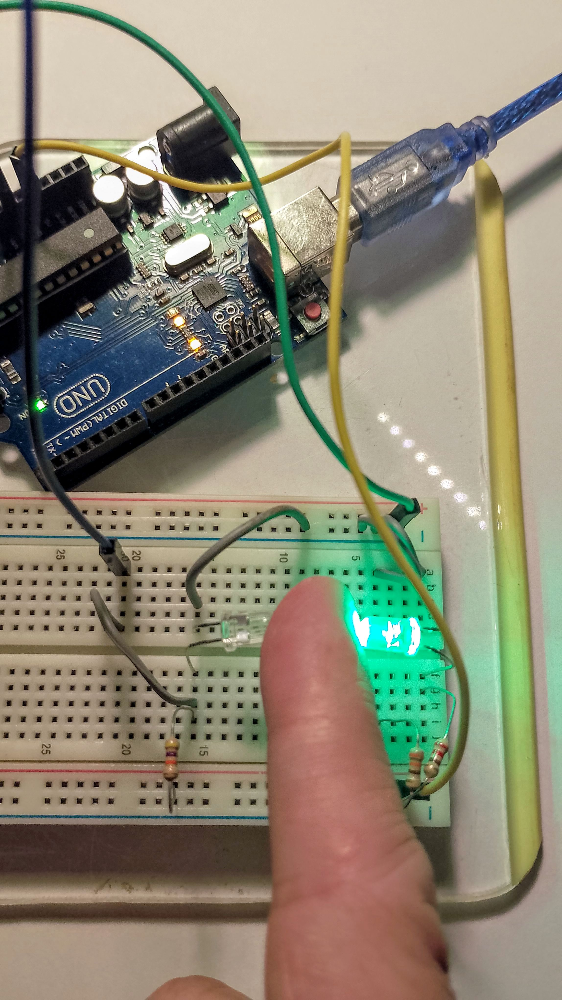
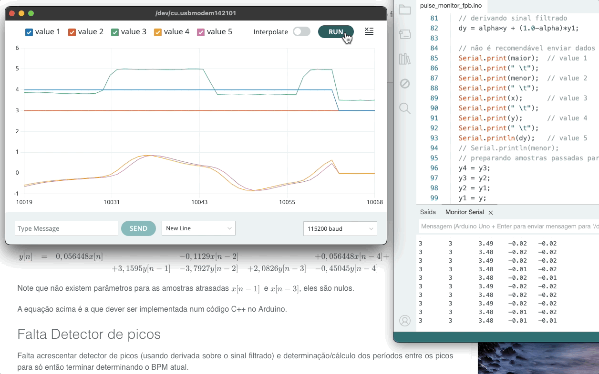

# DIY Sensor de Pulso IR (Parte 2)

Continução de [DIY Sensor de Pulso IR](Pulse_Monitor/%20DIY_Sensor_Pulso_IR.html).

## Circuito usando foto-detector

A idéia agora é verificar se com um foto-detector IR obtemos um circuito eletrônico mais sensível às pulsações.

| Pinagem Led comum | Pinagem Foto-Detector |
| :---: | :---: |
|  |  |

Note que estes componentes são fisicamente similares mas não iguais.

## Setup Físico

Fisicamente a montagem ficou como mostrado nas próximas figuras:


## Software

Implementando uma IR para rodar à $f_s=$ 50 Hz, ou $T=$ 0,02 segundos. Usado **Timer 2**, evitando conflitos como possível uso de funções `delay`, `milis`, etc. Timer 2 é de 8-bits. Realizando cálculos:

```matlab
> fs = 50;
>> T=1/fs
T =
         0.02
>> CS2=[1 8 32 64 128 256 1024];
>> CMR2=(16E6./(CS2*fs))-1
CMR2 =
      3.2e+05        39999         9999         4999         2499         1249        311.5
>> % menor valor = 311 que "não cabe" em 8-bits
```

Pode-se usar o **Timer 1**, que é de 16-bits. Recalculando:

```matlab
>> % Mudando para timer 1
>> CS1=[1 8 64 256 1024];
>> CMR1=(16E6./(CS1*fs))-1
CMR1 =
      3.2e+05        39999         4999         1249        311.5
```

Adotando prescaler para timer no valor de 256 (CS12=1; CS11=0; CS10=0) e fazendo CMR1=1249.

Código para Arduíno (pulse\_monitor\_2.ino):

```C++
/* Monitor de pulsação
   Teste usando foto-detector
   Fernando Passold, em 10/10/2024
*/

const byte analogPin = A0;    // pino (A/D) que recebe sinal analógico
int x;  // dados lidos no A/D 0 do Arduíno

void setup() {
  // put your setup code here, to run once:

  // Programando a ISR à 50 Hz usando timer 1
  cli();//stop interrupts
  //set timer1 interrupt at 50 Hz
  TCCR1A = 0; // set entire TCCR1A register to 0
  TCCR1B = 0; // same for TCCR1B
  TCNT1  = 0; //initialize counter value to 0
  // set compare match register for 1hz increments
  OCR1A = 1249;  // = (16*10^6) / (50*256) - 1 (must be <65536)
  // turn on CTC mode
  TCCR1B |= (1 << WGM12);
  // Set CS12 bits for 256 prescaler
  TCCR1B |= (1 << CS12);  
  // enable timer compare interrupt
  TIMSK1 |= (1 << OCIE1A);

  Serial.begin(115200);     //  setup serial
  while (!Serial) {
    ;  // Aguarda até que a porta serial esteja pronta - normalmente 10 ms
  }
  Serial.println(" ");
  Serial.println("Monitorando foto-detector: ");

  sei();//allow interrupts
}

ISR(TIMER1_COMPA_vect){//timer1 interrupt 1Hz toggles pin 13 (LED)
  // Atualiza varíavel x contendo valor lido em A0
  x = analogRead(analogPin); // *(5.0/1024.0);  // converte para faixa 0 á 5 Volts
  // não é recomendável enviar dados pela serial dentro de um ISR, mas testando...
  Serial.println(x); 
}

void loop() {
  // put your main code here, to run repeatedly:
  // nada a ser feito aqui
}
```

Este código permitiu capturar a seguinte sequência de dados:


Os últimos segundos de captura mostrados (nível do sinal aumenta), correspondo ao que ocorre quando usuário remove o dedo do conjunto sensor.

Não corresponde ao tipo de sinal desejado ⚠️

## Novo setup físico

Uma nova configuração física  para o conjunto sensor foi testada:



E desta forma foram obtidos os seguintes dados:

1. Sem o dedo posicionado entre os sensores leitura na faixa: [417  432].

2. Com o dedo "bloqueando" o fluxo de luz, a leitura varia na faixa: [1015. 1023]:

   

Vamos tentar trabalhar com este "setup"...

## Aplicando o filtro passa-faixa

Código (pulse\_monitor\_fpb.ino):

```c++
/* Monitor de pulsação
   Teste usando foto-detector
   Rotina com Filtro Passa Faixa
   Fernando Passold, em 10/10/2024
*/

const byte analogPin = A0;    // pino (A/D) que recebe sinal analógico
const byte monitor_isr = 7;   // pino 7: para monitor freq e dutty-cycle da ISR (osciloscópio)
bool state = 0;               // variável ativada dentro da ISR (monitar ISR)
float alpha = 0.1;            // associado com filtro derivativo

float x;  // dados lidos no A/D 0 do Arduíno
float y;  // sinal x filtrado
int maior, menor; // atualiza em "tempo-real" valores máximos e mínimos (limites Serial Plot)

float x1, x2, x3, x4;   // valores amostras passadas sinal de entrada x
float y1, y2, y3, y4;   // valores amostras passadas sinal de saída y (sinal filtrado)
// Parâmetros do filtro (calculados usando Matlab)
float b0 = 0.056448;
float b2 = -0.1129;
float b4 = 0.056448;
float a0 = 1;
float a1 = -3.1595;
float a2 = 3.7927;
float a3 = -2.0826;
float a4 = 0.45045;

float dy;    // derivada primeira do sinal filtrado

void setup() {
  // put your setup code here, to run once:

  // Programando a ISR à 50 Hz usando timer 1
  cli();//stop interrupts
  //set timer1 interrupt at 50 Hz
  TCCR1A = 0; // set entire TCCR1A register to 0
  TCCR1B = 0; // same for TCCR1B
  TCNT1  = 0; //initialize counter value to 0
  // set compare match register for 1hz increments
  OCR1A = 1249;  // = (16*10^6) / (50*256) - 1 (must be <65536)
  // turn on CTC mode
  TCCR1B |= (1 << WGM12);
  // Set CS12 bits for 256 prescaler
  TCCR1B |= (1 << CS12);  
  // enable timer compare interrupt
  TIMSK1 |= (1 << OCIE1A);

  pinMode(monitor_isr, OUTPUT);
  digitalWrite(monitor_isr, LOW);

  Serial.begin(115200);     //  setup serial
  while (!Serial) {
    ;  // Aguarda até que a porta serial esteja pronta - normalmente 10 ms
  }
  Serial.println(" ");
  Serial.println("Monitorando foto-detector: ");

  // inicializa valores máximos e mínimos
  maior = 0;
  menor = 1023;
  // inicializando amostras atrasadas sinal de entrada
  x1 = 0; x2 = 0; x3 = 0; x4 = 0;
  // inicializando amostras atrasas sinal saída filtro
  y1 = 0; y2 = 0; y3 = 0; y4 = 0;
  dy = 0;

  sei();//allow interrupts
}

ISR(TIMER1_COMPA_vect){//timer1 interrupt 1Hz toggles pin 13 (LED)
  digitalWrite(monitor_isr, HIGH);
  // Atualiza varíavel x contendo valor lido em A0
  x = analogRead(analogPin)*(5.0/1024.0);  // converte para faixa 0 á 5 Volts
  // if (x > maior) maior = x;
  // if (x < menor) menor = x;
  // Aplicando fitro Passa-Faixa sobre sinal de entrada x
  // Saída filtrada em y
  y = b0*x + b2*x2 + b4*x4 - a1*y1 - a2*y2 - a3*y3 - a4*y4;
  if (x > maior) maior = x;
  if (x < menor) menor = x;
  // derivando sinal filtrado
  dy = alpha*y + (1.0-alpha)*y1;

  // não é recomendável enviar dados pela serial dentro de um ISR, mas testando...
  Serial.print(maior);  // value 1
  Serial.print(" \t");
  Serial.print(menor);  // value 2
  Serial.print(" \t"); 
  Serial.print(x);      // value 3
  Serial.print(" \t");
  Serial.print(y);      // value 4
  Serial.print(" \t");
  Serial.println(dy);   // value 5
  // Serial.println(menor);
  // preparando amostras passadas para próxima chamada da ISR
  y4 = y3;
  y3 = y2;
  y2 = y1;
  y1 = y;
  x4 = x3;
  x3 = x2;
  x2 = x1;
  x1 = x;
  digitalWrite(monitor_isr, LOW);
}

void loop() {
  // put your main code here, to run repeatedly:
  // nada a ser feito aqui
}
```

Resultado obtido:



Obs.: durante os primeiros 3/4 da captura mostrada na figura anteiror, o dedo "oscilava" entre o led emissor verde e o foto acoplador. Propositalmente para testar se o filtro digital e derivada estão funcionando. Apenas os últimos segundos do gráfico correspondem ao dedo bloqueando estaticamente o fluxo de luz. E nesta condição, se percebe pelo sinal filtrado que não parece ser possível recuperar a informação esperada.

Através do osciloscópio (conectado ao pino 7, `monitor_isr`) se comprova que a ISR está sendo executada obdecendo à $f_s$ estilpulada e que ainda "sobra" poder de processamento. Ela levou $\Delta t = $1,4 mili-segundos para ser executada, resultando um "duty-cycle" de 7,22%:


Mostrando apenas o sinal bruto e o sinal filtrado com o dedo posicionado de forma estática bloqueando o fluxo luminoso temos:


:o()


---

Fernando Passold, em 10/10/2024.


