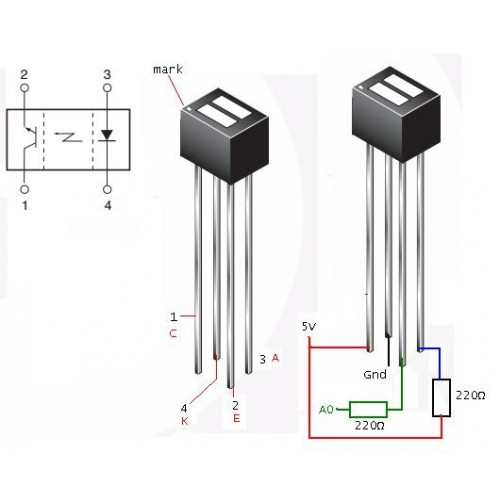
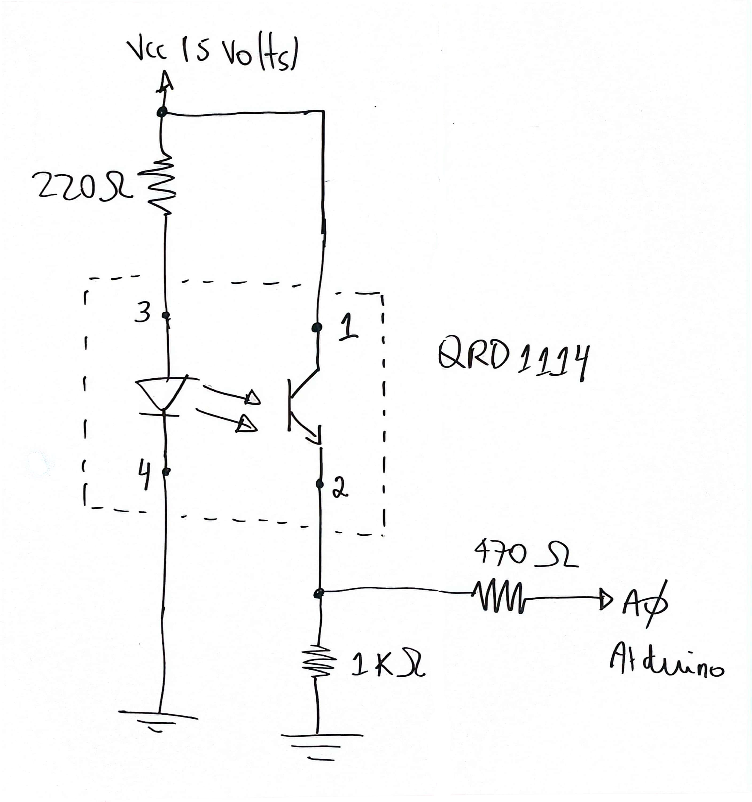
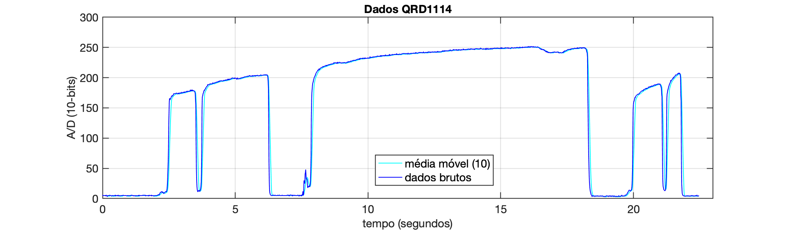
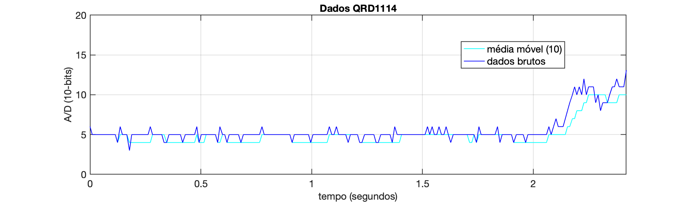
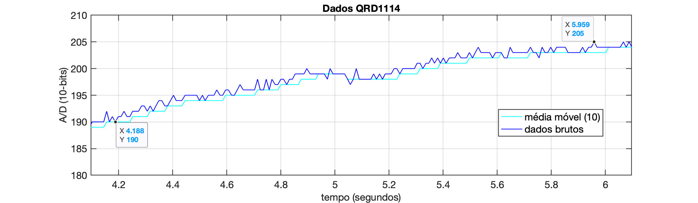
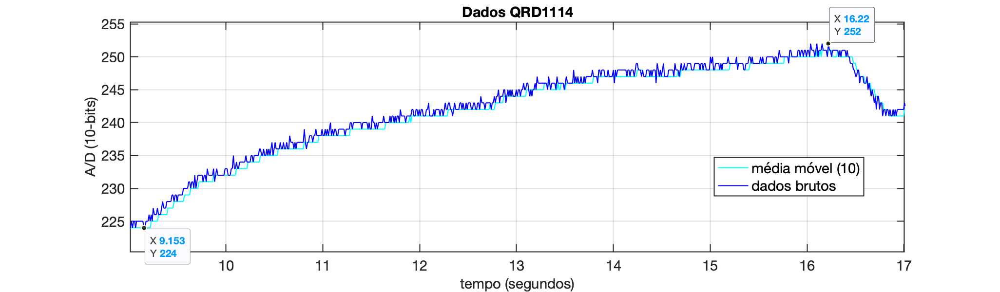
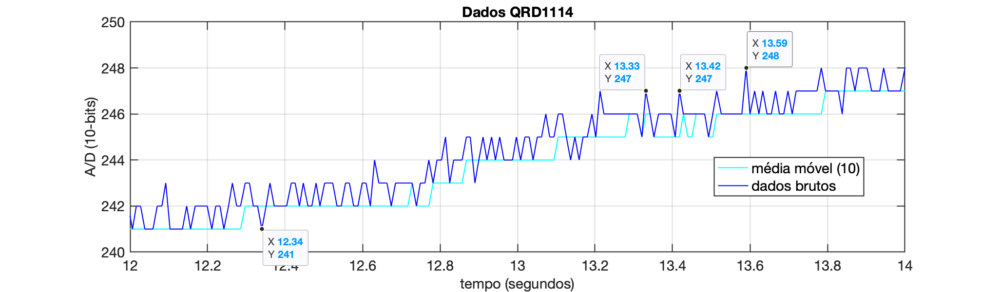

# Sensor Pulsação - Teste #1

Usando foto-acoplador IR, QRD 1114 conforme mostrado na figura abaixo:



Dados: 30 $\le$ Batimentos cardíacos $\le$ 300 batidas (picos)/minuto → 0,5 $\le f \le$ 5 Hz.

**Taxa de Amostragem**

Amostrar 20 pontos dentro do ciclo de uma senóide à 5 Hz → $20 \times 5 = 100$ Hz ou $T=1/100=0,01$ segundos. 

Ou amostrar 10 pontos por ciclo numa seóide à 5 Hz → $10 \times 5=50$ Hz, o que impica numa taxa de amostragem de 0,02 segundosz.

**Parte Eletrônica**

Esquema elétrico proposto:



Código exemplo → `QRD1114_teste1.ino`:

```C++
/***
 Testando foto-acoplador QRD1114 como sensor de pulsação
 Fernando Passold, em 27/09/2024

 Dado de entrada: valor lido na saída do QRD1114 (pino 2 = Emissor) que está 
 em série com resistor de 220 Ohms conectado à entrada A0.

 30 <= Batimentos cardíacos <= 300 BPM
 0,5 <= f <= 5 Hz
 Amostrando 50 pontos em 5 Hz, resulta: fs = 50*5 = 250 Hz, T = 1/250 = 0,004 
****/

#define NUM_SAMPLES 10
#define TS 10 // taxa de amostragem em ms

const byte analogPin = A0;    // pino (A/D) que recebe sinal analógico
// const byte PIN_LED = 5;       // Led à ser "controlado", no pino 5 (ou 6)
int x;  // Variável que contém a nova amostra lida
int y;  // valor filtrado
int samples[NUM_SAMPLES]; // Array para armazenar as últimas 10 amostras
int sampleIndex = 0; // Índice circular para o array de amostras
long sum = 0; // Soma das últimas 10 amostras (usando long para evitar overflow)
int numSamplesCollected = 0; // Contador de amostras coletadas

unsigned long time;

void setup() {
  // put your setup code here, to run once:
  // pinMode(PIN_LED, OUTPUT);
  // digitalWrite(PIN_LED, LOW); // led inicia apagado
  Serial.begin(115200);     //  setup serial
  while (!Serial) {
    ;  // Aguarda até que a porta serial esteja pronta - normalmente 10 ms
  }
  Serial.println(" ");
  Serial.println("Saída QRD1114: ");
}

void loop() {
  // put your main code here, to run repeatedly:
  // time = micros();
  time = millis();
  x = analogRead(analogPin); // *(5.0/1024.0);  // converte para faixa 0 á 5 Volts
  sum -= samples[sampleIndex];  // Remove a amostra mais antiga da soma
  samples[sampleIndex] = x; // Armazena a nova amostra no array
  sum += x; // Adiciona a nova amostra à soma
  sampleIndex = (sampleIndex + 1) % NUM_SAMPLES;  // Avança o índice circular
  // Conta o número de amostras coletadas até que tenhamos coletado 10 amostras
  if (numSamplesCollected < NUM_SAMPLES) {
    numSamplesCollected++;
  }
  // Calcula a média móvel continuamente
  y = sum / numSamplesCollected;
  Serial.print(time);
  Serial.print(" \t");
  Serial.print(x);
  Serial.print(" \t");
  Serial.println(y);
  delay(TS); // não garante período entre amostras de 4 ms... mas vamos tentar...
}
```

Usando o script em Python: `capture_serial_data.py`, obtemos o seguinte arquivo texto `dados_capturados_1.txt` resultando em algo como:

```
Saída QRD1114:
0 	6 	6
10 	5 	5
20 	5 	5
30 	5 	5
41 	5 	5
52 	5 	5
62 	5 	5
72 	5 	5
82 	5 	5
94 	5 	5
104 	5 	5
114 	5 	5
124 	4 	4
...
2452 	33 	15
2462 	45 	18
2473 	60 	23
2484 	81 	30
2494 	123 	41
2505 	142 	54
2515 	161 	69
2527 	166 	85
2537 	163 	99
2548 	164 	113
2558 	165 	127
2570 	166 	139
2580 	167 	149
2591 	168 	158
2601 	170 	163
2613 	170 	166
...
```

Percebe-se que a taxa de amostragem não é exatamente os 10 mili-segundos requeridos.

Separando apenas os dados números no arquivo `dados_1.csv`, podemos com auxílio do Matlab, obter o seguinte gráfico: 



Resultado de uma captura de 22,462 segundos, 2100 pontos.

Nota-se:

* Vales com amplitudes muito baixas, quando não há um dedo sobre o sensor;

  

* Vales com amplitudes maiores capturados com dedo encostado no sensor.

  

  Nota-se neste último gráfico que não parece estar sobreposto uma "pulsação" sobre o sinal medido. Este circuito elétrico é de baixa sensibilidade para permitir detectar a pulsação. O resultado não varia muito mudando o foco da captura de dados para outra região:

  

  Ou realizando um pouco mais de "zoom":

  

  Este último gráfico permite tentar detectar a pulsação:

  ```matlab
  >> delta_t=13.42-13.33
  delta_t =
           0.09
  >> f=1/delta_t	% pulsação em Hz
  f =
         11.111
  >> f*60			% pulsação em BPM
  ans =
         666.67
  ```

  Nota-se uma frequência muito exagerada (incorreta). 
  
  Além de uma baixa variação de amplitude: [245, 247], apenas 2 passos (degraus) do conversor A/D de 10-bits. Uma variação muito baixa de amplitude. Cada passo (degrau) do A/D corresponde à $5/2^{10}=4,8828$ mili-Volts; 2 passos resulta em variação de apenas 9,7656 mV.

Resultado das leituras: com taxa de amostragem de 10 ms:

* sem dedo: valores variando entre: 69 à 72;
* com dedo: valores variando entre: 228 à 260 (varia conforme posicionamento do dedo no sensor).

**Conclusão**: mudar a configuração elétrica usada com este sensor ou mudar de foto-acoplador!

Esta configuração elétrica parece mais adequada para medir proximidade (distância). Este circuito é mais sensível à aproximação do dedo ao sensor do que à variação de luminosidade na ponta do dedo causada pela pulsação.

\>> [Teste 2](QRD1114_teste2.html)

---

Fernando Passold, em 27/09/2024

