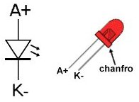

# Sensor Pulsação - Teste #2

O primeiro teste usando o QRD1114 não alcançou resultados promissores (ver [Teste 1](QRD1114.html)).

Modificando a configuração elétrica para:

Inspirado em: [QRD1114 Optical Detector Hookup Guide - SparkFun Learn](https://learn.sparkfun.com/tutorials/qrd1114-optical-detector-hookup-guide/all):

Com ligeiras modificações:

* R1 foi mantido em 220 $\Omega$ (vermelho, vermelho, marrom, dourado);
* R2 continua sendo de 10 K$\Omega$ (marrom, preto, laranja, dourado).

Considerando detalhes do QRD1114:

E pinagem de um led comum:

O código para captura dos dados será refeito, usando interrupção com taxa de amostragem correspondendo à 50 pontos/ciclo de sinal máximo de 5 Hz, o que resulta $f_s=$ 250 Hz, ou $T=$ 0,004 segundos.

**Primeiro teste**

Sem taxa de amostragem, mais para capturar dados e perceber se quando o dedo está pressionado contra o sensor, se é possível detectar ondulação na luminosidade como resposta às pulsações.

Usando mesmo código simples já testado anteriormente: `QRD1114_teste1.ino`. Este código juntamente com o o script em Python `capture_serial_data.py`, permite caputar um arquivo texto com dados reais. Estes últimos arquivos estão na pasta: `/Volumes/DADOS/Users/fpassold/Documents/UPF/Lab_Processa_Sinais/2024_2/Pulse_Monitor/..`. Detalhe, o script `capture_serial_data.py` **não** funciona se o IDE do Arduíno também estiver ativo (diferentes aplicativos tentando acessar o mesmo recurso, no caso de um Mac: `/dev/cu.usbmodem14201`).

Neste caso, obtemos um resultado como:

Sem o dedo no sensor:

O `value2` , única variável mostrada no gráfico do "Serial Plotter" da IDE do Arduino só mostra (intencionalemente), o dado bruto assim como medido pelo A/D de 10-bits do Arduino (possibilitando leituras na faixa [0  1024]).

Perceber a faixa de variação dos valores. Ocorre uma alteração no meio deste teste porque intencionalmente é desligada uma lámpada/projetor sobre o sensor, o que mostra a sensibilidade deste circuito quanto à ruídos na linha de alimentação mas nem tanto em relação à iluminação externa.

Colocando o dedo no sensor:

Perceba que este circuito é capaz de detecgar a aproximação do dedo no sensor. E que o sinal (oscilatório) só se estabiliza depois que o usuário mantêm certa pressão de contato contra o sensor! Isto confirma que este sensor é mais adequado para medir distância que variações de transmissão de luz infra-vermelha!

Mantendo o dedo pressionado contra o sensor, obtemos algo como:

Percebe-se em alguns casos, uma pequena variação no sinal, mas há casos em que o mesmo varia apenas no intervalo [49  50] e depois salta para [49  51] e pode se manter na faixa [53  55]. O provável problema é que o sinal oscila apenas entre 1 ou 2 passos (*steps*) do próprio A/D, o que provavelmente inviabiliza a detecção do BPM neste sinal.

**Teste 2**: Ativar um led vermelho ao lado do dedo pressionado contra o sensor aumenta a faixa de excursão do sinal enquanto o dedo está pressionado contra o sensor?

Neste caso, percebe-se que baixa o intervalo de varição do sinal medido: [33  34], mas a faixa de esxcursão do sinal infelizmente não aumenta!

**Conclusão**: Muito provavelmente o sensor QRD1141 não é útil sozinho para capturar pulsação. Ele se sai melhor até detectando aproximações que pulsações.

**Provavel solução**: Propor outro circuito baseado no MRD500 (foto-transístor) com led IR apontando contra o mesmo, interceptado pelo dedo.

\>> Partindo para teste_com_MRD500.

----

Fernando Passold, em 03/10/2024.

