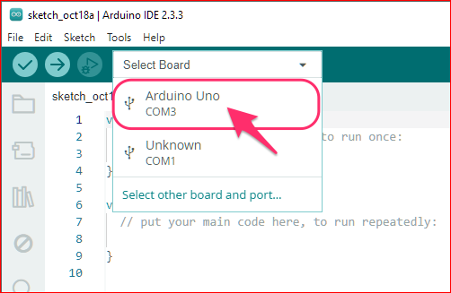
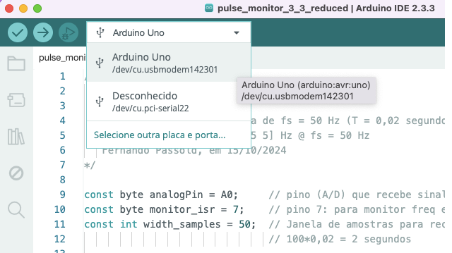

<font size="2">https://www.oceanlight.com/log/northern-fur-seal.html</font>

# Capturando Dados de Porta Serial

Eventualmente pode ser bastante útil analisar *off-line* dados práticos, principalmente se eles foram transmitidos como um *streaming* de caracteres ASCIII pela porta serial/USB.

[toc]

## Código: Versão simples

Segue um programa feito para [**Python**](https://www.python.org/) para captura de dados gerados por uma placa Arduino Uno:

`captura_serial_data.py` (baixe [aqui](capture_serial_data.py), eventualmente usando "Salvar link como..."):

```python
# Captura dados da porta serial, tal qual foram enviados
# e cria arqiuvo texto refletindo os dados capturados
# Realiza um "dump" dos dados sendo recebidos pela porta serial
# Fernando Passold, em 19/06/2024

import serial # Instalar com: > pip install pyserial ou % conda install -c anaconda pyserial
import threading
import os

# Configurações da porta serial
# porta_serial = '/dev/cu.usbmodem14201'     # Substitua pelo nome da porta serial correta no seu macOS
# porta_serial = '/dev/cu.usbmodem142101'    # no caso do macOS
porta_serial = 'COM3'   # no caso do Windows
taxa_baude = 115200     #   9600 # <-- modifique o valor "default"

# Função para parar a captura quando uma tecla for pressionada
def espera_tecla():
    print("\nScript para captura de dados à partir de porta serial")
    input("Pressione Enter para parar a captura de dados...\n\n")
    global capturando
    capturando = False

# Função principal para ler da porta serial e escrever no arquivo
def captura_dados():
    linhas_capturadas = 0
    try:
        with serial.Serial(porta_serial, taxa_baude, timeout=1) as ser:
            with open('dados_capturados.txt', 'w') as arquivo:
                while capturando:
                    linha = ser.readline().decode('utf-8').strip()
                    if linha:
                        linhas_capturadas += 1
                        arquivo.write(linha + '\n')
                        print(f"\rLinhas capturadas: {linhas_capturadas} | {linha}          ", end='') # exibe linha sem "\n"
    except serial.SerialException as e:
        print(f"Erro ao acessar a porta serial: {e}")
    except OSError as e:
        print(f"Erro ao abrir o arquivo: {e}")

# Variável global para controlar a captura
capturando = True

# Inicia a captura de dados em uma thread separada
thread_captura = threading.Thread(target=captura_dados)
thread_captura.start()

# Espera o usuário pressionar uma tecla para parar a captura
espera_tecla()

# Aguarda a thread de captura finalizar
thread_captura.join()

print("\nCaptura de dados finalizada.")
print("\nGerado arquivo: dados_capturados.txt")
```

**Uso**

Abra o "Prompt de Comandos" (no Windows, ou no terminal no macOS/linux) e digite:

```shell
python capture_serial_data.py
```

**Observações**:

1. Esta rotina só é executada com sucesso se não existe outro programa acessando a porta serial do Arduíno. Isto é, para este *script* conseguir capturar dados, o **Terminal** ou **Serial Plotter** da IDE do Arduino **não podem estar sendo executado**. Seriam 2 programas "competindo" pe,o memso recurso simulataneamente (não é possível).

2. **Sempre** será gerado o arquivo `dados_capturados.txt`. Se você deseja mudar este nome, deve editar o programa Python ou (mais fácil), simplesmente renomei o arquivo texto recém criado para outro nome desejado.

3. **Atenção** para a linha `porta_serial = '/dev/cu.usbmodem142101'`. Nesta linha você (o programador), deve indicar a porta de comunicação adotada pelo seu computador com o Arduíno. 

4. Por último certifique-se que este *script* está trabalhando com o mesmo *baud rate* da placa Arduino:

   ```python
   taxa_baude = 115200     #   9600 # <-- modifique o valor "default"
   ```

   

### Porta de Comunicação com Arduino

É possível descobrir a porta de comunicação usada à partir da própria IDE do Arduíno:

* No Windows:

  

* No macOS:

  

<!--   -->

### Exemplo de Uso

**Uso**

Abra o "Prompt de Comandos" (no Windows, ou no terminal no macOS/linux) e digite:

```shell
python capture_serial_data.py
```

Exemplo (no Windows):

```shell
Z:\fpassold\Documents\UPF\Lab_Processa_Sinais\2024_2\Pulse_Monitor>python capture_serial_data.py
Erro ao acessar a porta serial: could not open port '/dev/cu.usbmodem142101': FileNotFoundError(2, 'O sistema não pode encontrar o caminho especificado.', None, 3)
Pressione Enter para parar a captura de dados...

Captura de dados finalizada.

Z:\fpassold\Documents\UPF\Lab_Processa_Sinais\2024_2\Pulse_Monitor>
```

Neste caso, foi esquecido de indicar a porta correta. Procedendo a correção usando o "Bloco de Notas" para editar as linhas em questão:

```python
# porta_serial = '/dev/cu.usbmodem142101'     # no caso do macOS
porta_serial = 'COM3'       # no caso do Windows
```

E agora devemos obter algo como:

```shell
Z:\fpassold\Documents\UPF\Lab_Processa_Sinais\2024_2\Pulse_Monitor>python capture_serial_data.py

Script para captura de dados à partir de porta serial
Pressione Enter para parar a captura de dados...

Linhas capturadas: 361 | 149    -0.622862
Linhas capturadas: 362 | 149    -0.536371
Captura de dados finalizada.

Gerado arquivo: dados_capturados.txt

Z:\fpassold\Documents\UPF\Lab_Processa_Sinais\2024_2\Pulse_Monitor>
```


## Instalando Python

Para usá-lo você precisa ter o Python instalado no seu computador. Isto pode ser feito (no Windows), baixando e instalando à partir de: https://www.python.org/downloads/ (em outubro/2024, estava na versão 3.13.0; mas não é ncessário baixar a última versão).

Durante a instalação do Python o Windows além de perguntar se você deseja instalar apenas para o usuário atual ou para todos na máquina atual, ele pergunta (**importante**) se você deseja atualizar o `PATH` do sistema para que as janelas do comando reconheçam o Python instalado no seu computador.

### Teste inicial

Como teste inicial, experimente apenas executar: `> python --version` (ou `python3 --version`).

No caso do Windows resulta algo como:

```shell
C:\Users\fpassold>python --version
Python 3.12.0

C:\Users\fpassold>
```

No caso de um macOS resulta algo como:

```bash
(base) fernandopassold@MacBook-Pro-de-Fernando ~ % python --version 
Python 3.12.7
(base) fernandopassold@MacBook-Pro-de-Fernando ~ % 
```


### Instalando dependências (Bibliotecas)

Eventualmente o *script* acima ao ser executado resulta erros. Se nas mensagens de erro constar algo como:

```shell
Z:\fpassold\Documents\UPF\Lab_Processa_Sinais\2024_2\Pulse_Monitor>python capture_serial_data.py
Traceback (most recent call last):
  File "Z:\fpassold\Documents\UPF\Lab_Processa_Sinais\2024_2\Pulse_Monitor\capture_serial_data.py", line 6, in <module>
    import serial # Instalar com: % conda install -c anaconda pyserial
    ^^^^^^^^^^^^^
ModuleNotFoundError: No module named 'serial'

Z:\fpassold\Documents\UPF\Lab_Processa_Sinais\2024_2\Pulse_Monitor>
```

significa que, neste caso, faltou a biblioteca **serial**.

No caso do código, são necessárias as bibliotecas:

* serial
* threading
* os

que estão associadas com as linhas:

```python
import serial # Instalar com: > pip install pyserial ou % conda install -c anaconda pyserial
import threading
import os
```

Existem diferentes formas instalar as bibliotecas necesárias, mas vou sugerir a mais simples que normalmente dá certo. Para cada uma das bibliotecas digite:

* **serial** --> Instalar esta biblioteca, abrindo terminal com comando: `pip install pyserial` (ou `conda install -c anaconda pyserial` se você instalou o [Anaconda](https://docs.anaconda.com/anacondaorg/user-guide/)). Mais informações sobre esta biblioteca, clicar [aqui](https://projecthub.arduino.cc/ansh2919/serial-communication-between-python-and-arduino-663756).
* **threading** --> "Nada à ser feito". Isto é, esta biblioteca normalmente faz parte das bibliotecas padrão do Python (está presente na instalação do Python).
* **os** --> "Nada à ser feito". Isto é, esta biblioteca também normalmente faz parte das bibliotecas padrão do Python (está presente na instalação do Python).

**Obs**: normalmente o comando [`pip`](https://pip.pypa.io/en/stable/user_guide/) acompanha a instalação do Python.

Por exemplo, no caso do Windows, resulta algo como:

```shell
Z:\fpassold\Documents\UPF\Lab_Processa_Sinais\2024_2\Pulse_Monitor>pip --version
pip 23.2.1 from C:\Users\fpassold\AppData\Local\Programs\Python\Python312\Lib\site-packages\pip (python 3.12)

Z:\fpassold\Documents\UPF\Lab_Processa_Sinais\2024_2\Pulse_Monitor>pip install pyserial
Collecting pyserial
  Obtaining dependency information for pyserial from https://files.pythonhosted.org/packages/07/bc/587a445451b253b285629263eb51c2d8e9bcea4fc97826266d186f96f558/pyserial-3.5-py2.py3-none-any.whl.metadata
  Downloading pyserial-3.5-py2.py3-none-any.whl.metadata (1.6 kB)
Downloading pyserial-3.5-py2.py3-none-any.whl (90 kB)
   ---------------------------------------- 90.6/90.6 kB 854.7 kB/s eta 0:00:00
Installing collected packages: pyserial
Successfully installed pyserial-3.5

[notice] A new release of pip is available: 23.2.1 -> 24.2
[notice] To update, run: python.exe -m pip install --upgrade pip

Z:\fpassold\Documents\UPF\Lab_Processa_Sinais\2024_2\Pulse_Monitor>
```


----

<font size="2">🌊 [Fernando Passold](https://fpassold.github.io/)[ 📬 ](mailto:fpassold@gmail.com), <script language="JavaScript"><!-- Hide JavaScript...
var LastUpdated = document.lastModified;
document.writeln ("página criada em Oct 17, 2024; atualizada em " + LastUpdated); // End Hiding -->
</script></font>

