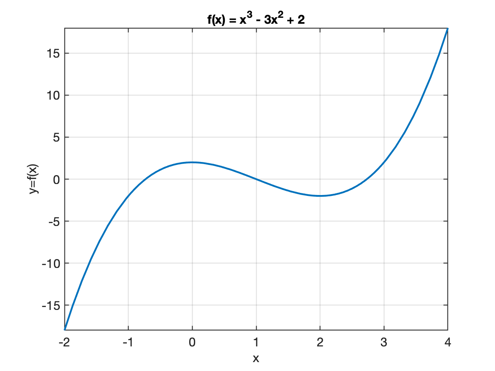
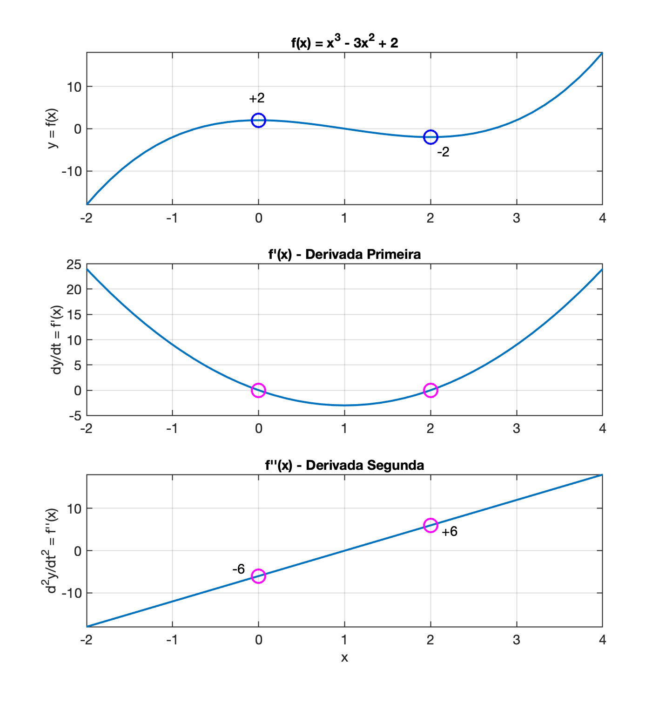
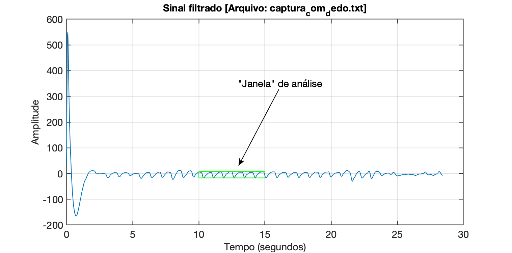
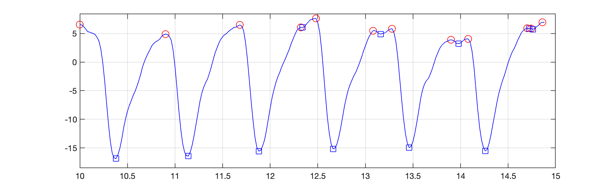
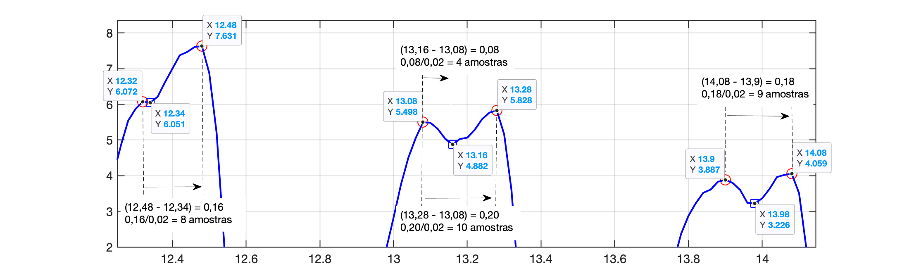
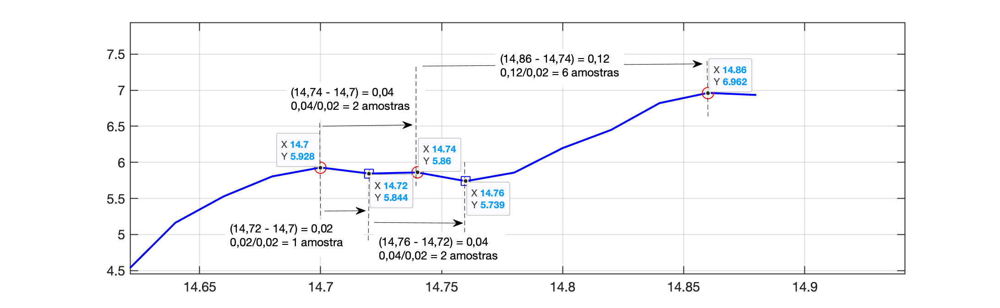
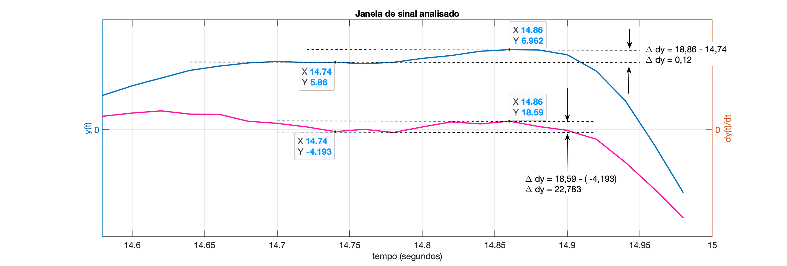
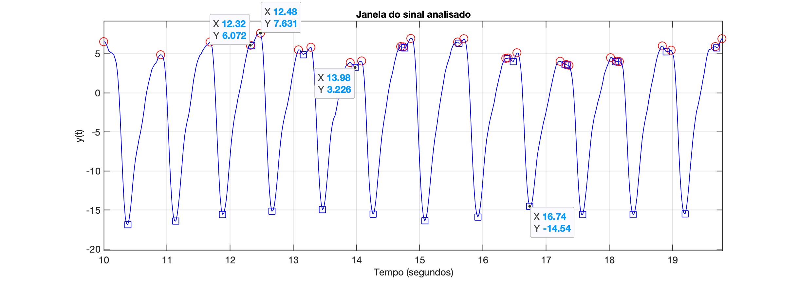
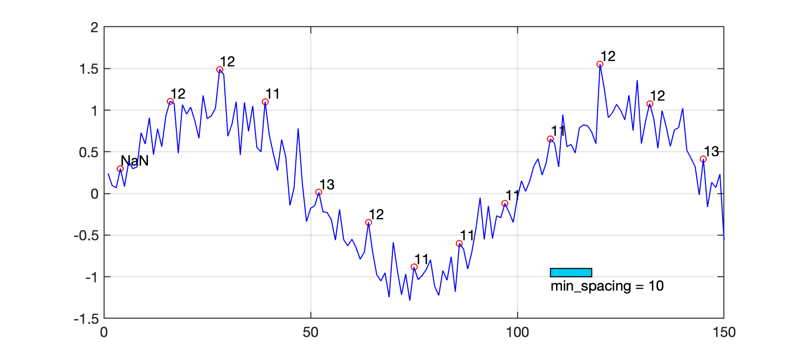

# Detectores de Picos

<!--- https://consensus.app/ + chatGPT -->

[toc]

[🎧](https://youtu.be/dZKd_HqvZlI?si=vQ-sFboY0XxNfBCB)

## Introdução

A detecção de picos em sinais ruidosos é uma tarefa crítica em diversas aplicações científicas e de engenharia. Algoritmos baseados na primeira e segunda derivadas são comumente usados para identificar picos, detectando mudanças na inclinação do sinal. Esses métodos devem lidar com ruído de maneira eficaz e distinguir picos verdadeiros de flutuações aleatórias.

## Principais insights

- **Metodos baseados em Derivada primeira e segunda**:
  - Algoritmos que utilizam a primeira e a segunda derivadas são eficazes na identificação de picos, detectando cruzamentos de zero e mudanças na inclinação do sinal. Esses métodos podem ser scuceptíveis ao ruído, o que exige técnicas adicionais para melhorar a precisão, [[1]](#1), [[2]](#2), [[4]](#4).

Seguem maiores exmplicações.

### Derivada Primeira

1. **Encontrar os Pontos Críticos**:
   - A derivada primeira de uma função $f(x)$, denotada por $f’(x)$, representa a taxa de variação da função.
   - Para encontrar os pontos críticos, você deve resolver $f’(x) = 0$. Esses pontos são onde a **inclinação da função é zero**, ou seja, onde a função pode ter um máximo, mínimo ou ponto de inflexão.
2. **Teste da Derivada Primeira**:
   - Após encontrar os pontos críticos, você pode usar o sinal de $f’(x)$ antes e depois desses pontos para determinar se eles são máximos ou mínimos.
   - Se $f’(x)$ muda de positivo para negativo ao passar por um ponto crítico, esse ponto é um **máximo local**.
   - Se $f’(x)$ muda de negativo para positivo, o ponto crítico é um [**mínimo local**](https://www.politecnicos.com.br/disciplinas/mat2453-calculo-i-poli-usp/pdf/060.pdf).

### Derivada Segunda

1. Teste da Derivada Segunda:
   - A derivada segunda de uma função $f(x)$, denotada por $f’'(x)$, fornece informações sobre a **concavidade** da função.
   - Avalie $f’'(x)$ nos pontos críticos encontrados anteriormente.
   - Se $f’'(x) > 0$ em um ponto crítico, a função é côncava para cima nesse ponto, indicando um **mínimo local**.
   - Se $f’'(x) < 0$, a função é côncava para baixo, indicando um [**máximo local**](https://www.colegioweb.com.br/estudo-das-derivadas/maximos-ou-minimos-relativos.html).

### Exemplo

Vamos considerar uma função: $f(x) = x^3 - 3x^2 + 2$. Um gráfico na região $x=[-2 \; , \; 4]$ resulta:



1. **Derivada Primeira**: $f’(x) = 3x^2 - 6x$:
   - Encontramos os pontos críticos resolvendo: $3x^2 - 6x = 0$, 
     o que dá $x = 0$ e $x = 2$.
2. **Teste da Derivada Primeira**:
   - Para $x = 0$: $f’(x)$ muda de negativo para positivo, indicando um mínimo local.
   - Para $x = 2$: $f’(x)$ muda de positivo para negativo, indicando um máximo local.
3. **Derivada Segunda**: $f’'(x) = 6x - 6$
   - Avaliando nos pontos críticos:
     - Para $x = 0$: $f’'(0) = -6$ (máximo local).
     - Para $x = 2$: $f’'(2) = 6$ (mínimo local).
4. Determinando valor pontos de mínimo e máximo
   * Para $x=0$: $f(x)=2$ (ponto de máximo);
   * Para $x=2$: $f(x)=-2$ (ponto de mínimo).

**Gráficos resumo** abaixo:



## Versão considerando derivadas

Em um sistema embarcado com memória limitada, você deve implementar um algoritmo eficiente que utiliza as derivadas primeira e eventualmente a derivada segunda para identificar máximos e mínimos locais em tempo real, sem armazenar muitos pontos. 

Segue pseudo-código considerando cálculo de derivadas

```
inicializar prev_y = 0, prev_dy = 0
T = intervalo de amostragem

para cada nova amostra y(t) faça:
    % Calcular a derivada primeira (aproximação)
    dy = (y(t) - prev_y) / T
    
    % Calcular a derivada segunda (aproximação)
    ddy = (dy - prev_dy) / T
    
    % Verificar condições para máximo local
    se prev_dy > 0 e dy < 0 então
        imprimir "Máximo local encontrado em t =", t-T, "com valor", prev_y
    
    % Verificar condições para mínimo local
    se prev_dy < 0 e dy > 0 então
        imprimir "Mínimo local encontrado em t =", t-T, "com valor", prev_y
    
    % Atualizar variáveis para a próxima iteração
    prev_y = y(t)
    prev_dy = dy
fim para
```

**Explicação do Algoritmo**:

1. **Inicialização**:
   - `prev_y` e `prev2_y` armazenam os valores das amostras anteriores.
   - `prev_dy` armazena a derivada primeira da amostra anterior.
2. **Loop de Aquisição de Dados**:
   - A cada nova amostra `y(t)`, calcule a derivada primeira `dy` como a diferença entre a amostra atual e a anterior, dividida pelo intervalo de amostragem `T`.
   - Calcule a derivada segunda `ddy` como a diferença entre a derivada primeira atual e a anterior, dividida por `T`.
   - Verifique as condições para máximos e mínimos locais:
     - Um máximo local é identificado se a derivada primeira muda de positiva para negativa.
     - Um mínimo local é identificado se a derivada primeira muda de negativa para positiva.
   - Atualize as variáveis (associadas com amostras passadas) para a próxima iteração.

### Implementação em MATLAB

Aqui está uma implementação em MATLAB baseada no pseudo-código acima:

```matlab
% detecta_picos_simples.m
% Algoritmo exemplo para tentar detectar picos máximos
% de sinal capturado real (e filtrado) de sensor foto-elétrico
% baseado em cálculos de derivadas
% Fernando Passold, em 25/10/2024; 07/11/2024

disp('Rotina para testar algoritmo detector picos...')
T = 0.02; % taxa de amostragem adotada (esperada) ou 50 Hz
%% Leitura do arquivo "bag"
filename = 'captura_com_dedo.txt';
fprintf('Nome (e path) do arquivo (bag) de dados: [%s] ', filename);
aux = input('? ', 's');
if (aux ~= '')
    filename = aux;
end
dados = load(filename);
[amostras, cols] = size(dados);  % espera 2 colunas de dados
x=dados(:,1);    % separa x[n] = dados brutos
yy=dados(:,2);    % separa y[n] = sinal filtrado

fprintf('Arquivo com %d amostras, ou %g segundos de dados\n', amostras, amostras*T);

%% PLotando dados filtrados
t=0:T:(amostras-1)*T; % cria vetor t (em segundos)
figure; % abre nova janela gráfica
plot(t,yy);
xlabel('Tempo (segundos)');
ylabel('Amplitude');
aux= [ 'Sinal filtrado [Arquivo: ' filename ']' ];
title(aux)
H = gcf;
fprintf('Informe a "janela" de dados à ser usada para testar algoritmo\n');
fprintf('Observe a Figure (%d) e indique:\n', H.Number);
t_ini = input('Instante de tempo inicial (em segundos): ? ');
t_fim = input('Instante final de tempo (em segundos): ? ');
% calculando pontos iniciais e finais em instante de amostragem
k_ini = t_ini/T + 1;    % +1 pq indices Matlab iniciam em 1 e não em zero
k_fim = t_fim/T + 1;
u = k_fim - k_ini;
max_y = max(yy(k_ini:k_fim));
min_y = min(yy(k_ini:k_fim));
fprintf('Serão analizadas %d amostras\n', u);
fprintf('Com y[k] variando na faixa: [%.2f, %.2f]\n', min_y, max_y);
figure(H.Number)
hold on
x_aux = [t_ini   t_fim  t_fim    t_ini    t_ini];
y_aux = [min_y min_y  max_y  max_y min_y];
plot(x_aux, y_aux, 'g-');

%% Inicialização de variáveis
anterior = 0;
prev_dy = 0;

figure; % Abre nova janela gráfica
H = gcf; % returns the handle of the nwe current figure
clear yyy tt x_aux y_aux

%% varrendo janela de dados
for k = 1:u  % Loop varrendo os dados progressivamente
    novo_ponto = yy(k_ini + k - 1);  % novo valor de amostra
    
    % guarda pontos para gerar gráfico em "tempo-real":
    % plot(tt, yyy)
    if (k == 1)
        yyy(1) = novo_ponto;
        tt(1) = t(k_ini);
    else
        yyy = [yyy novo_ponto];  % faz um "append" de dados ao vetor yyy
        tt = [tt t(k_ini + k - 1)];
    end
    
    % Calcular a derivada primeira (aproximação)
    dy = (novo_ponto - anterior) / T;
    
    % Calcular a derivada segunda (aproximação)
    ddy = (dy - prev_dy) / T;
    
    % Verificar condições para máximo local
    if (prev_dy > 0) && (dy < 0)
        fprintf('[k=%d] Máximo local encontrado em k = %d, com valor: %5.2f\n', k, k-1, anterior);
        Atualiza_Grafico(H.Number, tt, yyy, min_y, max_y, 'ro');
    end
    
    % Verificar condições para mínimo local
    if (prev_dy < 0) && (dy > 0)
        fprintf('[k=%d] Mínimo local encontrado em k = %d, com valor: %5.2f\n', k, k-1, anterior);
        Atualiza_Grafico(H.Number, tt, yyy, min_y, max_y, 'sb');
    end
    
    % atualizando variáveis para próxima interação
    anterior = novo_ponto;
    prev_dy = dy;
end

%% Subrotina para atualizar 2o-gráfico
function Atualiza_Grafico(num_fig, t, y, min_y, max_y, option);
    figure(num_fig);
    plot(t, y, 'b-');
    hold on;
    plot(t(end-1), y(end-1), option, 'MarkerSize', 12);
    grid;
    ylim([min_y*1.1  max_y*1.1]);
    pause;
end

```

Executando análise sobre o arquivo "bag": [`captura_com_dedo.txt`](captura_com_dedo.txt):

```matlab
>> detecta_picos_simples
Rotina para testar algoritmo detector picos...
Nome (e path) do arquivo (bag) de dados: [captura_com_dedo.txt] ? 
Arquivo com 1424 amostras, ou 28.48 segundos de dados
Informe a "janela" de dados à ser usada para testar algoritmo
Observe a Figure (1) e indique:
Instante de tempo inicial (em segundos): ? 10
Instante final de tempo (em segundos): ? 15
Serão analizadas 250 amostras
Com y[k] variando na faixa: [-16.86, 7.63]
[k=2] Máximo local encontrado em k = 1, com valor:  6.56
[k=21] Mínimo local encontrado em k = 20, com valor: -16.86
[k=47] Máximo local encontrado em k = 46, com valor:  4.88
[k=59] Mínimo local encontrado em k = 58, com valor: -16.43
[k=86] Máximo local encontrado em k = 85, com valor:  6.48
[k=96] Mínimo local encontrado em k = 95, com valor: -15.57
[k=118] Máximo local encontrado em k = 117, com valor:  6.07
[k=119] Mínimo local encontrado em k = 118, com valor:  6.05
[k=126] Máximo local encontrado em k = 125, com valor:  7.63
[k=135] Mínimo local encontrado em k = 134, com valor: -15.17
[k=156] Máximo local encontrado em k = 155, com valor:  5.50
[k=160] Mínimo local encontrado em k = 159, com valor:  4.88
[k=166] Máximo local encontrado em k = 165, com valor:  5.83
[k=175] Mínimo local encontrado em k = 174, com valor: -14.96
[k=197] Máximo local encontrado em k = 196, com valor:  3.89
[k=201] Mínimo local encontrado em k = 200, com valor:  3.23
[k=206] Máximo local encontrado em k = 205, com valor:  4.06
[k=215] Mínimo local encontrado em k = 214, com valor: -15.55
[k=237] Máximo local encontrado em k = 236, com valor:  5.93
[k=238] Mínimo local encontrado em k = 237, com valor:  5.84
[k=239] Máximo local encontrado em k = 238, com valor:  5.86
[k=240] Mínimo local encontrado em k = 239, com valor:  5.74
[k=245] Máximo local encontrado em k = 244, com valor:  6.96
>> 
```

São geradas 2 figuras gráficas:

**Figure 1**: Sinal original com "janela" de análise de dados ressaltada pelo retângulo verde:



**Figure 2**: Resultado da detecção dos picos:



Note:

* Normalmente entre 2 picos locais máximos (positivos) consecutivos, existe um pico local mínimo;

* Eventualmente 2 picos locais máximos estão muito próximos como na região $13 < t < 13,5$ segundos. Sugerindo que 2 picos não podem estar localizados muito próximos:

  

* Eventualmente temos uma sucessão de picos positivos e negativos muito próximos como no trecho $14,5 < t < 15$ segundos. Um "zoom" sobre esta área revela:

  

**Conclusão**: deveria ser considerado um espaçamento mínimo entre picos consecutivos de mesmo sinal (para evitar detecção de falsos picos).

​                  

## Versão considerando Espaçamento Mínimo

Este exemplo em MATLAB detecta os picos em tempo real, processando dados de forma incremental, sem a necessidade de armazenar todo o sinal, atualizando as variáveis `pico` e `distancia` entre os últimos picos detectados conforme novos pontos de dados são "lidos". A detecção de picos usa a primeira e a segunda derivada, ao mesmo tempo em que leva em conta o ruído, deixando “espaço” (ou seja, tolerância) para vales e picos suaves (verificando existência de um espaçamento mínimo).

Considerações:

1. Se espera medir pulsação no intervalo: $30 < pulso < 300$ BMP; isto resulta na seguinte faixa de frequências esperada para o sinal: $05, < f < 5$ Hz;

2. O sinal mais rápido estaria oscilando à 5 Hz, resultando num período de $T=1/5=0,2$ segundos;

3. Estamos amostrando o sinal à taxa de 50 Hz, então estariamos capturando $50/5=10$ amostras entre picos de mesmo sinal mais rápido.

4. Além disto, poderia ser considerado um limiar mínimo de variação do sinal $y[k]$ ou da variação do valor da derivada de $y[k]$. Analizando o gráfico da derivada do sinal sobreposto com o sinal, na região onde 2 picos positivos foram detectados muito próximos, se percebe:

   

   Ou mesmo um limiar maior para a variação do sinal $y[k]$ entre picos máximos válidos:

   

   No caso do gráfico acima:

   $\Delta y > 7,631 - 6,072 = 1,559$ Ou:

   $\Delta y > 3,226$


Segue código usando Matlab:

```matlab
% detecta_picos.m
% Fernando Passold, em 24/10/2024
% Inicialização de variáveis
pico = NaN;  % Valor do último pico detectado
distancia = NaN; % Distância entre o último e o penúltimo pico (em amostras)
ultimoPicoIdx = NaN; % Índice do último pico detectado
anterior = 0;

% Parâmetros de detecção
min_spacing = 10; % Espaçamento mínimo entre picos de mesmo sinal, em número de amostras
threshold = 0.1;  % Limite mínimo da derivada para ignorar ruídos

% Simulação de captura de dados em tempo real
figure; % Abre nova janela gráfica
H = gcf; % returns the handle of the current figure
k = 0;
clear x y
for t = 1:150  % Exemplo de loop simulando captura contínua
    
    % Simulação de um novo ponto de dado com ruído
    novo_ponto = sin(2 * pi * t / 100) + 0.2 * randn();
    x(t) = t;
    y(t) = novo_ponto;

    figure(H);
    plot(x, y, 'b-');
    
    if t > 2
        % Calcular primeira e segunda derivadas com os últimos três pontos
        dy = novo_ponto - anterior;  
        dy_prev = anterior - anterior2;
        d2y = dy - dy_prev;
        
        % Verificar se o ponto atual é um pico
        if dy_prev > 0 && dy < 0 && abs(dy_prev) > threshold && d2y < 0
            % Verificar espaçamento mínimo
            if isnan(ultimoPicoIdx) || (t - ultimoPicoIdx) >= min_spacing
                % Atualizar variáveis de pico e distância
                distancia = t - ultimoPicoIdx;
                pico = novo_ponto;
                ultimoPicoIdx = t;
                hold on;
                plot(x(end-1),y(end-1),'ro')
                aux=num2str(distancia, '%d');
                text(x(end-1), y(end-1)+0.1, aux);
                fprintf('Pico detectado: %f, Distância: %d amostras\n', pico, distancia);
                aux = input('Tecle <ENTER> para continuar');
            end
        end
    end
    
    % Atualizar os valores anteriores
    anterior2 = anterior;
    anterior = novo_ponto;
end
hold on;
rectangle('Position', [t*0.72, -1, min_spacing, 0.1], 'FaceColor',[0 0.8 0.95])
aux=num2str(min_spacing, '%d');
aux=[ 'min\_spacing = ' aux];
text(t*0.72, -1.1, aux)
```

**Explicação**:

1. **Primeira e segunda derivadas**: Calculadas usando diferenças entre os últimos três pontos capturados.
2. **Detecção de pico**: Verifica zero-crossing (mudança de sinal) da primeira derivada e que a segunda derivada seja negativa.
3. **Controle de ruído**: Usa um limite (`threshold`) para evitar picos falsos.
4. **Atualização em tempo real**: As variáveis `pico` e `distancia` são atualizadas sempre que um novo pico é detectado.

Exemplo de uso:

```matlab
>> detecta_picos
Pico detectado: 0.083061, Distância: NaN amostras
Tecle <ENTER> para continuar
Pico detectado: 1.081005, Distância: 12 amostras
Tecle <ENTER> para continuar
Pico detectado: 1.427308, Distância: 12 amostras
Tecle <ENTER> para continuar
Pico detectado: 0.705388, Distância: 11 amostras
Tecle <ENTER> para continuar
Pico detectado: -0.219932, Distância: 13 amostras
Tecle <ENTER> para continuar
Pico detectado: -0.700761, Distância: 12 amostras
Tecle <ENTER> para continuar
Pico detectado: -1.034320, Distância: 11 amostras
Tecle <ENTER> para continuar
Pico detectado: -0.667690, Distância: 11 amostras
Tecle <ENTER> para continuar
Pico detectado: -0.224956, Distância: 11 amostras
Tecle <ENTER> para continuar
Pico detectado: 0.601979, Distância: 11 amostras
Tecle <ENTER> para continuar
Pico detectado: 1.268751, Distância: 12 amostras
Tecle <ENTER> para continuar
Pico detectado: 0.899890, Distância: 12 amostras
Tecle <ENTER> para continuar
Pico detectado: -0.162192, Distância: 13 amostras
Tecle <ENTER> para continuar
>>
```


Note:



Este algoritmo não detecta um "vale de descida" com largura mínima entre 2 possíveis pontos.


### Versão considerando arquivo "bag" de dados

Segue código que carrega arquivo "bag" de dados gerados em outro momento e permite testar o algoritmo para detecção de picos: `detecta_picos_bag_old.m`:

```matlab
% detecta_picos_bag_old.m
% Algoritmo exemplo para tentar detectar picos máximos
% de sinal capturado real (e filtrado) de sensor foto-elétrico
% Fernando Passold, em 25/10/2024

T = 0.02; % taxa de amostragem adotada (esperada)
%% Leitura do arquivo "bag"
filename = input('Nome (e path) do arquivo (bag) de dados: ? ', 's');
dados = load(filename);
[pts, cols] = size(dados);  % esperadas 2 colunas
x=dados(:,1);    % separa x[n] = dados brutos
y=dados(:,2);    % separa y[n] = sinal filtrado
fprintf('Arquivo com %d amostras, ou %g segundos de dados\n', pts, pts*T);

%% PLotando dados filtrados
t=0:T:(pts-1)*T; % cria vetor t (em segundos)
figure; % abre nova janela gráfica
plot(t,y);
xlabel('Tempo (segundos)');
ylabel('Amplitude');
aux= [ 'Sinal filtrado [' filename ']' ];
title(aux)
H = gcf;
fprintf('Informe a "janela" de dados usada para testar algoritmo\n');
fprintf('Observe a Figure (%d) e indique:\n', H.Number);
ini = input('Instante de tempo inicial (em segundos): ? ');
fim = input('Instante final de tempo (em segundos): ? ');

%% Inicialização de variáveis
pico = NaN;  % Valor do último pico detectado
distancia = NaN; % Distância entre o último e o penúltimo pico (em amostras)
ultimoPicoIdx = NaN; % Índice do último pico detectado
anterior = 0;
anterior2 = 0;

%% Parâmetros de detecção
min_spacing = 10; % Espaçamento mínimo entre picos em número de amostras
% Estimasse medir BPM entre 30 à 300 BPM ==> 0.5 < f (Hz) < 5
% O sinal mais rápido, de 5 Hz, teria período de: 1/5 = 0,2
% o que equivale a uma "distância" entre os picos de: 0,2/0,02 = 10
% amostras
threshold = 0.1;  % Limite mínimo da derivada para ignorar ruídos

figure; % Abre nova janela gráfica
H = gcf; % returns the handle of the current figure
k_ini = ini/T;          % amostra inicial
k_fim = fim/T;      % amostra final
u = k_fim - k_ini;  % qtdade de dados à ser "percorrida"

%% Percorre dados da "janela"
for k = 1:u  % Loop varrendo os dadoa progressivamente
    novo_ponto = y(k_ini + k - 1);  % acessa dado real do "bag"
    
    % acumulando novos pontos num novo gráfico
    % atualizado em "tempo-real"
    tt(k) = t(k_ini + k -1);
    yy(k) = novo_ponto;
    figure(H);
    plot(tt, yy, 'b-');
    
    % if k > 2    % detectar só depois de anterior2 diferente de zero
        % Calcular primeira e segunda derivadas com os últimos três pontos
        dy = novo_ponto - anterior;         % "derivada" primeira
        dy_prev = anterior - anterior2;
        d2y = dy - dy_prev;                   % "derivada" segunda
        
        % Verificar se o ponto atual é um pico
        if dy_prev > 0 && dy < 0 && abs(dy_prev) > threshold && d2y < 0
            % Verificar espaçamento mínimo
            if isnan(ultimoPicoIdx) || (k - ultimoPicoIdx) >= min_spacing
                % Atualizar variáveis de pico e distância
                distancia = k - ultimoPicoIdx;
                pico = novo_ponto;
                ultimoPicoIdx = k;
                hold on;
                plot(tt(k-1), yy(k-1), 'ro')    % plotando marcador no pico detectado
                delta_t = distancia*T;
                freq = 1/delta_t;
                BPM = freq*60;
                aux=num2str(BPM, '%.1f');
                text(tt(k-1), yy(k-1)+0.2, aux);  % sobrepõe texto com valor em BPM
                fprintf('Pico detectado (valor = %4.2f, dist = %d): %.1f BPM\n', pico, distancia, BPM);
                aux = input('Tecle <ENTER> para continuar');
            end
        end
    % end
    
    % Atualizar os valores anteriores
    anterior2 = anterior;
    anterior = novo_ponto;
end
hold on;
x_ini=tt(u*0.8);
rectangle('Position', [x_ini, -12, min_spacing*T, 2.5], 'FaceColor',[0 0.8 0.95])
aux=num2str(min_spacing, '%d');
aux=[ 'min\_spacing = ' aux];
text(x_ini, -13, aux)
axis tight
xlabel('Tempo (segundos)')
ylabel('Amplitude');
aux= [ 'Sinal filtrado [' filename ']' ];
title(aux)
% 
```

Resultado:

<!---->
<!-- <iframe src="https://giphy.com/embed/0VZW3Lp9kua5eayvbP" width="480" height="283" style="" frameBorder="0" class="giphy-embed" allowFullScreen></iframe><p><a href="https://giphy.com/gifs/0VZW3Lp9kua5eayvbP">via GIPHY</a></p> -->
<!-- https://youtu.be/r9W99kYl1sE (1384 × 811 original; mkv: 1392 x 816) -->

<iframe width="640" height="480" src="https://www.youtube.com/embed/r9W99kYl1sE" title="Teste rotina detecção de picos de sinal (BMP)." frameborder="0" allow="accelerometer; autoplay; clipboard-write; encrypted-media; gyroscope; picture-in-picture" allowfullscreen></iframe>

<!--Note que aparentemente o algorimto seria mais eficaz se detectasse os picos negativos.-->

Note que aparentemente o algorimto seria mais simples e eficaz se detectasse os picos negativos.


## Versão considerando largura dos "vales"

Para garantir que um pico só seja detectado se for precedido por um "vale" com uma largura mínima, precisamos modificar o algoritmo para verificar se o sinal realmente desce a partir do pico anterior antes de um novo pico ser registrado. Isso ajuda a evitar falsos picos consecutivos em regiões onde o sinal não apresenta uma "descida" significativa.

A abordagem é ajustar o código para:

1. Armazenar o índice e o valor do último pico detectado.
2. Detectar um vale intermediário entre o último pico e um novo candidato a pico.
3. Validar a largura mínima entre o pico e o vale intermediário.

### Exemplo em MATLAB

Abaixo está uma versão MATLAB que considera a presença de um "vale" entre os picos, obedecendo a uma largura mínima antes de detectar um novo pico.

```matlab
% Inicialização de variáveis
pico = NaN;           % Último valor de pico detectado
distancia = NaN;      % Distância entre o último e o penúltimo pico em amostras
ultimoPicoIdx = NaN;  % Índice do último pico detectado
ultimoValeIdx = NaN;  % Índice do último vale detectado

% Parâmetros de detecção
min_spacing = 10;     % Espaçamento mínimo entre picos em amostras
min_valley_width = 5; % Largura mínima do vale entre dois picos
threshold = 0.1;      % Limite mínimo da derivada para ignorar ruído

% Simulação de captura de dados em tempo real
for t = 2:1000  % Exemplo de loop de captura contínua
    
    % Simulação de um novo ponto de dado com ruído
    novo_ponto = sin(2 * pi * t / 100) + 0.2 * randn();
    
    if t > 2
        % Calcular derivadas
        dy = novo_ponto - anterior;
        dy_prev = anterior - anterior2;
        d2y = dy - dy_prev;
        
        % Verificar vale
        if dy_prev < 0 && dy > 0
            ultimoValeIdx = t;  % Atualizar o índice do vale
        end
        
        % Detectar pico
        if dy_prev > 0 && dy < 0 && abs(dy_prev) > threshold && d2y < 0
            % Validar condições de espaçamento e vale
            if ~isnan(ultimoValeIdx) && ...
               (t - ultimoPicoIdx) >= min_spacing && ...
               (t - ultimoValeIdx) >= min_valley_width
               
                % Atualizar variáveis de pico e distância
                distancia = t - ultimoPicoIdx;
                pico = novo_ponto;
                ultimoPicoIdx = t;
                
                fprintf('Pico detectado: %f, Distância: %d amostras\n', pico, distancia);
            end
        end
    end
    
    % Atualizar valores anteriores
    anterior2 = anterior;
    anterior = novo_ponto;
end
```

**Explicação**:

1. **Detecção de Vale**: Identificamos um vale onde a derivada muda de negativa para positiva, o que representa uma "descida" completa antes do próximo pico.
2. **Validação do Pico**: Um novo pico é detectado apenas se:
   - Obedecer a uma largura mínima entre o último pico e o vale (`min_valley_width`).
   - Cumprir o espaçamento mínimo entre picos (`min_spacing`).
3. **Atualização das Variáveis**: `pico` e `distancia` são atualizados somente se todas as condições forem satisfeitas.


----

## Outros Métodos

- **Método baseado em transformada Wavelet**:
  - A Transformada Wavelet Contínua (CWT) e suas variantes, como a Transformada Wavelet Contínua Ponderada (WCWT), são populares para detecção de pico em sinais ruidosos. Esses métodos identificam picos em múltiplas escalas no espaço wavelet, o que ajuda na redução de ruído e na correção da linha de base. Eles são particularmente eficazes no tratamento de picos sobrepostos e sinais densos [ [2](#2), [4](#4) ].
- **Otimização Multimodal Probabilística**:
  - Algoritmos de Otimização Multimodal Probabilística (PMO) usam estratégias baseadas no princípio de Buffon e no teorema de amostragem de Nyquist para detectar múltiplos pontos extremos em ambientes ruidosos. Esses métodos fornecem previsões probabilísticas e otimizam a detecção de picos particionando o espaço de busca e usando análise de frequência de amostragem [ [3](#3) ].

## Conclusão

A detecção de pico em sinais ruidosos pode ser efetivamente alcançada usando métodos de primeira e segunda derivadas, técnicas baseadas em transformadas wavelet e algoritmos de otimização probabilística. Cada abordagem tem seus pontos fortes, com ==métodos derivados sendo simples, mas sensíveis ao ruído==, transformadas wavelet oferecendo tratamento robusto de ruído e correção de linha de base, e métodos probabilísticos fornecendo recursos avançados de otimização em ambientes de ruído complexos.

## Referências

<a id="1">[1]</a> Cheng, D., & Schwartzman, A., 2014. MULTIPLE TESTING OF LOCAL MAXIMA FOR DETECTION OF PEAKS IN RANDOM FIELDS.. *Annals of statistics*, 45 2, pp. 529-556 . https://doi.org/10.1214/16-AOS1458.

<a id="2">[2]</a> Zhang, Z., Tong, X., Peng, Y., Ma, P., Zhang, M., Lu, H., Chen, X., & Liang, Y., 2015. Multiscale peak detection in wavelet space.. *The Analyst*, 140 23, pp. 7955-64 . https://doi.org/10.1039/c5an01816a.

<a id="3">[3]</a> Wang, X., Wang, Y., Shi, X., Gao, L., & Li, P., 2021. A probabilistic multimodal optimization algorithm based on Buffon principle and Nyquist sampling theorem for noisy environment. *Appl. Soft Comput.*, 104, pp. 107068. https://doi.org/10.1016/J.ASOC.2020.107068.

<a id="4">[4]</a> Zhou, Y., Ma, J., Li, F., Chen, B., Xian, T., & Wei, X., 2022. An Improved Algorithm for Peak Detection Based on Weighted Continuous Wavelet Transform. *IEEE Access*, 10, pp. 118779-118788. https://doi.org/10.1109/ACCESS.2022.3220640.

-----

<font size="2">🌊 [Fernando Passold](https://fpassold.github.io/)[ 📬 ](mailto:fpassold@gmail.com), <script language="JavaScript"><!-- Hide JavaScript...
var LastUpdated = document.lastModified;
document.writeln ("página criada em Oct 25, 2024; atualizada em " + LastUpdated); // End Hiding -->
</script></font>

