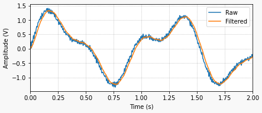
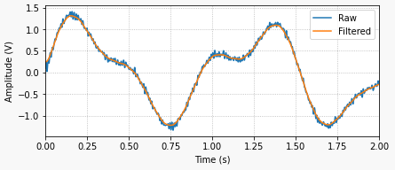
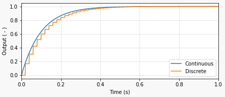

# Filtro Digital Passa-Baixa Primeira Ordem

<!-- Ref: https://thingsdaq.org/2022/03/23/digital-filtering/ -->

[toc]


## Intro à Filtro Digital

Depois que um sinal contínuo passa por uma [conversão analógico para digital](https://thingsdaq.org/2022/01/17/analog-to-digital-conversion/), filtragem digital adicional pode ser aplicada para melhorar a qualidade do sinal. Se o sinal está sendo usado em um aplicativo em tempo real ou foi coletado para uma análise posterior, implementar um filtro digital via software é bastante simples. Já os vimos sendo usados casualmente em alguns dos meus posts anteriores, como [MCP3008 com Raspberry Pi](https://thingsdaq.org/2022/01/24/mcp3008-with-raspberry-pi/). Agora, vamos analisar esses tipos de filtros com mais detalhes. Para os exemplos, usaremos as [funções de processamento de sinal ](https://scipy.github.io/devdocs/reference/signal.html#filtering)do pacote [SciPy ](https://scipy.github.io/devdocs/index.html)Python.

Uma das **desvantagens** da filtragem digital (ou filtragem analógica, para esse assunto) é a ==introdução de um atraso de fase== no sinal filtrado.

Acompanhe pelos gráficos abaixo:

1a-figura: sinal bruto e filtrado (com atraso de fase):



2a-figura: sinal bruto e filtrado (sem atraso de fase):



Os gráficos anteriores ilustram como seria um sinal filtrado real e seu atraso de fase (1a-figura), em contraste com um sinal filtrado ideal sem atraso (2a-figura). Embora a situação ideal não possa ser alcançada com o processamento de sinais em tempo real, ela pode ser alcançada ao processar sinais que já estão amostrados e armazenados como uma sequência discreta de valores numéricos.

Como a sequência do início ao fim está disponível, a ideia é filtrá-la uma vez (causando uma mudança de fase) e, em seguida, filtrar a sequência resultante para trás (causando uma mudança de fase novamente). Como a filtragem é feita tanto para frente quanto para trás, as mudanças de fase se cancelam, resultando em um sinal filtrado de fase zero!

Para ver como isso é feito, confira o script `filtfilt.py` ([mais abaixo](#filtfilt)) e os exemplos de aplicação na documentação do **SciPy**. Você também pode acessar o código usado para gerar os gráficos baseado na página [GitHub: Things-DAQ-Code/Digital-Filtering](https://github.com/EduardoNigro/Things-DAQ-Code/tree/main/Digital-Filtering).

> Em [GitHub: Things-DAQ-Code/Digital-Filtering](https://github.com/EduardoNigro/Things-DAQ-Code/tree/main/Digital-Filtering), estão disponíveis:
>
> ```bash
> /Things-DAQ-Code-main/Digital-Filtering/
> ├── post_digital_filtering_bandpass.py
> ├── post_digital_filtering_butterworth.py
> ├── post_digital_filtering_phase_delay.py
> ├── post_digital_filtering_response.py
> └── utils.py
> 
> 1 directory, 5 files
> ```

A rotina `filtfilt` faz parte dos esforços de processamento de sinal. Há muitas informações que podem ser extraídas de um sinal depois de "limpá-lo" um pouco. Se o alinhamento temporal entre os eventos for crítico, evitar uma mudança de fase é o caminho a seguir.

Antes de entrarmos na aplicação em tempo real de filtros digitais, vamos falar brevemente sobre como eles são implementados. 

### Equação de Diferenças

Vou me concentrar em filtros que podem ser descritos como a equação de diferença abaixo:

$\displaystyle\sum_{k=0}^{N} a_k y[n-k] = \displaystyle\sum_{k=0}^{M} b_k x[n-k]$

Onde $x[n]$ é a sequência de entrada (sinal bruto, de entrada) e $y[n]$ é a sequência de saída (sinal filtrado). Antes de você abandonar esta página da web, deixe-me reescrever a equação para que possamos começar a trazê-la para uma forma mais aplicável. Já que a ideia é encontrar a saída $y[n]$. Em função de seus valores anteriores e da entrada, podemos escrever:

$a_0 y[n] = -a_1 y[n-1] - \ldots - a_N y[n-N]\quad+\quad b_0 x[n]+b_1 x[n-1] + \ldots + b_M x[n-M]$

É comum normalizar os coeficientes, então $a_0=1$. 

## Filtro de 1a-ordem

Para simplificar, considere um filtro de primeira ordem que, em termos de equações de diferença, depende apenas dos valores das amostras atuais e da amostra anterior, ou respectivamente: $[n]$ e $[n-1]$. Assim:

$a_0 y[n] = -a_1 y[n-1] + b_0 x[n] + b_1 x[n-1]$

Então, para construir um filtro digital passa-baixa de primeira ordem, tudo o que precisamos fazer é determinar os coeficientes: $a_1$, $b_0$ e $b_1$ (considerando que $a_0=1$, está normalizado). Felizmente para nós, as [funções de design de filtro SciPy MATLAB-Style](https://scipy.github.io/devdocs/reference/signal.html#matlab-style-iir-filter-design) retornam esses coeficientes, reduzindo nossa tarefa para a implementação do filtro usando Python. Antes de revisarmos alguns exemplos de código, vamos examinar um filtro de primeira ordem que eu uso bastante. Ver também [A função **filter()** do Matlab/Octave](https://fpassold.github.io/Process_Sinais/funcao_filter.html).

## Filtro Passa Baixas Digital de 1a-ordem

Passar do domínio tempo contínuo para o domínio tempo discreto envolve uma transformação em que aproximamos uma variável contínua por seu equivalente discreto (transformada-Z). 

No caso de um filtro passa-baixo de primeira ordem, podemos analisar seu comportamento no tempo contínuo, mais especificamente a resposta a uma entrada degrau unitário. A figura à seguir ilustra a aplicação de um filtro passa-baixa de 1a-ordem sobre um sinal exponencial de entrada:



A resposta contínua do sistema à entrada constante $x(t)=u(t)$ (degrau unitário) é dado por: $y(t)=1-e^{-t/\tau}$, onde $\tau$ é o tempo de resposta do filtro (constante de tempo do filtro) e está relacionado à frequência de corte do filtro, $f_c$:

$\tau_c=\dfrac{1}{2 \pi f_c}$

O tempo de resposta do filtro é o tempo que leva para a saída atingir aproximadamente 63% do valor final. No caso do gráfico acima, o tempo de resposta é de 0,1 segundo. Se você está se perguntando de onde isso vem, basta calcular a resposta do sistema usando $t=\tau$.

A equação diferencial que corresponde ao sistema contínuo de primeira ordem em questão é:

$\dfrac{\partial y}{\partial t}=\dfrac{1}{\tau} x(t) - \dfrac{1}{\tau} y(t)$

E aqui é onde nossa aproximação discreta (equação de diferenças) de $\partial y/ \partial t$ usando **relação de Euler** (também conhecida como "regra retangular direta ou *forward rectangular rule*"), incluindo o período de amostragem $T_s$, fica:

$\dfrac{\partial y}{\partial t} \cong \dfrac{y[n]-y[n-1]}{T_s}$

Aplicando esta aproximação no termos $y(t)$ e  $x(t)$ em suas contrapartes discretas $y[n]$ e $x[n]$, podemos chegar à equação de diferenças abaixo, que representa o filtro digital passa-baixa de primeira ordem, onde usamos a relação de Euler para aproximar $\partial y/\partial t$. Lembre-se: $[n]$ e $[n-1]$ são as amostras discretas no instante de amostrragem atual e no instante de amostragem anterior (respectivamente).

$\dfrac{y[n]-y[n-1]}{T_s} = \dfrac{1}{\tau}x[n] - \dfrac{1}{\tau}y[n]$

Finalmente, isolando $y[n]$ resultra numa equação muito semelhante à que vimos no final da seção anterior. Observe que os coeficiente $a_1$ e $b_0$ são uma ponderação envolvendo uma relação entre taxa de amostragem e constante de tempo do filtro ($b_1=0$ neste caso em particular):

$y[n]=\left( \dfrac{\tau_c}{\tau_c+T_s} \right) y[n-1] + \left( \dfrac{T_s}{\tau_c+T_s} \right) x[n]$

O interessante nesta abordagem de implementação é que é fácil perceber que a saída $y[n]$ é uma "média ponderada" entre seu valor anterior $y[n-1]$ e o valor de entrada atual $x[n]$. 

Note: quanto menor o tempo de resposta do filtro ($\tau_c << T_s$), mais rápido o filtro (maior frequência de corte) e mais ele segue o valor de entrada. Por outro lado, num filtro mais lento ($\tau_c >> T_s$), a saída só leva em conta o valor anterior de saída do próprio filtro.

## Filtro Exponencial Digital

Em outras abordagens semelhantes deste tipo de filtro (ver: "[**Filtro Exponencial Digital**](https://fpassold.github.io/Controle_3/Controle_Acao_Derivativa.html#filtro-exponencial-digital)" em [Controle com Ação Derivativa](https://fpassold.github.io/Controle_3/Controle_Acao_Derivativa.html)), é comum se usar o ==termo $\alpha$==, onde:

$\alpha=\left( \dfrac{T_s}{\tau_c+T_s} \right)=\dfrac{1}{\dfrac{\tau_c}{T_s}+1}$

e a equação de diferenças anterior é re-escrita como:

$y[n]=\alpha x[n] + (1-\alpha)y[n-1]$

Onde: $0 < \alpha < 1$.

Tipicamente é empregado o valor $\alpha=0,1$ (o que implica que a constante de tempo do filtro é $10 \times$ menor que o período de amostragem adotado para o filtro).

Note:

$\left\{ \begin{array}{lclcl} \text{Se } \alpha=1 & \Rightarrow & y[n]=x[n] & \therefore & \text{Não existe filtragem!}\\ \text{Se } \alpha=0 & \Rightarrow & y[n]=0 & \therefore & \text{O sinal original é ignorado!} \end{array} \right.$

## Exemplo de Código em Python

O código Python abaixo mostra como implementar este filtro, colocando-o dentro de um loop de execução e executando uma excitação de entrada de etapa através dele. Ele produzirá o gráfico mostrado no início desta seção. Convido você a experimentar diferentes tempos de resposta (frequências de corte) e períodos de amostragem.

<a id="filtfilt">\></a> Segue script `filtro.py` : <!-- post_digital_filtering_response.py -->

```python
import numpy as np
import matplotlib.pyplot as plt

# Criando matriz de tempo para sinal "contínuo"
tstop = 1  		# Duração do sinal (s)
Ts0 = 0.001  	# Passo de tempo "Contínuo" (s)
Ts = 0.02  		# Período de amostragem (s)
t = np.arange(0, tstop+Ts0, Ts0)

# Resposta contínua do sistema de primeira ordem para entrada degrau
tau = 0.1  		# Tempo de resposta (s)
y = 1 - np.exp(-t/tau)  # y(t)

# Pré-alocação de arrays de sinal para filtro digital
tf = []
yf = []

# Inicializando valores anteriores e atuais
xcurr = 1  	# x[n] (entrada degrau)
yfprev = 0  # y[n-1]
yfcurr = 0  # y[n]

# Execução 
tprev = 0
tcurr = 0
while tcurr <= tstop:
    # Fazendo cálculos de filtro a cada `Ts` segundos
    if (np.floor(tcurr/Ts) - np.floor(tprev/Ts)) == 1:
        yfcurr = tau/(tau+Ts)*yfprev + Ts/(tau+Ts)*xcurr
        yfprev = yfcurr
    # Atualizando arrays de saída
    tf.append(tcurr)
    yf.append(yfcurr)
    # Atualizando etapas de tempo "contínuas" anteriores e atuais
    tprev = tcurr
    tcurr += Ts0

# Criando a figura Matplotlib
fig = plt.figure(
    figsize=(6.3, 2.8),
    facecolor='#f8f8f8',
    tight_layout=True)
# Adicionando e configurando eixos
ax = fig.add_subplot(
    xlim=(0, max(t)),
    xlabel='Time (s)',
    ylabel='Output ( - )',
    )
ax.grid(linestyle=':')
# Plotando sinais
ax.plot(t, y, linewidth=1.5, label='Continuo', color='#1f77b4')
ax.plot(tf, yf, linewidth=1.5, label='Discreto', color='#ff7f0e')
ax.legend(loc='lower right')


```

Fim.

----

<font size="2">🌊 [Fernando Passold](https://fpassold.github.io/)[ 📬 ](mailto:fpassold@gmail.com), <script language="JavaScript"><!-- Hide JavaScript...
var LastUpdated = document.lastModified;
document.writeln ("página criada em Oct 14 2024 e atualizada em " + LastUpdated); // End Hiding -->
</script></font>

