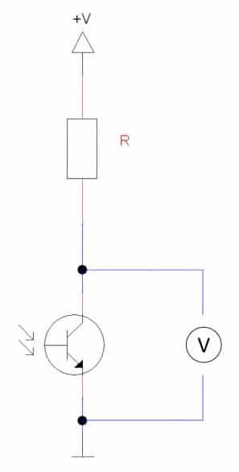

# Monitor de frequência de pulso

A taxa de pulso pode ser detectada usando uma variedade de princípios físicos. Uma maneira de fazer isso é aplicar luz infravermelha em um lado da ponta do dedo e detectar a “saída” do outro lado com um fototransistor. O fluxo sanguíneo através dos capilares na ponta do dedo flutua com a mesma frequência (taxa) do seu pulso. Essa flutuação pode ser detectada após o processamento do sinal capturado pelo sensor.


Circuito interno:



ou algo como:


A idéia é usar um circuito sensor monitor de frequência de pulso rudimentar para tentar resolver o problema. Neste post abordaremos o processamento do sinal e como exibir a frequência de pulso em tempo real. Como o circuito sensor gera um sinal analógico, ele deve ser usado com o chip conversor analógico-digital, conforme ilustrado nos esquemas abaixo.


Alguns destes sensores usam o sensor [APDS-9008]([AV02-1169EN.pdf (broadcom.com)](https://docs.broadcom.com/doc/AV02-1169EN)) numa configuração como a mostrada abaixo:


O objetivo é captar um sinal semelhante ao mostrado na próxima figura:


Neste caso, foi usado um sinal de referência na faixa dos 3,3 Volts.

A primeira coisa a fazer é observar o sinal que vem do sensor enquanto a ponta do meu dedo indicador é colocada entre o LED IR e o fototransistor. O gráfico à esquerda pode ser gerado executando o código Python abaixo.

Ao inspecionar o programa, a primeira coisa a observar é o período de amostragem (`tsample`) de 0,02 s. Como não sabemos muito sobre o sinal, é sempre bom começar com um valor menor. A segunda coisa é o tempo de espera de 5 segundos antes de coletar qualquer dado. Depois de mexer um pouco, se percebe que o sensor é muito sensível aos movimentos dos dedos. Portanto, esperar o sinal “se acalmar” pode ajudar.

```Python
# Importing modules and classes
import time
import numpy as np
import matplotlib.pyplot as plt
from gpiozero import MCP3008


# Defining function for plotting
def make_fig():
    # Creating Matplotlib figure
    fig = plt.figure(
        figsize=(8, 3),
        facecolor='#f8f8f8',
        tight_layout=True)
    # Adding and configuring axes
    ax = fig.add_subplot(xlim=(0, max(t)))
    ax.set_xlabel('Time (s)', fontsize=12)
    ax.grid(linestyle=':')
    # Returning axes handle
    return ax


# Creating object for the pulse rate sensor output
vch = MCP3008(channel=0, clock_pin=11, mosi_pin=10, miso_pin=9, select_pin=8)

# Assigning some parameters
tsample = 0.02  # Sampling period for code execution (s)
tstop = 30  # Total execution time (s)
vref = 3.3  # Reference voltage for MCP3008
# Preallocating output arrays for plotting
t = []  # Time (s)
v = []  # Sensor output voltage (V)

# Waiting for 5 seconds for signal stabilization
time.sleep(5)

# Initializing variables and starting main clock
tprev = 0
tcurr = 0
tstart = time.perf_counter()
# Running execution loop
print('Running code for', tstop, 'seconds ...')
while tcurr <= tstop:
    # Getting current time (s)
    tcurr = time.perf_counter() - tstart
    # Doing I/O and computations every `tsample` seconds
    if (np.floor(tcurr/tsample) - np.floor(tprev/tsample)) == 1:
        # Getting current sensor voltage
        valuecurr = vref * vch.value
        # Assigning current values to output arrays
        t.append(tcurr)
        v.append(valuecurr)
    # Updating previous time value
    tprev = tcurr

print('Done.')
# Releasing GPIO pins
vch.close()

# Plotting results
ax = make_fig()
ax.set_ylabel('Sensor Output (V)', fontsize=12)
ax.plot(t, v, linewidth=1.5, color='#1f77b4')
ax = make_fig()
ax.set_ylabel('Sampling Period (ms)', fontsize=12)
ax.plot(t[1::], 1000*np.diff(t), linewidth=1.5, color='#1f77b4')
```

Obs.: Este código originalmente foi feito para Raspberry e conversor DAC [MCP3008](https://thingsdaq.org/wp-content/uploads/2022/01/mcp3008.pdf). O MCP3008 é um conversor de 8 canais de 10-bits, trabalha tanto com 5 ou 3,3 Volts de alimentação, é capaz de realizar amostragens até 200 KSamples/s e se comunica com o Rasp via protocolo SPI (pinos "SCLK" = clock da comunicação; pino "MOSI" = Master Out/Master In, usado para receber códigos, pino "MISO" = Master In/ Slave Out, usado para transferir os dados capturados e pino "CEx" = Communication Enable, que inicia a comunicação com o dispositivo).

## Filtragem Digital e Detecção de Pulso

Nesta etapa do processamento do sinal, vamos fazret uso de um filtro passa-faixa digital e realizar detecção de eventos para o sinal de pulso.

Primeiro vamos remover os componentes de baixa e alta frequência do sinal que estão fora da banda de interesse. Foi adotada a ==faixa de: 0,5 e 5 Hz (corresponde à 30 e 300 batimentos por minuto)== como frequências de corte. Essa parece ser uma largura de banda razoável para levar em conta a atenuação do filtro nas frequências de corte, bem como para a “faixa de operação” do coração humano.

Então, vamos calcular a derivada do sinal (filtrado) para que seja mais fácil detectar os eventos de pulso. Ao normalizar a derivada com base no seu valor máximo, a amplitude do sinal torna-se mais consistente e, portanto, um simples limite de valor (*threshold*) pode ser usado. No caso: 25% do valor máximo.

O gráfico à seguir mostra o resultado esperado para a derivada normalizada:


O gráfico mostra a derivada normalizada do sinal filtrado. Em vermelho estão os eventos de gatilho (*trigger*) detectados.

 <!--pela função `find_cluster`, que aparece no módulo `utils.py` .--> 

O próximo gráfico mostra os eventos de disparo identificados (pontos vermelhos) exibidos com base no sinal de saída do sensor filtrado:


Segue um programa Python que é uma continuação do comentado da anteriormente, onde agora estão incorporados o filtro digital e os recursos de detecção de trigger. A taxa de pulso é calculada usando a mediana da diferença de tempo entre dois eventos de disparo consecutivos. Neste caso, recomenda-se utilizar a mediana em vez da média, pois torna o cálculo mais robusto a pontos fora do comum ("*outliers*").

```python
# Importing modules and classes
import time
import numpy as np
import matplotlib.pyplot as plt
from gpiozero import MCP3008
from utils import find_cluster


# Defining function for plotting
def make_fig():
    # Creating Matplotlib figure
    fig = plt.figure(
        figsize=(8, 3),
        facecolor='#f8f8f8',
        tight_layout=True)
    # Adding and configuring axes
    ax = fig.add_subplot(xlim=(0, max(t)))
    ax.set_xlabel('Time (s)', fontsize=12)
    ax.grid(linestyle=':')
    # Returning axes handle
    return ax


# Creating object for the pulse rate sensor output
vch = MCP3008(channel=0, clock_pin=11, mosi_pin=10, miso_pin=9, select_pin=8)

# Assigning some parameters
tsample = 0.1  # Sampling period for code execution (s)
tstop = 30  # Total execution time (s)
vref = 3.3  # Reference voltage for MCP3008
# Preallocating output arrays for plotting
t = np.array([])  # Time (s)
v = np.array([])  # Sensor output voltage (V)
vfilt = np.array([])  # Filtered sensor output voltage (V)

# Waiting for 5 seconds for signal stabilization
time.sleep(5)

# First order digital band-pass filter parameters
fc = np.array([0.5, 5])  # Filter cutoff frequencies (Hz)
tau = 1/(2*np.pi*fc)  # Filter time constants (s)
# Filter difference equation coefficients
a0 = tau[0]*tau[1]+(tau[0]+tau[1])*tsample+tsample**2
a1 = -(2*tau[0]*tau[1]+(tau[0]+tau[1])*tsample)
a2 = tau[0]*tau[1]
b0 = tau[0]*tsample
b1 = -tau[0]*tsample
# Assigning normalized coefficients
a = np.array([1, a1/a0, a2/a0])
b = np.array([b0/a0, b1/a0])
# Initializing filter values
x = [vref*vch.value] * len(b)  # x[n], x[n-1]
y = [0] * len(a)  # y[n], y[n-1], y[n-2]
time.sleep(tsample)

# Initializing variables and starting main clock
tprev = 0
tcurr = 0
tstart = time.perf_counter()
# Running execution loop
print('Running code for', tstop, 'seconds ...')
while tcurr <= tstop:
    # Getting current time (s)
    tcurr = time.perf_counter() - tstart
    # Doing I/O and computations every `tsample` seconds
    if (np.floor(tcurr/tsample) - np.floor(tprev/tsample)) == 1:
        # Getting current sensor voltage
        valuecurr = vref * vch.value
        # Assigning sensor voltage output to input signal array
        x[0] = valuecurr
        # Filtering signals
        y[0] = -np.sum(a[1::]*y[1::]) + np.sum(b*x)
        # Updating output arrays
        t = np.concatenate((t, [tcurr]))
        v = np.concatenate((v, [x[0]]))
        vfilt = np.concatenate((vfilt, [y[0]]))
        # Updating previous filter output values
        for i in range(len(a)-1, 0, -1):
            y[i] = y[i-1]
        # Updating previous filter input values
        for i in range(len(b)-1, 0, -1):
            x[i] = x[i-1]
    # Updating previous time value
    tprev = tcurr

print('Done.')
# Releasing pins
vch.close()

# Calculating and normalizing sensor signal derivative
dvdt = np.gradient(vfilt, t)
dvdt = dvdt/np.max(dvdt)
# Finding heart rate trigger event times
icl, ncl = find_cluster(dvdt>0.25, 1)
ttrigger = t[icl]
# Calculating heart rate (bpm)
bpm = 60/np.median(np.diff(ttrigger))
print("Heart rate = {:0.0f} bpm".format(bpm))

# Plotting results
ax = make_fig()
ax.set_ylabel('Normalized Derivative ( - )', fontsize=12)
ax.plot(t, dvdt, linewidth=1.5, color='#1f77b4', zorder=0)
for ik, nk in zip(icl, ncl):
    if ik+nk < len(t):
        ax.plot(t[ik:ik+nk], dvdt[ik:ik+nk], color='#aa0000')
ax = make_fig()
ax.set_ylabel('Filtered Output (V)', fontsize=12)
ax.plot(t, vfilt, linewidth=1.5, color='#1f77b4', zorder=0)
for ik, nk in zip(icl, ncl):
    ax.plot(t[ik:ik+nk], vfilt[ik:ik+nk], color='#aa0000')
    ax.scatter(t[ik+1], vfilt[ik+1], s=25, c='#aa0000')
```

A execução do código gerará os dois gráficos mostrados acima e imprime a taxa de pulso mediana para a janela de aquisição de dados correspondente (30 segundos). Você notará que a ==amplitude do sinal== é bastante pequena (aproximadamente 30 mV) e ==muito sensível à localização da ponta do dedo==. Podem ser necessárias ==algumas tentativas para encontrar a posição e a pressão corretas do dedo==.

## Detecção de frequência de pulso em tempo real

Uma vez que temos a detecção e o cálculo da frequência de pulso funcionando, podemos modificar o código da seção anterior para adicionar a exibição em tempo real da frequência de pulso. Para esta etapa, usaremos um display LED de 7 segmentos com chip TM1637. Caso você não tenha um, todas as chamadas para o objeto `tm` no código abaixo devem ser removidas e um simples

```python
print("Heart rate = {:0.0f} bpm".format(bpm))
```

pode ser usado para substituir a linha de código:

```Python
tm.number(int(bpm))
```

Além disso, note que está sendo usando um buffer circular (`tbuffer`) de 20 segundos que retém o sinal para o cálculo da taxa de pulso. O buffer é atualizado a cada `tsample` segundos e o cálculo da taxa de pulso real ocorre a cada `tdisp` segundos. Através da comparação com o programa anterior, você pode ver como o cálculo do bpm agora é colocado dentro do loop de execução, acontecendo em tempo real.

```python
# Importing modules and classes
import time
import numpy as np
import matplotlib.pyplot as plt
import tm1637
from gpiozero import MCP3008
from utils import find_cluster

# Defining function for plotting
def make_fig():
    # Creating Matplotlib figure
    fig = plt.figure(
        figsize=(8, 3),
        facecolor='#f8f8f8',
        tight_layout=True)
    # Adding and configuring axes
    ax = fig.add_subplot(xlim=(0, max(t)))
    ax.set_xlabel('Time (s)', fontsize=12)
    ax.grid(linestyle=':')
    # Returning axes handle
    return ax

# Creating object for the pulse rate sensor output and LED display
vch = MCP3008(channel=0, clock_pin=11, mosi_pin=10, miso_pin=9, select_pin=8)
tm = tm1637.TM1637(clk=18, dio=17)

# Assigning some parameters
tsample = 0.1  # Sampling period for code execution (s)
tstop = 60  # Total execution time (s)
tbuffer = 20  # Data buffer length(s)
tdisp = 1  # Display update period (s)
vref = 3.3  # Reference voltage for MCP3008
# Preallocating circular buffer arrays for real-time processing
t = np.array([])  # Time (s)
v = np.array([])  # Sensor output voltage (V)
vfilt = np.array([])  # Filtered sensor output voltage (V)

# Waiting for 5 seconds for signal stabilization
time.sleep(5)

# First order digital band-pass filter parameters
fc = np.array([0.5, 5])  # Filter cutoff frequencies (Hz)
tau = 1/(2*np.pi*fc)  # Filter time constants (s)
# Filter difference equation coefficients
a0 = tau[0]*tau[1]+(tau[0]+tau[1])*tsample+tsample**2
a1 = -(2*tau[0]*tau[1]+(tau[0]+tau[1])*tsample)
a2 = tau[0]*tau[1]
b0 = tau[0]*tsample
b1 = -tau[0]*tsample
# Assigning normalized coefficients
a = np.array([1, a1/a0, a2/a0])
b = np.array([b0/a0, b1/a0])
# Initializing filter values
x = [vref*vch.value] * len(b)  # x[n], x[n-1]
y = [0] * len(a)  # y[n], y[n-1], y[n-2]
time.sleep(tsample)

# Initializing variables and starting main clock
tprev = 0
tcurr = 0
tstart = time.perf_counter()
# Running execution loop
tm.show('Hold')
print('Running code for', tstop, 'seconds ...')
print('Waiting', tbuffer, 'seconds for buffer fill.')
while tcurr <= tstop:
    # Getting current time (s)
    tcurr = time.perf_counter() - tstart
    # Doing I/O and computations every `tsample` seconds
    if (np.floor(tcurr/tsample) - np.floor(tprev/tsample)) == 1:
        # Getting current sensor voltage
        valuecurr = vref * vch.value
        # Assigning sensor voltage output to input signal array
        x[0] = valuecurr
        # Filtering signals
        y[0] = -np.sum(a[1::]*y[1::]) + np.sum(b*x)
        # Updating circular buffer arrays
        if len(t) == tbuffer/tsample:
            t = t[1::]
            v = v[1::]
            vfilt = vfilt[1::]
        t = np.concatenate((t, [tcurr]))
        v = np.concatenate((v, [x[0]]))
        vfilt = np.concatenate((vfilt, [y[0]]))
        # Updating previous filter output values
        for i in range(len(a)-1, 0, -1):
            y[i] = y[i-1]
        # Updating previous filter input values
        for i in range(len(b)-1, 0, -1):
            x[i] = x[i-1]
    # Processing signal in the buffer every `tdisp` seconds
    if ((np.floor(tcurr/tdisp) - np.floor(tprev/tdisp)) == 1) & (tcurr > tbuffer):
        # Calculating and normalizing sensor signal derivative
        dvdt = np.gradient(vfilt, t)
        dvdt = dvdt/np.max(dvdt)
        # Finding heart rate trigger event times
        icl, ncl = find_cluster(dvdt>0.25, 1)
        ttrigger = t[icl]
        # Calculating and displaying pulse rate (bpm)
        bpm = 60/np.median(np.diff(ttrigger))
        tm.number(int(bpm))
    # Updating previous time value
    tprev = tcurr

print('Done.')
tm.show('Done')
# Releasing pins
vch.close()
```


### Respositório original dos códigos

* https://github.com/EduardoNigro/Things-DAQ-Code/tree/main/Pulse-Rate-Monitor

----

Fernando Passold, em  26/09/2024.

