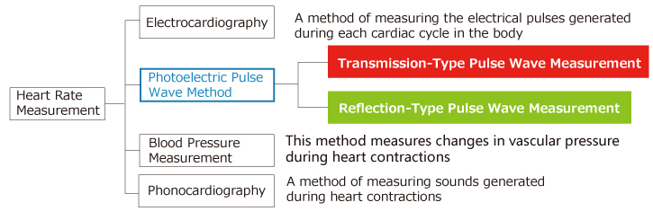
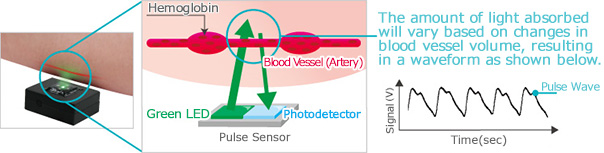
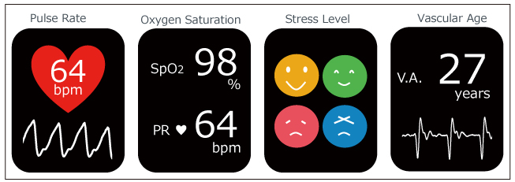

# Sensor de Pulso

Ref.: ROHM Semiconductor >> [Pulse Sensor](https://www.rohm.com/electronics-basics/sensor/pulse-sensor), acessado em 03/10/2024.

## O que é um sensor de pulso?

Uma onda de pulso é a mudança no volume de um vaso sanguíneo que ocorre quando o coração bombeia sangue, e um detector que monitora essa mudança de volume é chamado de sensor de pulso.

Primeiro, existem quatro maneiras principais de medir a frequência cardíaca: eletrocardiograma, onda de pulso fotoelétrica, medição da pressão arterial e fonocardiografia.

Os sensores de pulso usam o método fotoelétrico:

Os sensores de pulso usando o método de onda de pulso fotoelétrica são classificados em 2 tipos, dependendo do método de medição: transmissão e reflexão.

Os tipos de transmissão medem as ondas de pulso emitindo luz vermelha ou infravermelha da superfície do corpo e detectando a mudança no fluxo sanguíneo durante os batimentos cardíacos como uma mudança na quantidade de luz transmitida pelo corpo. Este método é limitado a áreas onde a luz pode penetrar facilmente, como a ponta do dedo ou o lóbulo da orelha. A ROHM está atualmente desenvolvendo um sensor de pulso do tipo reflexão (Sensor Óptico para Monitor de Frequência Cardíaca).

O sensor de pulso do tipo reflexão (Sensor Óptico para Monitor de Frequência Cardíaca) é explicado abaixo.

### Sensor de Pulso Tipo Reflexão (Sensor Óptico para Monitor de Frequência Cardíaca)

Os sensores de pulso do tipo reflexão (Sensores Ópticos para Monitor de Frequência Cardíaca) emitem luz infravermelha, vermelha ou verde (~550nm) em direção ao corpo e medem a quantidade de luz refletida usando um fotodiodo ou fototransistor. 

A hemoglobina oxigenada presente no sangue das artérias tem a característica de absorver a luz incidente, portanto, ao sentir a taxa de fluxo sanguíneo (mudança no volume dos vasos sanguíneos) que muda após as contrações cardíacas ao longo do tempo, somos capazes de medir o sinal da onda de pulso.

Além disso, como a luz refletida é medida, a gama de áreas adequadas não é limitada como nos sensores de pulso do tipo transmissão.

Sensor de Pulso do Tipo Reflexão (Sensor Óptico para Monitor de Frequência Cardíaca) - Mecanismo Operacional:

A medição de ondas de pulso usando luz vermelha ou infravermelha pode ser afetada por raios infravermelhos contidos na luz solar (ou seja, ao ar livre), impedindo a operação estável. Por esse motivo, o ==uso interno ou semi-interno é recomendado==.

Para medição de onda de pulso ao ar livre (ou seja, por relógios inteligentes), ==é preferível uma fonte de luz verde que tenha uma alta taxa de absorção na hemoglobina e menos suscetibilidade à luz ambiente==, portanto, o ROHM utiliza LEDs verdes como fontes de luz de transmissão.

### Aplicações do Sensor de Pulso (Sensor Óptico para Monitor de Frequência Cardíaca)

Geralmente, observando o período de flutuação da forma de onda obtida por medições do sensor de onda de pulso e observando a pulsação (variação) usando a frequência cardíaca junto com as ondas vermelhas e infravermelhas, ==é possível medir a saturação de oxigênio no sangue arterial (SpO2)==.

Além disso, espera-se que o uso de dados de sensores de pulso permita o cálculo de vários sinais vitais, como análise de HRV (nível de estresse) e idade vascular por meio de amostragem de alta velocidade e medição de alta precisão:

---

Fernando Passold, em 03/10/2024.

