# Versão 3

[toc]


## Sensor

Nova disposição física para o sensor:

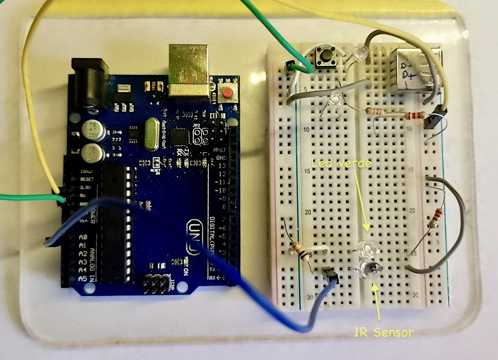

Em uso:

| Detalhe | Em uso |
| :---: | :---: |
| 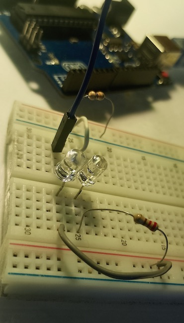 | 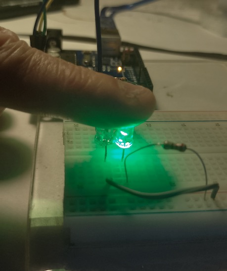 |

## Circuito

| Diagrama Elétrico | Diodo Foto-detector | Detalhe led |
| :---: | :---: | :---: |
| 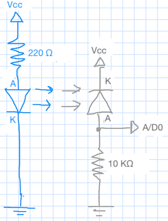 | 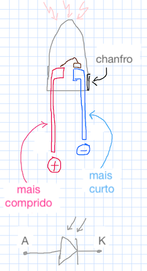 | 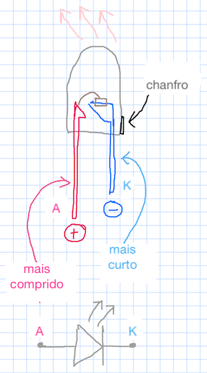 |

**Obs.:** Note que o foto-diodo é polarizado inversamente quando usado como sensor.

## Código

Segue `pulse_monitor_3.ino`:

```c++
/* Monitor de pulsação
   Teste usando foto-detector
   Inclui: 
   1. Dados capturados à taxa de fs = 50 Hz (T = 0,02 segundos), usando ISR
   2. Filtro passa-faixa [0,5 5] Hz @ fs = 50 Hz
   Fernando Passold, em 15/10/2024
*/

const byte analogPin = A0;     // pino (A/D) que recebe sinal analógico
const byte monitor_isr = 7;    // pino 7: para monitor freq e dutty-cycle da ISR (osciloscópio)

bool state = 0;  // variável ativada dentro da ISR (p/monitorar ISR)

int x;         // dados lidos no A/D 0 do Arduíno
float y;       // sinal x filtrado

int x1, x2, x3, x4;    // valores amostras passadas sinal de entrada x
float y1, y2, y3, y4;  // valores amostras passadas sinal de saída y (sinal filtrado)
// Parâmetros do filtro (calculados usando Matlab)
float b0 = 0.056448;  // peso associado com x[n]
float b2 = -0.1129;   // peso associado com x[n-2]; o "b" para x[n-1] é nulo!
float b4 = 0.056448;  // peso associado com x[n-4]; o "b" para x[n-3] também é nulo
float a0 = 1;         // peso para y[n] ("normalizado")
float a1 = -3.1595;   // peso para y[n-1]
float a2 = 3.7927;    // peso para y[n-2]
float a3 = -2.0826;   // peso para y[n-3]
float a4 = 0.45045;   // peso para y[n-4]

void setup() {
  // put your setup code here, to run once:

  // Programando a ISR à 50 Hz usando timer 1
  cli();  //stop interrupts
  //set timer1 interrupt at 50 Hz
  TCCR1A = 0;  // set entire TCCR1A register to 0
  TCCR1B = 0;  // same for TCCR1B
  TCNT1 = 0;   //initialize counter value to 0
  // set compare match register for 1hz increments
  OCR1A = 1249;  // = (16*10^6) / (50*256) - 1 (must be <65536)
  // turn on CTC mode
  TCCR1B |= (1 << WGM12);
  // Set CS12 bits for 256 prescaler
  TCCR1B |= (1 << CS12);
  // enable timer compare interrupt
  TIMSK1 |= (1 << OCIE1A);

  pinMode(monitor_isr, OUTPUT);
  digitalWrite(monitor_isr, LOW);

  Serial.begin(115200);  //  setup serial
  while (!Serial) {
    ;  // Aguarda até que a porta serial esteja pronta - normalmente 10 ms
  }
  Serial.println(" ");
  Serial.println("Monitorando foto-detector: ");

  // inicializando amostras atrasadas sinal de entrada
  x1 = 0; x2 = 0; x3 = 0; x4 = 0;
  // inicializando amostras atrasas sinal saída filtro
  y1 = 0; y2 = 0; y3 = 0; y4 = 0;

  sei();  //allow interrupts
}

ISR(TIMER1_COMPA_vect) {  //timer1 interrupt 1Hz toggles pin 13 (LED)
  digitalWrite(monitor_isr, HIGH);
  // Atualiza varíavel x contendo valor lido em A0
  x = analogRead(analogPin);  // * (5.0 / 1024.0);  // converte para faixa 0 à 5 Volts

  // Aplicando fitro Passa-Faixa sobre sinal de entrada x
  // Saída filtrada em y
  y = b0 * (float)x + b2 * (float)x2 + b4 * (float)x4 - a1 * y1 - a2 * y2 - a3 * y3 - a4 * y4;
  // atualizando amostras passadas para próxima chamada da ISR
  y4 = y3;
  y3 = y2;
  y2 = y1;
  y1 = y;
  x4 = x3;
  x3 = x2;
  x2 = x1;
  x1 = x;

  // não é recomendável enviar dados pela serial dentro de um ISR, mas testando...
  Serial.print(x);  // col 1 - valor bruto (int)
  Serial.print(" \t");
  Serial.println(y);  // col 2 - valor filtrado (float)

  digitalWrite(monitor_isr, LOW);
}

void loop() {
  // put your main code here, to run repeatedly:
  // Nothing to do here
}
```


## Resultados

A figura abaixo mostra como fica a captura de dados SEM dedo colocado sobre o par emissor-receptor fotoelétrico:

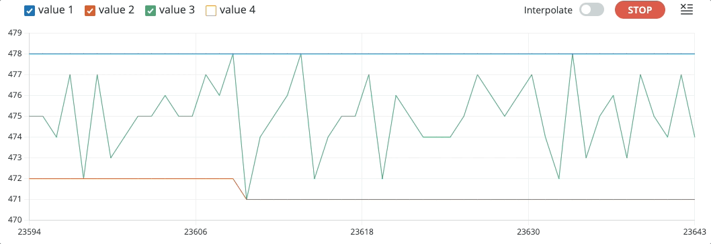

Captura semelhante observando a saída do filtro:

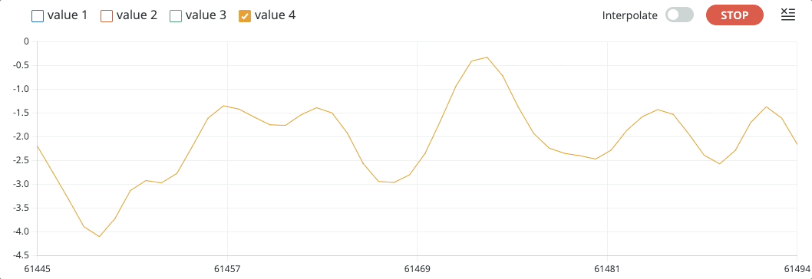

O próximo gráfico compara $x[n]$ $\times$ $y[n]$ "escalonado":

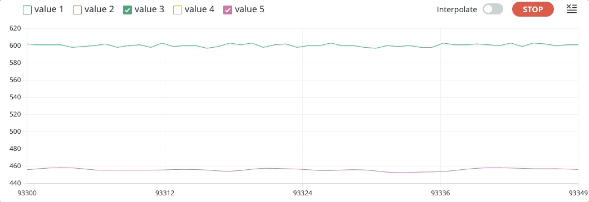

<!-- Segue um arquivo "bag" com este tipo de dados capturados: -->

A próxima figura mostra uma sequência de captura de dados COM o dedo posicionado de forma algo estática sobre o conjunto emissor-sensor fotoelétrico:

<!--  -->

Gráfico dos dados brutos, $x[n]$:

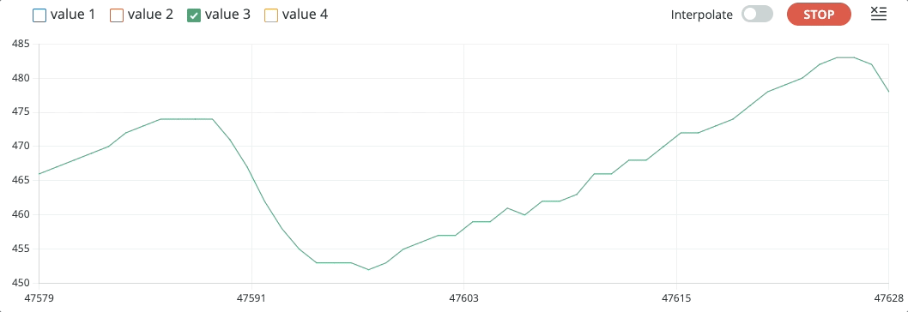

Gráfico do valor filtrado, $y[n]$:

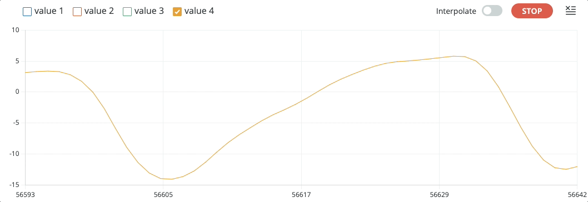

A próxima figura mostra um gráfico do tipo $x[n]$ (sinal bruto) $\times$ $y[n]$ (sinal filtrado) "escalonado" ou variável  `y_aux` calculada da seguinte forma:

```c++
y_aux = 460.0 + 2.0 * y;
```

Esta variável foi acrescentada depois ao código mostrado acima e os valores usados para "escalar" $y[n]$ foram obtidos empiricamente observando ensaios realizados.

É possível se observar simulateamente sinal bruto (value 3) $\times$ sinal filtrado (escalonado) (value 5):

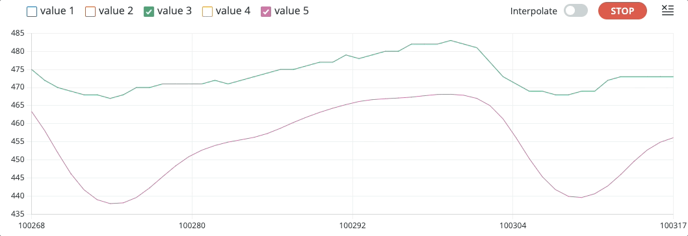

Note que o filtro consegue "ignorar" adequadamente bem variações abruptas no sinal de entrada $x[n]$ causadas por movimentação do dedo, movimento do dedo sobre sensores, etc:

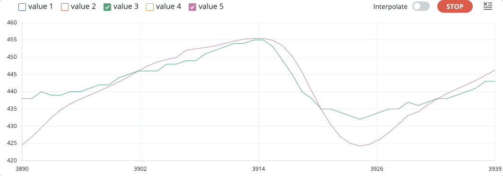

## Arquivos "bag"

Disponibilizando arquivos de dados capturados para testes offlines de algoritmos de filtros e detecção de picos:

* **Sem** dedo posicionado sobre o conjunto sensor/receptor: <a href="captura_sem_dedo.txt" target="_blank">captura\_**sem**\_dedo.txt"</a> (20 segundos; 14 KB)
* **Com** dedo posicionado sobre o conjunto sensor/receptor: <a href="captura_com_dedo.txt" target="_blank">captura\_**com**\_dedo.txt</a> (30 segundos, incluindo nos últimos segundos, movimentação do dedo sobre sensor; 21 KB).

<!-- Segue um arquivo "bag" com este tipo de dados capturados: [dados_capturados_pulse_monitor_3_3_com_dedo.txt](dados_capturados_pulse_monitor_3_3_com_dedo.txt). -->

Trabalhando com os dados do último arquivo se é capaz de mostrar $x[n]$ e $y[n]$ ao mesmo tempo, no mesmo gráfico:

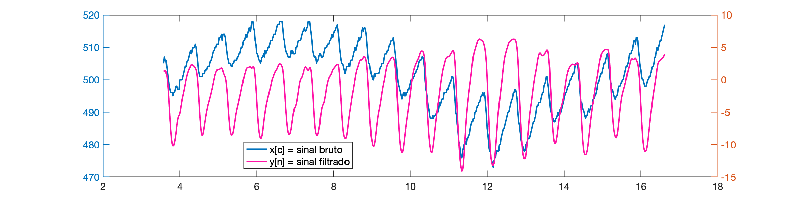

Você pode plotar os dados usando o Matlab:

```matlab
>> dados=load('captura_sem_dedo.txt');	% lê "bag" file
>> size(dados)		% matriz de 923 x 2, col 1=x[x], col 2=y[n]
ans =
   923     2
>> x=dados(:,1);	% separa x[n] = dados brutos
>> y=dados(:,2);	% separa y[n] = sinal filtrado
>> u=length(x)
u =
   923
>> T=0.02;			% período de amostragem adotado (50Hz)
>> t=0:T:(u-1)*T; 	% sintetiza vetor tempo
>> plot(t,x)
```

Seria obtido um gráfico como:

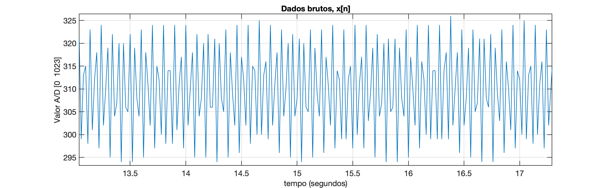

Note como o sinal se modifica quando o dedo está sobre o sensor:

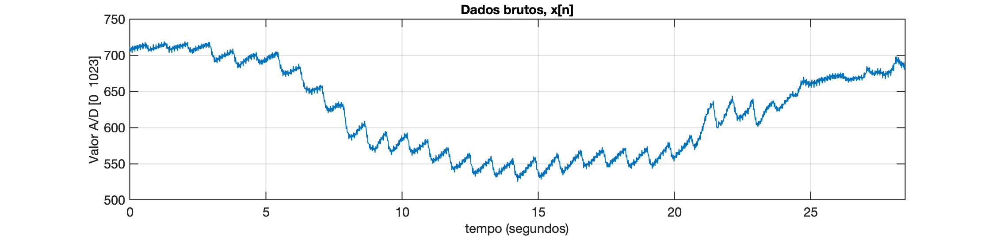

Por isto que se faz necessário passar o sinal bruto $x[n]$ pelo filtro passa-faixa, resultado em:

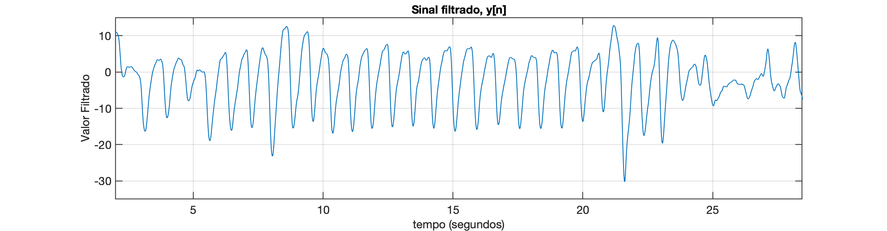

**Obs.**: note que os 2 primeiros segundos do sinal filtrado são ignorados, o filtro ainda está no seu "regime transitório".

Os arquivos "bag" podem ser úteis para testar diferentes abordagem para **pós-processamento do sinal bruto**, sem necessidade de acessar novamente o hardware para realizar novos ensaios *in-locco*. 

Resta agora detectar os picos e calcular o BPM. 

## Pós-processamento do sinal filtrado

Para determinar o BPM, ainda se faz necessário processar o sinal filtrado fazendo:

* **Opção 1**: **simples deteccção de máximos** consecutivos e determinaçao da distância (período) de tempo entre os mesmos. Note: BMP $=\Delta t \times 60$. Eventualmente se pode aprimorar em algo esta abordagem desonsiderando picos muito próximos. E adicionalmente ainda pode ser verificado se existe um "vale de descida" entre os picos, verificando se o sinal caiu abaixo de certo limiar antes de encontrar um novo pico. Abordagem obviamente ==suceptível à erros==.
* **Opção 2**: **uso de derivada**, ==método mais robusto==. A abordagem de derivadas no código de detecção de picos, considera calcular a derivada primeira (ou diferença entre amostras consecutivas; gradiente do sinal) para identificar quando o sinal está subindo ou descendo. Isso pode ajudar a garantir que um pico seja detectado apenas após uma subida e uma descida, confirmando a formação de um pico verdadeiro. Essa abordagem reduz a probabilidade de detectar picos falsos que podem ocorrer devido a ruídos ou variações rápidas no sinal.


----

<font size="2">🌊 [Fernando Passold](https://fpassold.github.io/)[ 📬 ](mailto:fpassold@gmail.com), <script language="JavaScript"><!-- Hide JavaScript...
var LastUpdated = document.lastModified;
document.writeln ("página criada em Oct 15, 2024; atualizada em " + LastUpdated); // End Hiding -->
</script></font>