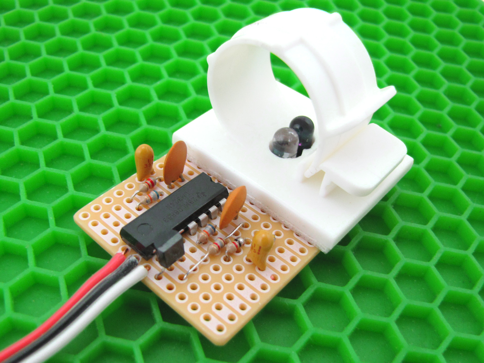

# Projeto de um Sensor de Pulsação

O objetivo é tentar realizar um sistema para medição da pulsação ou batimentos cardíacos por minuto (BPM) usando abordagem fotométrica.

Etapas:

1. Base teórica →  [Sensor de Pulso](Pulse_Monitor/sensor_pulso.html).

2. Exemplo de sistema usando sensor comercial KS0015, Raspberry Pi e Python →  [Monitor de Frequência do Pulso](Pulse_Monitor/pulse_monitor.html). Acompanha considerações e etapas necessárias envolvidas com processamento do sinal.

3. Outros projetos usando outros sensores comerciais prontos:
   1. [Instructables.com > DIY Arduino Pulse Sensor](https://www.instructables.com/Simple-DIY-Pulse-Sensor/);
   2. [Makezine.com > Infrared Pulse Sensor](https://makezine.com/projects/ir-pulse-sensor/);
   3. [ElectronicsHub > Heartbeat Sensor Using Arduino (Heart Rate Monitor)](https://www.electronicshub.org/heartbeat-sensor-using-arduino-heart-rate-monitor/)
   4. [PulseSensor.com > Heartbeats in Your Project, Lickety-Split](https://pulsesensor.com)
   
4. 1o-Teste usando MRD1114 →  [Sensor Pulsação - Teste #1](Pulse_Monitor/QRD1114.html)  (inclui códigos Arduino e Python para captura de dados)

5. 2o-Teste usando MRD1114 (outra configuração elétrica) →  [Sensor Pulsação - Teste #2](Pulse_Monitor/QRD1114_teste2.html) 

6. 3o-Teste usando MRD500 →  [DIY Sensor de Pulso IR](Pulse_Monitor/ DIY_Sensor_Pulso_IR.html). Inclui considerações e projeto de Filtro Passa-Faixa usando Matlab.

7. Teste usando foto-diodo ([DiY Sensor de Pulso IR: Parte 2](Pulse_Monitor/DIY_parte2.html)).

8. Outro teste (funcional) com foto-diodo (outro setup físico, outro circuito, melhores resultados) ⇒ ( [**teste_pulse_monitor_3**](Pulse_Monitor/teste_pulse_monitor_3_3.html) ).
   
9. **Pós-processamento**:

   1. [Filtro Passa-Baixas de 1a-ordem](Pulse_Monitor/fpb1a-ordem_digital.html) 
   2. Calculos de [Média $\times$ Mediana](Pulse_Monitor/media_mediana.html) ;
   3. [Detecção de Picos](Pulse_Monitor/picos.html) (Método "Simples" $\times$ Usando Derivadas).
   4. [Testes de Rotinas de Detecção de Picos](Pulse_Monitor/detector_picos.html) baseados em Derivadas.

   

10. Resultados Finais.
    **Deadline**: entrega do projeto: 08/11/2024.

ANEXOS:

1. [Captura de Dados de Porta Serial](Pulse_Monitor/captura_dados_serial.html)   (*script* em Python, com instruções).

   

----

🌊 [Fernando Passold](https://fpassold.github.io/)[ 📬 ](mailto:fpassold@gmail.com), 

