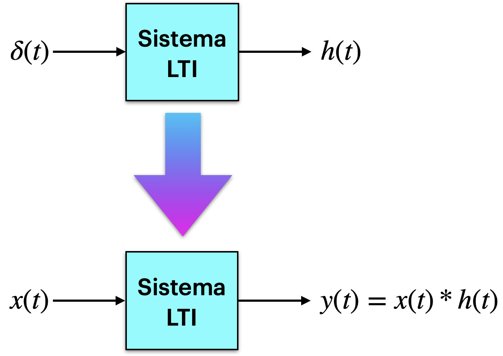
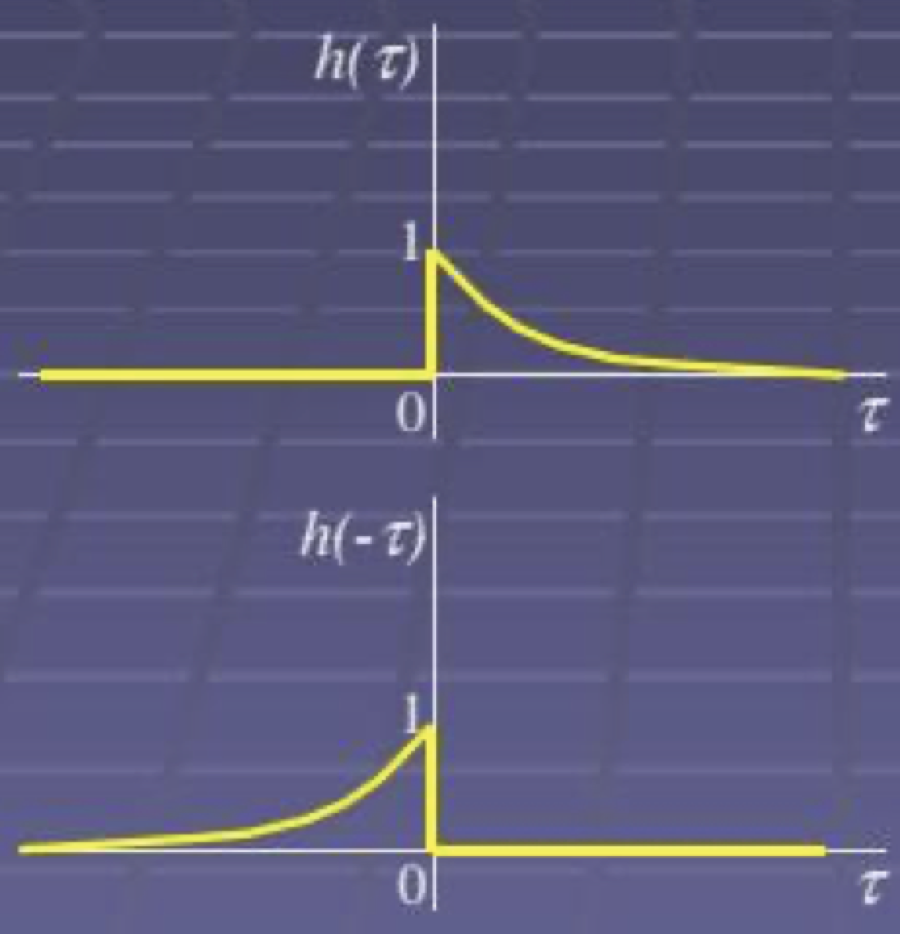
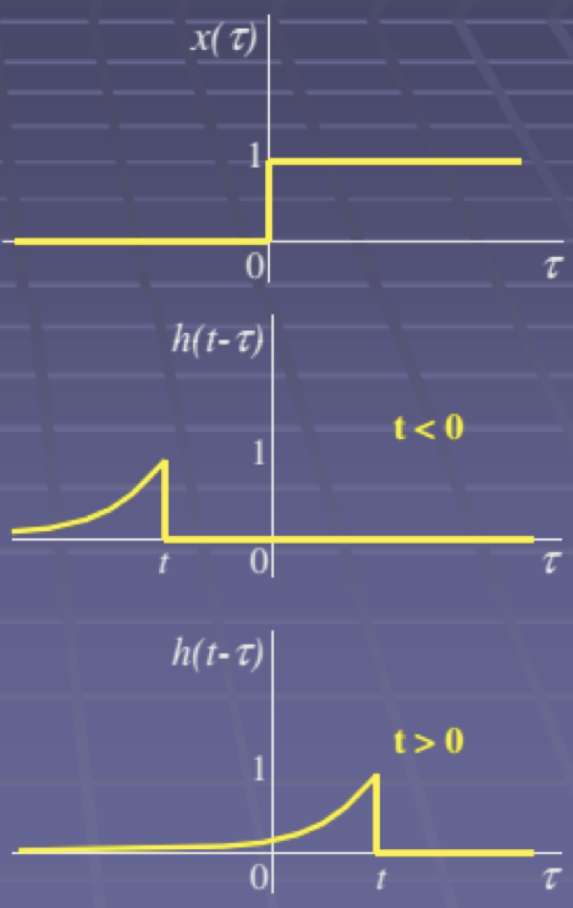

# Convolução

Material teórico:  [3_Sistemas.pdf](3_Sistemas.pdf) 

**Resumo**:

- Descreve a saída de um sistema, $h(t)$, quando um impulso unitário de Dirac, $\delta(t)$ (ou função delta) é aplicada à entrada de um sistema.
- A resposta ao impulso de um sistema LTI permite prever a saída, $y(t)$, para qualquer entrada arbitrária, , usando a teoria da **convolução**, ou:

**Equações**:

No tempo contínuo:
$$
y(t)=x(t) * h(t)=\int_{\tau=-\infty}^{\infty} x(\tau) \cdot h(t-\tau) \, d\tau
$$
ou no tempo discreto
$$
y[k]=x[k]*h[k]=\sum_{n=-\infty}^{\infty} x[n] \cdot h[k-n]
$$

- A saída de qualquer sistema LTI pode ser determinada pela convolução do sinal de entrada $x(t)$, com sua resposta ao impulso unitário, $\delta(t)$, ou (na forma de um diagrama em blocos):

**Cálculo**:

1. Reversão temporal (rebatimento em relação ao eixo vertical) da resposta impulsiva $h(t)$ para se obter $h(t-\tau)$.
2. Multiplicação dos sinais $x(t)$ e $h(t_0-\tau)$ para todos os valores de $\tau$, com $t=t_0$.
3. Integração do produto $x(\tau)\cdot(t-\tau)$ para todos os valores de $\tau$, obtendo-se um valor unitário para $y(t_0)$.
4. Repetição dos passos anteriores para $-\infty<t<\infty$ para produzir a saída para todos os instantes de tempo,$x(t)$ .

**Exemplos**:

**Ex_1**: Seja $x(t)=u(t)$ (Degrau unitário) e $h(t)=e^{-at}u(t)$, com $a>0$ (função exponencial converge). Determine $y(t)$ .

- Resolução gráfica:
  
    | Preparações | Resultados |
    | :---: | :---: |
    |  |  |
    

Resultado: $y(t)=\left( \frac{1-e^{-at}}{a} \right) u(t)$.

**Ex_2**: **Animação**_1:

**Ex_3**: **Animação**_2:

----

**Referências externas**:

- Matlab: [xen0f0n](https://gist.github.com/xen0f0n)/[animateConvolutionD.m](https://gist.github.com/xen0f0n/088d5fda244f72af1fcdfd3618dfba54): https://gist.github.com/xen0f0n/088d5fda244f72af1fcdfd3618dfba54  (animateConvolutionD.m)
- Python: https://github.com/spatialaudio/signals-and-systems-lecture/blob/master/systems_time_domain/animation.py 
- Matemathica/Wolfram: https://demonstrations.wolfram.com/DiscreteTimeConvolution/

----

Fernando Passold, em 08/09/2023.

