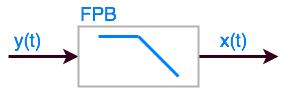
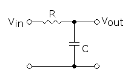

# Filtro Digital Exponencial

<!--
> Arquivo fonte: /Volumes/Macintosh_HD/Users/fernandopassold/Documents/UPF/Controle\_Auto\_3/Derivador/Controle\_Acao\_Derivativa.md (24/04/2018)
-->

- [Filtro Digital Exponencial](#filtro-digital-exponencial)
  - [Filtro Passa Baixas](#filtro-passa-baixas)
    - [Filtro Passa-Baixas RC](#filtro-passa-baixas-rc)
  - [Filtro Exponencial Digital](#filtro-exponencial-digital)
  - [Filtro exponencial duplo (ou de 2a-ordem)](#filtro-exponencial-duplo-ou-de-2a-ordem)
  - [Filtro de Média Móvel](#filtro-de-média-móvel)
  - [Exemplo de Aplicação](#exemplo-de-aplicação)


---

## Filtro Passa Baixas

Em várias aplicações é necessário reduzir o impacto do ruído num sinal sendo processado, eliminando componentes de alta frequência (não previstas no espectro original do sinal): 




A equação diferencial de um filtro passa-baixas (FPB) de 1a-ordem é dada por:

$
\tau_F \cdot \dfrac{\text{d}y(t)}{\text{d}t} + y(t) = x(t)
$

onde $\tau_F$ corresponde à constante de tempo do filtro. Então:

$
f_c = \dfrac{1}{2\pi \; \tau_F} \quad \text{(Hz)}
$

Para $\tau_F < 3$ segundos, o filtro pode ser passivo, constituído por um simples circuito RC.

### Filtro Passa-Baixas RC

Um simples filtro passa-baixas RC é mostrado na próxima figura:



Para este circuito:

$
f_c = \dfrac{1}{2\pi \; R \; C}
$

A frequência do filtro deveria esta na faixa: $\omega_{\text{máx}} < \omega_F < \omega_N$; onde: $\omega_F=1 / \tau_F$, $\omega_{\text{máx}}=1/\tau_{\text{máx}}$ e onde $\tau_{\text{máx}}$ corresponde a mair constante de tempo (a dominante) do processo e $\omega_N$ corresponde à frequência do ruído (rad/s). É esperado que $\omega_F < \omega_N$.

Na prática sugere-se $\tau_F < 0,1 \cdot \tau_{\text{máx}}$ (ou seja, a frequência de corte do filtro fique localizado uma década abaixo da freq. máxima permitida para o sinal de entrada); $\tau_\text{máx}$ corresponde à constante de tempo dominante (maior) do sistema.

A função transferência do filtro seria:

$
G(j\omega) = \dfrac{1}{\tau_F \; j \omega + 1}
$

Como $s=j\omega$, teremos:

$
G(s)=\dfrac{1}{\tau_F \; s + 1}
$

A amplitude fica caracterizada por:

$
|G(j\omega)|=\sqrt{ \left( \dfrac{1}{\omega^2 \; \tau_F^2 +1} \right)^2 + \left( \dfrac{-\omega \; \tau_F}{\omega^2 \; \tau_F^2+1}\right)^2}
$

$
|G(j\omega)|=\sqrt{ \dfrac{( 1+\omega^2\; \tau_F^2)}{(\omega^2 \; \tau_F^2+1 )} }
$

$
|G(j\omega)|=\dfrac{1}{ \sqrt{\omega^2 \; \tau_F^2 + 1} }
$

e a fase é caracterizada por:

$
\phi=\angle{G(j\omega)}=\tan^{-1}{(-\omega \; \tau_F)} = - \tan^{-1}{(\omega \; \tau_F)}
$

Se $\tau_F=1,0$ (segundo), então: $\omega_F = 1 / \tau_F = 1,0$ (rad/s). A função transferência deste filtro ficaria como:

$
G(s)=\dfrac{1}{s+1}
$

O que rende o seguinte diagrama de Bode:

```matlab
>> figure; bode(1, [1 1]); grid
```


Note que uma redução de 20dB ($-20$ dB) corresponde a uma atenuação de $1/10=0,1$ na amplitude original do sinal:

```matlab
>> 20*log10(0.1)
ans =
   -20
>> 
```

* * *

## Filtro Exponencial Digital 

Seja um filtro do tipo:


Uma derivada numérica simples se consegue através de:

$
\dfrac{\text{d}y(t)}{\text{d}t} \approx \dfrac{y[n]-y[n-1]}{\Delta t}
$

Note que se aproxima da equação do filtro analógico de 1a-ordem:

$
\tau_F \cdot \dfrac{\text{d}y(t)}{\text{d}t} + y(t) = x(t)
$

Que resultaria neste caso em:

$
\tau_F \cdot \dfrac{(y[n]-y[n-1])}{\Delta t} + y[n] = x[n]
$

Trabalhando a equação anterior à fim de isolar $y[n]$ (FPB sobre o sinal $x[k]$), teremos:

$
\begin{array}{rcl}
\dfrac{\tau_F \; y[n]}{\Delta t} - \dfrac{\tau_F \; y[n-1]}{\Delta t} + y[n] & = & x[n] \\
& & \\
y[n] \left( 1+\dfrac{\tau_F}{\Delta t} \right) &=& x[n] + \dfrac{\tau_F \; y[n-1]}{\Delta t} \\
& & \\
y[n] & = & \dfrac{ \dfrac{x[n]}{1} }{ 1 + \dfrac{\tau_f}{\Delta t} } + \dfrac{ \dfrac{\tau_F \; y[n-1]}{\Delta t} }{ 1 + \dfrac{\tau_F}{\Delta t} }\\
& & \\
y[n] & = & \dfrac{ \dfrac{x[n]}{1} }{ 1 + \dfrac{\Delta t + \tau_F}{\Delta t} } + \dfrac{ \dfrac{\tau_F \; y[n-1]}{\Delta t} }{ \dfrac{\Delta t + \tau_F}{\Delta t}} \\
& & \\
y[n] & = & \left( \dfrac{\Delta t}{\tau_F + \Delta t} \right) \cdot x[n] + \left( \dfrac{\tau_F}{\tau_F + \Delta t} \right) \cdot y[n-1] \\
\end{array}
$

Podemos criar a variável $\alpha$ tal que:

$
\alpha = \dfrac{\Delta t}{\tau_F + \Delta t} = \dfrac{1}{ \dfrac{\tau_F}{\Delta t} + 1}
$

e então:

$
(1-\alpha) = 1 - \dfrac{1}{ \dfrac{\tau_F}{\Delta t} + 1 } = \dfrac{\tau_F}{\tau_F + \Delta t}
$

E assim chegamos a um **formato mais simples de equação para o filtro digital exponencial de 1a-ordem**:

$
y[n] = \alpha \; x[n] + (1 - \alpha) \; y[n-1]
$

onde: $0 < \alpha < 1$. Tipicamente é empregado o valor $\alpha = 0,1$.

|**Note que:** | | |
|:---|:---|:---|:---|
| Se $\alpha = 1$ | $\rightarrow$ **não existe filtragem** | $\rightarrow \quad y[n] = x[n]$. |
| Se $\alpha = 0$ | $\rightarrow$ **Sinal original é ignorado** | $\rightarrow \quad y[n] = 0$. |

* * *

## Filtro exponencial duplo (ou de 2a-ordem)

Pode ser formado pelo cascateamento de 2 filtros de 1a-ordem:


Derivando as equações, teremos:

$
\begin{array}{rcl}
\bar{y}[n] & = & \gamma \; y[n] + (1 - \gamma) \; \bar{y}[n-1] \\
& & \\
\bar{y}[n] & = & \gamma \; \alpha \; x[n] + \gamma (1 - \alpha) y[n-1] + (1 - \gamma) \; \bar{y}[n-1] \\
& & \\
\bar{y}[n-1] & = & \gamma \; y[n-1] + (1 - \gamma) \; y[n-2] \\
& & \\
y[n-1] & = & \dfrac{1}{\gamma} \; \bar{y}[n-1] - \dfrac{(1 - \gamma)}{\gamma} \; \bar{y}[n-2]\\
& & \\
\bar{y}[n] & = & \gamma \; \alpha \; x[n] + (2 - \gamma - \alpha) \; \bar{y}[n-1] - (1-\alpha)(1-\gamma)\; \bar{y}[n-2]
\end{array}
$

Se $\gamma = \alpha$, este filtro resulta em:

$
\bar{y}[n] = \alpha^2 \; x[n] + 2(1-\alpha)\; \bar{y}[n-1] - (1-\alpha)^2 \; \bar{y}[n-2]
$

Note que existe uma vantagem deste filtro sobre o anterior de 1a-ordem: este filtro atenua mais fortemente ruídos de alta frequencia, especialmetne se $\gamma = \alpha$.

Este filtro resulta em algo semelhante à:

$
G(s) = \dfrac{1}{(s+1)^2}
$

Cujo diagrama de Bode resulta:

```matlab
>> figure; bode(1, conv( [1 1], [1 1] ) ); grid
```


Note: corte de 40 db/déc (uma atenuação de $1/100$ sobre o sinal de entrada)!

```matlab
>> 20*log10(0.01/1)
ans =
   -40

```
---

## Filtro de Média Móvel

Neste caso se aplica simplesmente a equação:

$
y[n] = \dfrac{1}{J} \; \sum_{i=n-J+1}^{n}{x[i]}
$

que representa a média dos últimos $J$ pontos sobre o sinal de entrada $x[n]$

Esta equação pode ser reescrita como:

$
y[n-1] = \dfrac{1}{J} \; \sum_{i=n-J}^{n-1}{}x[i]
$

mesclando as 2 últimas equações obtemos:

$
y[n] = y[n-1] + \dfrac{1}{J} \; \left( x[n] - x[n-J] \right)
$
que resulta num comportamento semelhante à um filtro passa-baixas, servindo também para eliminar componentes (ruídos) de alto frequência.

* * *

## Exemplo de Aplicação

Os 3 filtros anteriores poderiam ser aplicados sobre este tipo de sinal:


Trata-se de uma onda quadrada (sinal esperado) oscilando entre 0,0 e 1,0 Volts à frequência de $f=1/3$, acompanhado de um ruído (senoide) oscilando na frequência de 9 Hz com amplitude de 0,25 Vp.

Segue simulação da aplicação de alguns filtros sobre este sinal:
* Filtro analógico de 1a-ordem com $\tau_F = 0,1$ minutos;
* Filtro analógico de 1a-ordem com $\tau_F = 0,4$ minutos;
* Filtro digital exponencial de 1a-ordem com $\tau_F = 0,1$ minutos; e usando período de amostragem $T = 0,05$ minutos;
* Filtro digital exponencial de 1a-ordem com $\tau_F = 0,1$ minutos; e usando período de amostragem $T = 0,1$ minutos;
* Filtro de média móvel com $J=3$ (ainda se deve perceber ruído);
* Filtro de média móvel com $J=7$ (o ruído praticamente some).

Alguns resultados que poderiam ser obtidos:


>   Ref.: **[Process Dynamics and Control 4th Edição](https://a.co/d/4djgyBK)**, por [Dale E. Seborg](https://www.amazon.com/-/pt/s/ref=dp_byline_sr_book_1?ie=UTF8&field-author=Dale+E.+Seborg&text=Dale+E.+Seborg&sort=relevancerank&search-alias=books) (Author), [Thomas F. Edgar](https://www.amazon.com/-/pt/s/ref=dp_byline_sr_book_2?ie=UTF8&field-author=Thomas+F.+Edgar&text=Thomas+F.+Edgar&sort=relevancerank&search-alias=books) (Author), [Duncan A. Mellichamp](https://www.amazon.com/-/pt/s/ref=dp_byline_sr_book_3?ie=UTF8&field-author=Duncan+A.+Mellichamp&text=Duncan+A.+Mellichamp&sort=relevancerank&search-alias=books) (Author), [Francis J. Doyle III](https://www.amazon.com/-/pt/s/ref=dp_byline_sr_book_4?ie=UTF8&field-author=Francis+J.+Doyle+III&text=Francis+J.+Doyle+III&sort=relevancerank&search-alias=books) (Author), Wiley; 4ª edição (13 setembro 2016),  512 páginas, ISBN-10: 1119285917, ISBN-13 : 978-1119285915.

Segue script adotado no MATLAB que gerou figura com ruido:

```matlab
% Onda quadrada ruidosa
% Fernando Passold, 24/04/2018
T1=1/(0.05*60) % 1o-periodo de amostragem
T2=1/(0.1*60)   % 2o-periodo de amostragem
% Simulando os primeiros 2 ciclos de uma onda
% quadrada, f = 1/3 (Hz)
% amostrar este sinal 20 x f
disp('Onda quadrada oscilando à:')
f = 1/3
fs = 20*20;
T_square = 1/f;
T = 1/fs;
k=0:T:2*T_square;
u=length(k); % qtadade de amostras geradas
square=zeros(1, u);
for i=1:u
    t = k( i );    % calculando tempo real em segundos
    if ( t > T_square/2 )&&( t < T_square)
        square(1, i) = 1;
    end
    if ( t > (T_square + T_square/2) )&&( t < 2*T_square)
        square(1, i) = 1;
    end
end
% Sobrepondo a senoide (ruido) de 0,25 Vp, freq = 9 Hz
f_N = 9;
T_N = 1/f_N;
for i=1:u
    t = k( i );
    noise( i ) = 0.25*sin(2*pi*f_N*t);
    signal( i ) = square( i ) + noise( i );
end
plot(k, signal,'m-', k, square)
legend('Sinal com ruido','Sinal sem ruido')
grid
```

---

<font size="2px">

<!--
> Arquivo fonte: /Volumes/Macintosh_HD/Users/fernandopassold/Documents/UPF/Controle\_Auto\_3/Derivador/Controle\_Acao\_Derivativa.md (Abril/2018) 
-->

Fernando Passold, Abril/2018
</font>
