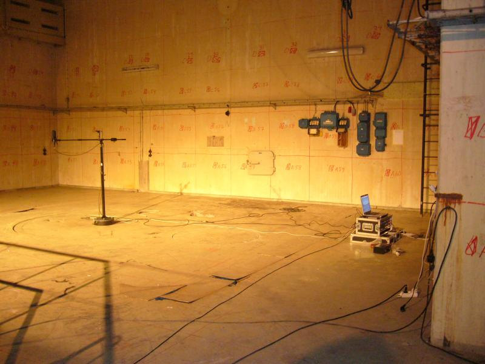

<!-- title: Lab. Processamento Digital de Sinais -->

# Lab. Processamento Digital de Sinais

Experimentos previstos:

* Lab 1) **Ruídos** (tipos, definições, geradores):  [lab_1_ruidos.pdf](Lab_1/lab_1_ruidos.pdf) (arquivo:  [numeros.c](Lab_1/numeros.c)  -- teste da função `rand()`: gerador de números aleatórios, linguagem GNU C).
* Lab 2) **Convolução (e Reverberação)**: processando sinal para reverberar de maneira diferente.
  Arquivo PDF do roteiro:  [lab_2_convolucao.pdf](Lab_2/lab_2_convolucao.pdf)  + rotina MATLAB para "brincar" com reverberação de sinais:   [convol2.m](Lab_2/convol2.m) + Arquivo Zipado com audios para testes:  [lab_2_material_aula.zip](Lab_2/lab_2_material_aula.zip) (75,2 MB).
  Revisão sobre **[Convolução](Convolucao/convolucao.html) **.

:construction_worker_man: Página ainda sendo atualizada.

----

Fernando Passold, em 08/09/2023