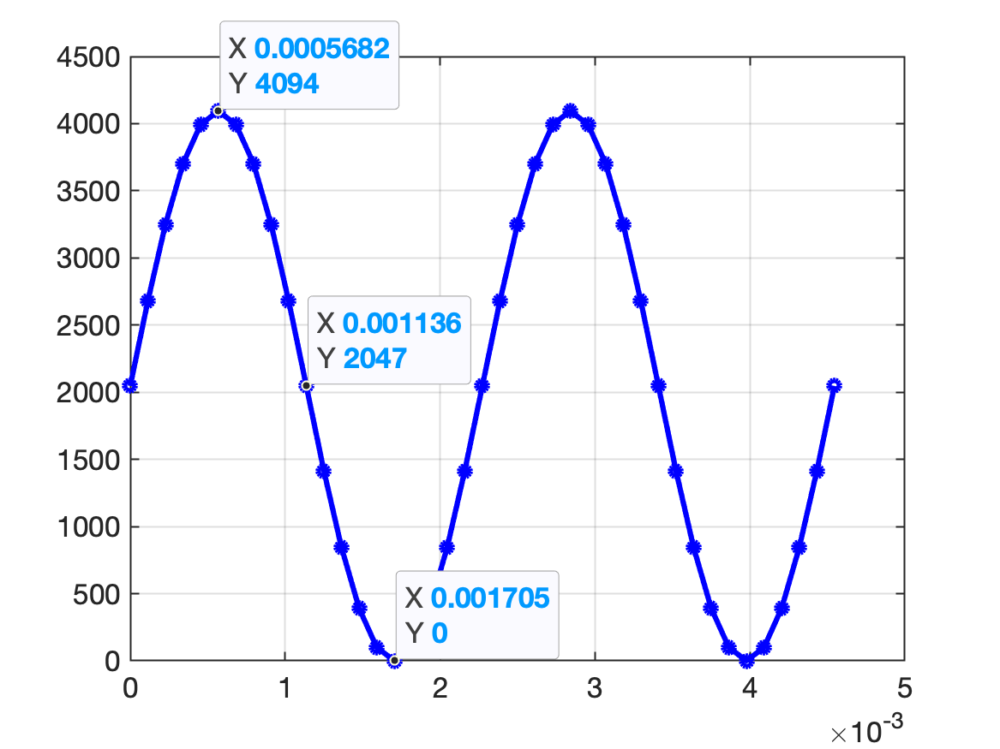

</br>
[Vaga-lume entra para a lista de insetos em extinção; diz estudo](https://super.abril.com.br/ciencia/vaga-lumes-estao-sob-risco-de-extincao-diz-estudo)

# Gerador Onda Senoidal

**Projeto**: gerar uma onda senoidal de 440 Hz[^La_musical] usando Arduino e circuitos auxiliares.

## Material

Este projeto usa um módulo externo MCP4725[^MPC4725] com o conversor D/A que se comunica com o Arduíno via I2C.

Módulo MCP4725 usado:


## Métodologia

Este conversor D/A é de 12 bits, o que significa que trabalha com valores de entrada variando de 0 até  $(2^{12}-1)=4095$:

```matlab
>> 2^12
ans =
        4096
>> ans/2
ans =
        2048
```

Isto significa que a onda senoidal será gerada usando uma equação como:

$y(t) = 2047 + 2047 \cdot \sin(2\pi \cdot 440 \cdot t)$

O que gera um sinal variando entre $0 \le y(t) \le 4094 \quad (=2 \times 2047)$.

Se vamos gerar **20 pontos por ciclo** na senóide teremos algo como:

```matlab
>> f=440;               % freq. desejada
>> fs=20*440            % freq. de amostragem = 20 * freq. desejada
fs =
        8800
>> T=1/fs               % período de amostragem necessário
T =
   0.00011364
>> % Simulando um gráfico
>> t=0:T:2/440;         % gera vetor tempo t
>> y=2047+2047*sin(2*pi*440*t);
>> plot(t,y,'bo-')
```

E temos o seguinte grãfico antecipando a sequência de pontos que deve ser gerada pelo Arduíno:



Podemos implementar o gerador desta onda, variando o ângulo da senoide à cada nova amostra, já que aplicar literalmente a equação para $y(t)$,  implica em problemas para gerar o valor de $t$. Não parece muito prático avançar o valor de $t$ à cada instante de amostragem. O mais prático é avançar o ângulo da senoide e lembrar que nosso sinal é cíclico (uma senóide), variando entre 0 à $360^o$. É muito mais fácil (e melhor) em termos computacionais, calcular o incremento angular correspondente ao $\Delta t$ ou $T$ adotado entre cada ponto do sinal gerado. Só não esquecer que a maior parte das linguagens de programação não trabalha com argumento de entrada em graus e sim em radianos. Completando alguns cáclulos, obtemos:

```matlab
>> 360/20       % incremento angular entre os pontos na onda senoidal (em graus)
ans =
    18
>> 2*pi/20      % incremento angular entre os pontos na onda senoidal (em radianos)
ans =
      0.31416
```

Isto implica em gerar um código para gerar a senoide do tipo:

```C
// Em algum bloco de inicialização de variáveis globais!
const float delta_th = 2.0 * PI / 20.0; // incremento angular entre os 20 pontos da senoide
int index = 0;                          // ponto da senoide sendo sintetizado

// Rotina gera pontos onda senoidal
void senoide(void){
    float y;
    theta = index * delta_th;           // calcula angulo atual da senoide
    y = 2047.0 + 2047.0*sin(theta);
    DAC_output((int)y);                 // envia valor inteiro entre 0 à 4095 ao DAC
    index++;                            // deixa pronto para proximo ponto
    if (index > 19) index = 0;
}
```

Note que temos que transformar o valor `y` *float*, num valor *int* usando operador de *casting*. Variáveis *int* no Arduíno ocupam 16-bits e são capazes de representar valores entre -32,768 ($=-2^{15}$) à 32,767 ($=2^{15}-1$)[^1]. Então neste caso, percebemos que estamos gerando valores dentro da faixa esperada.

### Usando *lookup table*

Outra forma comum de sintetizar sinais periódicos é fazer uso de uma "tabela de conversão" (ou *lookup table*).

Neste caso, passamos para a placa um vetor contendo os valores que devem ser gerados em cada instante de amostragem da onda. E repassamos este valor simplesmente apontando para o ponto correto na tabela. Este método é mais rápido que o anterior, pois não implica que a placa tenha que calcular por software o resultado da função `sin()` à cada instante de amostragem. Cabe lembrar que o $\mu$C ATMEL 328/168 das placas Arduino One segue arquitetura RISC (Instruções simples) e que sua ULA não é de ponto flutuante. Portanto o cálculo da função `sin()` é feito por software e não hardware, atrasando a execução do código nesta parte.

Neste caso, o valor dos pontos que devem ser gerados em cada instante de amostagem deve ser pré-informado num vetor durante a codificação do gerador.

Mas é fácil definir este vetor. Já praticamente montamos este vetor quando simulamos a onda quadrada á ser gerada pelo Arduinoi usando o Matlab. Basta "exportar" este vetor, contendo apenas os valores inteiros sem sinal de 12-bits:

```matlab
>> f=440;
>> T=1/f;
>> delta_t=T/20; % 20 amostras por ciclo
>> t = 0: delta_t : T - delta_t;  % vetor t contendo um ciclo exato da senoide
>> y=2047+2047*sin(2*pi*440*t);
>> [t' y']
ans =
            0         2047
   0.00011364       2679.6
   0.00022727       3250.2
   0.00034091       3703.1
   0.00045455       3993.8
   0.00056818         4094
   0.00068182       3993.8
   0.00079545       3703.1
   0.00090909       3250.2
    0.0010227       2679.6
    0.0011364         2047
      0.00125       1414.4
    0.0013636        843.8
    0.0014773       390.94
    0.0015909       100.19
    0.0017045            0
    0.0018182       100.19
    0.0019318       390.94
    0.0020455        843.8
    0.0021591       1414.4
>> % Percebemos que a variável y é do tipo "float", alternado para "int":
>> y_seno = round(y);
>> [t' y' y_seno']
ans =
            0         2047         2047
   0.00011364       2679.6         2680
   0.00022727       3250.2         3250
   0.00034091       3703.1         3703
   0.00045455       3993.8         3994
   0.00056818         4094         4094
   0.00068182       3993.8         3994
   0.00079545       3703.1         3703
   0.00090909       3250.2         3250
    0.0010227       2679.6         2680
    0.0011364         2047         2047
      0.00125       1414.4         1414
    0.0013636        843.8          844
    0.0014773       390.94          391
    0.0015909       100.19          100
    0.0017045            0            0
    0.0018182       100.19          100
    0.0019318       390.94          391
    0.0020455        843.8          844
    0.0021591       1414.4         1414
>> % é a última "coluna" da "tabela" anterior que temos que repassar para
>> % um programa em C
```

Note que se pode inicializar um vetor na linguagem C, realizando algo do tipo:

```C
const Valores uint16_t DACLookup[32] =
{
  2048, 2447, 2831, 3185, 3495, 3750, 3939, 4056,
  4095, 4056, 3939, 3750, 3495, 3185, 2831, 2447,
  2048, 1648, 1264,  910,  600,  345,  156,   39,
     0,   39,  156,  345,  600,  910, 1264, 1648
};
```

No exemplo anterior criamos um vetor de 32 elementos ($8 \times 4$) de valores inteiros sem sinal de 16-bits (uint16_t).

Para o nosso caso, podemos fazer o Matlab apresentar o vetor num formato prático para "copy-&-paste" para a IDE do Arduino:

```matlab
>> fprintf('%4d, ', y_seno); fprintf('\n')
2047, 2680, 3250, 3703, 3994, 4094, 3994, 3703, 3250, 2680, 2047, 1414,  844,  391,  100,    0,  100,  391,  844, 1414, 
>> 
```

O bloco de código em C necessário para nossa senóide fica então como:

```C
// a variável abaixo deve ser global!
const Valores uint16_t DACLookup[20] =
//    1     2     3     4     5     6     7     8     9    10
{
   2047, 2680, 3250, 3703, 3994, 4094, 3994, 3703, 3250, 2680, 
   2047, 1414,  844,  391,  100,    0,  100,  391,  844, 1414     
}
```

Para acessar então determinado valor (ou posição) de senóide basta codificar algo como:

```C
{
        uint16_t k;     // ponto da senoide (entre 0 à 19)
        uint16 valor;   // valor desejado para ponto k da senoide
        for (k = 0; k < 19; k++)
        {
                valor = &(DACLookup[k]);
        }
}
```

Lembrando que estamos acessando o conteúdo do vetor tratando o mesmo como um ponteiro (qualquer vetor ou matriz em C é um ponteiro para uma região de memória). O operador `&` permite então recuperar o valor da posiçao `k` do vetor (ou ponteiro).

### Definindo detalhes para a rotina ISR

Já sabemos como vamos implementar a senóide, o que nos falta agora é definir e programar a interrupção que vai disparar a rotina da onda senoidal à cada instante de amostragem.

O Arduino One e seu microcontrolador possui 3 temporizadores: *timer0*, *timer1* e *timer2*, todos de 8-bits, com excessão do *timer1* que é de 16-bits[^ISR_Arduino]. Além disto, cada um deles dispõe de registradores de *prescaler* para dividir a frequência de clock original da placa Arduino (16 MHz). Mas o $\mu$C ATMEL 328/168 da placas Arduino One permite definir o *prescaler* apenas no valores fixos: 1, 8, 64, 256 e 1024. Realizando alguns cálculos para avaliar a forma que melhor nos convêm para uso do *prescaler* e programação do registrador com valor do *timer*, temos:

```matlab
>> fs                              % Lembrando da freq. de amostragem desejada
fs =
        8800
>> prescaler=[1 8 64 256 1024];    % valores padrões do Arduino
>> CM=(16E6./(prescaler.*fs)-1);   % registrador do Clock Select
>> [prescaler' CM']                % mostrando resultados obtidos
ans =
            1       1817.2
            8       226.27
           64       27.409
          256       6.1023
         1024      0.77557
```

A idéia é trabalhar com o valor mais próximo de um "*int*" para a variável CM que define o valor a ser carregado no temporizador.

A combinação que parece resultar num menor erro na freq. de amostragem é *prescaler* = 256 e *CM* = 6, o que porém esulta num $f_s$ (freq. de amostragem) de 10,410 KHz (desejamos 8,8 KHz), um erro de 18,29% -- ver cálculos abaixo:

```matlab
>> int16(CM) % convertendo float CM para int 16-bits no Matlab
ans =
  1×5 int16 row vector
   1817    226     27      6      1
>> CM_usavel = [1817 226 27 6 1];
>> fs_efetivo = (16E6./(prescaler.*CM_usavel+1))
fs_efetivo =
       8800.9       8844.7       9253.9        10410        15610
>> erro_per=((fs-fs_efetivo)/fs)*100;
>> [prescaler' CM' CM_usavel' fs_efetivo' erro_per'] % mostrando resultados obtidos
ans =
            1       1817.2         1817       8800.9    -0.010001
            8       226.27          226       8844.7     -0.50756
           64       27.409           27       9253.9       -5.158
          256       6.1023            6        10410      -18.294
         1024      0.77557            1        15610      -77.384
>> 
```

Agora percebemos que apenas as 2 primeiras combinações para *prescaler* e *CM\_usavel* levam a menorer erros. 

O detalhe é que primeira combinação, requer carregar o registrador *CM (Compare Match Register)* com um valor que não cabe dentro da faixa *unsigned int* de 8-bits (de 0 até $(2^8-1)=255$).  Ou seja, neste caso, se fixarmos *prescaler* =1 seremos obrigados a trabalhar com o *timer1* que é o único de 16-bits. Este temporizador é o mesmo que a interface IDE do Arduino usa para gerar varia o *duty-cycle* no gerador PWM quando se usa a instrução `analogWrite()` (que diferentemente do que seu nome indica, não gera realmente nenhum sinal analógico porque a placa Arduino One nem possui D/A). 

**Opção final**: Como neste caso, não vamor usar o gerador PWM *default* do Arduino, podemos "sacrificar" o *timer1* para nossa ISR trabalhando com o mesmo.

> O gerador PWM **deafult* do Arduino trabalha com baixas frequências: 980 Hz nos pinos 5 e 6 e 490 Hz nos pinos 3, 9, 10, 11. 
>
> Suponha que eventualmente nos interessaria redefinir a rotina PWM do Arquino para que mesma trabalhase na frequência (não audível) de 44 KHz.
>
> Neste caso, considerando que o clock do Arduino é de 16 MHz, e é um processador RISC, que leva em média 4 ciclos de clock para finalizar uma instrução, isto resulta numa frequência de execução de código de 4 MHz, um valor pouco maior que $90 \times$ a frequência de 44 KHz.
>
> Realizando cálculos similares aos anteriores obteríamos:
>
> ```matlab
> >> [prescaler' CM' CM_usavel' fs_efetivo' erro_per'] % mostrando resultados obtidos
> ans =
>             1       362.64          363        43956       0.0999
>             8       44.455           44        45326      -3.0131
>            64       4.6818            5        49844      -13.282
>           256      0.42045            0      1.6e+07       -36264
>          1024     -0.64489           -1       -15640       135.55
> ```
>
> Aqui também se chega a conclusão que seria melhor trabalhar com as 2 primeiras combinações se for desejado uma maior frequência num gerador PWM (trabalhando em 44 KHz).

<!--
Semelhante ao que foi realizado no [Projeto do Gerador da Onda Senoidal de 40 Hz](https://fpassold.github.io/Lab_Controle_2/Projeto_Final/gerador_senoidal.html), também vamos continuar usando o *timer2* da placa Arduino.
-->

### Instalando a biblioteca (software) para trabalhar com DAC MCP4725

Temos que revisar agora a forma como o módulo A/D MCP4725 se comunica com o Arduino usando I2C. 

Revisando páginas exemplo na internet usando este módulo perbemos que o mesmo foi originalmente disponibilizado pela empresa **Adafruit**: [MCP4725 Breakout Board - 12-Bit DAC with I2C Interface](https://www.adafruit.com/product/935). Esta mesma empresa disponibilizou uma biblioteca (em código C) para trabalhar com este módulo: [GitHub Public: Adafruit_MCP4725](https://github.com/adafruit/Adafruit_MCP4725).

Para instalar esta biblioteca::

1. Acesse a página no [GitHub Public: Adafruit_MCP4725](https://github.com/adafruit/Adafruit_MCP4725), clique no botão [DOWNLOADS] no canto superior direito, renomeie a pasta descompactada para Adafruit_MCP4725. Verifique se a pasta Adafruit_MCP4725 contém os arquivos Adafruit_MCP4725.cpp (arquivo que codifica os métodos da classe `Adafruit_MCP4725`) e Adafruit_MCP4725.h (arquivo que inclui as definições de métodos da classe `Adafruit_MCP4725`).

2. Esta biblioteca também pode ser baixada à partir do site do Arduino [aqui: arquivo Adafruit_MCP4725-2.0.0.zip](https://downloads.arduino.cc/libraries/github.com/adafruit/Adafruit_MCP4725-2.0.0.zip?_gl=1*1u3djrw*_ga*MTgzMTk4MjI0LjE2OTk3Mjc5MjU.*_ga_NEXN8H46L5*MTY5OTczOTU0MS4zLjEuMTY5OTczOTczMy4wLjAuMA..). Este arquivo compactado é uma cópia do mesmo conteúdo que seria baixado acessando diretamente [GitHub Public: Adafruit_MCP4725](https://github.com/adafruit/Adafruit_MCP4725).

3. Coloque a pasta da biblioteca Adafruit_MCP4725 na sua pasta arduinosketchfolder/libraries/, **ou**:

    Para acrescentar componentes à biblioteca do Arduíno pode ser usando o [Gerenciador da Biblioteca (*Library Manager*)](https://www.arduino.cc/en/Guide/Libraries) do mesmo. É possível instalar a biblioteca diretamente à partir do arquivo `.zip`. Basta na IDE do  Arduino, navegar na barra do menur até "Sketch > Incluir Biblioteca > Adicionar Biblioteca .ZIP" (*Sketch > Include Library > Add .ZIP Library*):


*Obs.:* esta biblioteca requer a biblioteca `<Wire.h>` do Arduino para poder trabalhar com I2C.

### Usando a Biblioteca `<Adafruit_MCP4725.h>`

**Resumidamente** temos que montar um código contendo algo como:

```C
// Antes do bloco setup() ou loop() do Arduino:
#include <Wire.h>               // necessário para comunicação I2C
#include <Adafruit_MCP4725.h>

// Na parte do programa onde estamos declarando variáveis globais temos
// que instanciar o objeto Adafruit_MCP4725() para poder acessar este
// módulo

Adafruit_MCP4725 dac;   // para instanciar o objeto "dac" pertencente a classe "Adafruit_MCP4725"

void loop(void) {
        // Para o Adafruit MCP4725A1 om endereço no barramento I2C é 0x62 (default) ou 0x63 (ADDR pin conectado à VCC)
        // Para o MCP4725A0 o endereço é 0x60 ou 0x61
        // Para o MCP4725A2 o endereço é 0x64 ou 0x65        
        dac.begin(0x62);      // para inicializar o DAC
        // atenção: este método retorna uma variável boolena (bool) true se o módulo foi encontrado, caso contrário retorna false
        // outros comandos
}

void loop(void) {
        uint16_t valor;         // variável int sem sinal de 16-bits
        // comandos
        dac.setVoltage(valor, false);
        // modo mais fácil de acessar o módulo, mas outros parâmetros podem ser acessados
}
```

#### Descrição do método `setVoltage()` na classe `Adafruit_MCP4725``

A declaração deste método está no arquivo `Adafruit_MCP4725.cpp`, que traz:

```C
bool Adafruit_MCP4725::setVoltage(uint16_t output, 
                                  bool writeEEPROM,
                                  uint32_t i2c_frequency) {...}
```

onde:

* o primeiro parâmetro, chamado: `output`, corresponde ao valor inteiro sem sinal de 12-bits que o DAC deve converter;
* o segundo parâmetro, chamado: `writeEEPROM`, indica se o módulo deve reter na sua memória EPROM (não volátil) o valor repassado, **mesmo depois** de o módulo ser desligado ou resetado.
* o terceiro parâmetro, chamado: `i2c_frequency`, permite alterar a freq. de comunicação I2C usada com o módulo. O padrão é 400 KHz.
* este método retorna uma variável boolena (*bool*) verdadeira (*true*) caso tenha sido possíivel repassar (escrever) valores no módulo I2C.

## Montagem

Digrama elétrico para ligação de alto-faltante amplificado no Arduíno:


:construction: *Obs.: página em construção*


## Referências:

[^1]: [Arduino Reference: int](https://www.arduino.cc/reference/pt/language/variables/data-types/int/).

[^La_musical]: [Lá musical](https://pt.wikipedia.org/wiki/Lá_440).

[^MPC4725]: [Conversor Digital Analógico DAC MCP4725 I2C](https://www.makerhero.com/produto/conversor-digital-analogico-dac-mcp4725-i2c/).

[^ISR_Arduino] [Arduino & Interrupções](https://fpassold.github.io/Lab_Controle_2/Arduino_Int/Arduino_Int.html).

### Outras referências

* [Introdução à Arduíno (PDF)](arduinosistucontroladosintroeletrica2019keynotenovo-190314222158.pdf)
* [440 Hz - A controversa afinação da nota Lá](https://www.aoredor.blog.br/post/440-hz-a-controversa-afinação-da-nota-lá);

---

[:musical_note:](https://youtu.be/VTT6picaCoQ?si=ZGrtAwUYUEWxuV8O) Fernando Passold, em 10/11/2023