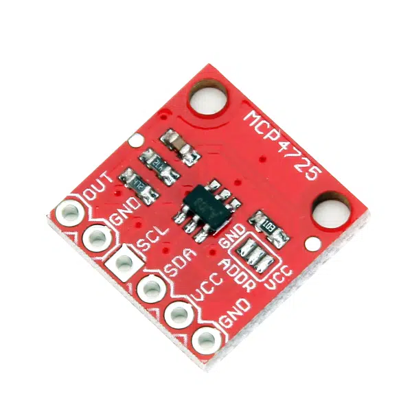
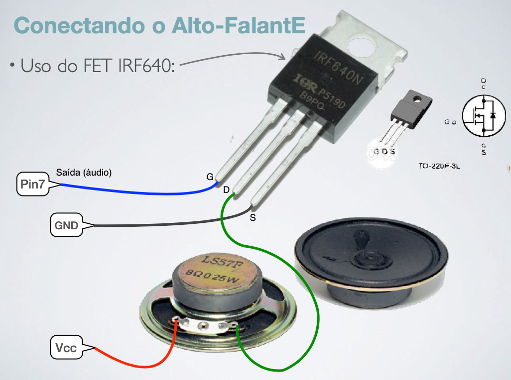

</br>
[Vaga-lume entra para a lista de insetos em extinção; diz estudo](https://super.abril.com.br/ciencia/vaga-lumes-estao-sob-risco-de-extincao-diz-estudo)

# Gerador Onda Senoidal

Projeto: gerar uma onda senoidal de 440 Hz, ("la" musical) usando Arduino e circuitos auxiliares.

## Material

Este projeto usa um módulo externo de D/A que trabalha conectado ao Arduíno via comunicação I2C.

Módulo MCP4725 usado:



## Métodologia

O conversor D/A usado (MCP4725) é de 12 bits, o que significa que trabalha com valores de entrada variando de 0 até  $(2^{12}-1)=4095$:

```matlab
>> 2^12
ans =
        4096
>> ans/2
ans =
        2048
```

Isto significa que a onda senoidal será gerada usando uma equação como:

$y(t) = 2047 + 2048 \cdot \sin(2\pi \cdot 440 \cdot t)$

Se vamos gerar 20 pontos por ciclo de senóide teremos algo como:

```matlab
>> f=440;       % freq. desejada
>> fs=20*440
fs =
        8800
>> T=1/fs       % período de amostragem necessário
T =
   0.00011364
>> % Os valores anteriores servem de guia para programação do pre-escaler
>> % e registrados gerados com o timer2 que será usando na
>> % rotina ISR à ser implementada no Arduíno
>> 360/20       % incremento angular entre os pontos na onda senoidal (em graus)
ans =
    18
>> 2*pi/20      % incremento angular entre os pontos na onda senoidal (em radianos)
ans =
      0.31416
```

### Acessando o módulo DAC MCP4725

O módulo A/D usado se comunica com o Arduino usando comunicação I2C. revisando páginas exemplo na internet usando este módulo perbemos que:

* 1
* 2

## Montagem

Digrama elétrico para ligação do alto-faltante no Arduíno:




*Obs.: página em construção*


## Referências:

* [Introdução à Arduíno (PDF)](arduinosistucontroladosintroeletrica2019keynotenovo-190314222158.pdf)
* [Conversor Digital Analógico DAC MCP4725 I2C](https://www.makerhero.com/produto/conversor-digital-analogico-dac-mcp4725-i2c/)
* Exemplo de uso do DAC MCP4725 para compor um gerador de sinais: [	
Gerador de sinais DIY – Mini Wave_Gen Parte 01](https://www.makerhero.com/blog/mini-wave_gen-gerador-de-sinais-parte-01/) e [	
Gerador de sinais DIY – Mini Wave_Gen Parte 02](https://www.makerhero.com/blog/mini-wave_gen-gerador-de-sinais-parte-02-2/);
---

[:musical_note:](https://youtu.be/VTT6picaCoQ?si=ZGrtAwUYUEWxuV8O) Fernando Passold, em 10/11/2023