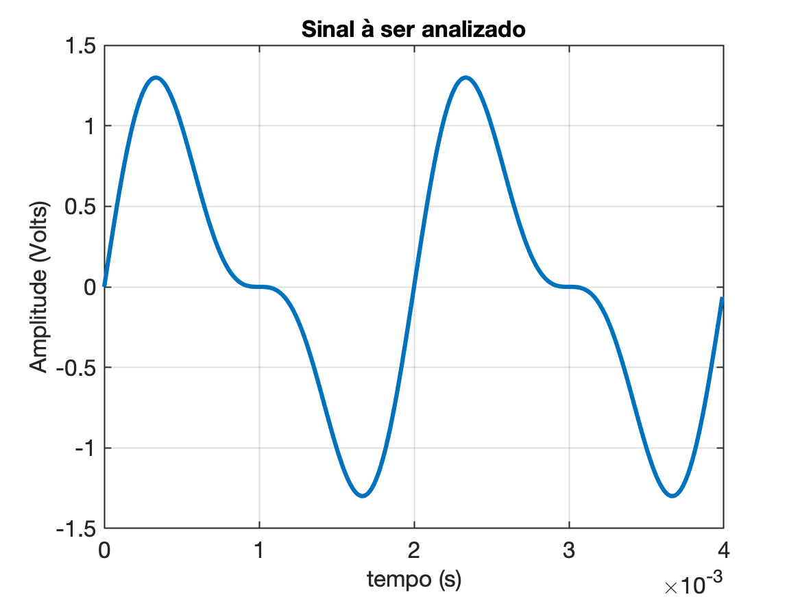

# Explorando o Espectro com a Transformada de Fourier


## Intro

<!--
Através da transformada de Fourier pode-se obter o conteúdo harmônico de um ==sinal periódico==. Essa análise é muito importante para avaliar a qualidade de amplificadores e para calcular o fator de potência de cargas não lineares alimentadas a partir da rede elétrica.
-->

A análise espectral desempenha um papel fundamental em engenharia elétrica, fornecendo uma visão profunda da composição de sinais e sistemas complexos. A Transformada de Fourier é uma ferramenta matemática essencial que permite desdobrar um sinal no domínio da frequência, revelando as diferentes componentes de frequência que o compõem. Neste laboratório, iremos explorar como a Transformada de Fourier pode ser aplicada para analisar e observar o espectro de sinais, um conceito essencial para engenheiros elétricos.

Este laboratório proporcionará uma compreensão prática e sólida da Transformada de Fourier e como ela pode ser aplicada na engenharia elétrica para analisar e interpretar o espectro de diferentes tipos de sinais. Os conceitos aprendidos neste laboratório são essenciais para uma ampla gama de aplicações em engenharia, incluindo telecomunicações, processamento de áudio, processamento de imagem e muito mais. Portanto, prepare-se para explorar o fascinante mundo do processamento de sinais e sua relação com o domínio da frequência

## Objetivos

1. Compreender os fundamentos da Transformada de Fourier e seu papel na análise de sinais.
2. Aprender a aplicar a Transformada de Fourier no domínio do tempo e do espectro.
3. Explorar a relação entre o domínio do tempo e do espectro de um sinal.
4. Realizar experimentos práticos para analisar diferentes tipos de sinais e observar suas características espectrais.

## Materiais e Equipamentos

* Computador com software de processamento de sinais (por exemplo, MATLAB ou Python com bibliotecas de processamento de sinais).
* Gerador de sinais (opcional).
* Osciloscópio (opcional).
* Sinais de exemplo ou dados coletados anteriormente.

## Procedimento Previsto

1. Breve revisão teórica sobre a Transformada de Fourier e sua aplicação.
2. Aplicação da Transformada de Fourier em sinais de exemplo no domínio do tempo.
3. Análise dos espectros resultantes e interpretação das informações espectrais.
4. Realização de experimentos práticos com sinais reais ou gerados, utilizando a Transformada de Fourier para analisar seu espectro.
5. Discussão dos resultados e conclusões sobre a análise espectral.

## Transformada de Fourier: Uma Visão Geral

A Transformada de Fourier é uma ferramenta matemática fundamental na análise de sinais e sistemas que permite decompor um sinal no domínio do tempo em suas componentes de frequência. Foi desenvolvida por Jean-Baptiste Joseph Fourier e é amplamente utilizada em áreas como engenharia elétrica, matemática, física, e processamento de sinais.

A Transformada de Fourier de um sinal é representada pela seguinte fórmula:

$X(f) = \int_{-\infty}^{+\infty} x(t)e^{-j2\pi f t} dt$

onde:</br>
$X(f)=$ representação do sinal no dominio frequencia;</br>
$x(t)=$ sinal no dominio tempo;</br>
$f$ = frequência;</br>

A Transformada de Fourier expressa o sinal $x(t)$ como uma soma (ou integral) de componentes senoidais com diferentes frequências. Isso permite a análise das contribuições de cada frequência presente no sinal.

### Aplicações da Transformada de Fourier:

1. **Análise Espectral**: Uma das aplicações mais comuns é a análise espectral. A Transformada de Fourier permite analisar um sinal e identificar as frequências que o compõem. Isso é crucial em telecomunicações, processamento de áudio e imagem, onde a análise de frequência é essencial.
2. **Filtragem de Sinais**: A Transformada de Fourier é usada para projetar filtros que podem atenuar ou realçar componentes de frequência específicas em um sinal. Isso é útil em sistemas de comunicação para remover ruído e distorção.
3. **Modulação e Demodulação**: Em sistemas de comunicação, a modulação é usada para transmitir informações em uma frequência portadora. A Transformada de Fourier é fundamental para entender a modulação e demodulação de sinais.
4. **Processamento de Imagem**: Em processamento de imagem, a Transformada de Fourier é usada em técnicas como filtragem de imagens, compressão de imagens e detecção de bordas.
5. **Medição e Análise de Sinais Biomédicos**: Na área médica, a Transformada de Fourier é aplicada na análise de eletroencefalogramas (EEG), eletrocardiogramas (ECG) e outros sinais biomédicos para extrair informações relevantes.
6. **Espectro de Potência**: É usado para calcular o espectro de potência de um sinal, que é útil na análise de sinais estocásticos e na caracterização do comportamento de sistemas dinâmicos.</br>
   Essa análise é muito importante para avaliar a qualidade de amplificadores e para corrigir o fator de potência de cargas não lineares alimentadas a partir da rede elétrica.
7. **Óptica**: Na óptica, a Transformada de Fourier é usada para descrever a propagação da luz e a difração em sistemas ópticos.

Em resumo, a Transformada de Fourier desempenha um papel fundamental na análise e processamento de sinais em uma ampla gama de aplicações. Ela permite a decomposição de sinais complexos em suas componentes de frequência, facilitando a análise e manipulação desses sinais de maneira eficaz.

## Aplicação da Transformada

A idéia é simular sinais analógicos e observar o espectro destes sinais e  eventualmente vamos tentar levantar o espectro de um sinal capturado em laboratório, usando o A/D do Arduíno.

Para tanto vamos usar a rotina [signal_fft.m](signal_fft.m) implementada no Matlab que faz uso da função `fftshift()` para mostrar corretamente o espectro de um sinal.

Segue código [signal_fft.m](signal_fft.m):

```matlab

```

**Testando**:

Suponha o sinal composto por 2 harmônicas apenas:

$y(t)=\sin(2\pi 500 t) + 1/2 \sin(2\pi 1000 t)$

Este sinal gera o seguinte gráfico no domínio tempo:



Note que a freq. fundamental (1a-harmônica) está em 500 Hz, o que implica $T=1/f=0,002$ segundos $=2$ mili-segundos. Um período e meio do sinal implica então num intervalo de tempo igual à 4 mili-segundos.

Segue código da função que gerou a simulação do sinal anterior:

```matlab
>> f=500;
>> T=1/f
T =
        0.002
>> delta_t=2*T
delta_t =
        0.004
>> t=0:T/200:delta_t-T/200; % gera vetor tempo, 200 amostras por ciclo
>> size(t)
ans =
     1   400
>> y=sin(2*pi*500*t)+(1/2)*sin(2*pi*2*500*t);
>> plot(t,y)
>> grid
>> xlabel('tempo (s)')
>> ylabel('Amplitude (Volts)')
>> title('Sinal à ser analizado')
```

Realizando a FFT sobre sinal usando a função `signal_fft`:

```matlab
>> signal_fft(t,y,0)
signal_fft >> Intervalo de tempo considerado: [0, 0.003]
>> 
```

Obtemos:


---

Fernando Passold, em 02/11/2023 21:25 (em edição)
