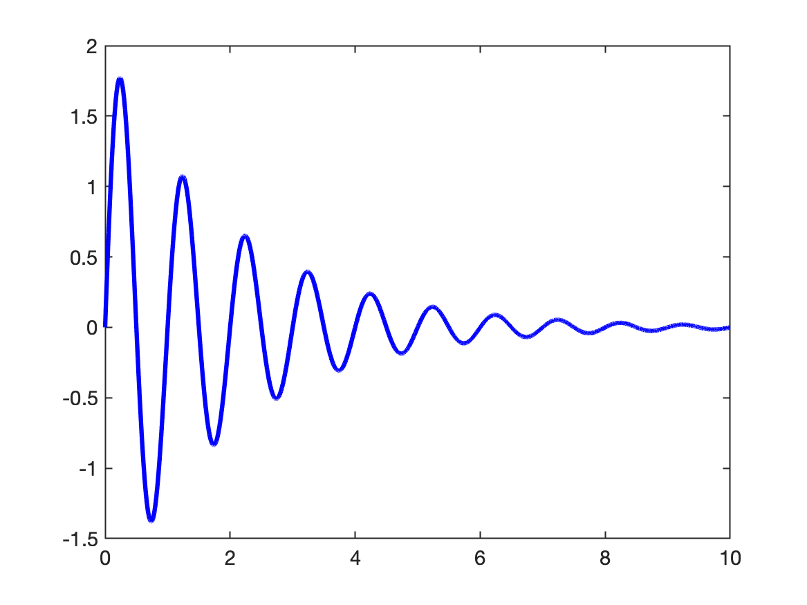
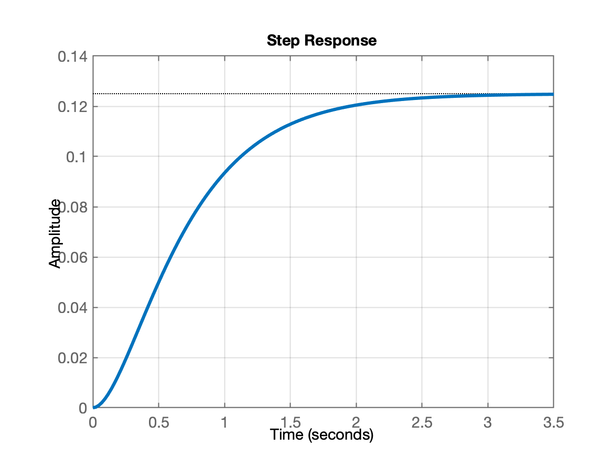

# Introdução ao Matlab

Aula introdutória sobre uso do Matrlab (para iniciantes)

Uma ver aberto o Matlab, na sua janela de comandos ("Command Window"), digitar os seguintes comandos:

```matlab
>> ver % para verificar toolboxes instalados
-----------------------------------------------------------------------------------------------------
MATLAB Version: 9.7.0.1190202 (R2019b)
MATLAB License Number: 968398
Operating System: macOS  Version: 13.6.5 Build: 22G621 
Java Version: Java 1.8.0_202-b08 with Oracle Corporation Java HotSpot(TM) 64-Bit Server VM mixed mode
-----------------------------------------------------------------------------------------------------
MATLAB                                                Version 9.7         (R2019b)
Simulink                                              Version 10.0        (R2019b)
Computer Vision Toolbox                               Version 9.1         (R2019b)
Control System Toolbox                                Version 10.7        (R2019b)
Curve Fitting Toolbox                                 Version 3.5.10      (R2019b)
Database Toolbox                                      Version 9.2         (R2019b)
Deep Learning Toolbox                                 Version 13.0        (R2019b)
Embedded Coder                                        Version 7.3         (R2019b)
Fixed-Point Designer                                  Version 6.4         (R2019b)
Fuzzy Logic Toolbox                                   Version 2.6         (R2019b)
Global Optimization Toolbox                           Version 4.2         (R2019b)
Image Acquisition Toolbox                             Version 6.1         (R2019b)
Image Processing Toolbox                              Version 11.0        (R2019b)
Instrument Control Toolbox                            Version 4.1         (R2019b)
MATLAB Coder                                          Version 4.3         (R2019b)
MATLAB Report Generator                               Version 5.7         (R2019b)
Navigation Toolbox                                    Version 1.0         (R2019b)
Optimization Toolbox                                  Version 8.4         (R2019b)
Parallel Computing Toolbox                            Version 7.1         (R2019b)
Partial Differential Equation Toolbox                 Version 3.3         (R2019b)
ROS Toolbox                                           Version 1.0         (R2019b)
Reinforcement Learning Toolbox                        Version 1.1         (R2019b)
Robotics System Toolbox                               Version 3.0         (R2019b)
Sensor Fusion and Tracking Toolbox                    Version 1.2         (R2019b)
Signal Processing Toolbox                             Version 8.3         (R2019b)
Simscape                                              Version 4.7         (R2019b)
Simscape Driveline                                    Version 3.0         (R2019b)
Simscape Electrical                                   Version 7.2         (R2019b)
Simscape Fluids                                       Version 2.7         (R2019b)
Simscape Multibody                                    Version 7.0         (R2019b)
Simulink 3D Animation                                 Version 8.3         (R2019b)
Simulink Control Design                               Version 5.4         (R2019b)
Simulink Desktop Real-Time                            Version 5.9         (R2019b)
Simulink PLC Coder                                    Version 3.1         (R2019b)
Simulink Report Generator                             Version 5.7         (R2019b)
Stateflow                                             Version 10.1        (R2019b)
Statistics and Machine Learning Toolbox               Version 11.6        (R2019b)
Symbolic Math Toolbox                                 Version 8.4         (R2019b)
System Identification Toolbox                         Version 9.11        (R2019b)
Text Analytics Toolbox                                Version 1.4         (R2019b)
```

O comando abaixo só funciona no Windows e permite ao usuário perceber a forma como o Matlab está usando a RAM de seu computador:

```matlab
>> memory
Function MEMORY is not available on this platform.
>>
```

# Iniciando as primeiras operações com o Matlab:

**Obs.:** o caracter `%` funciona como um comentário para o Matlab. As declarações que precedem este caracter são ignoradas pelo Matlab.

## Atribuições simples

```matlab
>> clc		% limpa a tela
>> a=2
a =
     2
>> b=4;		% note que o carater ';' no final da declaração faz Matlab não repetir conteúdo da variável
>> r=2+i*2	% criando uma variável complexa
r =
            2 +          2i
>> abs(r)	% módulo do número complexo
ans =
       2.8284
>> angle(a)	% ângulo do número complexo, resposta em radianos!
ans =
       0.7854
>>
```

### Declarando matrizes

```matlab
>> a=1; b=2; c=3;	% várias atribuições na mesma linha, separar usando ";"
>> whos 			% verificando tamanhos, tipos e variáveis já criadas
  Name      Size            Bytes  Class     Attributes

  a         1x1                 8  double              
  b         1x1                 8  double              
  c         1x1                 8  double              

>> a=[1 2; 3 4] 	% criando uma matriz 2x2
a =
     1     2
     3     4
>> b=[ 1 0; 0 1] 	% criando outra matriz 2x2, matrix indentidade
b =
     1     0
     0     1
>>
```

Obs.: Note que para o Matlab, qualquer variável é uma matriz, mesmo que com dimensão $1 \times 1$, e note que todas as partes numéricas das variáveis são consideradas com máxima precisão ("double").

### Operações com Matrizes

```matlab
>> c=a*b 			% multiplicando matrizes
c =
     1     2
     3     4
```

Note: que anteriormente foi feito:

$C = A \cdot I=A$

$C=\left[ \begin{array}{cc} 1 & 2\\ 3 & 4 \end{array}\right] \cdot \left[ \begin{array}{cc} 1 & 0\\ 0 & 1 \end{array}\right]=\left[ \begin{array}{cc} 1 & 2\\ 3 & 4 \end{array}\right]$

Continuando...

```matlab
>> d=[ 4 8]; 		% declarando outra matriz, d de 1x2
>> e=a*d			% tentando multiplicar matrizes
Error using *
Incorrect dimensions for matrix multiplication. Check that the number of
columns in the first matrix matches the number of rows in the second
matrix. To perform elementwise multiplication, use '.*'.
>>
```

**Sobre multiplicações de matrizes**:

Note: No comando anterior se tentou realizar $e = a * d$. O Matlab interpretou este comando como sendo:

$e = a \cdot d$

para um usuário iniciante do Matlab, pode parecer um simples cálculo de multiplicação, mas lembrar que o Matlab considera qualquer variável como sendo uma matriz de $m$-linhas por $n$-colunas, mesmo que sendo $1 \times 1$ (variáveis escalares).

Então na última declaração, para o Matlab, o usuário tentou fazer:

$e_{\text{?} \times \text{?}} = a_{2 \times \textcolor{red}{\underline{2}}} \cdot d_{\textcolor{red}{\underline{1}} \times 2}$

Note que as dimensões internas das matrizes $a$ e $d$ são diferentes, o que realmente não permite que estas matrizes sejam multiplicadas desta forma.

Este problema pode ser resolvido se for feito algo como:

$e = a \cdot d'$

onde $d'$ corresponde à transposta da matriz $d$.

Neste caso, estaríamos fazendo (corretamente):

$e_{2 \times 1} = a_{2 \times \textcolor{blue}{\underline{2}}} \cdot d'_{\textcolor{blue}{\underline{2}} \times 1}$

Verificando:

```matlab
>> e=a*d'
e =
    20
    44
```

### Trabalhando com números aleatórios

```matlab
>> g=rand(10,1); % gerando uma matriz de 10 linhas x 1 colina com números aleatórios no intervalo: (0,1)
>> help rand
 rand Uniformly distributed pseudorandom numbers.
    R = rand(N) returns an N-by-N matrix containing pseudorandom values drawn
    from the standard uniform distribution on the open interval(0,1).  rand(M,N)
    or rand([M,N]) returns an M-by-N matrix.  rand(M,N,P,...) or
    rand([M,N,P,...]) returns an M-by-N-by-P-by-... array.  rand returns a
    scalar.  rand(SIZE(A)) returns an array the same size as A.

    Note: The size inputs M, N, P, ... should be nonnegative integers.
    Negative integers are treated as 0.
     
    R = rand(..., CLASSNAME) returns an array of uniform values of the 
    specified class. CLASSNAME can be 'double' or 'single'.
     
    R = rand(..., 'like', Y) returns an array of uniform values of the 
    same class as Y.
     
    The sequence of numbers produced by rand is determined by the settings of
    the uniform random number generator that underlies rand, RANDI, and RANDN.
    Control that shared random number generator using RNG.
     
    Examples:
     
       Example 1: Generate values from the uniform distribution on the
       interval (a, b).
          r = a + (b-a).*rand(100,1);
     
       Example 2: Use the RANDI function, instead of <strong>rand</strong>, to generate
       integer values from the uniform distribution on the set 1:100.
          r = randi(100,1,5);
     
       Example 3: Reset the random number generator used by <strong>rand</strong>, RANDI, and
       RANDN to its default startup settings, so that <strong>rand</strong> produces the same
       random numbers as if you restarted MATLAB.
          rng('default')
          rand(1,5)
     
       Example 4: Save the settings for the random number generator used by
       <strong>rand</strong>, RANDI, and RANDN, generate 5 values from <strong>rand</strong>, restore the
       settings, and repeat those values.
          s = rng
          u1 = rand(1,5)
          rng(s);
          u2 = rand(1,5) % contains exactly the same values as u1
     
       Example 5: Reinitialize the random number generator used by <strong>rand</strong>,
       RANDI, and RANDN with a seed based on the current time.  <strong>rand</strong> will
       return different values each time you do this.  NOTE: It is usually
       not necessary to do this more than once per MATLAB session.
          rng('shuffle');
          rand(1,5)
     
    Replace Discouraged Syntaxes of rand and randn to use RNG to replace
    rand with the 'seed', 'state', or 'twister' inputs.
     
    See also randi, randn, rng, RandStream, rand,
             sprand, sprandn, randperm.
    
    See Other functions named rand.

>>
>> g 	% apenas requisitando que o Matlab mostre o conteúdo da variável
g =
      0.81472
      0.90579
      0.12699
      0.91338
      0.63236
      0.09754
       0.2785
      0.54688
      0.95751
      0.96489
>> g=rand(100,100); 	% gerando uma matriz de 100x100 de números aleatórios
>> whos 				% verificando tamanhos das variáveis já decladas
  Name        Size             Bytes  Class     Attributes

  a           2x2                 32  double              
  b           2x2                 32  double              
  c           2x2                 32  double              
  d           1x2                 16  double              
  e           2x1                 16  double              
  g         100x100            80000  double              

>> size(g) 				% outra forma (mais específica) de descobrir tamanho de certa variável
ans =
   100   100

>> a=[1 1+i*2; 1-2*i 2] % matriz 1x2 com números complexos
a =
            1 +          0i            1 +          2i
            1 -          2i            2 +          0i

```

## Criando vetores

Vamos supor que queremos gerar um gráfico temporal de uma função do tipo senoide amortecida exponencialmente:

$y(t)=A\,e^{-\zeta\,t}\,\sin(\omega\,t)$

onde: $A=$amplitude máxima (de pico) da senóide;
$\zeta=$ fator de amortecimento da senóide;
$\omega=$ Frequência angular (rad/s) da senóide.

Lembrar que $\omega=2\,\pi\,f$, onde $f=$ frequência em Hz.

Poderíamos criar um vetor $t$ variando dentro de certo intervalo de tempo e depois usar a equação anterior para calcular um vetor de pontos $y$.

```matlab
>>t=[0:10] 				% gerando vetor t no intervalo [0,10], com passo 1
t =
     0     1     2     3     4     5     6     7     8     9    10
>> t=[0:0.001:10];		% gerando vetor t no intervalo [0,1], com incremento de 0.001 (1 ms)
>> size(t)				% confirmando tamanho do vetor t
ans =
           1       10001
>> y=2*exp(-0.5*t)*sin(2*pi*1*t); % calculando uma senóide exponencialmente amortecida
Error using  *
Incorrect dimensions for matrix multiplication. Check that the number of
columns in the first matrix matches the number of rows in the second
matrix. To perform elementwise multiplication, use '.*'.
>>
```

Estamos querendo gerar uma senóide amortecida com $\zeta=0,5$ (um valor baixo == lento) de frequência igual à 1 Hz.

Mas...

:warning: Erro associado com multiplicação de matrizes, semelhante ao já gerado anteriormente, mas neste caso...

Note que quando realizamos qualquer operação aritmética envolvendo com uma matriz (ou vetor), o resultado será uma nova matriz (ou vetor).

Então, realizar a parte $=2*exp(-0.5*t)$, que envolve o vetor $t_{1 \times 10001}$, vai acabar gerando um vetor também de dimensão ${1 \times 10001}$.

Note que o caso da declaração:

```matlab
y=2*exp(-0.5*t)*sin(2*pi*1*t)
```

envolve a multiplicação de 2 vetores/matrizes:

$y=2*\underbrace{\exp(-\frac{1}{2}*t_{1 \times 10001})}_{1 \times \textcolor{red}{10001}}*\underbrace{\sin(2*pi*1*t_{1 \times 10001})}_{\textcolor{red}{1} \times 10001}$

ou seja, realmente não há como multiplicar as 2 partes internas da expressão.

Mas podemos tentar solucionar este problema usando **multiplicação ponto-à-ponto** entre elementos de um vetor, usando o operador `.*`, mas mesmo assim:

```matlab
>> y=2*exp(-0.5.*t)*sin(2*pi*1.*t)
Error using  * 
Incorrect dimensions for matrix multiplication. Check that the number of
columns in the first matrix matches the number of rows in the second
matrix. To perform elementwise multiplication, use '.*'.
```

Confirma que o erro está associado com a multiplicação entre as 2 partes internas da expressão. O operador `.*` deve estar localizado entre estas 2 partes:

```matlab
>> y=2*exp(-0.5.*t).*sin(2*pi*1.*t); 	% sem erros agora...
>> size(y) 								% confirmando tamanho do vetor y
ans =
           1       10001
>> plot(t,y,'b-') 			% gerando um gráfico t x y, cor azul, linha contínua
>>
```

O seguinte gráfico deve ter sido gerado:



### Visualizando dados parciais de uma matriz

Os vetores $t$ e $y$ gerados antes são grandes. 

Suponha que você queria verificar o conteúdo de parte deles, digamos, os primeiros 10 elementos de cada um. Podemos fazer algo do tipo:

```matlab
>> [t(1,1:10)' y(1,1:10)']
ans =
            0            0
        0.001      0.01256
        0.002     0.025107
        0.003      0.03764
        0.004      0.05016
        0.005     0.062665
        0.006     0.075155
        0.007     0.087629
        0.008      0.10009
        0.009      0.11253
```

Note que `ans` é a variável que o Matlab sempre cria quando realiza um cálculo para o qual o usuário não atribuiu explicitamente uma variável de retorno. No caso, note que `ans` == *answer* (resposta em inglês).

No caso anterior, o resultado visual parece uma tabela, mas note que na realizade, o Matlab criou uma matriz $ans_{10 x 2}$ contendo 10 linhas $\times$ 2 colunas. 

Note que o caracter `[` indica o início da declaração de um vetor ou matriz. O caracter `]` indica o fim deste vetor ou matriz. Mudanças de linha são indicadas pelo carater `;`. Para separar os elementos de uma matriz ou vetor dentro da mesma linha, usar espaço em branco, ou caracter `<TAB>` ou `,`. E se eventualmente a declaração de certa linha ultrapassar muitas colunas na tela, usar os caracteres `...` e teclar `<ENTER>` (ou `<RETURN>`) para indicar mudança de linha, sem inidicar fim de uma declaração.

Então no caso anterior, acabamos por deliberadamente criar uma matriz de $n-$ linhas $\times 2$ colunas, onde a primeira coluna era formada pela transposta do primeiros 10 elementos do vetor $t_{1 \times 10001}$. Como este vetor é grande, "separamos" a parte desejada, indicando o intervalo desejado de dados usando o operador `:`. Neste caso, explicitamente, separamos apenas os elementos da 1a-linha, colunas de 1 até 10. E realizamos uma transposta deste resultado, gerando um "vetor linha", neste caso, contendo 10 linhas. Mas no caso anterior, acrescentamos à definição da "nova" matriz "ans", uma segundo coluna formada pela transposta do vetor $y_{1 \times 10001}$, neste caso, também indicando que queríamos separar apenas os 10 primeiros elementos deste vetor (colunas de 1 até 10, linha = 1). O Matlab acabou gerando então uma matriz "ans"$_{10 x 2}$ e mostrando a mesma na tela. O resultado visualmente parece uma tabela.

## Gráficos Iniciais no Matlab

Gerando gráficos simples usando Matlab...

```matlab
>> help plot
 plot   Linear plot. 
    plot(X,Y) plots vector Y versus vector X. If X or Y is a matrix,
    then the vector is plotted versus the rows or columns of the matrix,
    whichever line up.  If X is a scalar and Y is a vector, disconnected
    line objects are created and plotted as discrete points vertically at
    X.

    plot(Y) plots the columns of Y versus their index.
    If Y is complex, plot(Y) is equivalent to plot(real(Y),imag(Y)).
    In all other uses of plot, the imaginary part is ignored.
     
    Various line types, plot symbols and colors may be obtained with
    plot(X,Y,S) where S is a character string made from one element
    from any or all the following 3 columns:
     
           b     blue          .     point              -     solid
           g     green         o     circle             :     dotted
           r     red           x     x-mark             -.    dashdot 
           c     cyan          +     plus               --    dashed   
           m     magenta       *     star             (none)  no line
           y     yellow        s     square
           k     black         d     diamond
           w     white         v     triangle (down)
                               ^     triangle (up)
                               <     triangle (left)
                               >     triangle (right)
                               p     pentagram
                               h     hexagram
                          
    For example, plot(X,Y,'c+:') plots a cyan dotted line with a plus 
    at each data point; plot(X,Y,'bd') plots blue diamond at each data 
    point but does not draw any line.
     
    plot(X1,Y1,S1,X2,Y2,S2,X3,Y3,S3,...) combines the plots defined by
    the (X,Y,S) triples, where the X's and Y's are vectors or matrices 
    and the S's are strings.  
     
    For example, plot(X,Y,'y-',X,Y,'go') plots the data twice, with a
    solid yellow line interpolating green circles at the data points.
     
    The plot command, if no color is specified, makes automatic use of
    the colors specified by the axes ColorOrder property.  By default,
    plot cycles through the colors in the ColorOrder property.  For
    monochrome systems, plot cycles over the axes LineStyleOrder property.
     
    Note that RGB colors in the ColorOrder property may differ from
    similarly-named colors in the (X,Y,S) triples.  For example, the 
    second axes ColorOrder property is medium green with RGB [0 .5 0],
    while plot(X,Y,'g') plots a green line with RGB [0 1 0].
     
    If you do not specify a marker type, plot uses no marker. 
    If you do not specify a line style, plot uses a solid line.
     
    plot(AX,...) plots into the axes with handle AX.
     
    plot returns a column vector of handles to lineseries objects, one
    handle per plotted line. 
     
    The X,Y pairs, or X,Y,S triples, can be followed by 
    parameter/value pairs to specify additional properties 
    of the lines. For example, plot(X,Y,'LineWidth',2,'Color',[.6 0 0]) 
    will create a plot with a dark red line width of 2 points.
     
    Example
       x = -pi:pi/10:pi;
       y = tan(sin(x)) - sin(tan(x));
       plot(x,y,'--rs','LineWidth',2,...
                       'MarkerEdgeColor','k',...
                       'MarkerFaceColor','g',...
                       'MarkerSize',10)
     
    See also plottools, semilogx, semilogy, loglog, plotyy, plot3, grid,
    title, xlabel, ylabel, axis, axes, hold, legend, subplot, scatter.
    
    Other functions named plot
>>
```

### Função *fplot()*

Já usamos este comando antes. Mas esta não é a única forma de mostrar um gráfico de certa função matemática. Podemos usar a função `fplot()`:

```matlab
>> help fplot
 fplot   Plot 2-D function
    fplot(FUN) plots the function FUN between the limits of the current
    axes, with a default of [-5 5].

    fplot(FUN,LIMS) plots the function FUN between the x-axis limits
    specified by LIMS = [XMIN XMAX]. 
     
    fplot(...,'LineSpec') plots with the given line specification.
     
    fplot(X,Y,LIMS) plots the parameterized curve with coordinates
    X(T), Y(T) for T between the values specified by LIMS = [TMIN TMAX].
     
    H = fplot(...) returns a handle to the function line object created by <strong>fplot</strong>.
     
    fplot(AX,...) plots into the axes AX instead of the current axes.
     
    Examples:
        fplot(@sin)
        fplot(@(x) x.^2.*sin(1./x),[-1,1])
        fplot(@(x) sin(1./x), [0 0.1])
     
    If your function cannot be evaluated for multiple x values at once,
    you will get a warning and somewhat reduced speed:
        f = @(x,n) abs(exp(-1j*x*(0:n-1))*ones(n,1));
        fplot(@(x) f(x,10),[0 2*pi])
     
    See also fplot3, fsurf, fcontour, fimplicit, plot, function_handle.

>>
```

Voltando ao caso da nossa expressão anterior (a senoide amortecida exponecialmente)...

```matlab
>> % y=2*exp(-0.5.*t).*sin(2*pi*1.*t); % lembrando da função desejada
>> figure;  			% abre outra janela gráfica (vazia)
>> fplot(@(t) 2*exp(-0.5.*t).*sin(2*pi*1.*t), [0 10])
>> % acrescentando alguns detalhes ao gráfico gerado
>> title('fplot')
>> figure;  			% abre outra janela gráfica (vazia)
>> plot(t,y,'m-') 		% mostra gráfico usando plot na nova janela
>> % compare os 2 gráficos gerados.
```

O comando `fplot()` anteiror deve ter gerado um gráfico como:


**Plotando 2 curvas no mesmo gráfico**

```matlab
>> % criando um 2o-vetor de dados:
>> y2=2*exp(-0.25.*t).*sin(2*pi*0.5.*t);
>> whos
  Name        Size               Bytes  Class     Attributes

  a           2x2                   64  double    complex   
  ans        10x2                  160  double              
  b           2x2                   32  double              
  c           2x2                   32  double              
  d           1x2                   16  double              
  e           2x1                   16  double              
  g         100x100              80000  double              
  t           1x10001            80008  double              
  y           1x10001            80008  double              
  y2          1x10001            80008  double              

>> plot(t,y,'b-', t,y2,'m--') 	% plotando 2 curvas no mesmo gráfico
>> legend('y(t): \zeta=1/2, f= 1 Hz', 'y_2(t): \zeta=1/4, f= 0,5 Hz')	% acrescentando uma legenda
```

Desta vez deve ter sido gerado um gráfico como:


## Uso do Matlab em Controle

**Declarando uma função transferência**

Suponha que se queira criar uma variável `G` para a função transferência:

$G(s)=\dfrac{1}{(s+2)(s+4)}$


```matlab
>> % G=tf(num,den);
>> num=1;
>> den=conv([1 2],[1 4]) 	% a função conv() permite multiplicar polinômios
den =
     1     6     8
>> den=poly([-2 -4]) 		% a função poly() gera um polinômio à partir das raízes passadas como argumento de entrada
den =
     1     6     8
>> G=tf(num,den)    		% a função tf() criou o objeto função transferência

G =
 
        1
  -------------
  s^2 + 6 s + 8
 
Continuous-time transfer function.

>> zpk(G) 			% permite mostrar conteúdo de uma tf no formato ganho (k), zeros (z) e pólos (p)

ans =
 
       1
  -----------
  (s+4) (s+2)
 
Continuous-time zero/pole/gain model.

>> T=0.1; 			% criando variável T para guardar valor período de amostragem (no caso 100 ms)
>> BoG=c2d(G, T) 	% a função c2d calculou BoG(z) à partir de G(s) e T

BoG =
 
  0.004107 z + 0.003363
  ----------------------
  z^2 - 1.489 z + 0.5488
 
Sample time: 0.1 seconds
Discrete-time transfer function.

>> zpk(BoG) 			% mostrando de forma mais "simpática" o conteúdo de BoG(z)

ans =
 
  0.0041073 (z+0.8187)
  ---------------------
  (z-0.8187) (z-0.6703)
 
Sample time: 0.1 seconds
Discrete-time zero/pole/gain model.

>> figure; step(G) 		% a função step() mostra resposta ao defrau para tf passada como argumento de entrada
>> figure; step(BoG)
>> figure; pzmap(G) 	% a função pzmap() mostra no plano-s ou plano-z os pólos e zeros de uma transfer function
>> figure; pzmap(BoG)
```

Os seguintes gráficos devem ter sido gerados:

| step(G) | pzmap(G) |
| :---: | :---: |
|  |  |
|  step(BoG) | pzmap(BoG) |
|  |  |

Fim.

---

<font size="1">(Onedark theme)</font>
Fernando Passold, em 25/03/2024