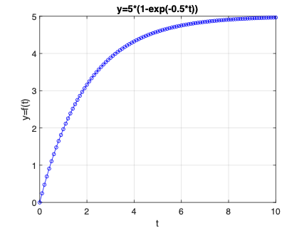

<!--  -->

# Matlab fácil

- [Matlab fácil](#matlab-fácil)
  - [Comandos simples no Matlab](#comandos-simples-no-matlab)
  - [Realizando Gráficos](#realizando-gráficos)
    - [Função ezplot](#função-ezplot)
    - [Recomendações para salvar gráficos](#recomendações-para-salvar-gráficos)
    - [Gráficos à partir de vetores](#gráficos-à-partir-de-vetores)
  - [Usando outras funções no Matlab](#usando-outras-funções-no-matlab)
    - [Transformada Inversa de Laplace](#transformada-inversa-de-laplace)
  - [Função step()](#função-step)
  - [Tutorial mais completo](#tutorial-mais-completo)

---

## Comandos simples no Matlab

Para começar, vamos supor que queremos declarar **matrizes**. 

:exclamation: Note que **para o Matlab, todas as variáveis são consideradas matrizes, mesmo que sendo 1x1**. E o elemento dentro de cada matriz pode ser um número real ou mesmo complexo, ou até um objeto.
No Matlab:

```Matlab
>> format compact % evita muitas linhas em branco entre respostas Matlab
>> a=[1 2; 3 4]   % ingressando matrix 2x2
a =
     1     2
     3     4

>> b=[1 0; 0 1]   % ingressando outra matriz 2x2
b =
     1     0
     0     1
>> c=a*b          % realizando multiplicação de matrizes
c =
     1     2
     3     4
>> c=[1 2]        % redefinindo matriz c, agora 1x2
c =
     1     2
>> d=a*c          % tentando multiplicar matriz a * c
Error using  * 
Incorrect dimensions for matrix multiplication.
Check that the number of columns in the first
matrix matches the number of rows in the second
matrix. To perform elementwise multiplication,
use '.*'. 
>> % Erro porque se tentou fazer:
>> % d = a_(2x2) * c_(1x2)
>> % Note que as "dimensões internas" não coincidem
>> e = c * a      % Esta multiplicação funciona
e =
     7    10
>> % Note: agora foi feito:
>> % e = c_(1x2) * a_(2x2) = e_(1x2)
```

## Realizando Gráficos

Existem várias formas e opções diferentes para obter gráficos no Matlab. Neste documento vamos nos restringir as formas mais simples e básicas de obter traçados (curvas) para funções matemáticas.

### Função ezplot

```Matlab
>> help ezplot
 ezplot   (NOT RECOMMENDED) Easy to use function plotter
 
  ==========================================================
  ezplot is not recommended. Use FPLOT or FIMPLICIT instead.
  ==========================================================
 
    ezplot(FUN) plots the function FUN(X) over the default domain
    -2*PI < X < 2*PI, where FUN(X) is an explicitly defined function of X.
 
    ezplot(FUN2) plots the implicitly defined function FUN2(X,Y) = 0 over
    the default domain -2*PI < X < 2*PI and -2*PI < Y < 2*PI.
 
    ezplot(FUN,[A,B]) plots FUN(X) over A < X < B.
    ezplot(FUN2,[A,B]) plots FUN2(X,Y) = 0 over A < X < B and A < Y < B.
 
    ezplot(FUN2,[XMIN,XMAX,YMIN,YMAX]) plots FUN2(X,Y) = 0 over
    XMIN < X < XMAX and YMIN < Y < YMAX.
 
    ezplot(FUNX,FUNY) plots the parametrically defined planar curve FUNX(T)
    and FUNY(T) over the default domain 0 < T < 2*PI.
 
    ezplot(FUNX,FUNY,[TMIN,TMAX]) plots FUNX(T) and FUNY(T) over
    TMIN < T < TMAX.
 
    ezplot(FUN,[A,B],FIG), ezplot(FUN2,[XMIN,XMAX,YMIN,YMAX],FIG), or
    ezplot(FUNX,FUNY,[TMIN,TMAX],FIG) plots the function over the
    specified domain in the figure window FIG.
 
    ezplot(AX,...) plots into AX instead of GCA or FIG.
 
    H = ezplot(...) returns handles to the plotted objects in H.
 
    Examples:
    The easiest way to express a function is via a string:
       ezplot('x^2 - 2*x + 1')
 
    One programming technique is to vectorize the string expression using
    the array operators .* (TIMES), ./ (RDIVIDE), .\ (LDIVIDE), .^ (POWER).
    This makes the algorithm more efficient since it can perform multiple
    function evaluations at once.
       ezplot('x.*y + x.^2 - y.^2 - 1')
 
    You may also use a function handle to an existing function. Function
    handles are more powerful and efficient than string expressions.
       ezplot(@humps)
       ezplot(@cos,@sin)
 
    ezplot plots the variables in string expressions alphabetically.
       subplot(1,2,1), ezplot('1./z - log(z) + log(-1+z) + t - 1')
    To avoid this ambiguity, specify the order with an anonymous function:
       subplot(1,2,2), ezplot(@(z,t)1./z - log(z) + log(-1+z) + t - 1)
 
    If your function has additional parameters, for example k in myfun:
       %-----------------------%
       function z = myfun(x,y,k)
       z = x.^k - y.^k - 1;
       %-----------------------%
    then you may use an anonymous function to specify that parameter:
       ezplot(@(x,y)myfun(x,y,2))
 
    See also ezcontour, ezcontourf, ezmesh, ezmeshc, ezplot3, ezpolar,
             ezsurf, ezsurfc, plot, vectorize, function_handle.

    Documentation for ezplot
    Other functions named ezplot

>>
```

Suponha que queiramos plotar a resposta ao degrau de um sistema de 1a-ordem:

$y(t)=5 \left[ 1 - e^{(-1/2 \cdot t)} \right]=5 \left[ 1 - \exp(-1/2 \cdot t)\right]$

Usando ezplot para isto, fica:

```Matlab
 >> ezplot('5*(1-exp(-0.5*t))',[0 10])
```

Será gerado um gráfico como o mostrado abaixo:


Note que a própria função `ezplot` já completa o eixo das abcissas com “t” o título do gráfico com a expressão da função.

### Recomendações para salvar gráficos

:warning: Programas de computador em geral, quando geram gráficos, usam a resolução da próprio tela, normalmente 96 dpi (a menos que você tenha uma tela High DPI tipo Retina Display). Está é uma ==resolução muito baixa para exportar figuras e usá-las em documentos==, **pior** se forem escalonadas. Considere ainda que as fontes originais, já usam um tamanho reduzido. Se a figura é reduzida no documento final, o texto presente nas mesmas fica quase ilegível.

**Solução**

Salvar as figuras usando maior resolução e fontes maiores nas figuras. Para tanto, na janela gráfica do Matlab, escolha no menu: "**File >> Export Setup**" e modifique os seguintes parâmetros:

* **Resolução**: aumente a resolução do "auto" (96 dpi) para o valor 150 ou 300 dpi:
    
* Aumente o **tamanho mínimo das fontes** para algo como 14 pts:
    
* Aumente a **espessura mínima para as linhas** usadas nos gráficos:
    

**Obs.:** Não é necessário repetir estes comandos toda vez que você quiser exportar ou salvar um gráfico. Basta **uma única vez, criar seu próprio Template**. Para tanto, repare que na parte infeior das figuras anteriores aparece um quadro "Export Styles". Nesta parte da janela, **salve** seu próprio estilo definindo um nome para o mesmo no qadro de texto "**Save as style named**". Não esqueça de clicar no botão "**Save**". Assim, toda vez que quiser **recuperar o estilo criado**, basta ir esta seção de *styles* e na caixa de textos (menu pull-down) "**Load setting for**", selecionar o nome adotado anteriormente para o estilo. Depois disto é necessário clicar em **Aply** para que as novas propriedades sejam aplicadas na figura atual. *Atenção*: não se recomenda gravar o estilo modificado usando o nome *default* porque isto altera o padrão do Matlab e não há como voltar atrpas, caso seja necessário.

A figura à seguir destaca a diferença obtida em termos de qualidade gráfica:

| Propriedades *Default* | Estilo modificado |
| :---: | :---: |
|  |  |
| 96 dpi | 150 dpi |
| Fonts $\ge$ 8 pts | Fonts $\ge$ 14 pts |
| 18 Kbytes | 41 Kbytes |

Por fim, preferir ==salvar as figuras como .PNG== ao invés de .JPG ou pior ainda .BMP.

### Gráficos à partir de vetores

Mas existem outras formas de obter este gráfico, que envolve a **criação de vetores**:

```Matlab
>> t = 0:10	% cria vetor t variando de 0 até 10, incremento == 1
t =
     0     1     2     3     4     5     6     7     8     9    10
>> t=0:0.1:10;	% recria vetor t, mas com incremento de 0,1
>> size(t)		% comprovando tamanho do vetor
ans =
     1   101
>> y=5*(1-exp(-0.5*t))	% criando vetor y com base no vetor t
y =
  Columns 1 through 7
         0    0.2439    0.4758    0.6965    0.9063    1.1060    1.2959
  Columns 8 through 14
    1.4766    1.6484    1.8119    1.9673    2.1153    2.2559    2.3898
  Columns 15 through 21
    2.5171    2.6382    2.7534    2.8629    2.9672    3.0663    3.1606
  Columns 22 through 28
    3.2503    3.3356    3.4168    3.4940    3.5675    3.6373    3.7038
  Columns 29 through 35
    3.7670    3.8271    3.8843    3.9388    3.9905    4.0398    4.0866
  Columns 36 through 42
    4.1311    4.1735    4.2138    4.2522    4.2886    4.3233    4.3563
  Columns 43 through 49
    4.3877    4.4176    4.4460    4.4730    4.4987    4.5232    4.5464
  Columns 50 through 56
    4.5685    4.5896    4.6096    4.6286    4.6467    4.6640    4.6804
  Columns 57 through 63
    4.6959    4.7108    4.7249    4.7383    4.7511    4.7632    4.7748
  Columns 64 through 70
    4.7857    4.7962    4.8061    4.8156    4.8246    4.8331    4.8413
  Columns 71 through 77
    4.8490    4.8564    4.8634    4.8700    4.8764    4.8824    4.8881
  Columns 78 through 84
    4.8936    4.8988    4.9037    4.9084    4.9129    4.9171    4.9212
  Columns 85 through 91
    4.9250    4.9287    4.9322    4.9355    4.9386    4.9416    4.9445
  Columns 92 through 98
    4.9472    4.9497    4.9522    4.9545    4.9567    4.9589    4.9609
  Columns 99 through 101
    4.9628    4.9646    4.9663
>> size(y)	% comprovando que tamanho do vetor y == tamanho vetor t
ans =
     1   101
>> [t(1,1:10)' y(1,1:10)']	% mostrando os 10 primeiros valores de t e y
ans =
         0         0
    0.1000    0.2439
    0.2000    0.4758
    0.3000    0.6965
    0.4000    0.9063
    0.5000    1.1060
    0.6000    1.2959
    0.7000    1.4766
    0.8000    1.6484
    0.9000    1.8119
>> % Note que o operador “‘“ significa realizar transposta de uma matriz
>> % Note que em cada vetor (t e y), separamos os 10 primeiros elementos
>> % que seriam as 10 primeiras colunas de cada um, todos na linha 1 
>> figure; plot(t,y,’bo-')	% gráfico simples
>> % note que o 3o-parâmetro (string) indica:
>> % b = blue (cor azul)
>> % o = usar marcador circular
>> % - = ligar pontos usando linha contínua (default)
>> % >> help plot % permite descobrir como usar esta função
``````

Deve ser gerado um gráfico como o mostrado a seguir:


Podemos acrescentar **títulos e etiquetas para o eixo X e Y** fazendo:

```Matlab
>> title('y=5*(1-exp(-0.5*t))')
>> xlabel('t')
>> ylabel('y=f(t)')
``````

E assim deve ser obtido:



Vamos tentar criar um gráfico um pouco mais complexo...

Supondo que agora queremos o gráfico de:

$y(t)=1 - 1\cdot \exp(-1/4 \cdot t) \cdot \sin(2\cdot \pi \cdot 1 \cdot t)$

Neste caso:

```Matlab
>> y2 =1 -1*exp((-1/4)*t) * sin(2*pi*1*t);
Error using  * 
Incorrect dimensions for matrix multiplication. Check that the number of
columns in the first matrix matches the number of rows in the second matrix.
To perform elementwise multiplication, use '.*'. 
>>
>> % O erro agora se deve ao fato que o lado esquerdo da expressão gerou
>> % uma matriz de 1x101 e o lado direito da expressão (separadas por * )
>> % também gerou um vetor 1x101. Então da forma como a eq. Foi dada
>> % o Matlab tentou fazer: 1x101 * 1x101 — não têm como funcionar.
>> % Como “avisar” o Matlab que na realidade, você deseja multiplicar
>> % 101 elementos do lado esquerdo com os 101 elementos do lado direito?
>> % Usando o operador “.*” que indica multiplicação ponto-a-ponto ou
>> % “elementwise multiplication”.
>> y2 =1 -1*exp((-1/4)*t) .* sin(2*pi*1*t);
>> [t(1,1:10)' y2(1,1:10)']	% mostrando os primeiros 10 elementos
ans =
         0    1.0000
    0.1000    0.4267
    0.2000    0.0953
    0.3000    0.1177
    0.4000    0.4681
    0.5000    1.0000
    0.6000    1.5059
    0.7000    1.7984
    0.8000    1.7787
    0.9000    1.4694
>> figure; plot(t,y2,'m-')	% plota apenas y=f(t)
>> % suponha que queremos destacar apenas o efeito o amortecimento na componente senoidal:
>> hold on
>> plot(t,y3,'b--')
``````

Agora deve ter sido gerado o gráfico:


## Usando outras funções no Matlab

### Transformada Inversa de Laplace

Usando o “**symbolic toolbox**” do Matlab, podemos calcular a **transformada Inversa de Laplace** de uma função.

Suponha que queremos saber a resposta analítica para:


Teríamos que fazer:

$y(t)=\mathcal{L}^{-1}\{ R(s) \cdot F(s) \}$,

onde $R(s)=\mathcal{L}\{ \text{Degrau} \}=\dfrac{1}{s}$.

Esta resolução envolve expansão em frações parciais:

$Y(s)=R(s) \cdot F(s) = \dfrac{(s+5)}{s(s+1)(s+2)}=\dfrac{R_1}{s}+\dfrac{R_2}{(s+1)}+\dfrac{R_3}{(s+2)}$

**Usando Matlab**, podemos calcular diretamente  usando a função `ilaplace()`:

```Matlab
>> syms s	% s é agora uma variável simbólica
>> F = (s+5)/(s^2+3*s+2)	% ingressando a função transferência
F =
(s + 5)/(s^2 + 3*s + 2)
>> ilaplace(F)	% buscando a transformada inversa de Laplace:
ans =
4*exp(-t) - 3*exp(-2*t)
>> f=ilaplace(F)
f =
4*exp(-t) - 3*exp(-2*t)
>> pretty(f)		% apresentando resultando num formato mais “amigável”
4 exp(-t) - exp(-2 t) 3
```

Lembrando que a resolução acima envolve cálculo de resíduos, podemos usar o Matlab para calculá-los, mas neste caso em particular,  esta resolução consta como item de trabalho, então vamos modificar a planta/processo acima para outra função transferência:

$G(s)=\dfrac{(s+5)}{(s+1)(s+7)}$

Usando o Matlab para encontrar (analiticamente) a resposta desta planta quando um degrau unitário é aplicado na sua entrada, teremos:

```Matlab
>> den=poly([-1 -7])	% montando o polinômio do denominador conhecendo-se suas raízes:
den =
     1     8     7
>> G=tf([1 5], [1 8 7]);	% montando uma “transfer function” (tf object)
>> zpk(G)			% monstrando uma tf

ans =
 
     (s+5)
  -----------
  (s+7) (s+1)
 
Continuous-time zero/pole/gain model.

>> figure; step(G)		% Matlab mostra gráfico resposta ao degrau aplicada à entrada deste sistema
````
Deve ter sido gerado o seguinte gráfico:


## Função step()

Mas o que fez a função `step()` ? 

Justamente o que estamos querendo determinar de forma analítica aqui, ou seja, queremos resolver algo como:

step(G): $\longrightarrow plot(t,y(t)) \quad \text{onde:} \quad y(t)=\mathcal{L}^{-1} \left\{ \dfrac{1}{s} \cdot G(s) \right\}$

Resolvendo analiticamente com ajuda do Matlab:

```Matlab
>> degrau=tf(1,[1 0])	% ingressando tf do degrau

degrau =
 
  1
  -
  s
 
Continuous-time transfer function.

>> Y=degrau*G		% calculando Y(s)=R(s)*G(s)

Y =
 
        s + 5
  -----------------
  s^3 + 8 s^2 + 7 s
 
Continuous-time transfer function.

>> zpk(Y)			% confirmando que foi obtido o que era desejado

ans =
 
      (s+5)
  -------------
  s (s+7) (s+1)
 
Continuous-time zero/pole/gain model.
>> [r,p,k]=residue(Y)
Error using InputOutputModel/subsref (line 43)
Use two or more subscripts to select or delete all elements, as
in the "sys(:,:)" command.
Error in residue (line 81)
u = u(:).'; v = v(:).'; k =[]; 
>> % função residue() não aceita tf como argumento de entrada
>> % Uma busca na internet em: 
>> % https://www.mathworks.com/help/matlab/ref/residue.html
>> % permite descobrir que devemos separar em variáveis diferentes, o
>> % numerador de denominador de Y(s):
>> num=[1 5];
>> den=[1 8 7 0];
>> [r,p,k]=residue(num,den)
r =
   -0.0476
   -0.6667
    0.7143
p =
    -7
    -1
     0
k =
     []
>> 
``````

Entendendo a resposta obtida, notamos que:

$Y(s)=R(s) \cdot G(s) = \dfrac{(s+5)}{s (s+7) (s+1)} = \dfrac{R_1}{s} + \dfrac{R_2}{(s+7)} + \dfrac{R_3}{(s+1)}$

Então analisando os resultados obtidos pelo Matlab, temos que:

$Y(s)=\dfrac{0.7143}{s}+\dfrac{(-0.6667)}{(s+1)}+\dfrac{(-0.0476)}{(s+7)}$

Consultando-se uma tabela de transformadas de Laplace:

$F(s)=\dfrac{1}{s} \quad \longrightarrow \quad f(t)=1 \quad \text{(Degrau Unitário)}$

$F(s)=\dfrac{1}{s+a} \quad \longrightarrow \quad f(t)=e^{-at}$

Então:

$y(t)=0,7143 -0,6667e^{-t} - 0,0476e^{-7t}$

Note que:

```Matlab
>> Y2=(s+5)/(s*(s+7)*(s+1))
Y2 =
(s + 5)/(s*(s + 1)*(s + 7))
>> y2=ilaplace(Y2)
y2 =
5/7 - exp(-7*t)/21 - (2*exp(-t))/3
```

Se fizermos:

```Matlab
>> format rat	% mostra resultados no formato racional
>> r			% mostrando resíduos no formato fracional
r =
      -1/21    
      -2/3     
       5/7     
>> format shortg	% voltando para resultados no formato tradicional
>> 5/7
ans =
      0.71429
```

Percebemos que poderíamos ter escrito:

$y(t)=0,7143 -0,6667e^{-t} - 0,0476e^{-7t}$

Como:

$y(t)=\dfrac{5}{7} -\dfrac{2}{3}e^{-t} - \dfrac{1}{21}e^{-7t}$

Por acaso, comparar com:

```Matlab
>> figure; step(G)		% resposta degrau última função G(s)
```

Que deve ter rendido o gráfico:


&nbsp;

&nbsp;


## Tutorial mais completo

:PDF: Um tutorial mais completo e mais longo pode ser baixado (**[Matlab\_guide.pdf](Matlab_guide.pdf)**) (arquivo PDF de 44 páginas; 13.4 Mbytes).


&nbsp;

:fist_right: That´s all folks! :fist_left:

---

<font size="2"> 
Fernando Passold, em 11/05/2023.
</font>
