<!--title: Usando Octave -->
# Uso do Octave

- [Uso do Octave](#uso-do-octave)
  - [Instalação do Octave](#instalação-do-octave)
  - [Primeiro Teste](#primeiro-teste)
  - [Instalando pacotes (comandos extras)](#instalando-pacotes-comandos-extras)
  - [Para listar pacotes já instalados](#para-listar-pacotes-já-instalados)
    - [Pacotes Interessantes para nosso caso de uso](#pacotes-interessantes-para-nosso-caso-de-uso)
  - [Para instalar pacotes](#para-instalar-pacotes)
    - [Pacotes mínimos para área de Controle](#pacotes-mínimos-para-área-de-controle)
  - [Novidades no pacote `Control`](#novidades-no-pacote-control)
  - [Atualizando pacotes já instalados](#atualizando-pacotes-já-instalados)
  - [Executando o pacote "control"](#executando-o-pacote-control)
  - [Exemplo de Uso: Projeto de um Controlador Proporcional](#exemplo-de-uso-projeto-de-um-controlador-proporcional)
    - [Outras funções do Octave](#outras-funções-do-octave)

---

## Instalação do Octave

O Octave pode ser obtido à partir de: <https://octave.org/download.html>. <!-- (em Sept/2022). -->

No Windows, o arquivo de instalação ocupa 364 MB na versão 7.2.0. Porém, depois de instalado (descompactado), e acrescentado os pacotes que necessitaremos para trabalhar na área de controle, o Octave passa a  ocupar aproximadamente 2,17 GBytes.

No Linux/Ubuntu, a versão snap do Octave 7.2.0 uma vez instalado (sem nenhum pacote extra) ocupa aproximadamente 345 Mbytes. Mas, diferente da versão para Windows, no Linux/Ubuntu, cada pacote (comandos/funções) extras deve se instalado à mão conforme se mostra à seguir e então, o espaço ocupado em disco aumenta.

Segue um janela de comandos comum do Octave:

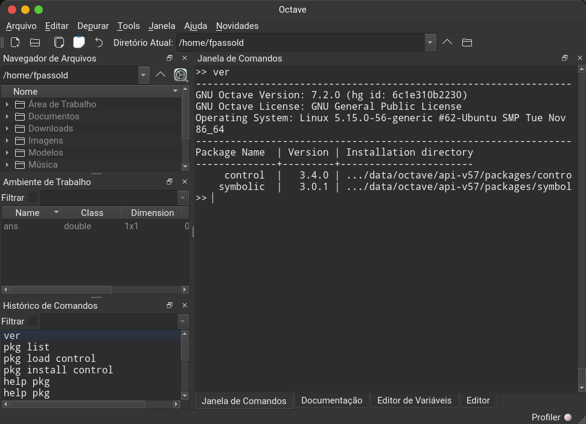

## Primeiro Teste

Vamos tentar imprimir um simples gráfico:

```matlab
>> t=0:0.01:2;                  % cria vetor tempo
>> pi                           % constante pi
ans = 3.1416
>> y=2*sin(2*pi*1*t);           % cria onda senoidal 1 Hz
>> % suponha um FPB com fc = 1 Hz, queda de 3 dB em 1 Hz:
>> G=10^(-3/20)                 % calculando "ganho" do FPB
G = 0.7079
>> y2=G*2*sin(2*pi*1*t-pi/4);   % senóide de saída, defasagem de 45 graus
>> plot(t,y, t,y2)              % plotando 2 curvas
>> legend('Input', 'Output')    % legenda
```

Se não houve erros de digitação, uma janela gráfica como a mostrada abaixo deve ter sido gerada:

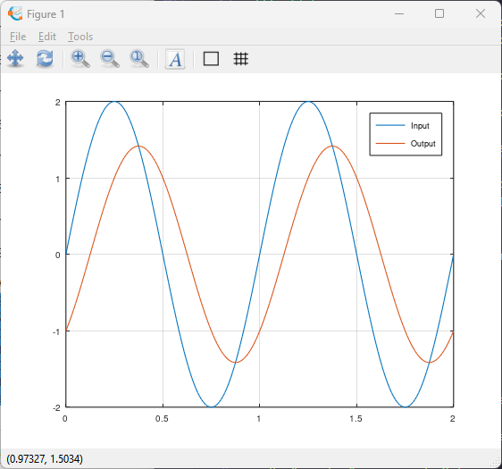

## Instalando pacotes (comandos extras)

De forma a ampliar as possibilidades de uso do Octave com a área de **Controle Automático**, se sugere a instalação de algumas ferramentas extras, chamadas de "pacotes".

> Os "pacotes" no caso do Octave, são equivalentes aos "toolboxes" no caso do Matlab.

<!-- 
- Como descobrir e listar pacotes extras?

No Octave existem 2 formas de instalar pacotes, para todo os usuários (opção "global") ou apenas para o usuário atual (opção "local").

**Obs.:** A opçãp "global" exige usuáruo executando o Octave como Administrador!

Doravante vamos supor que estamos executando o Ocatave como um simples usuário local.
-->

## Para listar pacotes já instalados

<!--
```matlab
>> pkg list          % para listar pacotes já instalados
>> pkg local_list    % para listar pacotes instalados pelo usuário atual
>> pkg global_list   % para listar pacotes instalados para todos os usuários
```

## Para instalar mais pacotes
-->

Para listar pacotes já instalados no Octave, fazer:

```matlab
>> pkg list
Package Name         | Version | Installation directory
---------------------+---------+-----------------------
              audio  |   2.0.5 | C:\Program Files\GNU Octave\Octave-7.2.0\mingw64\share\octave\packages\audio-2.0.5
             biosig  |   2.4.2 | C:\Program Files\GNU Octave\Octave-7.2.0\mingw64\share\octave\packages\biosig-2.4.2
     communications  |   1.2.4 | C:\Program Files\GNU Octave\Octave-7.2.0\mingw64\share\octave\packages\communications-1.2.4
            control  |   3.4.0 | C:\Users\fpassold\AppData\Roaming\octave\api-v57\packages\control-3.4.0
     data-smoothing  |   1.3.0 | C:\Program Files\GNU Octave\Octave-7.2.0\mingw64\share\octave\packages\data-smoothing-1.3.0
           database  |   2.4.4 | C:\Program Files\GNU Octave\Octave-7.2.0\mingw64\share\octave\packages\database-2.4.4
...
```

Repare que eventualmente alguns pacote **já estão instalados** (caso do Windows). Entre eles o "**control**" A lista acima é maior, mas apenas uma parte foi mostrada.

<!-- 
**De qualquer forma** se sugere executar o seguinte comando logo após a instalação do Octave: `>> pkg rebuild`. Isto evita erros como:

```Matlab
>> G=tf([1, 5, 7],[1, 8, 6])
error: could not find any INDEX file in directory C:\Users\fpassold\AppData\Roaming\octave\api-v57\packages\control-3.4.0, try 'pkg rebuild all' to generate missing INDEX files
error: called from
    describe>parse_pkg_idx at line 106 column 5
    describe at line 68 column 40
    pkg at line 742 column 43
    __unimplemented__>check_package at line 550 column 15
    __unimplemented__ at line 129 column 11
>>
```

**OBS: o erro continua ocorrendo mesmo após o `pakg rebuild all`!!! -->

### Pacotes Interessantes para nosso caso de uso

No nosso caso estamos interessados nos pacotes:

- **control**
- data-smoothing
- fits
- generate_html
- geometry
- miscellaneous
- **symbolic**
- **signal**

## Para instalar pacotes

Para descobrir que pacotes estão disponíveis (e versão dos mesmos):

```matlab
>> pkg list -forge
Octave Forge provides these packages:
  arduino 0.10.0
  audio 2.0.5
  bim 1.1.5
  bsltl 1.3.1
  cgi 0.1.2
  communications 1.2.4
  control 3.4.0
  data-smoothing 1.3.0
  database 2.4.4
  dataframe 1.2.0
  dicom 0.5.1
  divand 1.1.2
  doctest 0.7.0
  econometrics 1.1.2
  fem-fenics 0.0.5
  financial 0.5.3
  fits 1.0.7
  fpl 1.3.5
  fuzzy-logic-toolkit 0.4.6
  ga 0.10.3
  general 2.1.2
  generate_html 0.3.3
  geometry 4.0.0
  gsl 2.1.1
  image 2.14.0
  image-acquisition 0.2.2
  instrument-control 0.8.0
  interval 3.2.1
  io 2.6.4
  level-set 0.3.0
  linear-algebra 2.2.3
  lssa 0.1.4
  ltfat 2.3.1
  mapping 1.4.2
  matgeom 1.2.3
  miscellaneous 1.3.0
  msh 1.0.10
  mvn 1.1.0
  nan 3.7.0
  ncarray 1.0.5
  netcdf 1.0.16
  nurbs 1.4.3
  ocl 1.2.0
  ocs 0.1.5
  octclip 2.0.1
  octproj 2.0.1
  optics 0.1.4
  optim 1.6.2
  optiminterp 0.3.7
  parallel 4.0.1
  quaternion 2.4.0
  queueing 1.2.7
  secs1d 0.0.9
  secs2d unknown
  secs3d 0.0.1
  signal 1.4.3
  sockets 1.4.0
  sparsersb 1.0.9
  splines 1.3.4
  statistics 1.4.3
  stk 2.7.0
  strings 1.3.0
  struct 1.0.18
  symbolic 3.0.1
  tisean 0.2.3
  tsa 4.6.3
  vibes 0.2.0
  video 2.0.2
  vrml 1.0.13
  windows 1.6.3
  zeromq 1.5.5
>>
```

**Obs.:** a listagem acima é resultado do Octave sendo executado no Windows.

Se for necessário instalar pacotes (caso do Linux), use o comando:</p>
`>> pkg install -forge  <package_name>`</p>
A opção `-forge` carrega diretamente do repositório internet da Octave (obviamente exige conexão à internet).

Por exemplo:

```matlab
>> pkg install -forge symbolic
For information about changes from previous versions of the symbolic package, run 'news symbolic'.
>>
```

Se você deseja instalar pacotes e acompanhar o processo de download e instalação, use a opção `-verbose`, mas isto pode gerar longas mensagens:

Por exemplo:

```matlab
>> pkg install -forge -verbose control
mkdir (/tmp/oct-T38v9D)
untar (/tmp/control-3.4.0-RNDqAP.tar.gz, /tmp/oct-T38v9D)
checking for mkoctfile... /app/bin/mkoctfile-7.2.0 --verbose
checking for octave-config... /app/bin/octave-config-7.2.0
checking whether the C++ compiler works... yes
checking for C++ compiler default output file name... a.out
checking for suffix of executables...
checking whether we are cross compiling... no
checking for suffix of object files... o
checking whether we are using the GNU C++ compiler... yes
checking whether g++ accepts -g... yes
checking   is_real_type or isreal... isreal
checking   is_cell or iscell... iscell
checking   is_object or isobject... isobject
checking   is_complex_type or iscomplex... iscomplex
checking   is_numeric_type or isnumeric... isnumeric
checking for g77... no
checking for xlf... no
checking for f77... no
checking for frt... no
checking for pgf77... no
checking for cf77... no
checking for fort77... no

checking for pghpf... no
checking for epcf90... no
checking for gfortran... gfortran
checking whether we are using the GNU Fortran 77 compiler... yes
checking whether gfortran accepts -g... yes
checking for library containing dgges... no
configure: creating ./config.status
config.status: creating Makefile.conf
config.status: creating config.h
make: Entrando no diretório '/tmp/oct-T38v9D/control-3.4.0/src'

tar -xzf slicot.tar.gz
/app/bin/mkoctfile-7.2.0 --verbose -Wall -Wno-deprecated-declarations  __control_helper_functions__.cc
g++ -c -I/app/include -fPIC -I/app/include/octave-7.2.0/octave/.. -I/app/include/octave-7.2.0/octave -I/app/include  -pthread -fopenmp -O2 -g -pipe -Wp,-D_FORTIFY_SOURCE=2 -fexceptions -fstack-protector-strong -grecord-gcc-switches  -Wall -Wno-deprecated-declarations   __control_helper_functions__.cc -o /tmp/oct-PTj2gZ.o
mkdir sltmp
mv slicot/src/*.f ./sltmp
mv slicot/src_aux/*.f ./sltmp
if [ "0" = "1" ]; then \
        echo "copy routines using DGGES"; \
        cp SB04OD.fortran ./sltmp/SB04OD.f; \
        cp SG03AD.fortran ./sltmp/SG03AD.f; \
        cp SG03BD.fortran ./sltmp/SG03BD.f; \
fi;
cp AB08NX.fortran ./sltmp/AB08NX.f
cp AG08BY.fortran ./sltmp/AG08BY.f
cp SB01BY.fortran ./sltmp/SB01BY.f
cp SB01FY.fortran ./sltmp/SB01FY.f

gfortran -c -fPIC -g -O2 -std=legacy     UD01MZ.f -o UD01MZ.o
gfortran -c -fPIC -g -O2 -std=legacy     UD01ND.f -o UD01ND.o
gfortran -c -fPIC -g -O2 -std=legacy     UE01MD.f -o UE01MD.o
ar -rc slicotlibrary.a ./sltmp/*.o
rm -rf sltmp slicot
LDFLAGS="-L/app/lib  -lopenblas  -L/app/lib -L/usr/lib/gcc/x86_64-unknown-linux-gnu/11.3.0 -L/usr/lib/gcc/x86_64-unknown-linux-gnu/11.3.0/../../../x86_64-linux-gnu -L/usr/lib/gcc/x86_64-unknown-linux-gnu/11.3.0/../../../../lib64 -L/lib/x86_64-linux-gnu -L/lib/../lib64 -L/usr/lib/x86_64-linux-gnu -L/usr/lib/../lib64 -L/usr/lib/gcc/x86_64-unknown-linux-gnu/11.3.0/../../../../x86_64-unknown-linux-gnu/lib -L/usr/lib/gcc/x86_64-unknown-linux-gnu/11.3.0/../../.. -lgfortran -lm -lquadmath" \
    /app/bin/mkoctfile-7.2.0 --verbose -Wall -Wno-deprecated-declarations  __control_slicot_functions__.cc common.cc slicotlibrary.a
g++ -c -I/app/include -fPIC -I/app/include/octave-7.2.0/octave/.. -I/app/include/octave-7.2.0/octave -I/app/include  -pthread -fopenmp -O2 -g -pipe -Wp,-D_FORTIFY_SOURCE=2 -fexceptions -fstack-protector-strong -grecord-gcc-switches  -Wall -Wno-deprecated-declarations   __control_slicot_functions__.cc -o /tmp/oct-2fVEiL.o
g++ -c -I/app/include -fPIC -I/app/include/octave-7.2.0/octave/.. -I/app/include/octave-7.2.0/octave -I/app/include  -pthread -fopenmp -O2 -g -pipe -Wp,-D_FORTIFY_SOURCE=2 -fexceptions -fstack-protector-strong -grecord-gcc-switches  -Wall -Wno-deprecated-declarations   common.cc -o /tmp/oct-x9Eujr.o
g++ -I/app/include/octave-7.2.0/octave/.. -I/app/include/octave-7.2.0/octave -I/app/include  -pthread -fopenmp -O2 -g -pipe -Wp,-D_FORTIFY_SOURCE=2 -fexceptions -fstack-protector-strong -grecord-gcc-switches  -Wall -Wno-deprecated-declarations -o __control_slicot_functions__.oct  /tmp/oct-2fVEiL.o /tmp/oct-x9Eujr.o  slicotlibrary.a  -shared -Wl,-Bsymbolic -L/app/lib  -lopenblas  -L/app/lib -L/usr/lib/gcc/x86_64-unknown-linux-gnu/11.3.0 -L/usr/lib/gcc/x86_64-unknown-linux-gnu/11.3.0/../../../x86_64-linux-gnu -L/usr/lib/gcc/x86_64-unknown-linux-gnu/11.3.0/../../../../lib64 -L/lib/x86_64-linux-gnu -L/lib/../lib64 -L/usr/lib/x86_64-linux-gnu -L/usr/lib/../lib64 -L/usr/lib/gcc/x86_64-unknown-linux-gnu/11.3.0/../../../../x86_64-unknown-linux-gnu/lib -L/usr/lib/gcc/x86_64-unknown-linux-gnu/11.3.0/../../.. -lgfortran -lm -lquadmath  -L/app/lib -shared -Wl,-Bsymbolic  -L/app/lib -Wl,-z,relro,-z,now -Wl,--as-needed
make: Saindo do diretório '/tmp/oct-T38v9D/control-3.4.0/src'

copyfile /tmp/oct-T38v9D/control-3.4.0/src/__control_helper_functions__.oct /tmp/oct-T38v9D/control-3.4.0/src/__control_slicot_functions__.oct /tmp/oct-T38v9D/control-3.4.0/inst/x86_64-pc-linux-gnu-api-v57
For information about changes from previous versions of the control package, run 'newscontrol'.
>>
```

### Pacotes mínimos para área de Controle

Os pacotes mínimos necessários para a área de Controle Automático Clássico aparecem listados abaixo:

```matlab
>> ver
----------------------------------------------------------------------
GNU Octave Version: 7.2.0 (hg id: 6c1e310b2230)
GNU Octave License: GNU General Public License
Operating System: Linux 5.15.0-56-generic #62-Ubuntu SMP Tue Nov 22 19:54:14 UTC 2022 x86_64
----------------------------------------------------------------------
Package Name  | Version | Installation directory
--------------+---------+-----------------------
     control *|   3.4.0 | .../.var/app/org.octave.Octave/data/octave/api-v57/packages/control-3.4.0
      signal *|   1.4.3 | .../.var/app/org.octave.Octave/data/octave/api-v57/packages/signal-1.4.3
    symbolic *|   3.0.1 | .../.var/app/org.octave.Octave/data/octave/api-v57/packages/symbolic-3.0.1
>>
```

<!-- 
Se for desejado instalar este pacote no modo "global", será necessário executar o Octave como Administrador e usar o comando: `>> pkg install -forge -global control`.

No caso, foi instalada a versão control-3.4.0 (Release Date: 2022-01-16).
-->

## Novidades no pacote `Control`

```matlab
>> news control
```

Alguns destaques:

- Declare `tf([1],[1])` as static gain
- Returned num and den of `tfdate` have same length (bug #43947)
- Fixes for Octave 7.1.0: removed deprecated `.+` operator and unsupported `plot` style
- Fixed time response for first order systems
- new function `rlocusx` providing gain, damping and frequency for selected poles together with the possibility to generate open loop bode plots and simulations of the closed loop for selected closed loop poles.
- Fixed several issues in `bode`, `c2d`, `lsim` and `step` (control-3.3.0, Release Date: 2021-06-19).
- Fixed issues in legends of time and frequency responses when requested for multiple systems.
- Added discretization method `foh` to `c2d`.
- Fixed transposing a tfploy.
- new function `sgrid` (control-3.2.0, Release Date: 2019-04-01)
- new function: `ss2ss`.
- added demos to `rlocus`, `pzmap`, `bode`, `nichols`, `nyquist`, `impulse`, `lsim`, `ramp` and `step`.
- improved `pzmap` to plot with only zeros.
- New function: `damp` (control-3.1.0, Release Date: 2018-03-11).
- The new function `imp_invar.m` converts a Laplace tranfer function to a discrete tranfer function.
- Function `lsim` now plots inputs as well.

<!-- ## Instalando outros pacotes interessantes -->

## Atualizando pacotes já instalados

De vez em quando pode ser interessante atualizar os pacotes já instalados. Para tanto, simplesmente execute:</p>
`>> pkg update`</p>

```matlab
>> pkg update
For information about changes from previous versions of the netcdf package, run 'news netcdf'.
For information about changes from previous versions of the symbolic package, run 'news symbolic'.
For information about changes from previous versions of the windows package, run 'news windows'.
>>
```

Obs.: usar a opção "global" apenas se deseja aplicar alterações à todos os usuários e se tiver permissão (estiver executando o Octave como) de administrador para acessar/alterar arquivos de instalação, senão ocorrerão erros!

<!--
## Para instalar mais pacotes 
```matlab
>> pkg update -global
error: couldn't delete directory C:\Program Files\GNU Octave\Octave-7.2.0\mingw64\share\octave\packages\symbolic-3.
0.0: Permission denied
error: called from
    uninstall at line 131 column 11
    install at line 217 column 9
    pkg at line 612 column 9
    pkg at line 796 column 11
>>
```
-->

## Executando o pacote "control"

Informações adicionais sobre este pacote podem ser encontradas em:

- <https://octave.sourceforge.io/control/#:~:text=Octave%20Forge%20is%20a%20collection%20of%20packages%20providing,Design.%20Latest%20package%20release.%20Version.%203.2.0.%20Date.%202019-04-01>. (Sept/2022).

- ou <https://octave.sourceforge.io/control/index.html>;

- ou <https://octave.sourceforge.io/control/overview.html>.

Segue lista das funções mais utilizadas:

**Obs.:** **ANTES** de chamar qualquer função associado a este pacote, você deve "**carregar**"  este pacote executando comandos como:

```matlab
>> pkg load control
>> pkg load symbolic
>>
```

<!-- para forçar o carregamento deste pacote ou outro de interesse. -->

Segue exemplo de ingresso de uma "transfer function" (função transferência):

objeto `tf`, exemplo de uso:

```matlab
>> s = tf('s');
>> G = 1/(s+1)
>> z = tf('z', tsam);
>> z = tf('z', 0.2);
>> Gd = 0.095/(z-0.9)
>> sys = tf (num,den);
>> G = tf([1, 5, 7], [1, 8, 6])
>> sys = tf (num,den,tsam);
```

Exemplo$_2$:

```matlab
>> num=poly([0, -2])
num =
   1   2   0

>> den=poly([-1, -4, -8]);
>> G=tf(num,den)
Transfer function 'G' from input 'u1' to output ...

             s^2 + 2 s
 y1:  ------------------------
      s^3 + 13 s^2 + 44 s + 32

Continuous-time model.
>> zpk(G)
Transfer function 'ans' from input 'u1' to output ...

             s^2 + 2 s
 y1:  ------------------------
      s^3 + 13 s^2 + 44 s + 32

Continuous-time model.
>> % conferindo detalhes da função transferência:
>> pole(G)
ans =
  -8
  -4
  -1

>> zero(G)
ans =
  -2
   0
>> % de outra forma:
>> [z,p,k]=tf2zp(G)
z = [](0x1)
p =

  -10
   -4
   -1

k = 40
>>
```

> **Note**: a função `tf2zp()` (disponível no pacote `signal`) permite obter um resultado simular ao que seria obtido usando a função `zpk()` do MATLAB

---

## Exemplo de Uso: Projeto de um Controlador Proporcional

Seja uma planta como:

$$
G(s)=\dfrac{40}{(s+1)(s+4)(s+10)}
$$

O projeto de um controlador Proporcional com sobressinal máximo de 10% poderia ser desenvolvido como:

```matlab
>> % Nâo esquecer de carregar certos pacotes:
>> pkg load control
>> pkg load symbolic
>> 
>> G=tf(40,poly([-1 -4 -10]))   % ingressando a planta

Transfer function 'G' from input 'u1' to output ...

                 40
 y1:  ------------------------
      s^3 + 15 s^2 + 54 s + 40

Continuous-time model.
>> pole(G)  % confirmando polos da planta
ans =

  -10
   -4
   -1

>> zero(G)  % confirmando zeros da planta
ans = [](0x1)
>> dcgain(G)    % confirmando ganho DC da planta
ans = 1
>> % Isto significa que um degrau de amplitude u(t)=1 na entrada da planta 
>> % faz saída convergir para y(∞)=1
>> % confirmando aplicando degrau unitário na planta:
>> step(G)
```

O que deve ter gerado o seguinte gráfico:

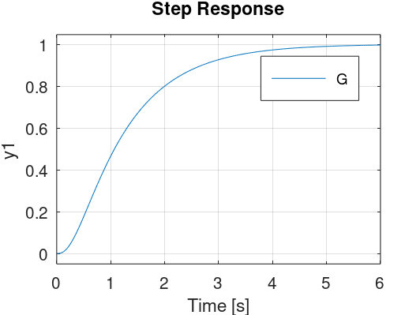

Temos que fechar a malha definindo um ganho para o controlador, evitando o sobressinal máximo desejado, então:

```matlab
>> OS=10;   % valor do sobressinal em porcentagem
>> zeta=(-log(OS/100))/(sqrt(pi^2+(log(OS/100)^2)))
zeta = 0.5912
>> rlocus(G)
>> hold on;
>> sgrid(zeta,0)
error: sgrid: W argument (1) must have positive values larger than 0
error: called from
    sgrid at line 147 column 7
>> % sgrid obriga 2 parâmetros de entrada no mínimo

```

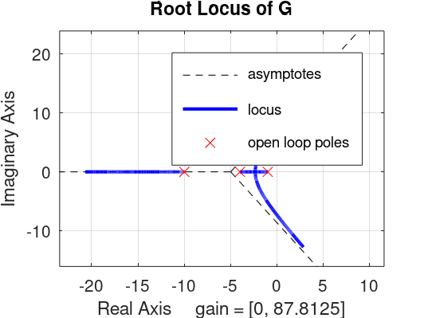

Mas podemos traçar uma reta axial que parte da origem do plano-s. Conhecendo-se o valor do $\zeta$ podemos determinar o ângulo $\alpha$, ver figura a seguir:

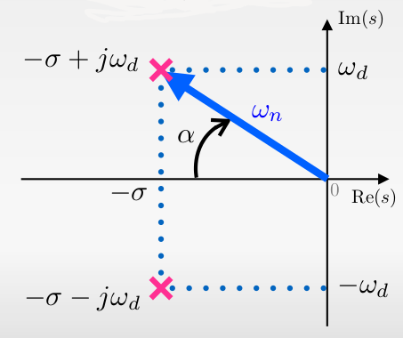

A figura anterior mostra polos de um sistema de 2a-ordem, do tipo:

$$
\dfrac{Y(s)}{R(s)}=\dfrac{K}{(s+p_1)(s+p_2)}=K \left( \dfrac{\omega_n^2}{s^2+2\zeta\omega s + \omega_n^2} \right)
$$

com polos em: $s=\sigma \pm j \omega_d$, onde:

$\sigma=\omega_n \zeta=\omega_n \cos(\alpha)$;</br>
$\omega_d = \omega_n \sqrt{1-\zeta^2}=\omega_n \sin(\alpha)$;</br>
$\zeta=\cos(\alpha)$;</br>
$\sin(\alpha)=\sqrt{1-\zeta^2}$.

então: $\alpha=\arccos(\zeta)$

```matlab
>> alpha=acos(zeta)
alpha = 0.9383
>> % convertendo para graus:
>> alpha_deg=alpha*180/pi
alpha_deg = 53.761
```

Podemos "automatizar" este cálculo e incluir os comandos para imprimir a reta correspondente a valores constantes de $\zeta$, criando uma **nova** função, neste caso, chamada de `sgrid2()`, cujo código aparece em seguinda:

```matlab
function sgrid2 (zeta)
  % função para plotar linha guia do zeta na última janela gráfica ativa
  % a partir do valor de zetam calcula o angulo alpha e traça a reta
  % que corresponde a linha guia
  % Fernando Passold, em 29/12/2022
  alpha=acos(zeta); % angulo correspondente ao zeta
  % fig=gcf(); % descobre numero da última janela ativa atual - dá no mesmo que fazer:
  fig = get (0, "currentfigure"); % recupera número da última figura ativa
  % Capturando limite da figura atual
  xlim=get(gca(),"xlim");
  ylim=get(gca(),"ylim");
  min_x=min(xlim);
  x=[0 min_x]; % vetor pontos da reta
  y2=abs(min_x)*tan(alpha);
  y=[0 y2];
  hold on;
  plot(x,y,"color","cyan"); % ,"linestyle","--");
  % sobre propriedades de plot ver:
  % https://docs.octave.org/v6.3.0/Line-Properties.html
  y=[0 -y2];
  plot(x,y,"color","cyan");
  shg % show the graph window
  % Note: shg is equivalent to figure (gcf) assuming that a current figure exists.
end
```

O resultado da aplicação da mesma na figura anterior gera:

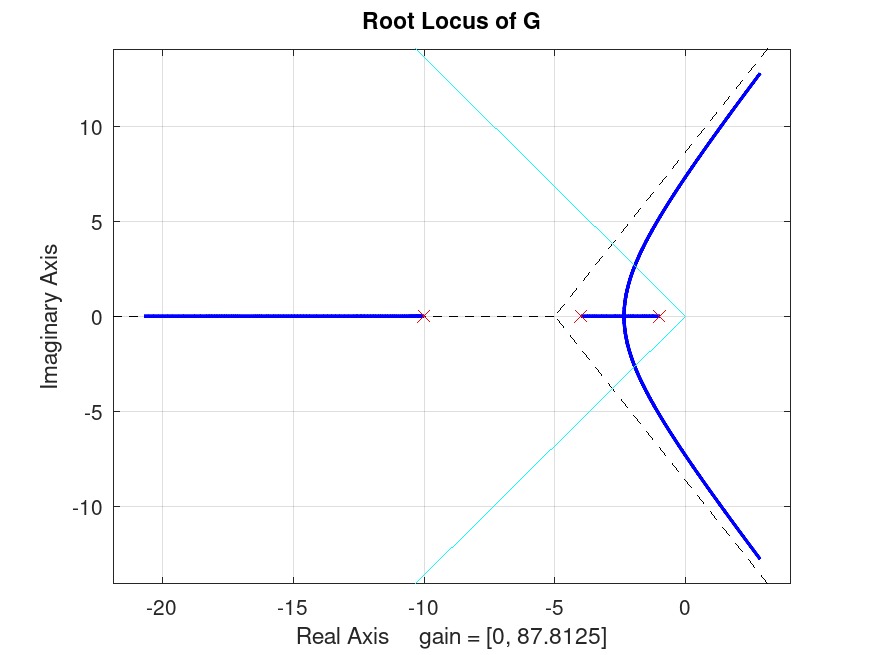

Podemos usar o comando `>> legend off` para sumir com o quadro que aparece junto a figura.

O Ocatve não possui uma função chamada `rlocfind()` como no caso do MATLAB, mas possui uma função similar: `rlocusx()`.

No caso deste exemplo, resultaria em algo como:

```matlab
>> figure; rlocusx(G)
```

O que acaba gerando uma figura como a mostrada à seguir:

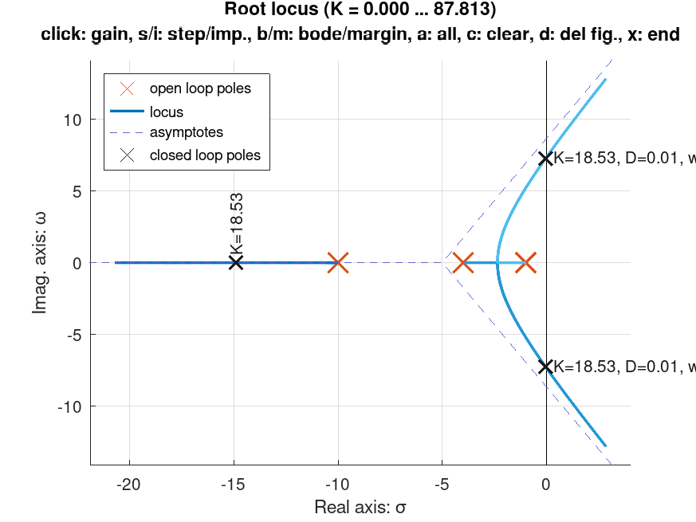

Mas note no exemplo anterior, que não foi possível imprimir uma linha guia para valores constantes de $\zeta$.

**Note** que `rlocuxx()` entretanto traz outras opções. Uma vez ingressado este comando, a janela gráfica entra em modo interativo aceitando os seguintes comandos (<https://octave.sourceforge.io/control/function/rlocusx.html>):

| Tecla | Resultado |
| :---: | :--- |
| clique-esquerdo | mostra valor do ganho, polos de MF, $\zeta$ e $\omega_n$ |
| s | "step" = Resposta ao degrau unitário para ganho no ponto escolhido |
| b | "bode" = Diagrama de Bode |
| m | "margin" = Diagrama de Bode com margens de estabilidade (ganho e fase) |
| a | "all" = Plota os 4 gŕaficos anteriores |
| c | "clear" = limpa todas as anotações já feitas |
| d | "delete" = apaga todas as figuras abertas |
| x | "eXit" = sair do modo interativo |

Por exemplo, apontando mais de uma posição no RL, podemos obter uma figura como:

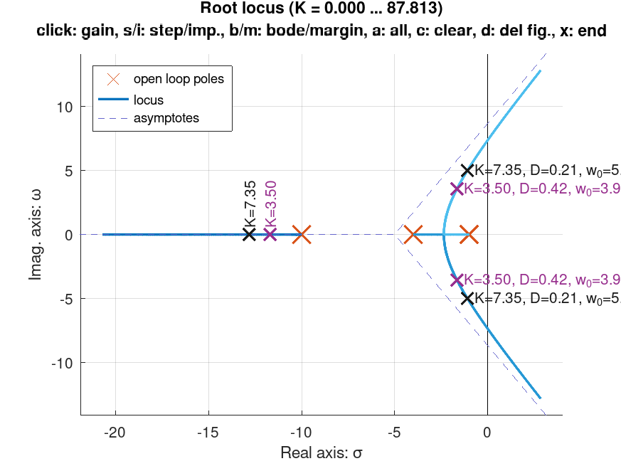

O diagrama de bode com as margens de ganho e de fase são mostradas na próxima figura:

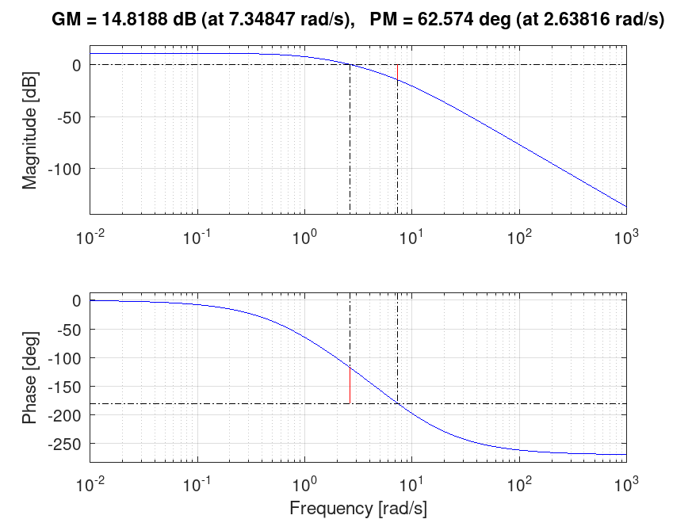

E a resposta à entrada degrau unitário para o ponto escolhido ($K=3,5$) fica:

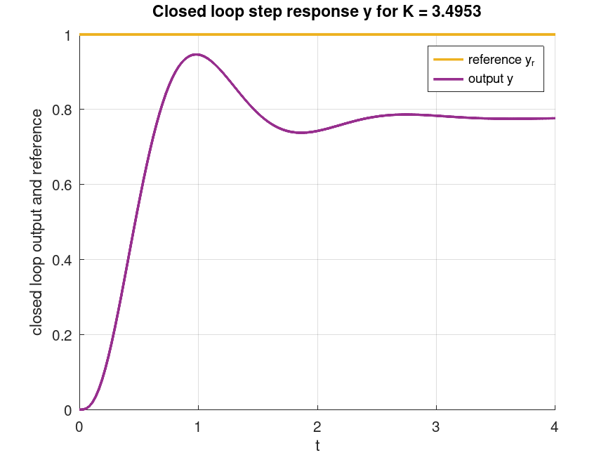

E clicamos "x" para sair do modo interativo e voltar para a janela de comandos do Octave.

A única limitação é que no RL mostrado, não aparece nenhuma linha guia referente a valores constantes de $\zeta$, o que dificulta um pouco a sintonia do controlador. **Faltaria** "combinar" a função `rlocusx()` com `sgrid2()`...

Mas podemos tentar descobrir o ponto no RL com $\zeta=0.5912$:

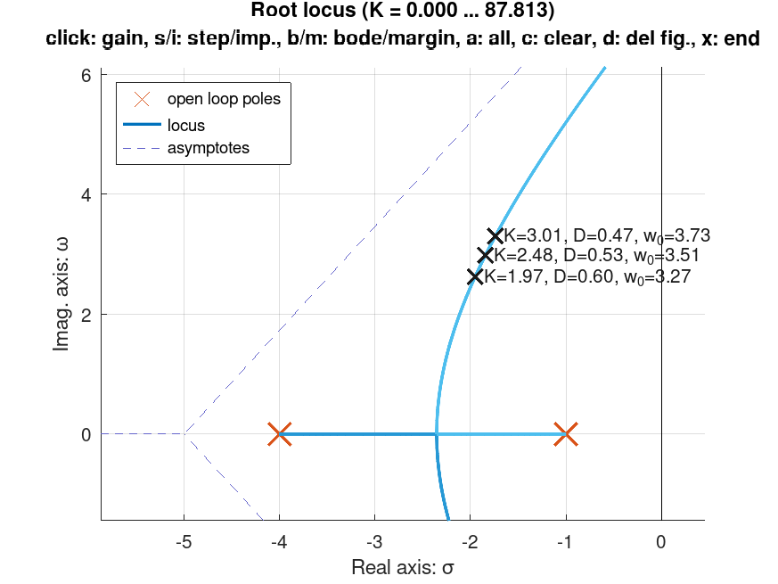

Encontramos um ganho aproximado de $K=1,97$ ($\zeta=0,6$).

Fechando a malha com $K=1,95$ vamos obter:

```matlab
>> ftma=K*G

Transfer function 'ftma' from input 'u1' to output ...

                 78
 y1:  ------------------------
      s^3 + 15 s^2 + 54 s + 40

>> H=tf(1,1)

Transfer function 'H' from input 'u1' to output ...

 y1:  1

Static gain.
>> ftmf=feedback(ftma, H, -1)

Transfer function 'ftmf' from input 'u1' to output ...

                 78
 y1:  -------------------------
      s^3 + 15 s^2 + 54 s + 118

Continuous-time model.
>> % gráfico da resposta ao degrau:
>> figure; step(ftmf)
>>
```

E a seguinte figura é gerada:

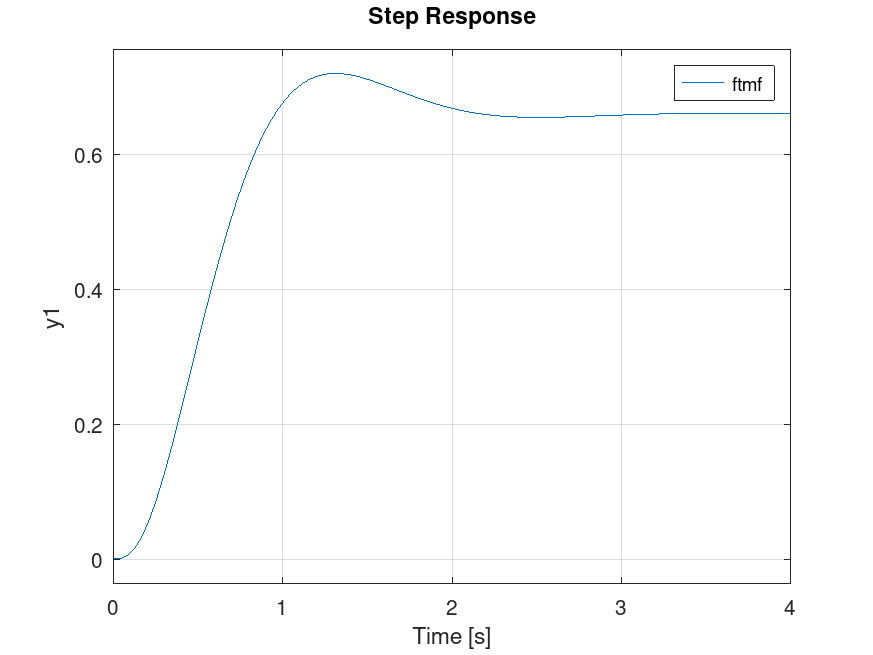

Percebemos um grande erro de regime permanente, $e(\infty)=33,9%$:

```matlab
>> dcgain(ftmf)
ans = 0.6610
>> erro=(1-dcgain(ftmf))/1*100
erro = 33.898
>>
```

Por curiosidade, usando este controlador e limitando o erro à 10%, teríamos que usar outro valor de ganho:

Lembrando da Teoria do Erro:

$$
e_{\text{Step}}(\infty)=\lim_{s \to 0} s \, E(s) = \dfrac{1}{1+\lim_{s \to 0} FTMA(s)}=\dfrac{1}{1+K_p}
$$

onde $K_p=$constante do erro estático de posição.

Neste caso, $e(\infty)=10\%=0,1$, então $K_p$ deveria assumir o valor:

$$
\begin{array}{rcl}
0,1 &=& \dfrac{1}{1+K_p}\\
K_p &=& \dfrac{1-0,1}{0,1}=9
\end{array}
$$

Calculando a constante $K_p$ para esta planta:

$$
\begin{array}{rcl}
\lim_{s \to 0} FTMA(s) &=& \lim_{s \to 0} \dfrac{K \cdot 40}{(s+1)(s+4)(s+10)}\\
&=& \dfrac{40 K}{(1)(4)(10)}\\
&=& K
\end{array}
$$

Então $K=K_p=9$. Testando:

```matlab
>> ftma2=9*G

Transfer function 'ftma2' from input 'u1' to output ...

                360
 y1:  ------------------------
      s^3 + 15 s^2 + 54 s + 40

Continuous-time model.

>> % Conferindo detalhes da FTMA2(s):
>> [z,p,k]=tf2zp(ftma2)
z = [](0x1)
p =

  -10
   -4
   -1

k = 360
>>
>> ftmf2=feedback(ftma2, H, -1);
>> figure; step(ftmf2)
>>
```

E obtemos a resposta:

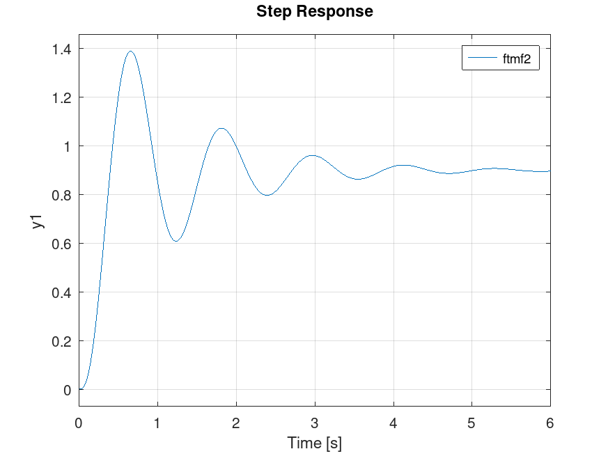

**Faltaria** obter informações sobre as características de resposta do sitema (função `stepinfo()` no MATLAB).

### Outras funções do Octave

- Blocos em série:
  $G(s)=G_1(s) \cdot G_2(s)$
  `>> G = series(G1, G2)`

- Blocos em paralelo:
  $G(s)=G_1(s)+G_2(s)$
  `>> G = parallel(G1, G2)`

- Realimentação:
  $G(s)=\dfrac{G_1(s)}{1+G_1(s)G_2(s)}$
  `>> G = feedback(G1, G2, -1)`

- Resíduos de uma função transferência:
  `>> [r,p,k]=residue (num,den)`
  
Exemplo: Seja a seguinte função transferência:
$$
G(s)=\dfrac{4s+6}{2s^3+10s^2+16s+8}\qquad \text{eq. (1)}
$$
supondo que esta função foi gerada à partir da eq. diferencial:
$$
\dfrac{2\,d^3 y}{dt^3}+\dfrac{10\,d^2 y}{dt^2} + \dfrac{16\,dy}{dt} + 8y = \dfrac{4\,du}{dt}+6u
$$
A expansão em frações parciais de (1), rende:

```matlab
>> num=[4 6];
>> den=[2 10 16 8];
>> [r,p,k]=residue(num,den)
r =

  -1
   1
   1

p =

  -2
  -2
  -1

k = [](0x0)
>>
```

Resultado da expanção:

$$
\begin{array}{rcl}
G(s) &=& \dfrac{4s+6}{2s^3+10s^2+16s+8}\\
&=& - \dfrac{1}{(s+2)} + \dfrac{1}{(s+2)} - \dfrac{1}{(s+1)}\\
\end{array}
$$

Lembrando da tabela de transformadas de Laplace:

| $f(t)$ | $F(s))$ |
| :---: | :---: |
| $e^{at}$ | $\dfrac{1}{s-a}$ |

vamos obter:

$$
g(t)=-e^{-2t}+e^{-2t}+1e^{-t}
$$

---

Fim
