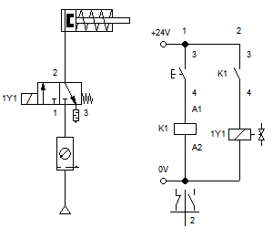
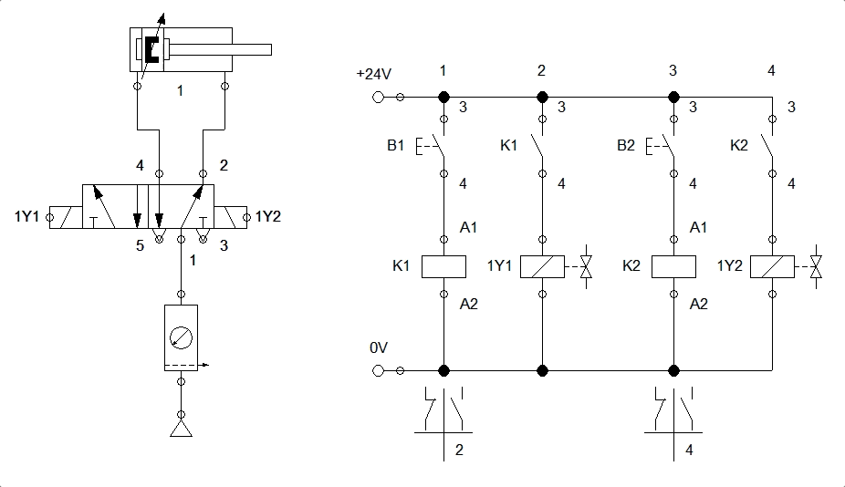
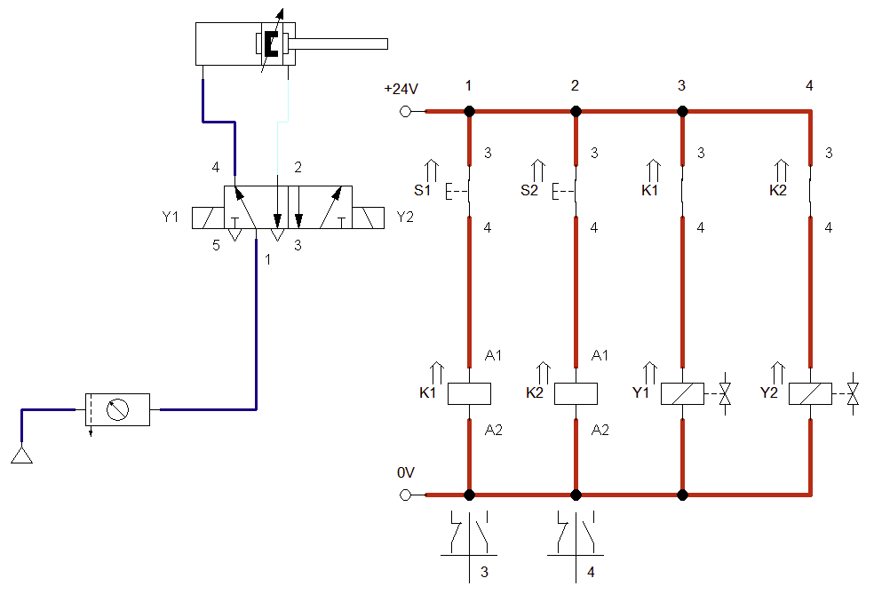
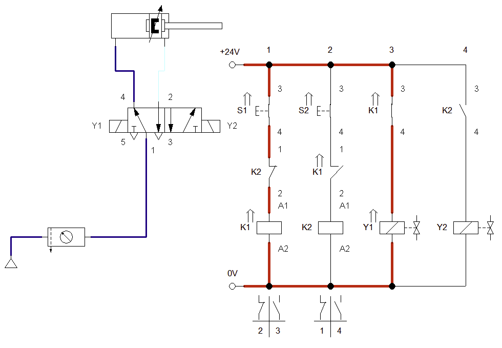
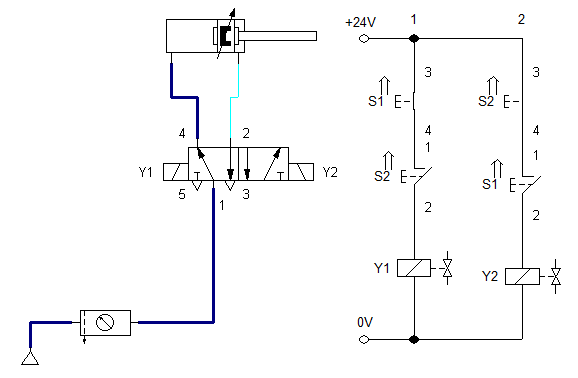
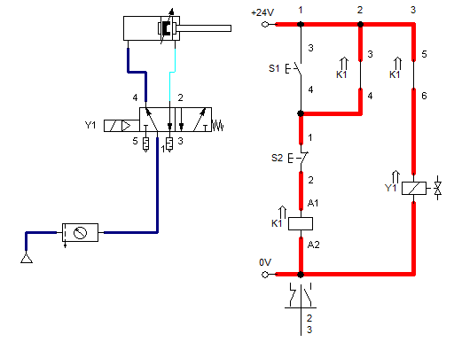
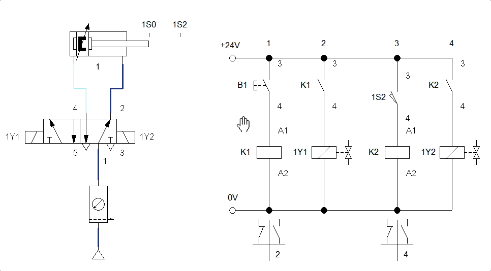
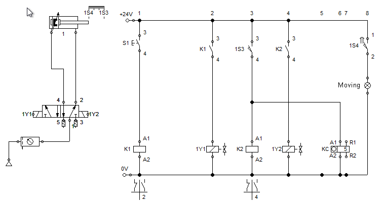

# Acionamentos Eletro-Pneumáticos

## Exemplos

1. Problema 2: com pistão de acionamento simples, acionamento por botão e "retorno automático" por mola:  [problema2.ct](Exercicios/problema2.ct):

   

2. Problema 3:  [problema3.ct](Exercicios/problema3.ct) : usar um botão N/A para comandar o avanço de um pistão e outro botão N/A para comandar o retrocesso do pistão:

   
   
   Obs.: Note porém que o ciruito anterior não prevê nenhuma proteção para acionamento simulatâneo das 2 chaves:
   
   
   
   Uma possível solução é mostrada abaixo ( [parker_circuito_04a.ct](Exercicios/parker_circuito_04a.ct) ): que mostra o que ocorre quando o usuário pressiona simultaneamente as chaves S1 e S2:
   
   

3. Problema: haveria outra solução para o circuito pneumático anterior, mais "econômica"?

   Solução possível:  [parker_circuito_04.ct](Exercicios/parker_circuito_04.ct) : que mostra o que ocorre quando se pressionam simultaneamente as chaves S1 e S2:

   

   E outra solução possível ainda é: ( [parker_circuito_04c.ct](Exercicios/parker_circuito_04c.ct) ): Neste caso S2 apenas interrompe a alimentação do contator K1 (interrompendo energia para bonina Y1):

   

   Note que o circuto elétrico associado com o relé K1 é do tipo "selo" ou de "auto-retenção" (uma verz ewnergizada a bobina do relé, ela continua energizada, até que os contatos S2 se abram).

3. Problema 4:  [problema4.ct](Exercicios/problema4.ct) : Similar ao anterior, mas note que o retrocesso do pistão é feito automaticamente quando o mesmo atinge o final da sua excursão (uso de chave de fim de curso, 1S2):

   

4. Ciruito 06 da [apostila da Parker](Exercicios/20_01_04_apostila_eletropneumatica_parker.pdf)(pág. 75): Neste caso, um circuito de ação dupla, com amortecedore de final de curso, deve avançar e retroceder automaticamente. Mas com um detalhe: deve haver um botão (S1) para comandar o avanço e retrocesso do pistão uma única vez. E deve haver um segundo botão (S2) que quando acionado, faz com que o pistão avance e retroceda automaticamente um número de $n$ vezes, onde este $n$ é programado num **relé-contador Kc**.

    > Um relé contador é um tipo de relé, "Kc", recebe impulsos elétricos na sua **bobina contadora** que leva a numeração A1 e A2. A cada impulso recebido nesta bobina, este relé realiza uma contagem (dispositivo eventualmente mecânico). O usuário programa o valor limite desta contagem. Quando este limite é atingido, seus contatos de saída invertem de estado. Este relé só volta a zero (é resetado) quando recebe um impulso na sua **bobina zeradora**, cujos contatos normalmente são representados pela numeração R1 e R2. 
    
    Segue parte inicial da resposta:  [parker_circuito_06_1a-parte.ct](Exercicios/parker_circuito_06_1a-parte.ct) 
    
    
    
    <!-- Dica: ver pág. 59-60 de  [apostila pneumtica 2008 nova.pdf](/Volumes/DADOS/Users/fpassold/Documents/UPF/Acionamentos/2022_1/Livros/apostila pneumtica 2008 nova.pdf) -->

Seguem mais exemplos...

---

Fernando Passold, em 03/04/2024.

