# Simulações Circuitos eletrônicos-pneumáticos no FluidSIM

**Exemplo$_1$**: Circuito pneumático simples de avanço-retorno de um pistão sob comando manual (mecânico).

> Ref: YouTube: Teoria na Prática com Prof. Pedro Henrique de Jesus: [1 - Vídeo Aula automação pneumática (Início simulação FluidSim)](https://youtu.be/zW7tsEidWQw), 71K visualizações, 8:28.

**Recomendações** de uso/Sequencia da simulação:

1. Menu >> Biblioteca >> Visão Geral (para abrir janela de componentes);

2. Menu >> File >> New (abrir/iniciar novo diagrama -- ==arquivo `*.ct`== -- observar local, pasta da gravação!)
   Local "padrão" adotado: `C:\Program Files\Festo Fluidsim 4.2\Pneumatic\ct\...`

3. **Iniciar pela alimentação (fonte) de ar-comprimido**:

   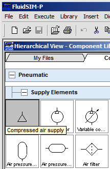

   | Aparência | Símbolo    | Configurações     |
   | :--- | :---: | :--- |
   |  |  | Pressão: 0 à 2 MPa (def: 0,6) Vazão: 0 à 5000 l/min (def: 1000) |

4. Arrastar até janela em branco do novo diagrama:

   

5. Acrescentar "**Unidade Conservadora**" (*Air Service Unit*), que inclui: filtro de ar, válvula de segurança (regula pressão), manômetro e lubrificador:

   | Aparência   | Símbolo    | Configurações   |
   | :--- | :---: | :--- |
   |  |  | Pressão: 0 à 2 MPa (typ: 0,6) Vazão: 0,1 à 5000 l/min (typ: 750) |

   Obs.: para abrir detalhes sobre o componente, clicar com botão direito do mouse sobre seu ícone; deve abrir uma janela semelhante à mostrada a seguir; selecionar "**Component Description":
   
   

6. Duplo clique sobre certo componente (ou botão direito do Mouse >> **Properties**), permite configurar suas propriedades como pressão e vazão desejadas:
   Obs.: Alterar pressão da Unidade Conservadora para: 5 bar:
   
   

7. Interligar compressor à unidade de conservação: processo de "clicar e arrastar". Para tanto selecionar saída do compressor (este ponto circular vai ser ressaltado na cor verde; manter pressionado botão esquerdo do mouse até encontrar entrada da unidade conservadora, círculo que será ressaltado na cor verde enquanto não se confirma a ligação e que muda para vermelho indicando conexão realizada):

   | Conectando    | Conexão estabelecida    |
   | :--- | :--- |
   |  |  |

8. Acrescentar cilindro de dupla ação:

   | Aparências      | Símbolos    | Configurações  |
   | :--- | :---: | :--- |
   |  |  | Parâmetros default:  |

   Se for pressionado o botão direito sobre o cilindro pode-se modificar sua **configuração**:

   
   
   Ou modificar **parâmetros** de funcionamento:
   
   
   
   Obs.: no momento, ainda não modificar nenhuma propriedade!

9. Acrescentar uma válvula 4/2 (posteriormente configurada para 4/2) e completar ligações com sistema de alimentação e com atuador (cilindro):

   

10. Note que o terminal de saída 3 da válvula ficou sem conexão. Abrir propriedades da Válvula e indicar que a saída 3 fará "retorno para a atmosfera" (simples escape de ar) ou você pode acrescentar um silenciador. Para o primeiro caso, de "retorno à atmosfera", você deve selecionar o terminal 3 e clicar com o botão direito do mouse sobre o mesmo para abrir a caixa de propriedades e ajustar conforme indicado na próxima figura:

    | Selecionar terminal 3 e abrir propriedades   | Ajustar propriedades |
    | :--- | :--- |
    |  |  |

    Obs.: Em sistemas hidráulicos o retorno é efeito para o tanque de armazenamento do fluído (óleo).

11. Por enquanto, neste esquema, a válvula ainda não possui nenhum sistema de acionamento. Se faz necessário acrescentar algum tipo de acionamento (manual, mecânico, elétrico). Para este primeiro exemplo, vamos usar acionamento manual (mecânico) para as 2 posições ("lados") da válvula. Para tanto, temos que selecionar a válvula e abrir suas propriedades (clicando 2x sobre a válvula ou cilcando com bitão direito sobre a válvula e selecionando Propriedades). Na **configuração da válvula**, ajustaremos o **lado esquerdo** para **acionamento manual** e o **lado direito** também com **acionamento manual**, nos 2 casos usando botão (mecânico) simples:

    

12. Segue arquivo  [exemplo_01.ct](exemplo_01.ct)  - contendo apenas os comportes necessários. Falta realizar as conexões entre os mesmos.

13. Note que o diagrama deve ter ficado como:

    

14. Note que da forma como está configurada a válvula neste esquema, na sua posição default (neutra, ou de retorno) vamos ter o "retorno" do cilindro (ar ciculando do ponto 1 ao ponto 2, o que mantêm o cilindro recuado). Quando a válvula mudar de posição, o ar vai circular da posição1 para o ponto 4, o fará o cilindro "avançar" -- veja animação mais adiante.

15. Este primeiro exemplo está pronto, para testá-lo, basta executar um "play", botão "▶︎". Note que assim que o mesmo é pressionado (sua cor muda para verde), no diagrama surgem linhas ressaltadas em **azul escuro** (indicando linha pressurizada, com ar-comprimido) e em **azul claro** (linha sem pressão, sem ar-comprimido):

    

    Note que o cilindro pneumático é mantido recuado.

16. Note o que ocorre quando se clica no botão que está à esquerda da válvula e depois no botão da direita da válvula, segue animação:

    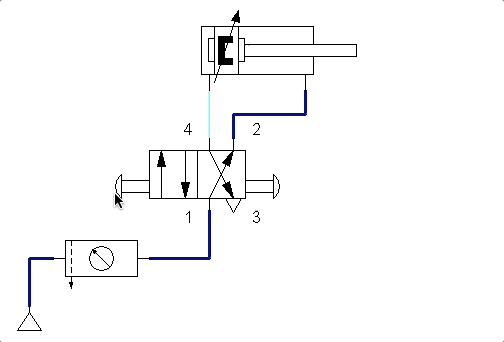

17. Você pode retardar (reduzir velocidade) da simulação clicando na barra de menu em: Opções >> Simulação e alterar "**Slow-motion Factor**" para um valor como: 6 (ou 15 até):

    | **Opções >> Simulação**                                          | Alteração da Velocidade                                      |
    | ------------------------------------------------------------ | ------------------------------------------------------------ |
    | 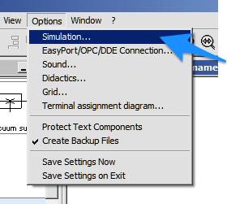 | 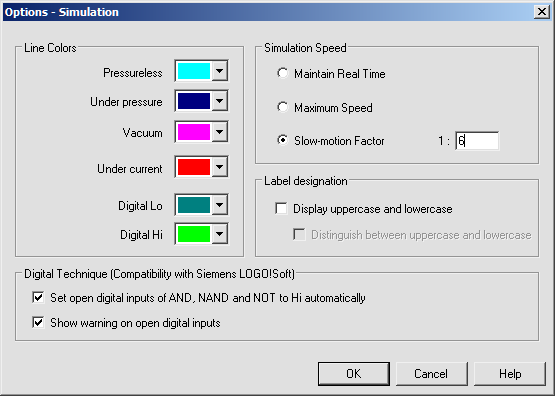 |

    A figura abaixo mostra a simulação usando fator 12:

    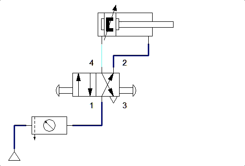

18. Também posso reduzir a velocidade de todo o circuito, reduzindo a pressão do ar-comprimindo. Neste caso, clicando em propriedades do Sistema de Alimentação para reduzir pressão de 5 bar para apenas 0,1 bar:

    | Reduzindo pressão Propriedades: | De 5 bar para 0,1 bar: |
    | :--- | :--- |
    |  |  |

    O que resulta na seguinte simulação:

    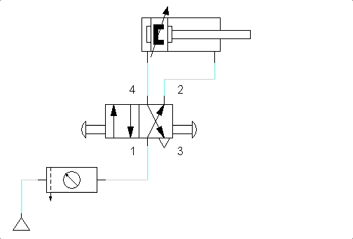

    Obs.: Neste caso, o fator slow motion adotado para simulação foi retornado para a posição normal (=1). Note que baixar a pressão resulta menor força para deslocar o cilindro. Então ==o nível de pressão é ditado pela carga à ser movida pelo cilindro e velocidade desejada==.

19. Podemos ainda substituir um dos botões de acionamento mecânico por um **acionamento com retorno por mola**. Para tanto, temos que alterar novamente as propriedades da válvula para:

    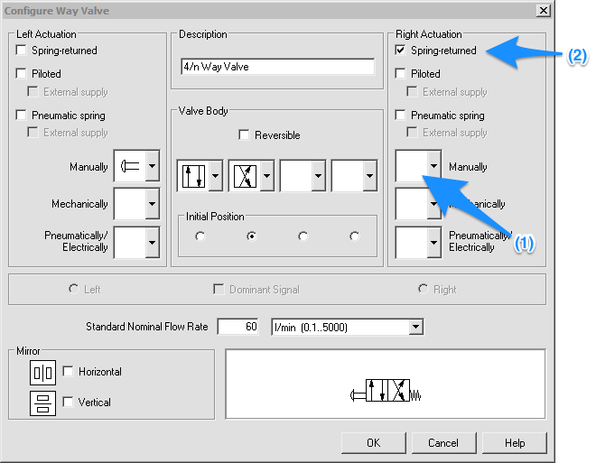

    Obs.: Note que (1) retiramos (temos que selecionar uma opção vazia) para o item e depois (2) clicar na caixa indicando retorno por mola.
    O novo diagrama fica como o mostrado na animação abaixo (fator slow-motion: 6; pressão no sistema: 5 bar):

    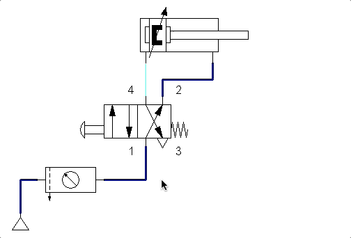

20. Perceba agora que para manter o cilindro avançando se faz necessário pressionar continuamente o botão da esquerda (na válvula). Note que toda vez que o usuário solta o botão, a mola força o retorno da válvula.

    **Arquivo disponível**: [teste1.ct](teste1.ct) .

Fim. 

> Ref.: YouTube: Teoria na Prática com Prof. Pedro Henrique de Jesus: [1 - Vídeo Aula automação pneumática (Início simulação FluidSim)](https://youtu.be/zW7tsEidWQw), 71K visualizações, 8:28. 

---

**Exemplo$_2$**: Circuito eletro-pneumático:

Ref.: ["FluidSim Eletropneumatica Aula 1" no YouTube](https://youtu.be/MLyVrviC0nk) (Enéias Belan; 20,2K visualizações; maio/2020; 16:36)

Detalhe: este tipo de circuito contempla 2 diagramas na mesma "folha": um diagrama pneumátivo + um diagrama elétrico.

A idéia aqui é implementar um simples atuador sobre um cilindro simples com 2 botões (pulsadores elétricos), onde um comanda o avanço do pistão e outro o recesso do pistão.

Lista de material:

* cilindro de simples ação;
* Válvula 3/2 (acionamento por botão elétrico e retorno automático por mola)
* unidade de conservação;
* compressor.

1-parte Diagrama pneumático:

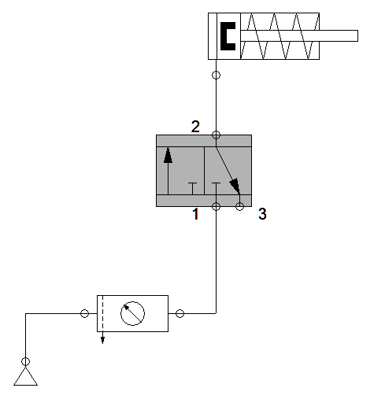

Configurar Válvula:

O diagrama deve ter se modificado para:

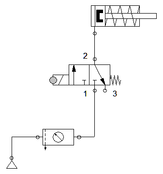

Falta agora **nomear o solenóide**: clicar no círculo do solenóide (sua cor muda; é ressaltada para verde) e modificar campo Etiqueta (ou Label) para: "1Y1".

> Nomenclatrua sugerida: "1Y1": onde "1"=Atuador 1; "Y"=Solenóide; e "1" novamente para se referir ao solenóide responsável pelo avanço. Lembrar que tudo que está à esquerda da válvula (onde está o solenóide) representa o avanço do controlador.

Você pode também aproveitar e introduzir um silenciador na saída 3 (de exaustão) da válvula:

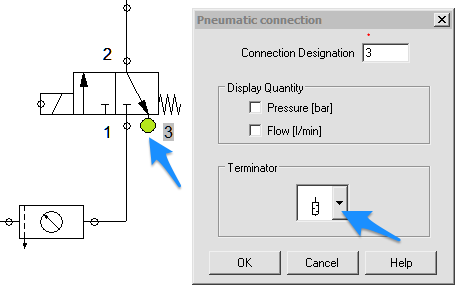

Agora iniciamos com a parte elétrica, iniciando pela alimentação realizada com 24 Volts e referência com 0 (zero) Volts: 

O espaço entre +24 Volts e 0 Volts vai ser completado com os comandos (lógica) da parte elétrica.

Sugere-se iniciar pela parte de controle: selecionamos um **botão (*push buttom* NA)**. Queremos que quando o usuário pressione este botão, o pistão avance. Quando o usuário solta este botão, o pistão retorna "sozinho":

Este botão vai acionar um relé auxiliar. Este relé será chamado de "K1" ("K" de relé; "1"= primeiro relé do circuito):

Falta acrescentar a parte de potência, isto é, o acionamento da "carga". Para isto vamos selecionar um **contato NA**. Este contato deverá ser configurado com o mesmo nome do nosso relé, no caso: "K1":

Este relé deve acionar o solenóide:

Este contato NA deve ser alimentado (conectado à +24 Volts):

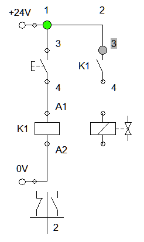

E terminamos as conexões envolvendo o solenóide:

Falta configurar o nome do solenóide: o mesmo que adotado no diagrama pneumático, ou seja: "1Y1":

Você deve ter percebido que na parte de baixo do diagrama elétrico, sob a coluna correspondente à bobina do relé auxiliar, o FluidSim mostra onde vai haver contatos NA e NF referentes à este rele (no caso K1).

Notamos que estamos usando apenas a parte do contato aberto (NA) que possui relação com a coluna/linha (2) do diagrama elétrico:

Pode-se passar agora à simulação do circuito. Segue diagrama completo abaixo:

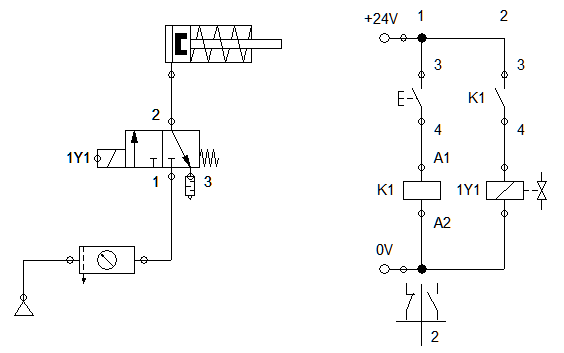

Animação:

> Arquivo disponível: [eletro_pneumo_1.ct](eletro_pneumo_1.ct)  .

---

**Problema**$_1$: A idéia agora é usar um atuador de ação dupla e 2 botões pushbuttom NA, um para comandar o avanço e o outro boão para comandar o recuo. Como o diagrama anterior deve ser modificado?

*Note que:* neste caso, a atuador simples deverá ser trocado e consequentemente a válvula de controle também deverá ser trocada, por uma do tipo: 5/2 vias.

 *Solução*:

Animação:

> Arquivo disponível: [eletro_pneumo_2.ct](eletro_pneumo_2.ct) .

---

**Problema**$_2$: E como o circuito anterior deveria ser modificado para uso de uma chafe de fim de curso?

*Nota*: 

(1) sugere-se acrescentar uma "**Régua de posicionamento**" (*Distance rule*):

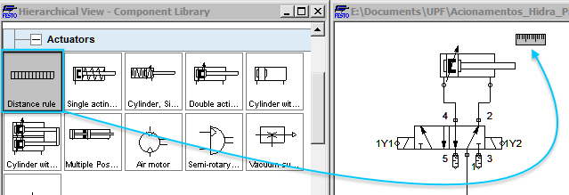

Ajuste suas propriedades para configurar a posição final. Chamar esta posição (primeira no quadro de configuração) de: "1S2", na posição 100 mm (o que equivale à posição final à ser atingida pelo atuador):

(2). O botão B2 não será mais usado. Pode ser apagado. No logar deste botão será introduzido um contato NA da chave de fim de curso. Aproveitar e mudar nome deste contato para "1S2" que o nome que adotamos anteriormente para indicar certa distância percorrida pelo atuador. Notar que o próprio simular reconhece este contato como sendo a chave de fim de curso! O resultado deverá ser algo do tipo:

**Atenção**: Aparentemente existe um bug no FluidSim versão quanto a regra de distânicas e configuração dos pontos de interesse. Na janela de configuração abaixo, note que foram configuradas 2 posições: a 1S2 que corresponde ao atuador completamente estendido e a posição 1S0 que corresponde à posição do atuador completamente recuado:

Note que a distância 1S0 não é usada. Consta apenas para entendimento.
Repare que agora o contato 1S2 muda para NA conforme o esperado.

Circuito final com animação:

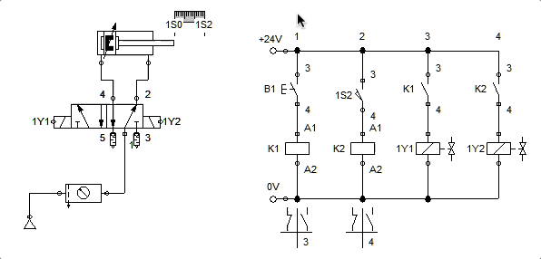

> Arquivo disponível:  [eletro_pneumo_3_fim_curso.ct](eletro_pneumo_3_fim_curso.ct) .

> Ref.: [YouTube: FluidSim Eletropneumatica Aula 1](https://youtu.be/MLyVrviC0nk) – Prof. Enéias Belan, 20.985 visualizações25 de mai. de 2020.

---

Fernando Passold, atualizado em 11/03/2022; 25/03/2022.

