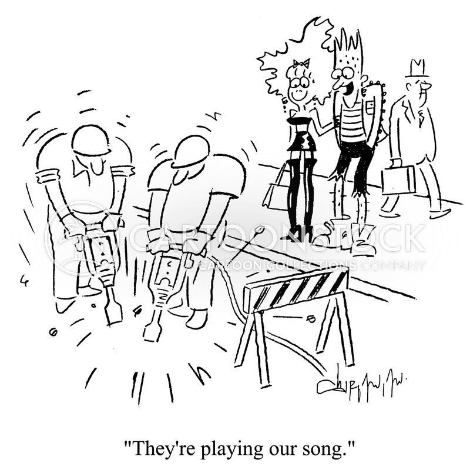

# Acionamento Hidráulico e Pneumático.

Tópicos:

1. [**Introdução**](https://fpassold.github.io/Pneumatica/intro_pneumatica.html) à Pneumática;
2. **Válvulas pneumáticas**, versão ["Básica"](https://fpassold.github.io/Pneumatica/valvulas_basic.html) ou ["Completa"](https://fpassold.github.io/Pneumatica/valvulas.html);
3. **Cilindros ou Atuadores**, versão ["Básica"](https://fpassold.github.io/Pneumatica/cilindros_basic.html) ou ["Completa"](https://fpassold.github.io/Pneumatica/cilindros.html);
4. [Sensores](https://fpassold.github.io/Pneumatica/sensores.html);
5. [Simulações](https://fpassold.github.io/Pneumatica/simulacao_01.html) (parte 1);
6. [Apostila da Festo: Pneumatics Basic Level](Festo_Workbook_TP_101-Pneumatics_Basic_Level.pdf)" (44 páginas, com considerações, cálculos, diagramas - PDF: 1,5 Mb);
7. [Catálogo da Festo: Painel Simulador de Pneumática e Eletropneumática](Painel_Simulador_Pneumatica_Eletropneumatica.pdf) (contêm símbolos e figuras, 76 pags. - PDF: 2 Mb)
8. Apostila de Pneumática do professor (  [apostila_pneumatica.pdf](apostila_pneumatica.pdf) - 72 pág, 16.7 MB )
9. [Material extra](material_extra.html) ) (mais material).
10. **Exercícios de Fixação de Conteúdo**, à partir da pág. 66 da Apostila "**Tecnologia Eletropneumática Industrial**, M1002-2 BR/Agosto 2001 da Parker Training) - 152 págs. -  [20_01_04_apostila_eletropneumatica_parker.pdf](Exercicios/20_01_04_apostila_eletropneumatica_parker.pdf) 
    <!-- (https://fpassold.github.io/Pneumatica/exercicios_2.html) -->
11. [Introdução](apostila_pneumatica.pdf) com Cálculos (Dimensionamento) do Reservatório Ar-Comprimido.
12. [Considerações Matemáticas](https://fpassold.github.io/Pneumatica/calculos_pneumo.html);
13. [Exemplos Especificações Circuitos Pneumáticos](https://fpassold.github.io/Pneumatica/exercicios_1.html).

Trabalhos Prospostos

* [Trabalho 1](trabalho_1.html): Resoluções de exercícios da apostila da Parker.
* [Trabalho 2](trabalho_2.html): Trabalhos associados com temas específicos.

Calendário final das aulas:

| Data  | Conteúdo Previsto           |
| ----- | --------------------------- |
| 26/03 | 1.                          |
| 02/04 | 2.                          |
| 09/04 | 3.                          |
| 16/04 | 4. Entrega Trabalho#1 e #2. |
| 23/04 | EXAME                       |

------

Prof. Fernando Passold (2022/1; sendo atualizado em 2024/1).