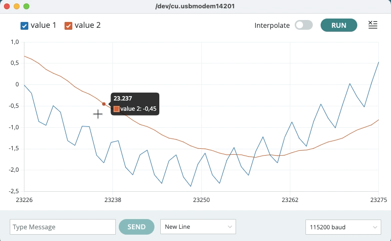

# Filtro Passa Baixas

Suponha que estamos querendo filtrar um ruído na faixa de 50 Hz presente no sinal desejado, uma senóide oscilando à 2 Hz. O sinal original de 2 Hz, oscila à 1 Vp, e o ruído oscila à 20% desta amplitude.

Suponha ainda que vamos amostrar o sinal à $f_s=$ 1 KHz.

No Matlab, podemos simular este sinal sobreposto ao ruído fazendo:

```matlab
>> T=1/1000;	% período de amostragem, fs = 1 KHz.
>> f_onda=2;	% sinal original 2 Hz
>> T_onda=1/f_onda	% periodo deste sinal
T_onda =
          0.5
>> t_fim=2*T_onda-T_onda; % 2 ciclos do sinal de 2 Hz iniciando em t=0
>> t=[0:T:t_fim]; % criando vetor tempo com incremento de 1/fs=T
>> x=sin(2*pi*2*t)+0.2*sin(2*pi*50*t);
>> plot(t,x)
>> grid
>> title('Sinal + Ruído')
>> xlabel('tempo (seg)')
>> ylabel('Amplitude')
```

E então obtemos:


A idéia aqui é eliminar o ruído sobreposto ao sinal de 2 Hz.

**Filtro**:

Eq. do filtro passa-baixas no mundo contínuo (plano-s):

$H(s)=\dfrac{\omega_0}{s+\omega_0}$		(eq.(1))

Necessitamos a função transferência no mundo discreto: $H(z)$, algo como:

$H(z)=\dfrac{b_0+b_1z^{-1}+b_2z^{-2}+\ldots}{1-a_1z^{-1}-a_2z^{-2}+\ldots}$

Para então obter a eq. de diferenças, algo como:

$y[n]=a_1 y[n-1]+a_2 y[n-2] + \ldots + b_0 x[n] + b_1 x[n-1] + \ldots$

o que neste caso pode se transfomar em algo como:

`y[n]=0.969*y[n-1]+0.0155*x[n]+0.0155*x[n-1]`

na eq. (1), $\omega_0=$ "*cutoff frequency*" = freq. de corte (rad/s);

Se $f_c=5$ Hz, então: $\omega_0=2\pi \cdot 5$ e:

$H(s)=\dfrac{2\pi \cdot 5}{s+2\pi \cdot 5}$

No Matlab:

```matlab
>> w0=2*pi*5		% calculando fc em rad/s
w0 =
       31.416
>> num=w0;
>> den=[1 w0];
>> H=tf(num,den);
>> zpk(H)
 
   31.416
  ---------
  (s+31.42)
 
Continuous-time zero/pole/gain model.

>> 
```

Transformar $H(s)$ em $H(z)$ depende da frequência de amostragem adotada, $f_s$.

Se o sinal de entrada, $x(t)$ for amostrado à $f_s=1$ KHz, o período de amostragem será:

$T=\dfrac{1}{f_s}=\dfrac{1}{1000}=0,001$ segundos ou 1 ms (1 mili-segundo).

Para obter $H(z)$ em função de $H(s)$ podemos realizar uma **transformação bi-linear**, usando o **método de Tustin** que estabelece que:

$s=\dfrac{2}{T}\left( \dfrac{1-z^{-1}}{1+z^{-1}} \right)$

Neste caso então:

$H(z)=\dfrac{\omega_0}{ \dfrac{2}{T}\left( \dfrac{1-z^{-1}}{1+z^{-1}} \right) + \omega_0 } = \dfrac{T \, \omega_0(z+1)}{(T \, \omega_0 + 2)z+(T \, \omega_0 -2)}$

Usando Matlab:

```matlab
>> T=1/1000
T =
        0.001
>> Hz = c2d(H,T,'tustin')		% realizando a transformação bilinear (Tustin)

Hz =
 
  0.01547 z + 0.01547
  -------------------
      z - 0.9691
 
Sample time: 0.001 seconds
Discrete-time transfer function.

>> zpk(Hz)

ans =
 
  0.015465 (z+1)
  --------------
    (z-0.9691)
 
Sample time: 0.001 seconds
Discrete-time zero/pole/gain model.

>> 
```

Pasando para o formato:

$H(z)=\dfrac{b_0+b_1z^{-1}+b_2z^{-2}+\ldots}{1-a_1z^{-1}-a_2z^{-2}+\ldots}$

a fim de obter a eq. de diferenças tal como:

$y[n]=a_1 y[n-1]+a_2 y[n-2] + \ldots + b_0 x[n] + b_1 x[n-1] + \ldots$

Note:

* os termos $a_i$ se referem à poderações aplicadas ao sinal de saída (filtrado), $y(t)$ e ao denominador de $H(z)$;
* os termos $b_j$ se referem à poderações aplicadas no sinal de entrada $x(t)$ e estão associadas com o numerador de $H(z)$.

Neste caso, resulta em:

$H(z) = \dfrac{Y(z)}{X(z)} = \dfrac{(0,01547 z + 0,01547)}{(z - 0,9691)} \cdot \dfrac{z^{-1}}{z^{-1}}$

$\dfrac{Y(z)}{X(z)} = \dfrac{(0,01547 + 0,01547z^{-1})}{(1-0,9691z^{-1})}$

$Y(z)(1-0,9691z^{-1})=X(z)(0,01547 + 0,01547z^{-1})$

$Y(z)=+0,9691z^{-1}Y(z) + 0,01547X(z) + 0,01547z^{-1}X(z)$

Ou finalmente, temos a **eq. de diferenças**:

$y[n]=0,9691 y[n-1] + 0,01547 x[n] + 0,01547 x[n-1]$

Agora sim podemos criar um **código para o Arduíno** ser capaz de executar este filtro, [FPB_Arduino.ino](FPB_Arduino/FPB_Arduino.ino) :

```c++
// variáveis globais
float x1 = 0;	// x[n-1]
float y1 = 0;	// y[n-1]
int k = 0;

void setup() {
  // put your setup code here, to run once:
  Serial.begin(115200);
}

void loop() {
  // put your main code here, to run repeatedly:
  // sinal original + ruído
  float t = micros()/1.0e6;	// clock do Arduino é de 16 MHz
  float x = sin(2*PI*2*t) + 0.2*sin(2*PI*50*t);
    
  // cálculo do sinal filtrado
  float y = 0.9691*y1 + 0.01547*x + 0.01547*x1;
    
  delay(1); 	// pausa de 1 mili-segundo
  // atualiza valor das variáveis associadas com amostras atrasadas
  x1 = x;
  y1 = y;
    
  if (k % 3 == 0){
    // Saída via porta serial
    Serial.print(2*x);		// dobrando amplitude original
    Serial.print(" ");
    Serial.println(2*y);	// dobrando amplitude original
  }
  k++;
}
```

Este código gera na tela do "**Monitor Serial**" a sequência de valores calculados (pares $x[n]$ e $y[n]$):

```bash
0.52 0.03
0.30 0.07
-0.03 0.07
0.37 0.07
0.97 0.13
0.87 0.21
0.46 0.25
0.72 0.27
1.36 0.35
1.38 0.44
0.93 0.50
1.04 0.54
1.67 0.62
1.81 0.73
1.35 0.80
1.30 0.84
1.89 0.91
2.13 1.02
```

E na tela do "**Serial Plotter**" deve surgir algo como:



<!-- Até minuto 5:57/12:52 de https://www.youtube.com/watch?v=HJ-C4Incgpw -->

Note que o sinal original é levemente atenuado e sofre um pequeno atraso (deslocamento de fase):


----

**Usando Python**

Alguns dos cálculos anteriores podem ser feitos usando **Python**:  [Arduino_FPB.ipynb](Arduino_FPB.ipynb) , ver abaixo:

```python
from scipy import signal
import numpy as np
w0 = 2*np.pi*5
print(w0)
```

```
31.41592653589793
```

```python
num=w0;
den=[1, w0];
H=signal.TransferFunction(num,den)
print(H)
```

```
TransferFunctionContinuous(
array([31.41592654]),
array([ 1.        , 31.41592654]),
dt: None
)
```

```python
T=1.0/1000.0;
print (T)
```

```
0.001
```

```python
Hd=H.to_discrete(T,method='gbt',alpha=0.5)
print(Hd)
```

```
TransferFunctionDiscrete(
array([0.01546504, 0.01546504]),
array([ 1.        , -0.96906992]),
dt: 0.001
)
```

```python
b = Hd.num;
a = Hd.den;
print("Coeficientes b_i: " + str(b))
print("Coeficientes a_i: " + str(a[1:]))
```

```
Coeficientes b_i: [0.01546504 0.01546504]
Coeficientes a_i: [-0.96906992]
```

Fim.

---

**Referência**:

* YouTube: [How to design and implement a digital low-pass filter on an Arduino](https://www.youtube.com/watch?v=HJ-C4Incgpw), 20 jun 2021, 136M visualizações, [Curio Res](https://www.youtube.com/@curiores111) (acessado em 19/05/2024).
* Para usar bloco de notas Jupyter (*Notebook*), inicie baixando o **Python**:
  https://wiki.python.org/moin/BeginnersGuide/Download
* E então siga as instruções para instalar o **Jupyter**:
  https://jupyter.org/install.html

---

<script language="JavaScript">
<!-- Hide JavaScript...
var LastUpdated = document.lastModified;
document.writeln ("Fernando Passold, atualizado em " + LastUpdated); // End Hiding -->
</script>

