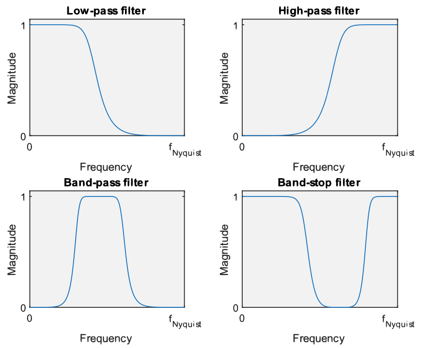
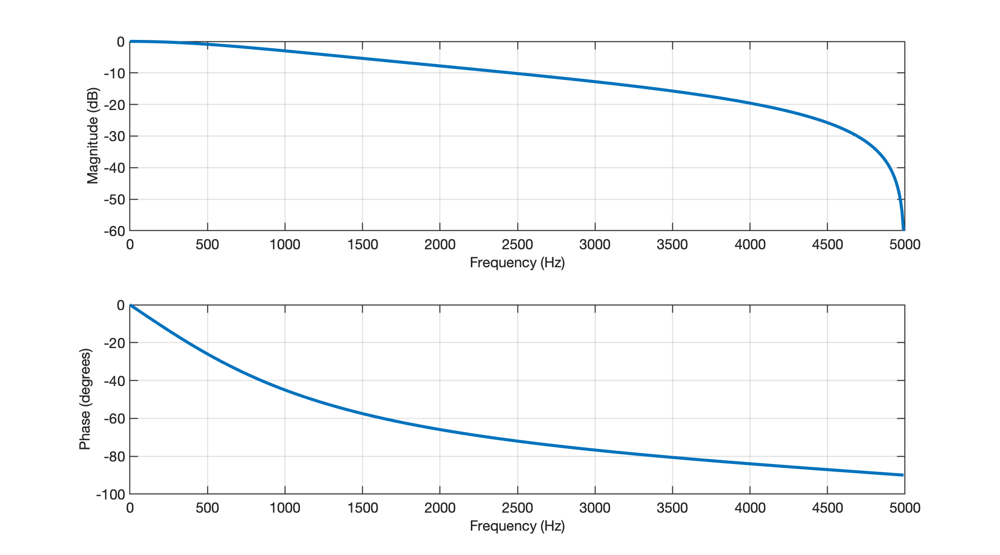
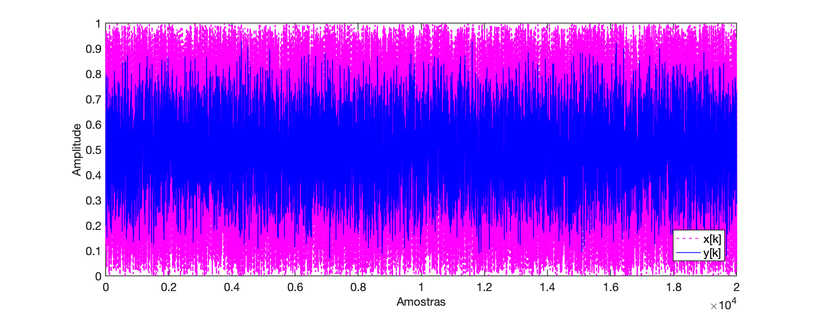
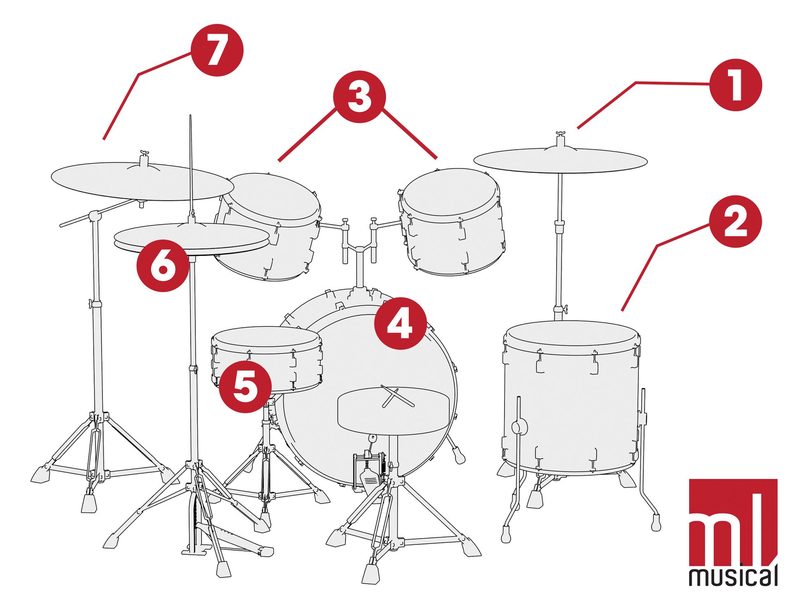
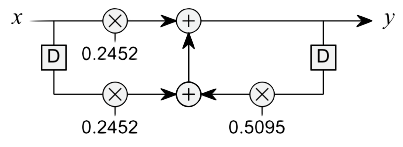
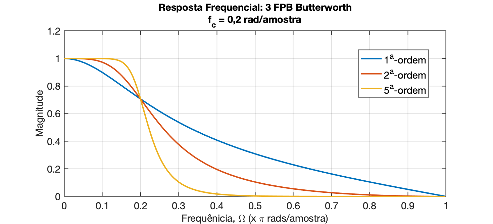
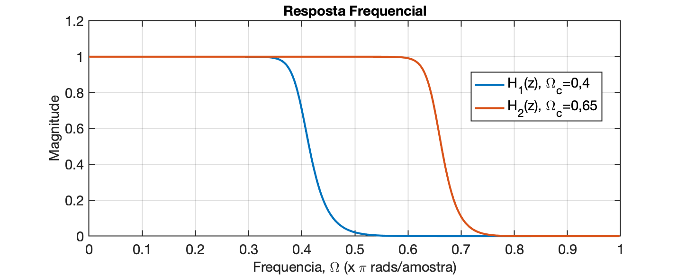

# Filtro Butterworth

**Idéia**: Usar o método de Tustin (e Matlab) para filtar certo sinal usando filtro do tipo Butterworth.

<!--Baseado em "**A filtered audio example**", de 3-DigitalFilters-apracticalguide.pdf, pág. 4/67-->

## Implementação de filtros usando Matlab/Octave

O Matlab/Octave fornece funções integradas para projetar quatro tipos básicos de filtros, conforme mostrado na figura abaixo:



* **Passa-Baixas** (*Lowpass*): permite a passagem de baixas freqüências; rejeita altas frequências.
* **Passa-Altas** (*Highpass*): permite frequências altas; rejeita baixas frequências.
* **Passa-Banda** (*Bandpass*): permite uma certa faixa de frequências e rejeita frequências fora desse intervalo
* **Rejeita-Faixa**: (*Bandstop*): rejeita uma determinada faixa de frequências e permite frequências fora dessa faixa para passar.

<!--pág. 24/67 de 3-DigitalFilters-apracticalguide.pdf-->
A função de projeto de filtro mais simples de usar é a função `butter()`, em homenagem ao engenheiro britânico Stephen Butterworth (1885–1958).

Conforme mostrado no código abaixo, a função manteiga recebe três parâmetros de entrada (o tipo de filtro, a ordem e a frequência de corte – explicado mais adiante) e retorna os coeficientes $b$ e $a$ que descrevem o sistema discreto, que podem então ser usados para filtrar um sinal.

Exemplo:

```matlab
>> [b a] = butter(1, 0.2,'low');
```

Os três parâmetros de entrada da função (ordem (valor = 1), frequência de corte (valor = 0,2) e tipo (valor = 'low')) são explicados posteriormente, mas vale a pena notar que uma única linha de código é tudo que você precisa para projetar um filtro. 

Cujo gráfico de resposta espectral pode ser visto adiante:

```matlab
>> figure; freqz(b,a,[],1)
```



A linha de código a seguir mostra um exemplo de filtragem de um sinal, onde a entrada do filtro é uma sequência de números aleatórios criados usando a função rand integrada.

```matlab
>> x = rand(1,20000);
>> y = filter(b,a,x);
```

A primeira linha criará a variável $x$ que contém 20.000 números aleatórios com um valor entre 0 e 1. A segunda linha usa a função `filter()` para filtrar o sinal $x$ usando os coeficientes $b$ e $a$ retornados pela função `butter()` usada antes.

```matlab
>> k=0:length(x)-1;
>> figure; plot(k,x,'m--', k,y,'b-')
>> legend('x[k]','y[k]')
>> xlabel("Amostras")
>> ylabel('Amplitude')
```



Pode ser interessante ouvir a entrada e a saída. Se você usar o código abaixo, ouvirá que as altas frequências foram removidas.

```matlab
>> sound(x, 10000)	% fs = 10 KHz.
>> pause(2.5)
>> sound(y, 10000)
```

Deve ter sido gerado algo como: $x[k]$ @ 10 KHz:

<audio controls><source src="butter1_x.wav" type="audio/wav"></audio>;

Sinal fittrado, $y[k]$ @ 10 KHz: 

<audio controls><source src="butter1_y.wav" type="audio/wav"></audio>;

**Resumidamente** os três parâmetros servem para:

* O primeiro parâmetro, a ordem do filtro, controla a inclinação (taxa de *roll-off*) da curva de resposta de frequência. Uma ordem mais alta resulta em uma curva mais íngreme e requer mais cálculos para sua implementação;
* O segundo parâmetro, a frequência de corte, controla onde a resposta de frequência começa a curvar. O valor está entre 0 e 1, sendo ==1 correspondente à frequência de Nyquist==.
* O terceiro parâmetro especifica o tipo de filtro, ou seja, ‘**low**’ → passa baixa; ‘**high**’ → passa alta; ‘**stop**’ → rejeita-faixa; ‘**bandpass**’ → passa banda. Ao projetar um filtro rejeita faixa (*stop band*) ou passa-banda, duas frequências de corte devem ser especificadas, por exemplo: `[b a] = butter(1, [0,25 0,6],'stop');`

**Teste**: Experimente executar o seguinte código sobre o vetor $x$ calculado anteriormente:

```matlab
>> [b2 a2] = butter(5, 0.05,'low');
>> 250/(10E3/2)
ans =
         0.05
>> y2=filter(b2,a2,x);
>> sound(y2, 10E3)
```

O som gerado deve ser semelhante à: $y_2[k]$ @ 10 KHz: 

<audio controls><source src="butter1_y2.wav" type="audio/wav"></audio>;

> **Curiosidades**
>
> A título de curiosidade, a voz masculina oscila nas frequências entre 250 à 700 Hz e a voz feminina, de 550 à 1000 Hz.
>
> Uma bateria é composta de:
>
> 
>
> Onde:
> \1. Prato de condução (Ride)
> \2. Surdo
> \3. Tom 1 e Tom 2 
> \4. Bumbo
> \5. Caixa
> \6. Chimbal (Hit-hat)
> \7. Prato de Ataque (Crash)
>
> Em especial:
>
> ### Bumbo:
>
> - **Graves:** 50Hz-100Hz – Ótimo para adicionar energia, mas em excesso pode soar estrondoso
> - **Médio-graves:** 100Hz-250Hz – Ótimo para adicionar gordura, mas em excesso pode deixar o som turvo
> - **Médios:** 400Hz-800Hz – em excesso pode soar encaixotado
> - **Médio-agudos:** 3kHz-5kHz – Ótimo para adicionar batida e ataque; em excesso pode causar aspereza
>
> ### Caixa
>
> - **Médio-graves:** 100Hz-250Hz – Ótimo para adicionar gordura, mas em excesso pode deixar o som turvo
> - **Médios:** 400Hz-1kHz – Em geral é onde o som da fundamental pode ser encontrado; em excesso pode soar encaixotado
> - **Médio-agudos:** 3kHz-5kHz – Ótimo para adicionar ataque; em excesso pode causar aspereza
> - **Agudos:** 10kHz – Ótimo para adicionar “ar” e “buzz”, em excesso pode ser estridente
>
> ### Tom-tons
>
> - **Graves:** 65 Hz-100Hz – Ótimo para adicionar energia ao surdo, mas em excesso pode soar estrondoso
> - **Médio-graves:** 100Hz-200Hz – Ótimo para adicionar energia aos tom-tons, mas em excesso pode deixar o som turvo
> - **Médios:** 400Hz-800Hz – Em excesso pode soar encaixotado
> - **Médio-agudos:** 5kHz-7kHz – Ótimo para adicionar ataque; em excesso pode causar aspereza
>
> ### Pratos/Overheads
>
> - **Médio-graves:** 200Hz-500Hz – Ótimo para adicionar “corpo” aos pratos, mas em excesso pode soar turvo ou encaixotado
> - **Médio-agudos:** 3kHz-5kHz – Ótimo para adicionar presença, mas em excesso pode soar duro e brigar com o vocal
> - **Agudos:** 7kHz-12kHz – Ótimo para adicionar “ar”; em excesso pode ser estridente
>
> Ref.: [11 Passos para mixar bateria como um profissional](https://musicosmos.com.br/mixar-bateria-como-um-profissional/) (acessado em 17/06/2024).
>
> Outras classificações para faixas de aúdio:
>
>
> | Categoria | Faixa Frequencial |
> | :--- | :--- |
> | Infrasom | < 20 Hz |
> | Subgraves | 20 Hz ~ 60 Hz |
> | Graves | 60 Hz ~ 100 Hz |
> | Médio-graves | 101 Hz  ~ 200 Hz |
> | Médios | 201 Hz  ~  3 KHz |
> | Agudos | 3 KHz  ~  20 KHz |
> | Ultrassom | > 20 KHz |

### Ordem do filtro

Se você executou o código `[b a] = butter(1, 0.2,'low');` você descobrirá que os coeficientes $b$ são [0,2452 0,2452] e os coeficientes $a$ são [1 -0,5095]:

```matlab
>> [b a] = butter(1, 0.2,'low');
>> b
b =
      0.24524      0.24524
>> a
a =
            1     -0.50953
```

Isto corresponde à função transferência:

```matlab
>> H=tf(b, a, 1/10E3)

H =
 
  0.2452 z + 0.2452
  -----------------
     z - 0.5095
 
Sample time: 0.0001 seconds
Discrete-time transfer function.

>> zpk(H)
 
  0.24524 (z+1)
  -------------
   (z-0.5095)
 
Sample time: 0.0001 seconds
Discrete-time zero/pole/gain model.
```

Ou a seguinte equação de diferença e ao diagrama de fluxo de sinal mostrados abaixo:

$y[n]=0,2452x[n]+0,2452x[n-1]+0,5095y[n-1]$



O código `[b a] = butter(1, 0.2,'low');` projeta um filtro de primeira ordem, onde a ordem (primeiro parâmetro) está associada ao número de coeficientes $b$ e $a$ retornados pela função. Se a ordem for 1, então existem 2 coeficientes $b$ e 2 coeficientes $a$. Se a ordem for 2, então existem 3 coeficientes $b$ e 3 coeficientes $a$. Em geral, se a ordem for $n$, existem coeficientes $n+1$ para $b$ e $a$.

A ordem do filtro afeta a taxa de “*roll-off*” do filtro, com filtros de ordem superior tendo uma taxa de *roll-off* mais rápida, conforme mostrado na figura abaixo. A taxa de roll-off refere-se à rapidez com que a resposta de frequência vai de alta para baixa, ou a inclinação da curva na resposta de magnitude:



Você deve notar que todos os três filtros passam pelo mesmo ponto, em 0,2π radianos por amostra, que é a frequência de corte para todos os três filtros (o código usado para criar o gráfico é mostrado abaixo). O filtro de ordem superior reduz as frequências mais altas de forma mais significativa e também preserva as frequências mais baixas em maior extensão, e em muitos casos este tipo de resposta é desejável, ou seja, mantendo as frequências baixas inalteradas enquanto reduz significativamente as frequências altas. No entanto, filtros de ordem superior requerem mais cálculos (mais adições e multiplicações) para serem implementados e podem levar mais tempo para serem executados em um computador (ou microcontrolador). Os projetistas de filtros digitais geralmente tentam determinar o filtro de ordem mais baixa para obter o efeito desejado <!--(consulte a seção Projetando um filtro de ordem mínima).-->

Outra razão para usar um filtro de ordem inferior é porque filtros com uma taxa de *roll-off* mais lenta têm uma resposta transitória mais rápida. <!--veja a seção intitulada “Resposta transitória dos filtros”-->

Para certas aplicações é desejável uma resposta transitória rápida. Um problema que surge frequentemente é que uma taxa de *roll-off* rápida também é desejável e o projetista do filtro está frequentemente procurando o melhor compromisso entre uma taxa de *roll-off* e uma resposta transitória. Infelizmente, é impossível ter uma taxa de *roll-off* rápida e uma resposta transitória rápida, uma vez que aumentar uma inevitavelmente diminui a outra.

### Frequência de corte (normalizada)

O segundo parâmetro de função no código `[b a] = butter(1, 0.2,'low');` especifica a frequência de corte do filtro, que neste caso é um valor de 0,2. Se o valor da frequência de corte for aumentado, uma faixa mais ampla de componentes de baixa frequência passará pelo filtro passa-baixa.

A frequência de corte sempre tem um valor entre 0 e 1, onde 0 corresponde a 0 Hz e 1 corresponde à frequência de Nyquist, que é metade da frequência de amostragem do sinal que você está filtrando. Os gráficos abaixo mostram a resposta de frequência de dois filtros Butterworth de 12ª ordem com frequências de corte de 0,4 e 0,65. Observe como a resposta de frequência associada à frequência de corte de 0,65 permitirá que uma faixa maior de frequências passe pelo filtro relativamente inalterada. Observe também que a transição da curva de resposta em frequência de um valor de 1 para um valor de zero está na região de 0,45 e 0,65 para as curvas azul e vermelha, respectivamente.

```matlab
>> [b1 a1]=butter(12, 0.4, 'low');
>> [b2 a2]=butter(12, 0.65, 'low');
>> H1=freqz(b1,a1);
>> f_norm = [0:length(H1)-1]/length(H1);
>> figure; plot(f_norm, abs(H1))
>> hold on
>> H2=freqz(b2,a2);
>> plot(f_norm, abs(H2))
>> title('Resposta Frequencial')
>> xlabel('Frequencia, \Omega (x \pi rads/amostra)')
>> ylabel('Magnitude')
```



Adadasd

<!-- até pág. 29/67 de 3-DigitalFilters-apracticalguide.pdf, butter1.mat-->

No caso do filtro testado, a resposta espectral pode ser vista abaixo:

```matlab
>> figure; freqz(b,a,[],10E3)
```


Ou a seguinte equação de diferença e ao diagrama de fluxo de sinal mostrados abaixo.


**Exemplo**: Vamos aplicar um filtro Butterworth de 5a-ordem com $f_c=$ sobre o sinal [xx](xx).

