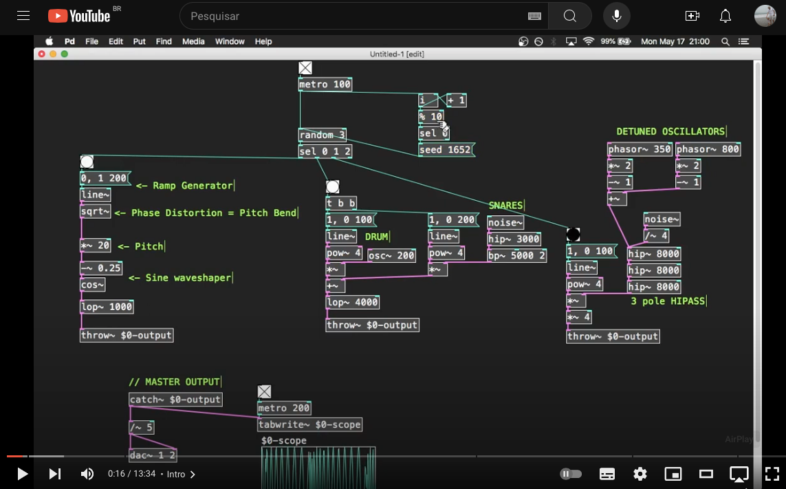
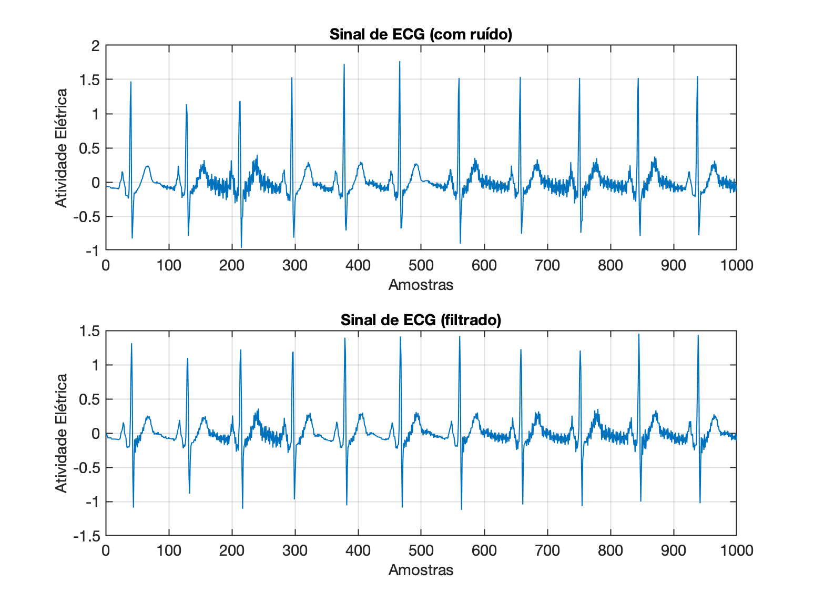
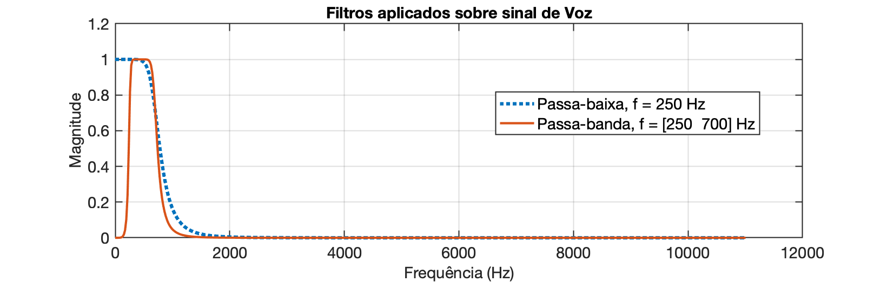
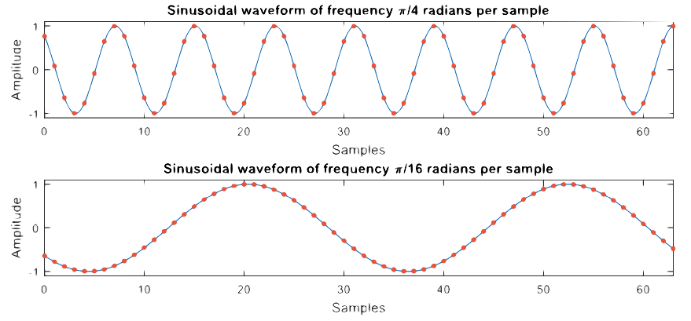
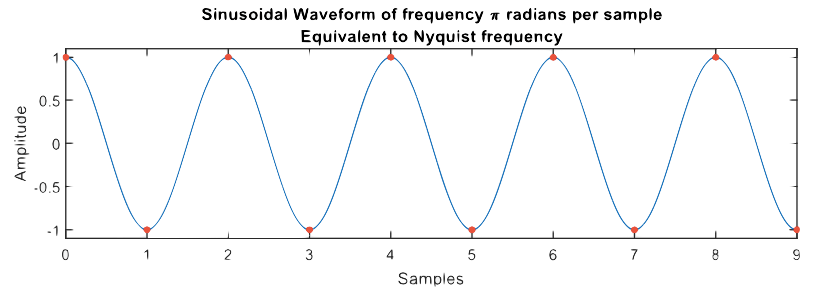
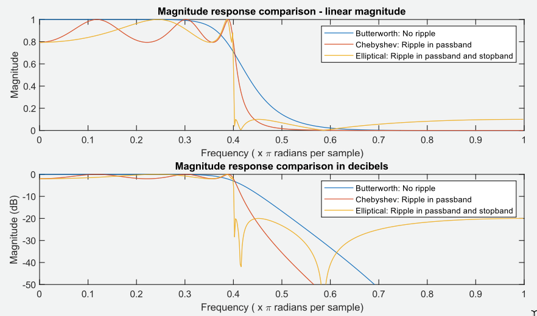

<font size="1"> [Pure data](https://puredata.info) >> [Simple Drum Machine](https://www.youtube.com/watch?v=nxnCkns-zMo&t=16s) (acessado em 17/06/2024)</font>

# Filtro Butterworth

- [Filtro Butterworth](#filtro-butterworth)
  - [Implementação de filtros usando Matlab/Octave](#implementação-de-filtros-usando-matlaboctave)
    - [Ordem do filtro](#ordem-do-filtro)
    - [Frequência de corte (normalizada)](#frequência-de-corte-normalizada)
    - [Frequência Normalizada](#frequência-normalizada)
  - [Outros tipos de filtros](#outros-tipos-de-filtros)

<!--Baseado em "**A filtered audio example**", de 3-DigitalFilters-apracticalguide.pdf, pág. 4/67-->

## Implementação de filtros usando Matlab/Octave

O Matlab/Octave fornece funções integradas para projetar quatro tipos básicos de filtros, conforme mostrado na figura abaixo:


* **Passa-Baixas** (*Lowpass*): permite a passagem de baixas freqüências; rejeita altas frequências.
* **Passa-Altas** (*Highpass*): permite frequências altas; rejeita baixas frequências.
* **Passa-Banda** (*Bandpass*): permite uma certa faixa de frequências e rejeita frequências fora desse intervalo
* **Rejeita-Faixa**: (*Bandstop*): rejeita uma determinada faixa de frequências e permite frequências fora dessa faixa para passar.

<!--pág. 24/67 de 3-DigitalFilters-apracticalguide.pdf-->
A função de projeto de filtro mais simples de usar é a função `butter()`, em homenagem ao engenheiro britânico Stephen Butterworth (1885–1958).

Conforme mostrado no código abaixo, a função manteiga recebe três parâmetros de entrada (o tipo de filtro, a ordem e a frequência de corte – explicado mais adiante) e retorna os coeficientes $b$ e $a$ que descrevem o sistema discreto, que podem então ser usados para filtrar um sinal.

Exemplo:

```matlab
>> [b a] = butter(1, 0.2,'low');
```

Os três parâmetros de entrada da função (ordem (valor = 1), frequência de corte (valor = 0,2) e tipo (valor = 'low')) são explicados posteriormente, mas vale a pena notar que uma única linha de código é tudo que você precisa para projetar um filtro. 

Cujo gráfico de resposta espectral pode ser visto adiante:

```matlab
>> figure; freqz(b,a,[],1)
```


A linha de código a seguir mostra um exemplo de filtragem de um sinal, onde a entrada do filtro é uma sequência de números aleatórios criados usando a função rand integrada.

```matlab
>> x = rand(1,20000);
>> y = filter(b,a,x);
```

A primeira linha criará a variável $x$ que contém 20.000 números aleatórios com um valor entre 0 e 1. A segunda linha usa a função `filter()` para filtrar o sinal $x$ usando os coeficientes $b$ e $a$ retornados pela função `butter()` usada antes.

```matlab
>> k=0:length(x)-1;
>> figure; plot(k,x,'m--', k,y,'b-')
>> legend('x[k]','y[k]')
>> xlabel("Amostras")
>> ylabel('Amplitude')
```


Pode ser interessante ouvir a entrada e a saída. Se você usar o código abaixo, ouvirá que as altas frequências foram removidas.

```matlab
>> sound(x, 10000)	% fs = 10 KHz.
>> pause(2.5)
>> sound(y, 10000)
```

Deve ter sido gerado algo como: $x[k]$ @ 10 KHz:

<audio controls><source src="butter1_x.wav" type="audio/wav"></audio>;

Sinal fittrado, $y[k]$ @ 10 KHz: 

<audio controls><source src="butter1_y.wav" type="audio/wav"></audio>;

**Resumidamente** os três parâmetros servem para:

* O primeiro parâmetro, a ordem do filtro, controla a inclinação (taxa de *roll-off*) da curva de resposta de frequência. Uma ordem mais alta resulta em uma curva mais íngreme e requer mais cálculos para sua implementação;
* O segundo parâmetro, a frequência de corte, controla onde a resposta de frequência começa a curvar. O valor está entre 0 e 1, sendo ==1 correspondente à frequência de Nyquist==.
* O terceiro parâmetro especifica o tipo de filtro, ou seja, ‘**low**’ → passa baixa; ‘**high**’ → passa alta; ‘**stop**’ → rejeita-faixa; ‘**bandpass**’ → passa banda. Ao projetar um filtro rejeita faixa (*stop band*) ou passa-banda, duas frequências de corte devem ser especificadas, por exemplo: `[b a] = butter(1, [0,25 0,6],'stop');`

**Teste**: Experimente executar o seguinte código sobre o vetor $x$ calculado anteriormente:

```matlab
>> [b2 a2] = butter(5, 0.05,'low');
>> 250/(10E3/2)
ans =
         0.05
>> y2=filter(b2,a2,x);
>> sound(y2, 10E3)
```

O som gerado deve ser semelhante à: $y_2[k]$ @ 10 KHz: 

<audio controls><source src="butter1_y2.wav" type="audio/wav"></audio>;

> **Curiosidades**
>
> A título de curiosidade, a voz masculina oscila nas frequências entre 250 à 700 Hz e a voz feminina, de 550 à 1000 Hz.
>
> Uma bateria é composta de:
>
> 
>
> Onde:
> \1. Prato de condução (Ride)
> \2. Surdo
> \3. Tom 1 e Tom 2 
> \4. Bumbo
> \5. Caixa
> \6. Chimbal (Hit-hat)
> \7. Prato de Ataque (Crash)
>
> Em especial:
>
> ### Bumbo:
>
> - **Graves:** 50Hz-100Hz – Ótimo para adicionar energia, mas em excesso pode soar estrondoso
> - **Médio-graves:** 100Hz-250Hz – Ótimo para adicionar gordura, mas em excesso pode deixar o som turvo
> - **Médios:** 400Hz-800Hz – em excesso pode soar encaixotado
> - **Médio-agudos:** 3kHz-5kHz – Ótimo para adicionar batida e ataque; em excesso pode causar aspereza
>
> ### Caixa
>
> - **Médio-graves:** 100Hz-250Hz – Ótimo para adicionar gordura, mas em excesso pode deixar o som turvo
> - **Médios:** 400Hz-1kHz – Em geral é onde o som da fundamental pode ser encontrado; em excesso pode soar encaixotado
> - **Médio-agudos:** 3kHz-5kHz – Ótimo para adicionar ataque; em excesso pode causar aspereza
> - **Agudos:** 10kHz – Ótimo para adicionar “ar” e “buzz”, em excesso pode ser estridente
>
> ### Tom-tons
>
> - **Graves:** 65 Hz-100Hz – Ótimo para adicionar energia ao surdo, mas em excesso pode soar estrondoso
> - **Médio-graves:** 100Hz-200Hz – Ótimo para adicionar energia aos tom-tons, mas em excesso pode deixar o som turvo
> - **Médios:** 400Hz-800Hz – Em excesso pode soar encaixotado
> - **Médio-agudos:** 5kHz-7kHz – Ótimo para adicionar ataque; em excesso pode causar aspereza
>
> ### Pratos/Overheads
>
> - **Médio-graves:** 200Hz-500Hz – Ótimo para adicionar “corpo” aos pratos, mas em excesso pode soar turvo ou encaixotado
> - **Médio-agudos:** 3kHz-5kHz – Ótimo para adicionar presença, mas em excesso pode soar duro e brigar com o vocal
> - **Agudos:** 7kHz-12kHz – Ótimo para adicionar “ar”; em excesso pode ser estridente
>
> Ref.: [11 Passos para mixar bateria como um profissional](https://musicosmos.com.br/mixar-bateria-como-um-profissional/) (acessado em 17/06/2024).
>
> Outras classificações para faixas de aúdio:
>
>
> | Categoria | Faixa Frequencial |
> | :--- | :--- |
> | Infrasom | < 20 Hz |
> | Subgraves | 20 Hz ~ 60 Hz |
> | Graves | 60 Hz ~ 100 Hz |
> | Médio-graves | 101 Hz  ~ 200 Hz |
> | Médios | 201 Hz  ~  3 KHz |
> | Agudos | 3 KHz  ~  20 KHz |
> | Ultrassom | > 20 KHz |

### Ordem do filtro

Se você executou o código `[b a] = butter(1, 0.2,'low');` você descobrirá que os coeficientes $b$ são [0,2452 0,2452] e os coeficientes $a$ são [1 -0,5095]:

```matlab
>> [b a] = butter(1, 0.2,'low');
>> b
b =
      0.24524      0.24524
>> a
a =
            1     -0.50953
```

Isto corresponde à função transferência:

```matlab
>> H=tf(b, a, 1/10E3)

H =
 
  0.2452 z + 0.2452
  -----------------
     z - 0.5095
 
Sample time: 0.0001 seconds
Discrete-time transfer function.

>> zpk(H)
 
  0.24524 (z+1)
  -------------
   (z-0.5095)
 
Sample time: 0.0001 seconds
Discrete-time zero/pole/gain model.
```

Ou a seguinte equação de diferença e ao diagrama de fluxo de sinal mostrados abaixo:

$y[n]=0,2452x[n]+0,2452x[n-1]+0,5095y[n-1]$


O código `[b a] = butter(1, 0.2,'low');` projeta um filtro de primeira ordem, onde a ordem (primeiro parâmetro) está associada ao número de coeficientes $b$ e $a$ retornados pela função. Se a ordem for 1, então existem 2 coeficientes $b$ e 2 coeficientes $a$. Se a ordem for 2, então existem 3 coeficientes $b$ e 3 coeficientes $a$. Em geral, se a ordem for $n$, existem coeficientes $n+1$ para $b$ e $a$.

A ordem do filtro afeta a taxa de “*roll-off*” do filtro, com filtros de ordem superior tendo uma taxa de *roll-off* mais rápida, conforme mostrado na figura abaixo. A taxa de roll-off refere-se à rapidez com que a resposta de frequência vai de alta para baixa, ou a inclinação da curva na resposta de magnitude:

```matlab
>> [b1 a1] = butter(1, 0.2,'low');
>> H1 = freqz(b1,a1);
>> f_norm=[0:length(H1)-1]/length(H1);
>> plot(f_norm,abs(H1))
>> hold on;
>> [b2 a2] = butter(2, 0.2,'low');
>> H2 = freqz(b2,a2);
>> plot(f_norm,abs(H2))
>> [b5 a5] = butter(5, 0.2,'low');
>> H5 = freqz(b5,a5);
>> plot(f_norm,abs(H5))
>> title({'Resposta Frequencial: 3 FPB Butterworth','f_c = 0,2 rad/amostra'})
>> ylabel('Magnitude')
>> xlabel('Frequênicia, \Omega (x \pi rads/amostra)') 
>> legend('1^{a}-ordem', '2^{a}-ordem','5^{a}-ordem')
```


Você deve notar que todos os três filtros passam pelo mesmo ponto, em 0,2π radianos por amostra, que é a frequência de corte para todos os três filtros (o código usado para criar o gráfico é mostrado abaixo). O filtro de ordem superior reduz as frequências mais altas de forma mais significativa e também preserva as frequências mais baixas em maior extensão, e em muitos casos este tipo de resposta é desejável, ou seja, mantendo as frequências baixas inalteradas enquanto reduz significativamente as frequências altas. No entanto, filtros de ordem superior requerem mais cálculos (mais adições e multiplicações) para serem implementados e podem levar mais tempo para serem executados em um computador (ou microcontrolador). Os projetistas de filtros digitais geralmente tentam determinar o filtro de ordem mais baixa para obter o efeito desejado <!--(consulte a seção Projetando um filtro de ordem mínima).-->

Outra razão para usar um filtro de ordem inferior é porque filtros com uma taxa de *roll-off* mais lenta têm uma resposta transitória mais rápida. <!--veja a seção intitulada “Resposta transitória dos filtros”-->

Para certas aplicações é desejável uma resposta transitória rápida. Um problema que surge frequentemente é que uma taxa de *roll-off* rápida também é desejável e o projetista do filtro está frequentemente procurando o melhor compromisso entre uma taxa de *roll-off* e uma resposta transitória. Infelizmente, é impossível ter uma taxa de *roll-off* rápida e uma resposta transitória rápida, uma vez que aumentar uma inevitavelmente diminui a outra.

### Frequência de corte (normalizada)

O segundo parâmetro de função no código `[b a] = butter(1, 0.2,'low');` especifica a frequência de corte do filtro, que neste caso é um valor de 0,2. Se o valor da frequência de corte for aumentado, uma faixa mais ampla de componentes de baixa frequência passará pelo filtro passa-baixa.

A frequência de corte sempre tem um valor entre 0 e 1, onde 0 corresponde a 0 Hz e 1 corresponde à frequência de Nyquist, que é metade da frequência de amostragem do sinal que você está filtrando. Os gráficos abaixo mostram a resposta de frequência de dois filtros Butterworth de 12ª ordem com frequências de corte de 0,4 e 0,65. Observe como a resposta de frequência associada à frequência de corte de 0,65 permitirá que uma faixa maior de frequências passe pelo filtro relativamente inalterada. Observe também que a transição da curva de resposta em frequência de um valor de 1 para um valor de zero está na região de 0,45 e 0,65 para as curvas azul e vermelha, respectivamente.

```matlab
>> [b1 a1]=butter(12, 0.4, 'low');
>> [b2 a2]=butter(12, 0.65, 'low');
>> H1=freqz(b1,a1);
>> f_norm = [0:length(H1)-1]/length(H1);
>> figure; plot(f_norm, abs(H1))
>> hold on
>> H2=freqz(b2,a2);
>> plot(f_norm, abs(H2))
>> title('Resposta Frequencial')
>> xlabel('Frequencia, \Omega (x \pi rads/amostra)')
>> ylabel('Magnitude')
```


Mais especificamente, a frequência de corte especifica o ponto em que a curva passará por um valor de 0,7071 = 1/√2, o que equivale a aproximadamente -3 dB (20log10(1/√2) = - 3,0103). Por esta razão, a frequência de corte também é frequentemente referida como frequência de 3 dB. Isso pode ser visto mais claramente no gráfico abaixo (também mostrado anteriormente), que mostra a resposta de magnitude de filtros de ordem diferente, todos passando pelo mesmo ponto com uma magnitude de 0,7071 e frequência de 0,2 radianos por amostra.


É útil observar que os ==filtros digitais não são projetados para funcionar apenas em uma frequência de amostragem específica==. Assim, para dois cenários muito diferentes, o mesmo filtro poderia ser usado para obter o efeito desejado. Por exemplo, considere uma situação em que um ECG (sinal cardíaco), amostrado em 120 Hz, foi corrompido por ruído de 50 Hz e uma segunda situação em que um sinal de fala amostrado em 32 kHz tem um artefato perceptualmente irritante em 13 kHz.

Para ambas as situações, o mesmo filtro digital pode melhorar a qualidade do sinal, conforme mostrado no código abaixo. Isso ocorre porque o artefato/ruído em ambos os sinais ocorre na mesma região em relação à taxa de Nyquist (que é metade da taxa de amostragem), ou seja, 50/60 = 0,8333 para o sinal de ECG e 13.000/16.000 = 0,8125 para o sinal de fala. Este fato pode parecer estranho para aqueles com experiência em filtros analógicos, já que para o caso analógico seriam necessários componentes de filtro completamente diferentes em ambas as situações. Quando você começa a pensar sobre isso, ==um filtro digital é apenas uma sequência de multiplicações e adições e o conhecimento da taxa de amostragem não é necessário para implementar o filtro== (o comportamento dos componentes dos filtros elétricos analógicos, como capacitores e indutores, dependem da frequência).

> **Repositório** de arquivos Wav:
>
> 1. **SampleSwap**: O SampleSwap é uma comunidade de compartilhamento de samples e oferece algumas respostas ao impulso para ambientes reais. Site:https://sampleswap.org.

**Exemplo 1**: Filtrando o sinal de ECG:
Arquivo: [noisy_ecg.txt](noisy_ecg.txt).

```matlab
>> noise_ecg=load('noisy_ecg.txt');
>> size(noise_ecg)
ans =
        6000           1
>> fs=120; % freq. de amostragem de 120 Hz
>> fNyquist=fs/2
fNyquist =
    60
>> omega=50/fNyquist
omega =
      0.83333
>> [b  a] = butter(15, omega, 'low');
>> ecg_filtrado = filter(b, a, noise_ecg);
>> figure;
>> subplot(211); plot(noise_ecg(1:1000))
>> xlabel('Amostras')
>> ylabel('Atividade Elétrica')
>> title('Sinal de ECG (com ruído)')
>> subplot(212); plot(ecg_filtrado(1:1000))
>> xlabel('Amostras')
>> ylabel('Atividade Elétrica')
>> title('Sinal de ECG (filtrado)')
```



Neste caso, o filtro parece que não atingiu os propósitos, mas se por acaso, baixamos um pouco a freq. de corte de 42 Hz para 50 Hz, teremos:

```matlab
>> omega=42/fNyquist
omega =
          0.7
>> [b  a] = butter(15, omega, 'low');
>> ecg_filtrado = filter(b, a, noise_ecg);
>> figure;
>> subplot(211); plot(noise_ecg(1:1000))
>> xlabel('Amostras')
>> ylabel('Atividade Elétrica')
>> title('Sinal de ECG (com ruído)')
>> subplot(212); plot(ecg_filtrado(1:1000))
>> xlabel('Amostras')
>> ylabel('Atividade Elétrica')
>> title('Sinal de ECG (filtrado)')
```


**Exemplo 2**: Filtrando sinal de voz com ruídos:
Arquivos disponíveis: [Apollo_11_launch.wav.mp3](Apollo_11_launch.wav.mp3).

```matlab
>> [noisy_speech fs]=audioread('Apollo_11_launch.wav.mp3');
>> fs
fs =
       22050
>> size(noisy_speech)
ans =
      230286           1
>> % Significa apenas 1 canal (sinal mono)
>> % Filtrando a voz (componentes < 700 Hz)
>> fNyquist=fs/2
fNyquist =
       11025
>> omega=700/fNyquist
omega =
     0.063492
>> % Aplicando um filtro passa-baixas buuterworth de 5a-ordem
>> [b a] = butter(5, omega, 'low');
>> y=filter(b, a, noisy_speech);
>> g=0.9/max(y)		% aumentando um pouco a amplitude do sinal filtrado
g =
       1.2355
>> y=g*y;
>> sound(y, fs)
>> audiowrite('Apollo_11_launch_filtrado.wav', y, fs);
>> % Aplicando filtro passa-faixa, frequências = [250 700] Hz
>> omega1=250/fNyquist;
>> [omega1 omega]		% frequencias normalizadas:
ans =
     0.022676     0.063492
> [b2 a2] = butter(5, [omega1 omega], 'bandpass');
>> y2=filter(b2, a2, noisy_speech);
>> g2=0.9/max(y2)
g2 =
       1.1358
>> y2=g2*y2;
>> sound(y2, fs)
>> audiowrite('Apollo_11_launch_filtrado2.wav', y2, fs);
```

Compare:

* Sinal original:

  <audio controls><source src="Apollo_11_launch.wav.mp3" type="audio/mp3"></audio>

* Sinal filtrado por passa-baixas com $f_c=$ 250 Hz:

  <audio controls><source src="Apollo_11_launch_filtrado.wav" type="audio/wav"></audio>
  
* Sinal filtrado por passa-faixas com $f=[250 \quad 700]$ Hz:
  
  <audio controls><source src="Apollo_11_launch_filtrado2.wav" type="audio/wav"></audio>

Note que o interessante aqui seria plotar as respostas espectrais de cada sinal para comparar e entender melhor o impacto dos diferentes filtros.

Você pode tentar aplicar este filtros em outro arquivo de voz:
[Martin-Luther-King-I-Have-A-Dream.mp3.mp3](Martin-Luther-King-I-Have-A-Dream.mp3.mp3) ou
[apollo10-see-you-on-other-side.mp3.mp3](apollo10-see-you-on-other-side.mp3.mp3).

Casualmente, podemos observar a resposta espectral dos últimos filtros implementados:

```matlab
>> H = freqz(b, a);
>> H2 = freqz(b2,a2);
>> freqs = (fs/2)*[0:length(H)-1]/length(H);
>> figure; plot(freqs, abs(H))
>> hold on;
>> plot(freqs, abs(H2))
>> xlabel('Frequência (Hz)')
>> ylabel('Magnitude')
>> title('Filtros aplicados sobre sinal de Voz')
>> legend('Passa-baixa, f = 250 Hz', 'Passa-banda, f = [250  700] Hz')
>> grid
```



### Frequência Normalizada

Quando se trabalha com filtros digitais, a frequência é normalmente expressa em unidades de radianos por amostra, em vez de frequência em Hertz (ou radianos por segundo).

Ao trabalhar com filtros digitais, a frequência é normalmente expressa em unidades de radianos por amostra, em vez de frequência em Hertz (ou radianos por segundo).

Para se familiarizar mais com esta forma de expressar frequência pode ser útil consultar alguns exemplos. As formas de onda senoidais plotadas abaixo têm uma frequência de π/4 radianos por amostra e π/16 radianos por amostra – observe que os pontos de amostra são mostrados como pontos vermelhos e a linha azul é apenas uma curva ajustada (interpolada) entre as amostras para fazer é mais fácil visualizar as formas de onda.



Note que existem 2π radianos em um ciclo completo (um período) de uma forma de onda senoidal, portanto, para a senóide de frequência π/4 radianos por amostra, são necessárias 8 amostras para completar um ciclo e para a senóide de frequência π/16 amostras por ciclo são necessárias 32 amostras.

Você pode estar se perguntando qual é a frequência das senóides mostradas anteriormente em unidades de Hertz (a maioria das pessoas se sente mais confortável com unidades de Hertz do que com radianos por amostra!). A resposta a esta pergunta é “Depende da taxa de amostragem!”. A taxa de amostragem determina a duração do tempo entre as amostras (ou seja, o intervalo de amostragem que é igual ao recíproco da taxa de amostragem), portanto, se uma forma de onda senoidal leva 8 amostras para completar um ciclo e a taxa de amostragem é de 10 Hz, então o tempo para completar um ciclo dura 0,8 segundos, o que significa que a frequência da forma de onda senoidal é 1/0,8 = 1,25 Hz. É muito importante compreender que para expressar o conteúdo de frequência de um sinal em Hertz é necessária a taxa de amostragem usada para capturar o sinal.

Você deve ter notado que os gráficos no domínio da frequência mostrados anteriormente têm um eixo de frequência com um intervalo de 0 a frequência de Nyquist ou de 0 a 1. A razão pela qual o limite superior é a frequência de Nyquist (que é igual à metade da frequência de amostragem) é porque quaisquer frequências acima da frequência de Nyquist sofreriam um fenômeno conhecido como **aliasing**. Este fenômeno de aliasing geralmente não é desejável e as frequências acima da frequência de Nyquist são geralmente consideradas insignificantes antes que um sinal seja amostrado. Por esta razão, a faixa de frequência de interesse é normalmente de 0 até a frequência de Nyquist.

Quando a faixa do eixo de frequência for de 0 a 1, você notará que as unidades são mostradas como sendo π radianos por amostra. O componente de frequência mais alto é, portanto, π radianos por amostra (também, a frequência mais baixa é 0 radianos por amostra e um componente de frequência no meio do eixo de frequência equivaleria a π/2 radianos por amostra). O gráfico abaixo mostra uma forma de onda senoidal de frequência π radianos por amostra, que você notará que tem duas amostras por ciclo.

A forma de onda senoidal tem uma frequência de metade da taxa de amostragem (por exemplo, se a frequência de amostragem fosse 100 Hz, a duração entre as amostras seria de 0,01 segundos. Como há duas amostras por ciclo, o período é de 0,02 segundos e a frequência é, portanto, 1/0,02 = 50Hz). Pode-se, portanto, ver que a frequência de Nyquist (metade da taxa de amostragem) é equivalente a π radianos por amostra:



Note que em muitos livros didáticos e recursos on-line, a faixa de frequências ao longo de um eixo de frequência geralmente mostra uma faixa de 0 a π, com unidades de radianos por amostra (em vez de uma faixa de 0 a 1 com unidades de π radianos por amostra).

<!--até pág. 35/67 = 52% de 3-DigitalFilters-apracticalguide.pdf -->

## Outros tipos de filtros

A função `butter()` é a mais fácil de usar porque requer menos parâmetros. Existem funções alternativas que podem atingir uma taxa de *roll-off* mais alta para o mesmo filtro requerido. No entanto, essas alternativas (filtros ==Chebyshev== e ==filtros Elípticos==) têm o que chamamos de “ondulação” (*ripple*) na banda passante e/ou banda de parada, conforme mostrado nos gráficos abaixo:



Os filtros Butterworth não têm “*ripple*” nem na banda passante nem na banda de corte e são chamados de “maximamente planos”. Cabe ao designer do filtro determinar se a ondulação pode ser tolerada ou não e isso realmente depende da aplicação (para algumas aplicações a ondulação pode ser aceitável, para outras não). O que é importante observar é que você pode obter uma taxa de *roll-off* mais rápida para um filtro de ordem inferior, mas isso tem um custo de ondulação na banda passante e/ou na banda de parada. O ==filtro Chebyshev== atua a uma taxa mais rápida do que o filtro Butterworth, mas apresenta ondulação na banda passante. O ==filtro elíptico== atua mais rapidamente do que Chebyshev, mas apresenta ondulação tanto na banda passante quanto na banda final.

<!-- até pág. 41/67 = 62% de 3-DigitalFilters-apracticalguide.pdf -->

[🎧](https://soundcloud.com/officialcignature/kaskade-room-for-happiness-cignature-remix)

---

<font size="2">🌊 [Fernando Passold](https://fpassold.github.io/)[ 📬 ](mailto:fpassold@gmail.com), <script language="JavaScript"><!-- Hide JavaScript...
var LastUpdated = document.lastModified;
document.writeln ("página criada em 17/06/2024; atualizada em " + LastUpdated); // End Hiding -->
</script></font>

