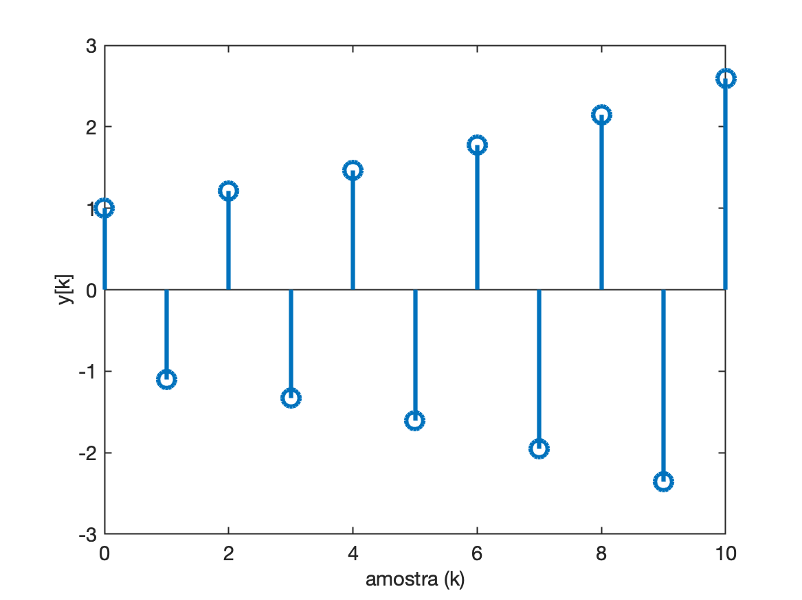
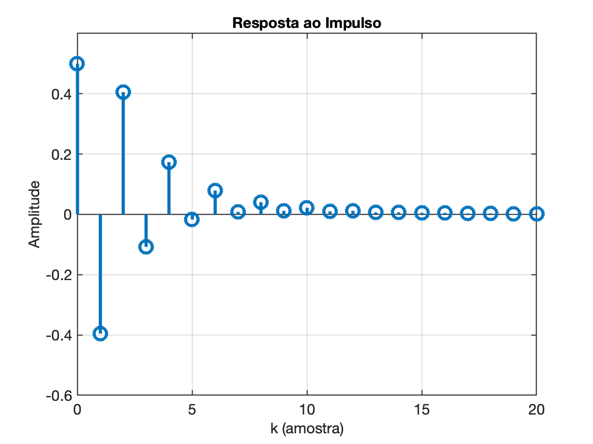
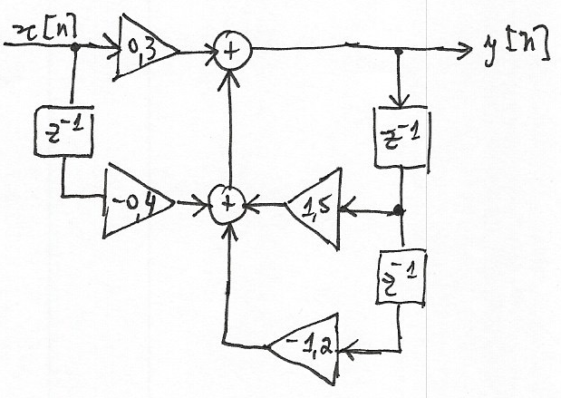
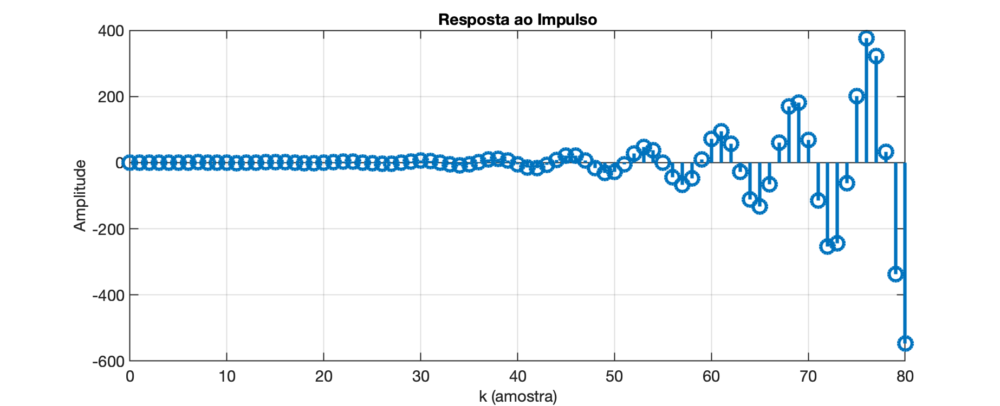
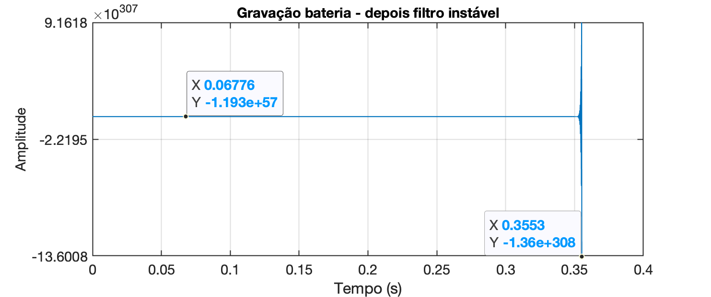

<font size="1">[Livraria Selexz Dominicanen, Holanda: a mais bela livraria do mundo](https://www.jornalopcao.com.br/colunas-e-blogs/imprensa/selexyz-dominicanen-ex-igreja-e-a-mais-bela-livraria-do-mundo-377069/)</font> 

# Estabilidade de Sistemas (Discretos)

<!-- Iniciando da pág. 20 de 5-TheZ-transform-Apracticaloverview.pdf -->

Nesta seção, começaremos com uma regra simples para determinar a estabilidade do sistema. Em seguida, estudaremos uma breve descrição da estabilidade e por que é importante que os engenheiros estejam cientes dela. 

Aqui esta a **regra geral** (e principal): 

<font size="4"><font color="blue">"Se algum dos pólos do sistema estiver fora do círculo unitário, o sistema será instável."</font></font>

É simples assim!

Outra forma de interpretar esta regra é a seguinte: Se a magnitude da localização (raio) de qualquer pólo do sistema for maior que 1, então o sistema é instável. Lembre-se de que os pólos estão localizados no plano z (diagrama de Argand) e portanto suas localizações são descritas usando números complexos. Todos os números complexos têm uma magnitude e um ângulo de fase associados a eles.

Todos os sistemas amostrados anteriormente eram sistemas estáveis, uma vez que os pólos estavam todos localizados dentro do círculo unitário. 

A seguir está um **exemplo de sistema instável**. Observe que um dos pólos está fora do círculo unitário:

$\begin{array}{rcl}y[n]&=&x[n]+0,17x[n-2]-0,5184x[n-4]-0,7772y[n-1]-0,1483y[n-2]+\\&&-0,1745y[n-3]-0,3139y[n-4]-0,8041y[n-5] \end{array}$

Levantando a função transferênica referente à eq. de diferenças anterior, temos:

$\begin{array}{rcl} Y(z)&=&X(z)+0,17z^{-2}X(z)-0,5184z^{-4}X(z)-0,7772z^{-1}Y(z)-0,1483z^{-2}Y(z)+\\ && -0,1745z^{-3}Y(z)-0,3139z^{-4}Y(z)-0,8041z^{-5}Y(z) \end{array}$

$\begin{array}{l} Y(z)&\left(1 +0,7772z^{-1} +0,1483z^{-2} +0,1745z^{-3} +0,3139z^{-4} +0,8041z^{-5} \right) =\\ &= X(z)\left( 1+0,17z^{-2} -0,5184z^{-4} \right) \end{array}$

$\dfrac{Y(z)}{X(z)}=H(z)=\left( \dfrac{1+0,17z^{-2} -0,5184z^{-4}}{1 +0,7772z^{-1} +0,1483z^{-2} +0,1745z^{-3} +0,3139z^{-4} +0,8041z^{-5}} \right) \cdot \left( \dfrac{z^5}{z^5} \right)$

$H(z)=\dfrac{z^5+0,17z^3-0,5184z}{z^5+0,7772z^4+0,1483z^3+0,1745z^2+0,3139z+0,8041}$

Note que podemos calcular as raízes (pólos e zeros) desta função transferência:

```matlab
>> a = [1 0.7772 0.1483 0.1745 0.3139 0.804];
>> b = [1 0 0.17 0 -0.5184 0];
>> polos=roots(a)
polos =
         -1.1 +          0i
     -0.47499 +     0.8227i
     -0.47499 -     0.8227i
      0.63637 +    0.63639i
      0.63637 -    0.63639i
>> zeros=roots(b)
zeros =
            0 +          0i
         -0.8 +          0i
  -6.9389e-17 +        0.9i
  -6.9389e-17 -        0.9i
          0.8 +          0i
>> pzmap(b,a)
>> % falta acrescentar o cículo unitário como uma referência:
>> angle=0:0.25:2*pi;
>> hold on;
>> plot(cos(angle), sin(angle), 'b--')
>> % enquadrando a região de interesse:
>> axis ([-1.25 1.25 -1.25 1.25])
>> axis equal
```

O diagrama pólo-zero deste sistema rende:


E então percebemos facilmente através do gráfico, que existe um pólo instável em $z=-1,1$.

De fato, a resposta ao impulso deste sistema, rende algo como:


Tudo devido ao pólo em $z=-1,1$ que sozinho rende algo como:

$\mathbb{Z}^{-1}\left\{ \dfrac{1}{z+1,1} \right\}=(-1,1)^k$

```matlab
>> % Simulando a resposta do pólo em z = -1,1
>> k=0:10;
>> y=(-1.1).^k;
>> [k' y']
ans =
            0            1
            1         -1.1
            2         1.21
            3       -1.331
            4       1.4641
            5      -1.6105
            6       1.7716
            7      -1.9487
            8       2.1436
            9      -2.3579
           10       2.5937
>> figure; stem(k,y)
```

Considerando apenas este pólo, sua resposta ao impulso rende:




## Por que sistemas instáveis são problemáticos?

É mais do que provável que você já tenha ouvido o efeito da instabilidade do sistema em um sistema PA de áudio (sistema de endereço público). Quando o “feedback” excessivo da saída do alto-falante é captado pelo microfone, o resultado é um som agudo realmente irritante produzido pelo sistema, que também pode danificar o equipamento de PA. Isso é conhecido como "**Efeito Larsen**".

No contexto de sistemas discretos, a instabilidade do sistema pode ocorrer quando amostras de saída anteriores são “realimentadas” no sistema. Vamos dar uma olhada em três exemplos de sistemas para avaliar a estabilidade do sistema.

**Exemplo\_1**:

O primeiro exemplo abaixo mostra um sistema discreto com realimentação, mas estável. Quando um impulso (a sequência {1, 0, 0,0,0,0, 0 ....}) é aplicado a este sistema, o sistema produz uma sequência de números de saída que vai ficando menor. Este padrão geral de redução persistente das amostras de resultados é indicativo de um sistema estável. Observe que em algum estágio as amostras de saída serão “efetivamente” zero, não haverá necessidade de determinar quaisquer amostras adicionais, pois podem ser consideradas como “efetivamente” zero.

$y[n]=0,5x[n]-0,495x[n-1]+0,245x[n-2]+0,2y[n-1]+0,48y[n-2]$

Este sistem retratado na forma de uma diagrama de fluxo fica:


Simulando a resposta à uma entrada impulso teremos:

```matlab
>> b = [0.5 -0.4950 0.245];
>> a = [1 -0.2 -0.48];		  % atenção aos sinais
>> impulso = [1 zeros(1,20)]; % [1 0 0 0 0 0 0 0 ... ... 0 0]
>> y = filter(b,a, impulso);
>> k = 0:length(y)-1; % vetor das amostras
>> stem(k, y, 'MarkerSize',12,'LineWidth',3)
>> xlabel('k (amostra)')
>> ylabel('Amplitude')
>> axis([0 20 -0.6 0.6])
>> title('Resposta ao Impulso')
```

>  Obs.: sobre a fução `filter()` clicar [[aqui](funcao_filter.html)].

O que deve ter gerado o gráfico:



Note como o sistema vai "amortecendo" o impulso recebido.

Segue outro exemplo de sistema estável. 

**Exemplo\_2**:

Neste caso, a resposta ao impulso aumenta inicialmente e oscila, mas gradualmente diminui. Novamente, observe que o padrão geral de redução persistente das amostras de produção é indicativo de um sistema estável. 

Após 40 amostras, a magnitude da saída será menor que 0,00001 e continuará diminuindo. Para fins práticos, essas amostras de pequena amplitude podem ser assumidas como zero e não são necessárias para compreender o comportamento do sistema.

$y[n]=0,25x[n]+0,2025x[n-2]+1,1314y[n-1]-0,64y[n-2]$

Que pode ser representado no seguinte diagrama de fluxo:


E cuja simulação rende:

```matlab
>> clear all % apaga qq variável existente
>> close all % apaga todas as janelas gráficas
>> b = [0.25 0 0.2025];
>> a = [1 -1.1314 +0.64];	  % atenção aos sinais
>> impulso = [1 zeros(1,30)]; % [1 0 0 0 0 0 0 0 ... ... 0 0]
>> y = filter(b,a, impulso);
>> k = 0:length(y)-1; % vetor das amostras
>> stem(k, y, 'MarkerSize',12,'LineWidth',3)
>> xlabel('k (amostra)')
>> ylabel('Amplitude')
>> axis([0 20 -0.6 0.6])
>> title('Resposta ao Impulso')
```

Deve ter sido gerada a seguinte resposta:


**Exemplo\_3**:

Agora vamos dar uma olhada em um sistema instável. Observe que as amostras de saída estão ficando cada vez maiores. Embora apenas as primeiras 80 amostras sejam exibidas no gráfico abaixo, as amplitudes das amostras continuarão a aumentar se mais amostras forem exibidas. Este padrão de amostras de saída crescentes persistentemente é indicativo de um sistema instável. 

$y[n]=0,3x[n]-0,4x[n-1]+1,5y[n-1]-1,2y[n-2]$

Diagrama de fluxo correspondente:



Resultado da resposta ao impulso:



> Simulação no Matlab:
>
> ```matlab
> >> b = [0.3 -0.4];
> >> a = [1 -1.5 +1.2];
> >> impulso = [1 zeros(1,80)]; % [1 0 0 0 0 0 0 0 ... ... 0 0]
> >> y = filter(b,a, impulso);
> >> k = 0:length(y)-1;
> >> stem(k, y, 'MarkerSize',12,'LineWidth',3)
> >> grid
> >> xlabel('k (amostra)')
> >> ylabel('Amplitude')
> >> title('Resposta ao Impulso')
> ```


A saída de tais sistemas nunca chegará “efetivamente” a zero e continuará a crescer para sempre. O resultado de tais sistemas nunca pode ser determinado na prática e, portanto, são de pouco valor para os engenheiros e geralmente indesejáveis.

**Outro exemplo: sinal de bateria**

Para obter um melhor "feeling" das consequências de sistemas instáveis, pode ser útil examinar um exemplo prático. 

Vamos dar uma olhada na saída de um sistema estável e instável quando a entrada é um sinal de áudio. Usaremos uma gravação de bateria que contém três batidas distintas (baixe [drum_seg.wav](drum_seg.wav)). Deve resultar numa forma de onda conforme mostrado abaixo: 


> No Matlab, faça:
>
> ```matlab
> >> [y,Fs] = audioread('drum_seg.wav');
> >> Fs	% freq. de amostragem usada para o sinal (em Hz)
> Fs =
>     22050
> >> t_fim=(length(y)-1)/Fs	% descobre valor temporal última amostra
> t_fim =
>        2.5952
> >> t=0:1/Fs:t_fim;	% sintetizando vetor tempo para amostra do sinal
> >> figure; plot(t,y)
> >> axis([0 t_fim -0.8 0.8])
> ```
> Para saber mais sobre a função `audioread()`  entre no [Help center do site da MathWorks](https://www.mathworks.com/help/matlab/ref/audioread.html).

Observe que todas as amplitudes do sinal amostrado estão entre -1 e 1, isso é típico de sinais de áudio, com uma amplitude próxima de 1 ou -1 associada a sons "altos".

Quando este sinal de áudio é aplicado ao segundo sistema estável anterior: 

$y[n]=0,25x[n]+0,2025x[n-2]+1,1314y[n-1]-0,64y[n-2]$

a saída produzida é mostrada abaixo: 


Você ainda pode ver as três batidas distintas e, se ouvir o sinal de saída ([drum_seg_output.wav](drum_seg_output.wav)), ouvirá o efeito do sistema aplicado nesta entrada (neste caso, as alto frequências foram atenuadas -- filtro passa-baixas).

Não há diferença significativa nos gráficos, exceto que as amostras na "cauda" após a primeira batida são visivelmente menores na saída; no entanto, você ouvirá claramente a diferença se ouvir a entrada e a saída.

Se você passou o sinal da bateria pelo **sistema instável**, a saída será mostrada abaixo: 



> No Matlab:
>
> ```matlab
> >> b = [0.3 -0.4];
> >> a = [1 -1.5 +1.2];
> >> yf = filter(b,a, y);
> >> figure; plot(t, yf)
> ```

Observe que o eixo de amplitude mostra amplitudes de $\times 10^{308}$! Na verdade, o Matlab não calculou nenhuma amostra de saída após aproximadamente 0,4 segundos de dados e apenas gerou valores NaN (Not A Number), que não são exibidos em um gráfico. Observe que as amostras no início do gráfico não são zero, são apenas muito pequenas comparadas às amostras com amplitude na região de  $10^{308}$.

Se você tentar ouvir o sinal de áudio de saída (do sistema instável), descobrirá que a função `sound()` no Octave/Matlab terá dificuldade em reproduzir o som, pois a amplitude das amostras de saída está fora da faixa operacional do função de som (espera-se que as amplitudes da amostra estejam entre -1 e 1 para a função `sound()`). 

Você poderia tentar corrigir isso dimensionando as amostras de saída para que fiquem entre -1 e 1 (dividindo por $10^{308}$, mas o resultado seria que apenas algumas amostras teriam amplitude significativa, de modo que o áudio produzido seria efetivamente um longo silêncio seguido por um som de 'clique'.

Esperamos que, com este exemplo, você possa perceber que sistemas instáveis são problemáticos e geralmente indesejáveis na maioria dos casos.

Por fim, vale ressaltar que sistemas sem feedback não podem ser instáveis. É a presença de feedback que leva à possibilidade de instabilidade do sistema, portanto qualquer sistema em que todos os coeficientes $a$ sejam zero, exceto $a_0$ (e $a_0$ geralmente é 1), será estável. Tais sistemas são comumente chamados de **sistemas FIR** (Resposta ao Impulso Finito), enquanto aqueles com feedback são comumente chamados de **sistemas IIR** (Resposta ao Impulso Infinito).

---

Próximo tópico: [>> Papel dos pólos e zeros na magnitude da resposta em frequência](papel_polos_zeros.html).

---

Fernando Passold, em 15/04/2024

