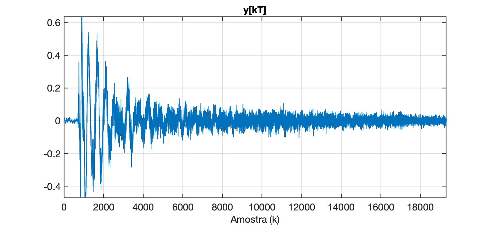
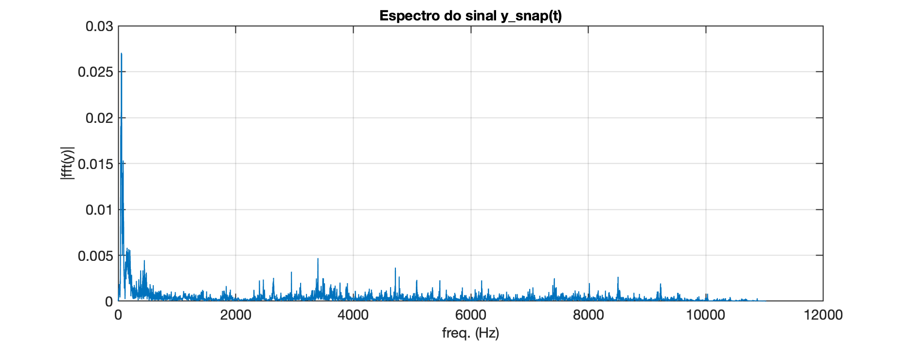
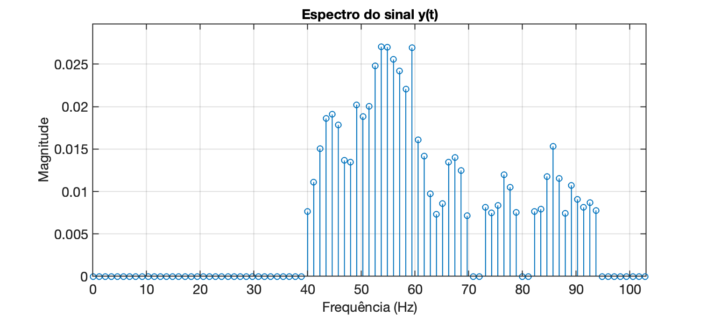
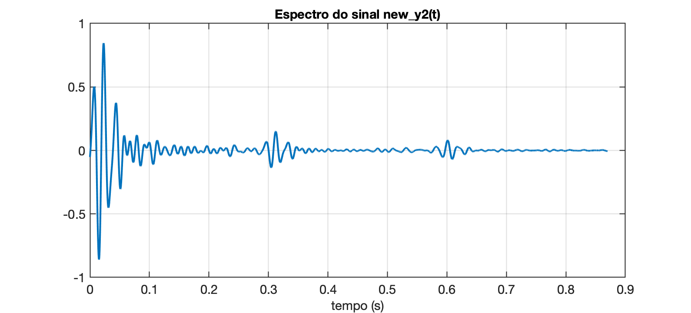

# Exemplo de uso de FFT

**Ex\_1**: Carregar o arquivo [[drum_seg.wav](drum_seg.wav)] e realizar a FFT sobre o mesmo.

<audio controls><source src="drum_seg.wav" type="audio/wav"></audio>

Este arquivo resulta num gráfico no domínio tempo como mostrado à seguir:


**Solução**

```matlab
>> dir *.wav	* verificando se arquivo está presente

bass_note.wav        drum_seg_output.wav  tom_800Hz_1seg.wav   
drum_seg.wav         speech_seg.wav       

>> [y,Fs] = audioread('drum_seg.wav');
>> t_fim=(length(y)-1)/Fs   % descobre valor temporal última amostra
t_fim =
       2.5952
>> f
>> figure; plot(t,y)
>> axis([0 t_fim -0.8 0.8])
>> grid
```

Sem dividir o sinal em 3 partes (como sugere seu aspecto visual), vamos obter:

```matlab
>> Y=fft(y);
>> L=length(Y);						% descobre qtdade amostras
>> P2=abs(Y/L);						% re-escalona magnitudes em função de L
>> P1=P2(1:L/2+1);					% isolando primeira metade do espectro
Warning: Integer operands are required for colon operator when used as index. 
>> L
L =
       57225
>> P1=P2(1:(L-1)/2+1);
>> P1(2:end-1)=2*P1(2:end-1);
>> f=Fs/L*(0:((L-1)/2));			% cria vetor (eixo) das frequências
>> Fs
Fs =
       22050
>> figure;
>> plot(f,P1)
>> title('Espectro do sinal y(t)')
>> xlabel("freq. (Hz)")
>> ylabel('|fft(y)|')
>> grid
>> Fs/2
ans =
       11025
```

E obtemos o seguinte gráfico:


Notamos que dominam mais componentes em baixas frequências.

Podemos tentar isolar os compontes mais relevantes, comparando a maior amplitude obtida no cálculo da FFT e separado amplitudes que alcançam até 25% deste valor:


Na figura anterior, usando o critério dos 25% foram encontrados 132 componentes.

Se o critério for ampliado para mostrar componentes maiores ou iguais à 50% da maior amplitude encontrada, teremos então o seguinte gráfico:


Sob este critério, separamos 31 componentes.

O *script* [separa_componentes.m](separa_componentes.m) que gerou este gráfico, também gerou outros resultados:

```
>> separa_componentes
Entre com limiar para separação em ? 50
Componentes relevantes:
| #  | Freq (Hz) | Amplitude |  %  | Fase (graus) |
|---:|:----------|----------:|:---:|-------------:|
| 1 | 43.16 | 0.01201 | 68.6 | -120.38 |
| 2 | 44.31 | 0.01280 | 73.1 | -165.22 |
| 3 | 45.47 | 0.01283 | 73.3 | 151.60 |
| 4 | 48.94 | 0.01260 | 72.0 | 99.06 |
| 5 | 50.09 | 0.01206 | 68.9 | 70.55 |
| 6 | 51.25 | 0.01330 | 76.0 | 50.43 |
| 7 | 52.02 | 0.01064 | 60.8 | -27.33 |
| 8 | 52.40 | 0.01689 | 96.5 | 20.15 |
| 9 | 53.17 | 0.01200 | 68.6 | -55.45 |
| 10 | 53.56 | 0.01750 | 100.0 | -10.16 |
| 11 | 54.33 | 0.01397 | 79.8 | -89.08 |
| 12 | 54.72 | 0.01693 | 96.7 | -40.12 |
| 13 | 55.49 | 0.01394 | 79.6 | -120.90 |
| 14 | 55.87 | 0.01627 | 93.0 | -70.06 |
| 15 | 56.64 | 0.01340 | 76.6 | -146.13 |
| 16 | 57.03 | 0.01487 | 84.9 | -97.58 |
| 17 | 57.80 | 0.01249 | 71.3 | -171.29 |
| 18 | 58.18 | 0.01263 | 72.2 | -117.26 |
| 19 | 58.95 | 0.01580 | 90.3 | 166.25 |
| 20 | 59.34 | 0.01505 | 86.0 | -151.30 |
| 21 | 60.11 | 0.01247 | 71.2 | 116.32 |
| 22 | 61.27 | 0.00917 | 52.4 | 105.09 |
| 23 | 67.05 | 0.00897 | 51.3 | 47.07 |
| 24 | 68.20 | 0.00891 | 50.9 | 11.05 |
| 25 | 85.16 | 0.00893 | 51.0 | 118.36 |
| 26 | 86.31 | 0.00895 | 51.1 | 70.61 |
| 27 | 204.61 | 0.00983 | 56.1 | -126.40 |
| 28 | 213.47 | 0.00886 | 50.6 | -65.95 |
| 29 | 213.85 | 0.00992 | 56.7 | 152.49 |
| 30 | 214.24 | 0.00880 | 50.2 | 22.64 |
| 31 | 215.01 | 0.00965 | 55.1 | 108.83 |
Encontrados 31 componentes
```

O código do *script* [[separa_componentes.m](separa_componentes.m)] segue abaixo:

```matlab
% Isola os compontes mais relevantes de uma FFT (amgnitude), comparando
% a maior amplitude obtida e separado amplitudes que alcançam até certo 
% percentual deste valor
% Fernando Passold, 04/05/2024

u = length(P1);
maximo=max(P1);
limiar=2;           % threshould em porcentagem
fprintf('Entre com limiar para separação em % (%.2f): ', limiar);
reply=input('? ');
if ~(isempty(reply))
    limiar=reply;
end 

threshould=maximo*(limiar/100);
P1_aux=zeros(u,1);  % inicializa outro vetor que conterá copia dos valores selecionados

% se não existe vetor das fases, cria:
if ~(exist('Y_phase','var'))
    Y_phase = angle(Y);  % calcula o ângulo (defasagem) em cada freq. mas em radianos
    Y_phase_deg = Y_phase.*(180/pi); % transforma de rad para graus
end

fprintf('Componentes relevantes:\n');
fprintf('| #  | Freq (Hz) | Amplitude |  %%  | Fase (graus) |\n');
fprintf('|---:|:----------|----------:|:---:|-------------:|\n');
maior_freq=f(1);
cont=0;
for i=1:u
    if (P1(i)>=threshould)
        cont=cont+1;
        per=(P1(i)*100)/maximo;
        P1_aux(i)=P1(i);
        fprintf('| %u | %.2f | %.5f | %.1f | %.2f |\n', cont, f(i), P1(i), per, Y_phase_deg(i)); 
        maior_freq=f(i);
    end
end
fprintf('Encontrados %u componentes\n', cont)

figure;
stem(f,P1_aux)
title('Espectro do sinal y(t)')
xlabel('Frequência (Hz)')
ylabel('Magnitude')
axis([0 maior_freq 0 maximo*1.1])
```

---

**Concentrando a FFT** na primeira parte do sinal da bateria...

Destacando o primeiro intervalo:

```matlab
>> plot(y);
>> ylim
ans =
     -0.47114       0.6344
>> axis([0 19300 ylim])		% o valor 19300 foi descoberto realizando alguns zoom's
>> sound(y(1:19300),Fs)		% tornando audível este segmento 
```

<audio controls><source src="y_snap.wav" type="audio/wav"></audio>

Temos o gráfico:



Separando esta parte do vetor `y` em outra variável e realizando a FFT:

```matlab
>> y_snap=y(1:19300);
>> t_fim=(length(y_snap)-1)/Fs   % descobre valor temporal última amostra deste segmento
t_fim =
      0.87524
>> clear t; 
>> t=0:1/Fs:t_fim;  % recriando vetor tempo
>> Y=fft(y_snap);	% calcula a FFT
>> L=length(Y)						% descobre qtdade amostras
L =
       19300
>> P2=abs(Y/L);						% re-escalona magnitudes em função de L
>> P1=P2(1:L/2+1);					% isolando primeira metade do espectro
>> P1=P2(1:L/2+1);
>> P1(2:end-1)=2*P1(2:end-1);
>> f=Fs/L*(0:length(P1)-1);			% re-cria vetor (eixo) das frequências
>> plot(f,P1)
>> title('Espectro do sinal y\_{snap}(t)')
>> xlabel("freq. (Hz)")
>> ylabel('|fft(y)|')
>> grid
```

O que resulta o espectro de magnitude:



Semelhante ao gráfico da primeira FFT realizada.

Executando o *script* separa_componentes com critério de 25%, obtemos:

```
>> separa_componentes
Entre com limiar para separação em ? 25
Componentes relevantes:
| #  | Freq (Hz) | Amplitude |  %  | Fase (graus) |
|---:|:----------|----------:|:---:|-------------:|
| 1 | 39.99 | 0.00763 | 28.2 | -101.34 |
| 2 | 41.13 | 0.01111 | 41.1 | -51.89 |
| 3 | 42.27 | 0.01505 | 55.6 | -174.98 |
| 4 | 43.41 | 0.01859 | 68.7 | -116.18 |
| 5 | 44.56 | 0.01908 | 70.5 | -54.55 |
| 6 | 45.70 | 0.01784 | 65.9 | -179.89 |
| 7 | 46.84 | 0.01365 | 50.5 | -113.52 |
| 8 | 47.98 | 0.01348 | 49.8 | -69.71 |
| 9 | 49.13 | 0.02022 | 74.7 | 151.66 |
| 10 | 50.27 | 0.01880 | 69.5 | -148.88 |
| 11 | 51.41 | 0.02004 | 74.1 | -108.47 |
| 12 | 52.55 | 0.02481 | 91.7 | 113.91 |
| 13 | 53.70 | 0.02705 | 100.0 | 173.70 |
| 14 | 54.84 | 0.02701 | 99.8 | -144.76 |
| 15 | 55.98 | 0.02555 | 94.4 | 81.69 |
| 16 | 57.12 | 0.02418 | 89.4 | 143.13 |
| 17 | 58.27 | 0.02207 | 81.6 | -171.41 |
| 18 | 59.41 | 0.02694 | 99.6 | 59.62 |
| 19 | 60.55 | 0.01608 | 59.4 | 124.89 |
| 20 | 61.69 | 0.01415 | 52.3 | 169.15 |
| 21 | 62.84 | 0.00972 | 35.9 | 44.19 |
| 22 | 63.98 | 0.00731 | 27.0 | 103.64 |
| 23 | 65.12 | 0.00857 | 31.7 | 146.15 |
| 24 | 66.26 | 0.01343 | 49.6 | 17.49 |
| 25 | 67.41 | 0.01400 | 51.8 | 75.85 |
| 26 | 68.55 | 0.01248 | 46.1 | 121.27 |
| 27 | 69.69 | 0.00713 | 26.4 | -2.43 |
| 28 | 73.12 | 0.00813 | 30.1 | -21.44 |
| 29 | 74.26 | 0.00746 | 27.6 | 36.31 |
| 30 | 75.40 | 0.00837 | 30.9 | 100.22 |
| 31 | 76.55 | 0.01198 | 44.3 | -22.06 |
| 32 | 77.69 | 0.01050 | 38.8 | 30.41 |
| 33 | 78.83 | 0.00751 | 27.8 | 87.69 |
| 34 | 82.26 | 0.00765 | 28.3 | 52.19 |
| 35 | 83.40 | 0.00791 | 29.2 | -75.85 |
| 36 | 84.54 | 0.01178 | 43.5 | -30.06 |
| 37 | 85.69 | 0.01532 | 56.6 | 16.04 |
| 38 | 86.83 | 0.01155 | 42.7 | -105.81 |
| 39 | 87.97 | 0.00741 | 27.4 | -80.86 |
| 40 | 89.11 | 0.01072 | 39.6 | -7.73 |
| 41 | 90.26 | 0.00908 | 33.6 | -139.17 |
| 42 | 91.40 | 0.00813 | 30.0 | -134.60 |
| 43 | 92.54 | 0.00869 | 32.1 | -92.72 |
| 44 | 93.68 | 0.00778 | 28.7 | 108.90 |
Encontrados 44 componentes
>> 
```

E o novo gráfico do espectro ficou como:



Tentando **recompor o sinal**...

Podemos usar a teoria de **Série de Fourier** para tentar recriar o som da bateria dentro de certo intervalo, digamos de [0, 0.87] segundos, usando o mesmo período de amostragem.

O *script* *separa\_componentes.m* criou o vetor `P1_aux` contendo os componentes relevantes, o vetor `Y_phase` contêm o valor da fase de cada componente o vetor `f` o valor da frequência em Hz.

Agora vamos executar o *script* [recria_componentes.m](recria_componentes.m) para tentar recompor os primeiros 0,87 segundos deste sinal com base nos dados da última FFT levantada:

```matlab
>> recria_componentes
Recriar sinal por quanto tempo (0.8700 seg): ? 0.87
Recriando sinal:
............................................................. 0.32%
............................................................. 0.64%
............................................................. 0.95%
............................................................. 1.27%
............................................................. 1.59%
............................................................. 1.91%

............................................................. 96.35%
............................................................. 96.66%
............................................................. 96.98%
............................................................. 97.30%
............................................................. 97.62%
............................................................. 97.94%
............................................................. 98.25%
............................................................. 98.57%
............................................................. 98.89%
............................................................. 99.21%
............................................................. 99.53%
............................................................. 99.84%
..............................
Escalonando sinal...
>> sound(y2,Fs)
```

<audio controls><source src="y2.wav" type="audio/wav"></audio>

Este *script* também gera o gráfico:


Segue código [[recria_componentes.m](recria_componentes.m)]:

```matlab
% Trabalha com componentes separados pelo script 'separa_componentes.m'
% e com base neles, tenta recriar o sinal sonoro, dentro do intervalo
% especificado pelo usuário
% Fernando Passold, 04/05/2024

duracao=0.87;
fprintf('Recriar sinal por quanto tempo (%.4f seg): ', duracao);
reply=input('? ');
if ~(isempty(reply))
    duracao=reply;
end 

tt=0:1/Fs:duracao; % cria outro vetor tempo
y2=zeros(length(tt),1);     % inicializa vetor y2 = sinal recriado
col=0;
fprintf('Recriando sinal:\n');
maior=0; menor=0;
for i=1:length(tt)
    % t = tt(i) tempo (valor em segundos);
    sum=0;      % soma das amplitudes em cada frequencia
    for j=1:length(P1) % varia o componente por frequencia
        if (P1_aux(j)>0)
            % existe componente válido em certa frequencia
            % freq atual = f(j)
            sum=sum+P1_aux(j)*sin(2*pi*f(j)*tt(i)+Y_phase(j));
        end
    end
    y2(i)=sum;
    col=col+1;
    fprintf('.');
    if (col>60)
        per=(i/length(tt))*100;
        fprintf(' %.2f%%\n', per); 
        col=0;
    end    
    % Descobrindo valor max e min
    if (sum>maior)
        maior=sum;    % detectando maior amplitude para escalonar sinal depois
    end
    if (sum<menor)
        menor=sum;
    end
end

% Escalonando sinal max --> 1,0
fprintf('\nEscalonando sinal...\n')
fator_escala=1/maior;
if (abs(menor)>maior)
    fator_escala=1/menor;
end
y2 = y2.*fator_escala;

figure; plot(tt,y2);
title('Sinal Recriado')
xlabel('Tempo (seg)');

sound(y2,Fs)    % torna audível
```

Infelizmente o vetor `y2` criando não soa semelhante ao sinal original, mas talevz porque faltou acrescentar um termo de "amortecimento" ou "fator decaimento" nas amplitutes geradas para o vetor `y2`.

Analisando o gráfico no domínio tempo do vetor `y_snap`, parece que estamos em presença de uma constante de tempo de aproximadamente $0,8 \times 4=3,2$ segundos. Note o que acontece quando sobrepomos o gráfico do vetor `y_snap` com a curva formada pela expressão: $y_3(t)=e^{-4,2\cdot t}$:

```matlab
>> figure; plot(t,y_snap)
>> hold on;
>> fplot(@(t) exp(-4.2*t), [0 1])
```

Resulta:


Isto significa que podemos rescalonar as amplitudes do vetor `y2` levando em conta vetor $y_3(t)$:

```matlab
>> % verificando dimensões dos vetores
>> size(y2)
ans =
       19184           1
>> size(tt)
ans =
           1       19184
>> size(y_snap)
ans =
       19300           1
>> size(t)
ans =
           1       19300
>> % entamos percebemos os seguintes "pares"
>> % t x y_snap
>> % tt x y2
>> % Criando vetor da exponencial decrescente:
y3=exp(-4.2.*tt);
>> size(y3)
ans =
           1       19184
>> % multiplicando ponto-à-ponto os vetores y2 e y3 num novo vetor
>> new_y2 = y2.*y3';
>> size(new_y2)
ans =
       19184           1
>> figure
>> plot(tt,new_y2)
>> grid
>> sound(new_y2,Fs)
```

<audio controls><source src="new_y2.wav" type="audio/wav"></audio>

E temos o gráfico:



Ele é semelhante ao gráfico do primeiro segmento do sinal da bateria:


A diferença é que o sinal original apresenta mais componentes de alta frequência que desprezamos quando usamos o critério de 25%.

Então a conclusão é que devemos recriar o sinal `new_y2` usando mais componentes frequênciais.

**Problema**: recriar o sinal `new_y2` reduzindo o critério percentual para as amplitudes dos componentes frequenciais à serem considerados no sinal original `y_snap`.

*Obs.:* no Matlab para gerar um arquivo `.wav` basta fazer: `audiowrite('new_y2.wav',new_y2,Fs)`.

---

Fernando Passold, 05/05/2024.

