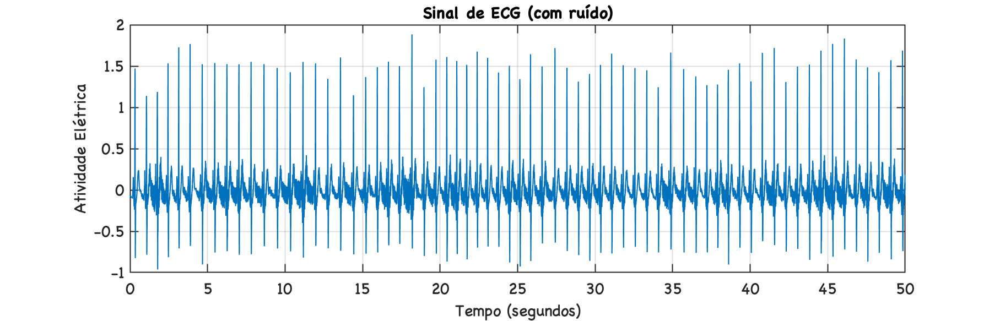
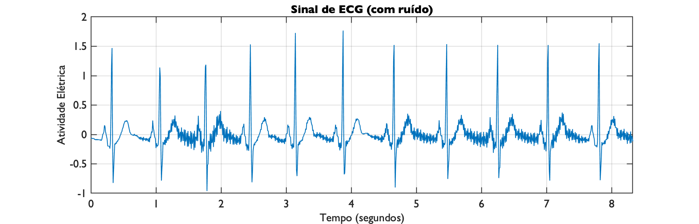
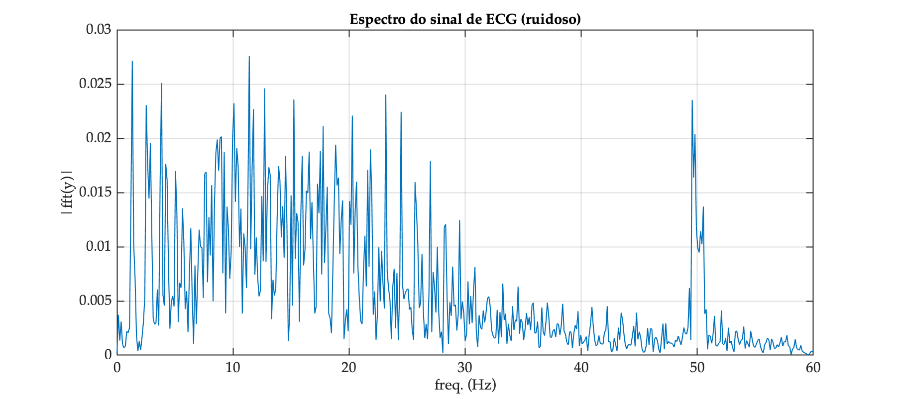
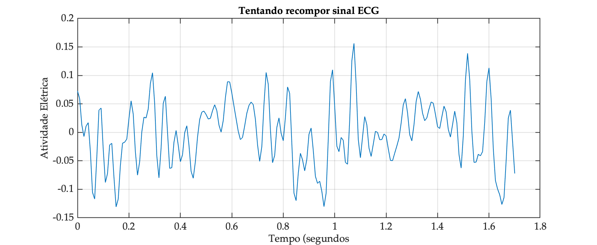
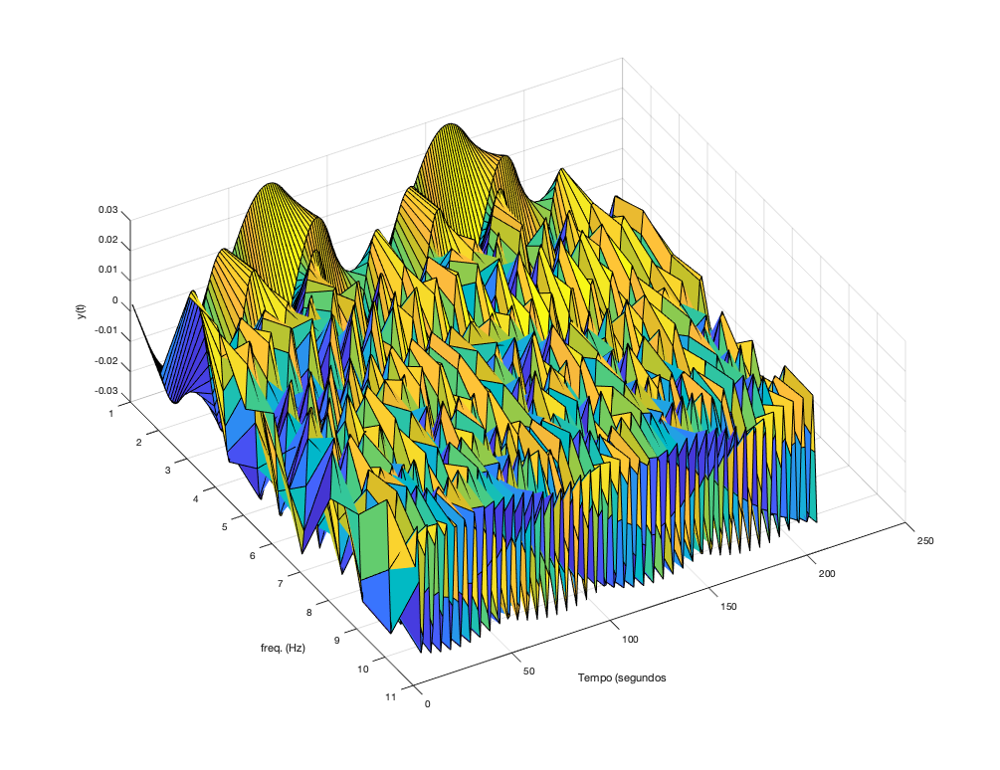

# FFT de ECG

Resposta exercício explorando FFT de sinal de ECG bruto amostrado à 120 Hz, arquivo: [noisy_ecg.txt](noisy_ecg.txt)

```matlab
>> dir *.txt

aula_23042024.txt       noisy_ecg.txt           signalData.txt          
nivel.txt               problema_nivel_rio.txt  

>> load noisy_ecg.txt
>> size (noisy_ecg)
ans =
        6000           1
>> % Arquivo com 6000 mil amostras
>> fs=120;
>> T=1/fs
T =
    0.0083333
>> t_fim=(length(noisy_ecg)-1)*T
t_fim =
       49.992
>> % criando vetor tempo, obbedecendo taxa amostragem do sinal
>> t=0:T:t_fim;
>> size(t)
ans =
           1        6000
>> plot(t,noisy_ecg)
>> xlabel('Tempo (segundos)');
>> title('Sinal de ECG (com ruído)')
>> ylabel('Atividade Elétrica')
>> grid
```

Diagrama temporal do sinal original:



Em oportunidade anterior, foram mostradas as primeiras 1000 amostras, ou seja, nos primeiros 8,325 segundos e resulta:

```matlab
>> xlim([0 (1000-1)*T])
>> (1000-1)*T
ans =
        8.325
>> grid
```



Realizando a FFT sobre estre trecho do sinal de ECG vamos obter:

```matlab
>> y=noisy_ecg(1:1000);	% separando uma parte de todo sinal no vetor y
>> length(y)			% melhor que seja de comprimento par (dividir especttro depois)
ans =
        1000
>> % Isto significa que nossa FFT vai ter 1000 pts, metada é "refletido"
>> L=length(Y)
L =
        1000
>> P2=abs(Y/L);                     % re-escalona magnitudes em função de L
>> P1=P2(1:L/2+1);                  % isolando primeira metade do espectro
>> f=fs/L*(0:(L/2));				% cria vetor (eixo) das frequências
>> size(f)
ans =
     1   501
 >> size(P1)
ans =
   501     1
>> title('Espectro do sinal de ECG (ruidoso)')
>> xlabel("freq. (Hz)")
>> ylabel('|fft(y)|')
>> grid
>> fs/2								% Freq max da FFT (conferindo)
ans =
    60
```

E temos o gráfico:



E percebe-se o ruído presente na frequênica de 50 Hz (pico nesta frequência). Motivo pelo qual se faz necessário aplicar um filtro passa-baixas ou Notch para atenuar este componente -- ver [Filtro Notch sobre sinal de ECG (projeto usando alocação pólo-zero)](projeto_polo_zero.html).

Por curiosidade, os componentes frequenciais mais presentes (limiar de magnitude $\ge$ 65% da magnitude máxima registrada) segue na tabela abaixo:

| #  | Freq (Hz) | Amplitude |  %  | Fase (graus) |
|---:|:----------|----------:|:---:|-------------:|
| 1 | 1.32 | 0.02715 | 98.4 | 175.63 |
| 2 | 2.52 | 0.02307 | 83.5 | -150.45 |
| 3 | 2.88 | 0.01956 | 70.8 | 76.18 |
| 4 | 3.84 | 0.02509 | 90.9 | 68.73 |
| 5 | 8.52 | 0.01867 | 67.6 | 77.54 |
| 6 | 8.64 | 0.01988 | 72.0 | -60.39 |
| 7 | 8.88 | 0.02002 | 72.5 | -158.07 |
| 8 | 9.00 | 0.02016 | 73.0 | -14.22 |
| 9 | 9.24 | 0.01876 | 68.0 | 56.52 |
| 10 | 9.96 | 0.01996 | 72.3 | -128.88 |
| 11 | 10.08 | 0.02323 | 84.2 | 87.36 |
| 12 | 10.32 | 0.01908 | 69.1 | -90.13 |
| 13 | 11.40 | 0.02761 | 100.0 | 10.28 |
| 14 | 11.76 | 0.02270 | 82.2 | 145.32 |
| 15 | 12.72 | 0.02461 | 89.1 | -81.56 |
| 16 | 14.52 | 0.01839 | 66.6 | -169.36 |
| 17 | 15.24 | 0.02358 | 85.4 | 8.50 |
| 18 | 15.96 | 0.01839 | 66.6 | -18.03 |
| 19 | 16.56 | 0.01877 | 68.0 | -91.51 |
| 20 | 17.52 | 0.01885 | 68.3 | 92.98 |
| 21 | 17.76 | 0.02112 | 76.5 | 104.09 |
| 22 | 18.84 | 0.01941 | 70.3 | -7.90 |
| 23 | 20.28 | 0.02209 | 80.0 | 160.04 |
| 24 | 21.84 | 0.01897 | 68.7 | -165.95 |
| 25 | 23.16 | 0.02404 | 87.1 | 114.10 |
| 26 | 24.48 | 0.02245 | 81.3 | 23.52 |
| 27 | 49.56 | 0.02354 | 85.3 | 16.01 |
| 28 | 49.80 | 0.02039 | 73.8 | -126.86 |

Um sinal típico possui fortes componentes nas frequências de: $f=\{         1.32;
         2.52;
         3.84;
        10.08;
         11.4;
        11.76;
        12.72;
        15.24;
        20.28;
        23.16;
        24.48\}$ Hz (limiar de 80%).

Se estes componenentes fossem usados para tentar recompor o sinal, no intervalo entre: $0 < t < 1,7$ segundos:

```matlab
>> size(tt)
ans =
     1   205
>> u=length(tt)
u =
   205
>> length(ff)
ans =
    12
>> ff(12)
ans =
        49.56
>> y2=ones(length(tt),length(ff)-1);	% linhas x colunas == tempo x y(t)|freq
>> y2(:,1)=g(1)*sin(phase(1)+2*pi*ff(1)*tt(1,:));
>> for u=1:length(ff)-1, y2(:,u)=g(u)*sin(phase(u)+2*pi*ff(u)*tt(1,:)); end
>> y3=zeros(length(tt),1);
>> for u=1:length(ff)-1, y3(:,1)=y3(:,1)+y2(:,u); end
>> figure; plot(tt,y3)
>> xlabel("Tempo (segundos")
>> ylabel('Atividade Elétrica')
>> title('Tentando recompor sinal ECG')
>> grid
>> figure; surf(y2)
>> xlabel("freq. (Hz)")
>> ylabel("Tempo (segundos")
>> zlabel('y(t)')
```

O que rende:



Ou isolando o gráfico de $y(t)$ associado com cada uma das 11 frequêncisa usadas para tentar recompor o sinal:



Nota-se que apenas 12 componentes frequenciais não foram suficientes para recompor o sinal.

Obviamente este sinal, para ser recomposto, necessitaria trabalhar com mais componentes frequenciais.

---

<font size="2">🌊 [Fernando Passold](https://fpassold.github.io/)[ 📬 ](mailto:fpassold@gmail.com), <script language="JavaScript"><!-- Hide JavaScript...
var LastUpdated = document.lastModified;
document.writeln ("página criada em 17/06/2024; atualizada em " + LastUpdated); // End Hiding -->
</script></font>


