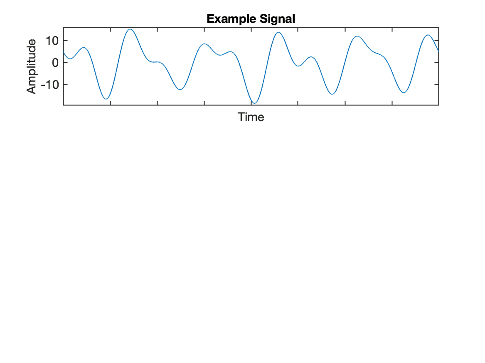
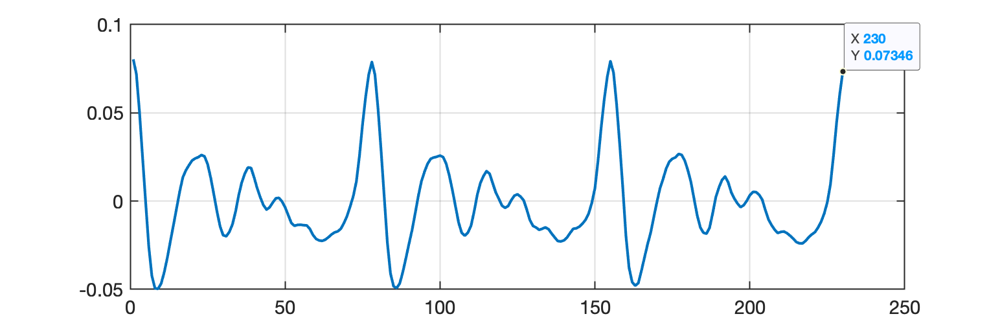
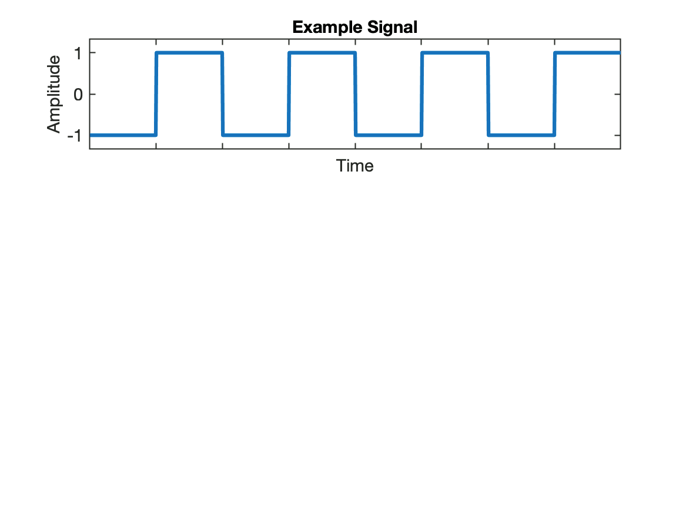

# Matlab Fourier Demo

Ref.: David Dorran, [Matlab Fourier Demo](https://dadorran.wordpress.com/2014/03/27/matlab-fourier-demo/), March 27, 2014 (acessado em 22/04/2024).

Segue teste da função "[fourier_demonstration.m](fourier_demonstration.m).":

```matlab
>> cd('/Users/fernandopassold/Documents/GitHub/fpassold.github.io/Process_Sinais')
>> pwd
ans =
    '/Users/fernandopassold/Documents/GitHub/fpassold.github.io/Process_Sinais'
>> what

MATLAB Code files in the current folder /Users/fernandopassold/Documents/GitHub/fpassold.github.io/Process_Sinais

create_filter_spec_plot         linear_phase_filters            
fourier_demonstration           superficie                      
grafico_superficie_media_movel  
linear_phase_filter             

MAT-files in the current folder /Users/fernandopassold/Documents/GitHub/fpassold.github.io/Process_Sinais

modelo_termico     usando_fft_matlab  

SLX-files in the current folder /Users/fernandopassold/Documents/GitHub/fpassold.github.io/Process_Sinais

amplificador                  filtro_media_movel_4          
exemplo_filtro_media_movel_2  modelo_termico                
filtro_media_movel_2          modelo_termico_empty          

>> dir *.wav

bass_note.wav        drum_seg.wav         drum_seg_output.wav  

>>
```

Resultado para: ``>> fourier_demonstration(1)``: sinal bem definido...



Saída para: ``>> fourier_demonstration(2)``: segmento de voz humana...



```matlab
>> fourier_demonstration(2)
Error using horzcat
Dimensions of arrays being concatenated are not consistent.
Error in fourier_demonstration (line 72)
ylim_max = max([ sorted_mags(1)/N*2 sig])*1.05; 

>> help horzcat
 horzcat Horizontal concatenation.
    [A B] is the horizontal concatenation of matrices A and B.  A and B
    must have the same number of rows.  [A,B] is the same thing.  Any
    number of matrices can be concatenated within one pair of brackets.
    Horizontal and vertical concatenation can be combined together as in
    [1 2;3 4].  
```

Obs.: como é uma função, não restam variáveis para depurar (todas são "voláteis").

Saída para: ``>> fourier_demonstration(3)``: onda quadrada...



Saída para: ``>> fourier_demonstration(3)``: um impulso...


---

Código: [fourier_demonstration.m](fourier_demonstration.m).

```Matlab
% illustration of Fourier Theory using plots
%
% usage : fourier_demonstration(1) % a well defined signal
%          fourier_demonstration(2)  % a segment of speech signal 
%  (download from https://www.dropbox.com/s/bw4dpf93xxz1lyb/speech_seg.wav)
%          fourier_demonstration(3)  % a SQUARE WAVE
%          fourier_demonstration(4)  % an impulse
function fourier_demonstration(num)
if(num==1)
    %sum of sinusoids as input
    t = 0:1/16000:1-1/16000;
    s1 = cos(2*pi*1*t);%cosw(16000,1, 16000, 0);
    s2 = cos(2*pi*5*t)*5;%cosw(16000,5, 16000, 0)*5;
    s3 = cos(2*pi*10*t + pi/2+0.56)*3;%cosw(16000,10, 16000, pi/2+0.56)*3;
    s4 = cos(2*pi*8*t+pi)*3;%cosw(16000,8, 16000, pi)*3;
    s5 = cos(2*pi*12*t+pi/2.2)*3;%cosw(16000,12, 16000, pi/2.2)*3;
    s6 = cos(2*pi*3*t+pi/2+0.4);%cosw(16000,3, 16000, pi/2+0.4)*3;
    sig = s1+s2+s3+s2+s3+s4;
elseif(num==2)
     sig = wavread('speech_seg.wav')';   
elseif(num==3)    
    sig = [zeros(1,100) ones(1,100) zeros(1,100) ones(1,100) zeros(1,100) ones(1,100) zeros(1,100) ones(1,100) ];
     sig = (sig-0.5)*2; 
else
    sig = [zeros(1, 200) 1 zeros(1,200)];  
end
sig = sig - mean(sig);
 
N = length(sig);
ft = fft(sig);
ft(round(length(ft)/2)-2:end) = [];
mags = abs(ft);
phases = angle(ft);
dc_mag = mags(1);
mags(1) = [];
phases(1) = [];
 
[sorted_mags sorted_indices] = sort(mags,2);
% sort in decending order
sorted_mags = fliplr(sorted_mags);
sorted_indices = fliplr(sorted_indices);
sorted_phases = phases(sorted_indices);
 
synth_op = zeros(1, N);
sig = sig -dc_mag;
n = [0:N-1]; % sample numbers
 
ylim_max = max([ sorted_mags(1)/N*2 sig])*1.05;
ylim_min = min([ -sorted_mags(1)/N*2 sig])*1.05;
ylims = [ylim_min ylim_max ];
    subplot(3,1,1)
    plot(sig)
    set(gca,'Xticklabel','', 'YLim', ylims)
    set(gca,'Xticklabel','')
    ylabel('Amplitude')
    xlabel('Time')
    title('Example Signal');
pause
colors = 'rgkbm';
significant_freqs = find(sorted_mags > max(sorted_mags/100));
freq_vals_to_display = max(sorted_indices(1:length(significant_freqs))) +1 ;
length(mags)
for k  = 1: length(mags)
    omega = 2*pi*(sorted_indices(k))/N;
    sinusoid = cos(n*omega+sorted_phases(k))*sorted_mags(k)/N*2 ;
    if(sorted_mags(k) < 10^-6)
        break
    end
    synth_op = synth_op + sinusoid;
    subplot(3,1,1)
    plot(sig)
    set(gca,'Xticklabel','', 'YLim', ylims)
    hold on 
    plot(synth_op,'r')
    set(gca,'Xticklabel','')
    ylabel('Amplitude')
    xlabel('Time')
    if k ==1
        title('Example signal and sinusoid shown in lower plot');
    else
        title(['Example signal and ' num2str(k) ' sinusoids shown in middle plot added together.']);
    end
    hold off
    subplot(3,1,2)
    hold on
    plot(sinusoid,colors(rem(k,5)+1))
    set(gca,'Xticklabel','')
    %set(gca, 'Ylim', [-max(mags)/N*2 max(mags)/N*2]) 
    set(gca, 'Ylim', ylims) 
    ylabel('Amplitude')
    xlabel('Time')
    subplot(3,1,3);
    ft_mag_vals = ones(1, freq_vals_to_display)*NaN;
    sorted_indices(k) 
    if( sorted_indices(k) < freq_vals_to_display)
        ft_mag_vals(sorted_indices(k)) = sorted_mags(k)/N*2;
    end
    hold on
     
    %stem([0:freq_vals_to_display],[NaN ft_mag_vals],'^')
    hold off
    ylabel('Magnitude')
    xlabel('Normalised Frequency (1/(periods displayed))')    
    pause
    %plot(sinusoid,colors(rem(k,6)+1))
end
close all
```

 Fim.

---

Fernando Passold, em 22/04/2024

