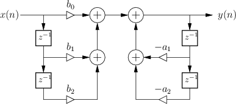

# A função `filter()` do Matlab

A função `filter()` do Matlab pode ser útil para determinar a saída de um filtro discreto/digital.

Ela é normalmente usada da seguinte maneira:

```matlab
>> Y = filter(B, A, X);
```

onde $X=$ vetor das amostras (sinal) de entrada do filtro;
$Y=$ vetor das amostras (sinal) de saída do filtro;
os parâmetros $A$ e $B$ são os coeficientes do filtro e estão associados com a implementação da equação de diferenças associada com a forma "Direta II Transposta":

$\begin{array}{rcll}
a(1)*y(n) &=& b(1)*x(n) &+& b(2)*x(n-1) + ... + b(nb+1)*x(n-nb) +\\
          & &           &-& a(2)*y(n-1) - ... - a(na+1)*y(n-na) \end{array}$		(eq. (1))

o que dá no mesmo que:

$\begin{array}{rcll}
a_1\,y[n] &=& b_1\,x[n] &+& b_2\,x[n-1] + \ldots + b_{n_b+1}\,x[n-n_b] +\\
          & &           &-& a_2\,y[n-1] - \ldots - a_{n_a+1}\,y[n-n_a] \end{array}$		(eq. (2))

Note que no Matlab, os índices dos vetores/matrizes iniciam em zero.

Se $a_1=1$, então, podemos generalizar a eq. (2) para:

$y[n]=\displaystyle\sum_{i=0}^{b_n} b_i \cdot x[n-i] + \displaystyle\sum_{j=1}^{n_a} a_j \cdot y[n-j]$			(eq. (3))

Podemos realizar a transformada Z sobre a eq. (2) e obter:

$\begin{array}{rcll}
a_1\,Y(z) &=& b_1\,X(z) &+& b_2\,z^{-1}X(z) + b_3\,z^{-2}X(z) + \ldots + b_{n_b+1}\,z^{-n_b}X(z) +\\
          & &           &-& a_2\,z^{-1}Y(z) - a_3\,z^{-2}Y(z) - \ldots - a_{n_a+1}\,z^{-n_a}Y(z) \end{array}$		(eq. (4))

Percebe-se que este filtro trabalha com até $n_b$ amostras atrasadas do sinal de entrada $X(z)$ e $n_a$ amostras atrasadas do sinal filtrado $Y(z)$.

Trabalhando um pouco mais com a eq. (3), podemos rescreve-la na forma:

$\begin{array}{l}
Y(z) \left( a_1 + a_2 z^{-1} + a_3 z^{-2} + \ldots + a_{n_a+1} z^{-n_a} \right)= \\ \qquad = X(z) \left( b_1 + b_2\,z^{-1} + b_3\,z^{-2} + \ldots + b_{n_b+1}\,z^{-n_b} \right) \end{array}$

$H(z)=\dfrac{Y(z)}{X(z)}=\dfrac{b_1\,z^{0} + b_2\,z^{-1} + b_3\,z^{-2} + \ldots + b_{n_b+1}\,z^{-n_b}}{a_1\,z^{0} + a_2 z^{-1} + a_3 z^{-2} + \ldots + a_{n_a+1} z^{-n_a}}$		(eq. (4))

$H(z)=\dfrac{Y(z)}{X(z)}=\dfrac{b_1\,z^{n_b} + b_2\,z^{n_b-1} + b_3\,z^{n_b-2} + \ldots + b_{n_b+1}\,z^{0}}{a_1\,z^{n_a} + a_2 z^{n_a-1} + a_3 z^{n_a-2} + \ldots + a_{n_a+1} z^{0}}$		(eq. (5))

Note que as equações (4) e (5) representam a função transferência de um filtro digital, no plano-z.

Note ainda que no Matlab, os valores dos coeficientes $b_i$ e $a_i$ do filtro, correspondem à polinômios e seus valores são ingressados simplesmente fazendo algo como:

```mathematica
>> H = tf(B, A, T);
```

onde $T$ corresponde ao período de amostragem adorado para realização do filtro. Modificar o valor de $T$ sem modificar os valores de $A$ e $B$ vai resultar num filtro com diferente resposta frequêncial (a frequência onde ocorrem ganhos e atenuações varia conforme varia $T$).

$B=[b1 \quad b2 \quad b3 \quad \ldots \quad b_{n_b}]=$ vetor (polinômio) do numerador da função transferência do filtro;
$A=[a1 \quad a2 \quad a3 \quad \ldots \quad a_{n_b}]=$ vetor (polinômio) do denomindador da função transferência do filtro.

Note que $a_1$ e $b_1$ se refere aos termos de mais alta ordem dos filtros (na notação positiva para expoentes em $z$).

Ou, de outro ponto de vista, note que $a_{n_a}=$ corresponde ao ganho (fator aternuação ou ganho) que será aplicado sobre o maior atraso sofrido no sinal de saída do filtro, $y[n]$, ou seja: $a_{n_a+1} \cdot z^{-n_a} \cdot Y(z) = a_{n_a+1} \cdot y[n-n_a]$. E $a_1=$ corresponde então ao ganho/atenuação que será aplicado sobre o sinal atual $y[n]$ (sem atraso).

A eq. (3), para um filtro digital de 2a-ordem pode ser visualizada num diagrama de fluxo de sinais como:



Obs.: Este diagrama está no formato conhecido como **Forma Direta I**.


## Uso da função `filter()`

Determinar a saída de sistemas discretos (implementar um sistema discreto) pode ser uma tarefa tediosa quando você lida com muitas amostras. Felizmente, os computadores podem realizar os cálculos para nós com extrema rapidez e precisão. Tanto o Matlab quanto o Octave são usados com muita frequência para esse propósito e possuem comandos/funções integrados que o tornam um processo muito simples; no entanto, essas funções exigem que os sistemas discretos sejam descritos em termos de coeficientes $b$ e $a$.

Depois de desenvolver uma compreensão dos coeficientes $b$ e $a$, você será capaz de implementar e analisar rapidamente sistemas discretos usando funções Matlab/Octave integradas.

Talvez a maneira mais rápida de entender como determinar os coeficientes $b$ e $a$ de um sistema seja examinar alguns exemplos. A tabela abaixo mostra cinco sistemas discretos em sua forma de equação de diferenças na coluna da esquerda e seus correspondentes coeficientes $b$ e $a$ no lado direito da tabela.

| Ex. | Eq. de diferença | Coeficientes $a$ e $b$ |
| :--- | :--- | :--- |
| Ex1 | $y[n]=3x[n]+2x[n-1]$ | $a=[ 1 ]$<br />$b=[ 3 \quad 2 ]$ |
| Ex2 | $y[n] = 0,5x[n]-x[n-1]+2x[n-2]$ | $a=[ 1 ]$<br />$b=[0.5 \quad -1 \quad 2]$ |
| Ex3 | $y[n]=-x[n]+x[n-3]$ | $a=[ 1 ]$<br />$b=[ -1 \quad 0 \quad 0 \quad 1 ]$ |
| Ex4 | $y[n]=2x[n]+0,3y[n-1]$ | $a=[ 1 \quad -0,3]$<br />$b=[ 2 ]$ |
| Ex5 | $y[n]=0,1x[n]+x[n-2]-0,2y[n-2]$ | $a=[ 1 \quad 0 \quad 0,2]$<br />$b=[ 0,1 \quad 0 \quad 1 ]$ |

Os mapeamentos dos vetores de coeficientes $b$ e $a$ para os coeficientes da equação de diferenças para cada um dos exemplos mostrados na tabela acima são ilustrados nos parágrafos abaixo. Ao se referir a cada uma das ilustrações, você deve observar que os coeficientes $a$ estão todos associados aos termos $y$ na equação de diferenças e os coeficientes $b$ estão todos associados aos termos $x$.

Observe também que o primeiro elemento do vetor de coeficientes está associado a $y[n]$; o segundo elemento (se houver) está associado a $y[n-1]$; o terceiro elemento (se houver) está associado a $y[n-2]$; etc.

Da mesma forma, o primeiro elemento do vetor de coeficiente $b$ está associado a $x[n]$; o segundo elemento (se houver) está associado a $x[n-1]$; o terceiro elemento (se houver) está associado a $x[n-2]$; etc.


### Implementando exemplos

Depois de ter os coeficientes $b$ e $a$ de um sistema, a implementação é uma tarefa trivial usando funções Matlab/Octave integradas. Esta seção aborda os exemplos mostrados antes (amplificador, média móvel e modelo de sistema) que você mesmo deve experimentar. Se você não possui Matlab ou Octave instalado em seu computador, você pode usar uma versão online http://octave-online.net.


**Exemplo\_1**: Amplificador
Um sistema amplificador que amplifica por um fator de 2 é descrito pela seguinte equação de diferenças:

$y[n] = 2\,x[n]$

Os coeficientes $b$ e $a$ têm apenas um valor cada, ou seja, $a = [1]$ e $b = [2]$.

Use o código abaixo para determinar a saída deste sistema após aplicar uma entrada $x[n]$ que é dado por: $x[n]=[2 \quad 1,1  \quad  3,2  \quad 0,31  \quad 0]$

```matlab
>> x = [2 1.1 3.2 0.31 0]; 
>> b = 2;
>> a = 1;
>> y = filter(b, a, x)
```


**Exemplo\_2**: filtro de média móvel de 4 pontos
Seja um filtro de média móvel de 4 amostras, cuja equação de diferenças é dada abaixo:

$y[n]=0,25x[n]+0,25x[n-1]+0,25x[n-2]+0,25x[n-3]$

Os coeficientes $b$ e $a$ seriam: $a=[1]$ e $b=[0,25 \quad 0,25 \quad 0,25 \quad 0,25]$.

Use o código abaixo para determinar e traçar a saída após passar o rio seguinte sinal de nível através do sistema:

$[.375 \quad .35 \quad .425 \quad .475 \quad .4 \quad .375 \quad .525 \quad .425 \quad .475 \quad .425 \quad .5 \quad .45 \quad .575 \quad .525 \quad .6 \quad .675 \quad .575 \quad .7 \quad .725 \quad .6]$

```matlab
>> x = [.375 .35 .425 .475 .4 .375 .525 .425 .475 .425 .5 .45 .575 .525 .6 .675 .575 .7 .725 .6]; b = [0.25 0.25 0.25 0.25];
>> a = 1;
>> y = filter(b, a, x)
>> plot(y)
```


**Exemplo_3**: Modelo térmico
Um modelo da mudança de temperatura de um copo de água colocado em uma geladeira é dado pela equação abaixo:

$y[n]=-0,0099x[n]+0,9901y[n-1]$

 A constante de resfriamento é 0,01 e o modelo opera com dados amostrados a 1 Hz.

O vetor $x[n]$ representa a diferença inicial de temperatura entre a água e a geladeira e $y[n]$ representa a mudança na temperatura da água em relação à temperatura inicial.

Usando o exemplo anterior da temperatura da água sendo inicialmente de 15 °C e depois colocada em uma geladeira a 4 °C, então $x[n]$ estará constantemente à 11 °C.

Use o código a seguir para modelar esta configuração por 1.000 segundos:

```matlab
>> x = ones(1, 1000)*11; %1000 seconds 
>> b = [ -0.0099 ];
>> a = [ 1 -0.9901];
>> y = filter(b, a , x);
>> n=0:1000-1;
>> plot(n,y)
>> xlabel('Tempo (segundos)') 
>> ylabel('\Delta Temp (^oC)')
>> title('Variação da Temperatura') 
>> figure
>> plot(n,y+15)
>> xlabel('Tempo (segundos)')
>> ylabel('Temp (^oC)')
>> title('Temperatura da água')
```

Fim.


----

Fernando Passold, em 28-29/03/2024.

