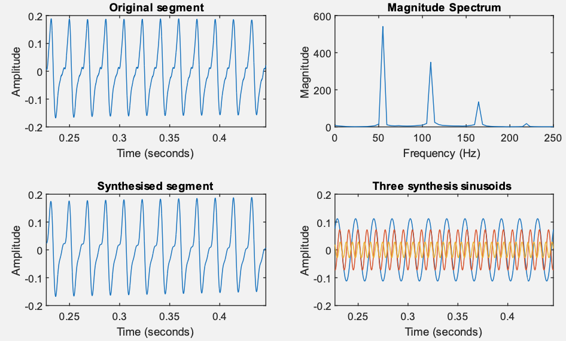
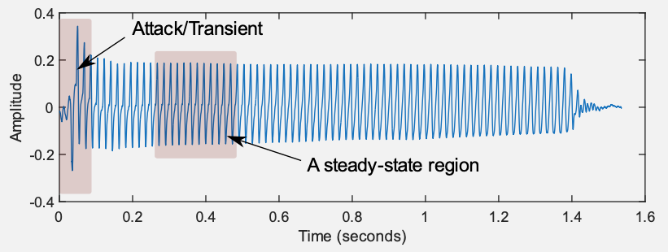

# Trabalho #2: Guitarra

**Objetivo principal**: sintetizar o som de uma guitarra.

<!--Baseado no item "**How to use Octave/Matlab’s fft function**", de 2-Anintroductiontothefrequency-domainandnegativefrequency.pdf, pág. 10/28 -->

Seja o arquivo [bass_note.wav](bass_note.wav): <audio controls><source src="bass_note.wav" type="audio/wav"></audio>.

A idéia é levantar a FFT deste sinal, descobrir seus componentes principais e resitentizar o sinal durante 0,5 segundos.  Como o intervalo é curto, o sinal resintetizado pode ser repetido uma 5 vezes, eventualmente aplicando-se um decaimento (função exponencial) sobre as amplitudes finais geradas.

A príncípio são esperados gráficos do tipo:

*Dica*: Realize a FFT apenas sobre a região do "regime permanente" (*steady-state region*) do sinal:

Fim.

---

🌊 [Fernando Passold](https://fpassold.github.io/)[ 📬 ](mailto:fpassold@gmail.com), 