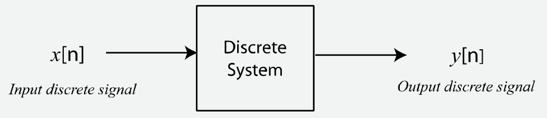

<!--
Ref.: Digital Signal Processing Foundations, David Dorran, Technological University Dublin, david.dorran@tudublin.ie
(PDF: Digital Signal Processing Foundations.pdf), pág. 19 - 23... 
-->

# Intro Sistemas Discretos

Sistemas discretos são usados para manipular ou modificar sinais discretos de maneira significativa. Eles recebem um sinal discreto (sequência de números) como entrada e geram um sinal discreto em sua saída, ver próxima figura.



Uma aplicação comum de sistemas discretos é remover alguma interferência ou componente de “ruído” de um sinal. Por exemplo, sinais de ECG podem ser afetados pela introdução de ruído de equipamentos elétricos nas proximidades dos sensores usados para capturar o sinal. Este tipo de ruído está normalmente presente em frequências de 50 Hz ou 60 Hz, dependendo de onde você mora, e sistemas discretos, conhecidos como filtros, podem ser projetados para remover tais artefatos -- ver próxima figura.


Outra aplicação comum de sistemas discretos é modelar o comportamento de sistemas do mundo real, como uma ponte ou a suspensão de um carro. Usando a suspensão do carro como exemplo, imagine que você queira experimentar um novo design de suspensão para um carro de corrida e gostaria de ver como ele se comporta em pistas de corrida acidentadas. Uma maneira seria construir a suspensão, alugar uma pista para o dia, testar seu projeto, voltar à oficina para fazer os ajustes e repetir este procedimento quantas vezes for necessário. Isso pode ser muito caro se você precisar testar com frequência! Uma alternativa é construir um sistema discreto que modele o design da sua suspensão; em seguida, criar um sinal que modele as forças aplicadas ao carro conforme ele passa por solavancos; e, finalmente, usar o computador para analisar e ajustar o funcionamento do projeto antes de passar o caro pelo processo de fabricação.

Os sistemas discretos são capazes de alcançar resultados surpreendentes e são fundamentais para o processamento digital de sinais. Na próxima seção você aprenderá sobre os três componentes básicos de sistemas discretos: somadores, multiplicadores e atrasos. Você também verá como visualizar sistemas discretos usando diagramas de fluxo de sinal e como eles se relacionam com a descrição matemática de um sistema discreto, ou seja, com as **equações de diferenças**.

Você verá como operam alguns sistemas discretos práticos e também verá seus **diagramas de fluxo de sinal** e suas **equações de diferenças**. Depois de concluir esta seção, será importante que você seja capaz de associar as equações de diferenças com os diagramas de fluxo de sinal para cada caso.

<!-- Também serão mostrados alguns exemplos de código que podem ser usados para implementar cada sistema; se você deseja apenas ter uma ideia do DSP, não é importante que você entenda totalmente esse código, mas se quiser poder aplicar o DSP, você o fará.-->

## Ex.1) Caso do Amplificador

Talvez o sistema discreto mais básico seja um amplificador. A figura abaixo mostra um sinal discreto $x[n]$ sendo amplificado por um fator de 2, com todas as amostras do sinal de entrada sendo multiplicadas por 2. Guiar-se pela próxima figura:


Embora este seja um sistema muito básico, ainda assim é muito útil. Por exemplo, em aplicações de áudio, um tal sistema teria o efeito de aumentar o volume do sinal de áudio.

Sistemas discretos são frequentemente descritos matematicamente e este sistema amplificador pode ser descrito usando a seguinte equação (referida como equação de diferenças):

$y[n]=2\cdot x[n]$

onde $x[n]$ representa a entrada do sistema, $y[n]$ representa a saída e $n$ representa o número da amostra.

Ao resolver esta equação de diferenças para diferentes valores de $n$ você pode determinar a saída do sistema para qualquer sinal discreto de entrada (sequência de números). Por exemplo, vamos descobrir qual será a saída do amplificador se a entrada do sistema for dada pela seguinte sequência:

$x[n]=[10 \quad 20 \quad 5 \quad 50 \quad 60]$

Vamos primeiro resolver para $n = 0$, portanto:

$y[0]=2 \cdot x[0]$

Substituindo $x[0]$ por $10$ obtemos:

$y[0]=2 \cdot 10 = 20$

Se você resolvesse para $n = 1$, descobriria que $y[1]=40$; para $n = 2$ dá $y[2]=10$; $y[3]=100$; etc.

Tenho certeza de que você achará que resolver essas equações é uma tarefa trivial; no entanto, seria extremamente tedioso determinar a saída do sistema manualmente se você estivesse lidando com milhares ou milhões de amostras de entrada. É aqui que os computadores são extremamente úteis, pois podem facilmente multiplicar milhões de números a cada segundo. 

Usando Matlab/Octave:

```matlab
>> x = [10 20 5 50 60];
>> y = 2*x;
>> y
y =
    20    40    10   100   120
>> [x' y']
ans =
    10    20
    20    40
     5    10
    50   100
    60   120
>> 
```

Outra maneira de representar um sistema discreto é usar o que chamamos de **diagrama de fluxo de sinal**. O diagrama de fluxo de sinal é uma representação gráfica de um sistema discreto que ilustra como o sistema se comporta. A figura abaixo mostra o diagrama de fluxo de sinal para o sistema amplificador. O diagrama de fluxo de sinal contém um operador multiplicador que multiplica qualquer entrada por um fator de 2:


<font size="2">
> Obs.: Para transformar um diagrama de blocos do Matlab/Simulink em uma imagem, fazer:
>
> ```matlab
> >> print(‘-samplificador','-dpng','-r150','amplificador.png')
> ```
>
> onde: `-s<nome do arquivo SLX (sem a extensão)>` indica que certo "sistema" (ou diagrama de blocos) deve ser "impresso"; `-dpng` indica que deve ser gerado um arquivo de imagem PNG, `-r150` indica a resolução desejada (150 dpi).

</font>

---

Segue com outros exemplos de sistemas discretos:

* Exemplo 2) [Filtro de Média Móvel](media_movel.html) (problema do nível do rio); 
* Exemplo 3) [Modelagem Sistema Térmico](modelo_termico.html);
* [Usando FFT](usando_fft_matlab.html) (espectro de sinais).

---

Fernando Passold, em 31/03/2024.


