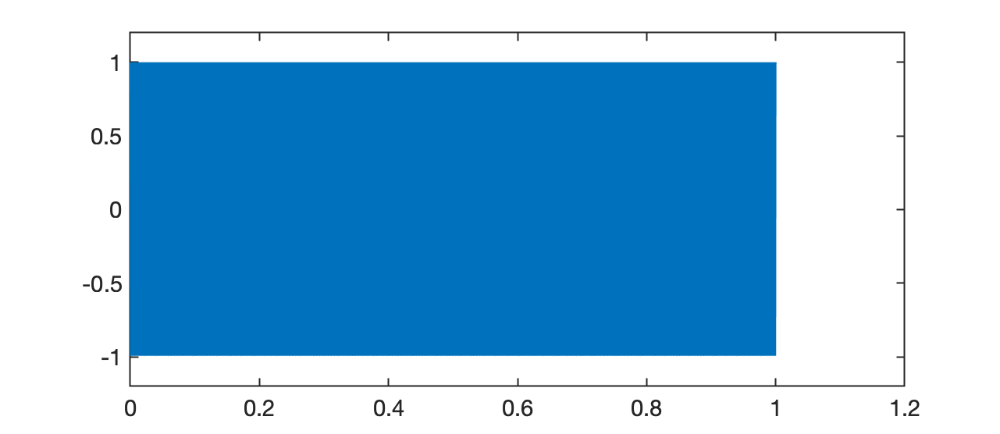

# Intro Respostas Frequenciais de Filtros

<!-- Ref: 2-Anintroductiontothefrequency-domainandnegativefrequency.pdf, pág. inicial-->

Quando alguém toca violão, sons diferentes são criados porque as cordas do violão vibram ou oscilam em frequências diferentes. Um efeito semelhante pode ser ouvido se você esticar um elástico entre os dedos e puxá-lo, e você notará que alterar o comprimento ou a tensão da corda alteraria a frequência do som, pois isso faz com que a corda vibre em um taxa ou frequência diferente.

Quando algo está oscilando, um **padrão repetitivo é produzido ao longo do tempo**. Isso pode ser visto com uma tira elástica vibratória à medida que se move para frente e para trás em sua posição inicial.

A natureza repetitiva associada ao movimento de uma corda de violão também pode ser vista em um gráfico do sinal de áudio que ela produz, conforme mostrado abaixo, onde a amplitude de um sinal de áudio de contrabaixo se move para cima e para baixo ao longo do tempo conforme as cordas vibrar. 

Você deve observar que a taxa de oscilação da corda é a mesma que a taxa de oscilação do sinal de áudio, uma vez que são as vibrações das cordas que causam variações de pressão no ar que percebemos como som (a gravação de áudio do sinal do contrabaixo mostrado acima pode ser baixado em [bass_note.wav](bass_note.wav)). A mudança na pressão do ar também pode ser registrada por um microfone e armazenada em um computador como um sinal discreto, ou seja, uma sequência de números que foi obtida medindo a pressão sonora em intervalos regulares de tempo.

A **representação de um sinal no domínio da frequência** é uma maneira conveniente de mostrar a taxa de oscilação associada a um sinal, conforme explicado no parágrafo seguinte.


Na figura anterior, a pressão sonora oscila após o "ataque" inicial ou componente transitório no início do sinal. Este gráfico de variação de pressão ao longo do tempo é conhecido como **gráfico no domínio do tempo** e, olhando atentamente para este gráfico, você pode ver que o tempo para completar um ciclo de oscilação é de cerca de 1,82 milissegundos (aproximadamente 11 ciclos em um segmento de 200 ms).

Em outras palavras, o ciclo se repete cerca de 55 vezes a cada segundo. À direita do gráfico no domínio do tempo está um **gráfico do espectro de magnitude** que é uma **representação no domínio da frequência** que pode ser usado para determinar rapidamente a taxa de oscilações em sinais no domínio do tempo. Os três 'picos' relativamente grandes mostrados no espectro de magnitude representam: o primeiro, a frequência fundamental (55 Hz) e os dois picos seguintes menores, as harmônicos (em 110 Hz e 165 Hz). Você deve notar que pode determinar a taxa de oscilação (55 Hz) com bastante facilidade quando observa o sinal no domínio da frequência; muito mais rápida e facilmente do que analisando o período do sinal no domínio do tempo.

Este tipo de padrão de repetição não acontece apenas com sinais de áudio e pode ser observado em muitos outros sinais, incluindo os do nosso coração. Seu coração baterá em um ritmo ou frequência específico, dependendo do que você estiver fazendo, e sua frequência cardíaca aumentará se você correr ou andar de bicicleta. Engenheiros e cientistas (e músicos e médicos!) estão frequentemente analisando a natureza repetitiva dos sinais e a visualização de um sinal no domínio da frequência mostra a frequência dos padrões repetidos em um gráfico conveniente.


A visão de um sinal no domínio da frequência fornece outra maneira de analisar um sinal que pode fornecer informações valiosas sobre o comportamento de um sinal. 

Podemos relacionar estas diferentes representações com a maneira como um arquiteto tem diferentes desenhos de um edifício, dependendo de com quem ele está lidando: um cliente acharia mais fácil visualizar como seria o edifício examinando uma vista 3D do edifício, enquanto um construtor exigiria planos detalhados para construir o edifício. Ambos os conjuntos de desenhos são representações do mesmo edifício e ambos têm seus usos. O mesmo acontece com as visualizações de sinais no domínio do tempo e no domínio da frequência - ambas representam o mesmo sinal e podem ser muito úteis na análise de sinais.

Você pode assistir ao video de David Dorran: [Fourier Demo - Why Fourier analysis is Useful!](https://www.youtube.com/watch?v=CZcktbDWtas), se quiser se aprofundar mais.

**Gráficos de sinais no domínio da frequência** são muito fáceis de criar usando ferramentas de software como Octave e Matlab e fazem uso de **técnicas de análise de Fourier** para extrair informações de frequência de um sinal no domínio do tempo (mais sobre isso mais tarde!). O princípio básico por trás de todas as técnicas de análise de Fourier é que qualquer sinal pode ser dividido em um conjunto de sinais senoidais e este conceito será explorado mais detalhadamente nas próximas subseções.

## Por que ondas senoidais?

Uma forma de onda senoidal que oscila suavemente ao longo do tempo (veja o gráfico abaixo) e está associada a muitos sinais que ocorrem na natureza. Por exemplo, quando você assobia, você cria variações de pressão no ar que têm uma forma senoidal ou se você permitir que um objeto preso à extremidade de uma mola salte para cima e para baixo, o movimento do objeto também seria senoidal, por exemplo:

<iframe width="640" height="360" src="https://www.youtube.com/embed/T7fRGXc9SBI" title="Harmonic oscillation HD" frameborder="0" allow="accelerometer; autoplay; clipboard-write; encrypted-media; gyroscope; picture-in-picture" allowfullscreen></iframe>

O mais interessante é que as **formas de onda senoidais são um elemento fundamental de qualquer sinal**, por isso vale a pena gastar algum tempo para se acostumar com sua aparência e como podem ser representadas matematicamente. Este fato foi demonstrado matematicamente por um matemático francês chamado **Jean Baptiste Joseph Fourier** (1768-1830).

Existem **três características** das formas de onda senoidais com as quais você precisa se sentir confortável para apreciar plenamente a análise de Fourier: 

* **frequência;**

* **amplitude;**
* **deslocamento de fase**:

<!--pág. 6 de 2-Anintroductiontothefrequency-domainandnegativefrequency.pdf-->


A figura acima mostra um **gráfico no domínio do tempo** de uma forma de onda cossenoidal à esquerda e seu espectro de magnitude correspondente à direita. Na visão no domínio do tempo, observe que a amplitude da senóide oscila entre 1,5 e -1,5, o que significa que a amplitude da senóide é 1,5. Você notará que a senóide se repete a cada 0,5 segundos, ou seja, tem período de 0,5 segundos, o que significa que tem frequência de 2 Hz.

 Já o **gráfico no domínio frequência**, mostra um único pico na frequência de 2 Hz. Sempre que você tiver um gráfico no domínio do tempo de uma única senóide, observará um único "pico" no domínio da frequência e a posição do "pico" no eixo da frequência corresponde à frequência da senóide. A **magnitude** (altura) do "pico" é proporcional à amplitude da sinusóide. 

<!-- Você verá exemplos de sinais com mais de uma senóide presente na próxima seção.. Recomendo que você confira a animação interativa em pzdsp.com/sinusoids para ter uma ideia mais clara sobre esses parâmetros.-->

Em termos genéricos uma onda senoidal pode ser descrita matematicamente como:

$x(t)=A \cos( 2\pi f t + \phi)$

onde: $A=$amplitude da onda sinosoidal; $f=$ frequência da onda (em Hz) e $\phi=$ deslocamento (ou atraso) de fase. A variável $t$ representa o tempo e a expressão matemática é avaliada para uma faixa de valores de $t$ para criar um sinal no domínio do tempo. Então, se você quisesse recriar o gráfico da sinusóide mostrada acima, você substituiria $A$ pelo valor 1,5 e $\phi$ por zero, levando à equação: $x(t)=1,5 \cos(4\pi t)$, e então você deveria considerar esta equação para diferentes valores de $t$ antes de finalmente plotar o gráfico de $x(t)$ contra o tempo.

Você deve notar que quando o valor da fase é zero, a forma de onda será máxima quando $t = 0$ e em todos os períodos da forma de onda depois disso. A mudança de fase alterará os tempos em que ocorrerá o máximo da senóide. Você deve tentar isso sozinho usando o código acima e também observar que adicionar $2\pi$ a qualquer valor de deslocamento de fase testado produzirá exatamente a mesma forma de onda, ou seja:

$A\cos(2\pi f t + \phi) = A \cos(2\pi f t + \phi + k\cdot 2\pi)$

onde $k=\pm 1, \pm 2, \pm 3, \ldots$.

<!--(Veja pzdsp.com/vid14 e pzdsp.com/vid15 para tutoriais/demonstrações em vídeo sobre este conceito); 2-Anintroductiontothefrequency-domainandnegativefrequency.pdf, pág. 8-->

## Qualquer sinal pode ser decomposto em ondas senoidais

O matemático francês Jean-Baptiste Joseph Fourier mostrou que qualquer sinal pode ser recriado adicionando sinais senoidais. 

**Exemplo\_1**: Crie um tom de 800 Hz, por 1 segundo:

```matlab
>> f1=800;		% freq. do sinal
>> t_fim=1;		% duração do sinal
>> fs=20E3;		% freq. de amostragem do sinal
>> t=0:t_fim/fs:t_fim;		% criando vetor tempo do sinal amostrado
>> length(t)
ans =
       20001
>> x1=1*cos(2*pi*f1*t);		% criando a onda sinosoidal
>> sound(x1,fs)				% escute o tom criado
```

Você pode ouvi-lo aqui:  <audio controls><source src="tom_800Hz_1seg.wav" type="audio/wav"></audio>. (O arquivo WAV foi criado usando o comando `audiowrite('tom_800Hz_1seg.wav', x1, fs)`).

Se o sinal $x_1(t)$ acima for "plotado", teremos:

```matlab
>> plot(t,x1)
>> axis([0 1.2 -1.2 1.2])
```

Com o resultado:



Se você quiser apreciar apenas apreciar apenas 2 ciclos deste sinal, deveria fazer então:

```matlab
>> T=1/f1;		% período do sinal
>> axis([0 2*T -1.2 1.2])
>> grid
```

e desta forma obteríamos:


**Exemplo\_2**: Crie um tom de 440 Hz, por 2 segundos:

```matlab

```


** Exercícios propostos**:


