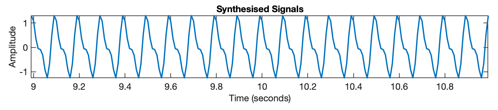
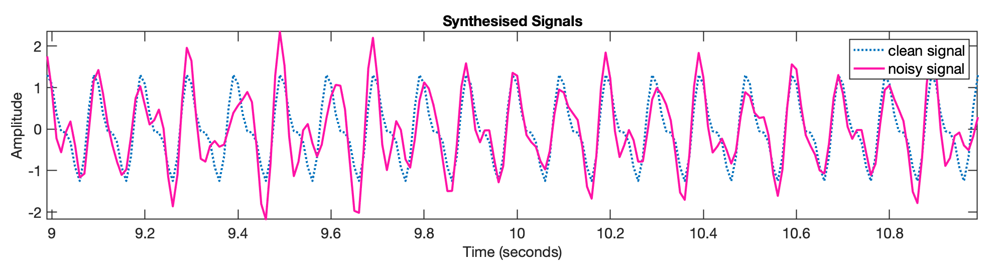
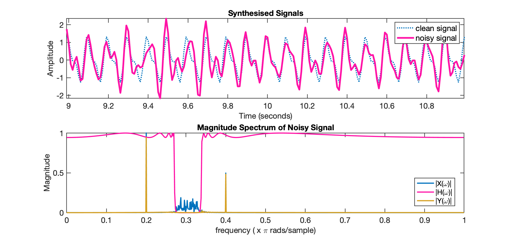
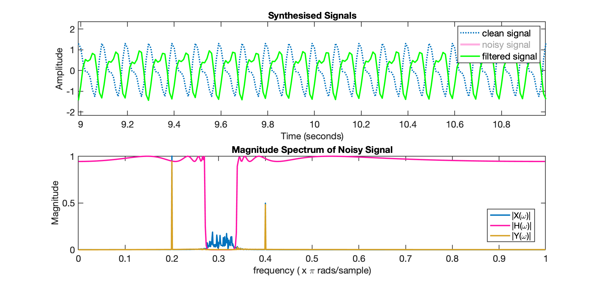
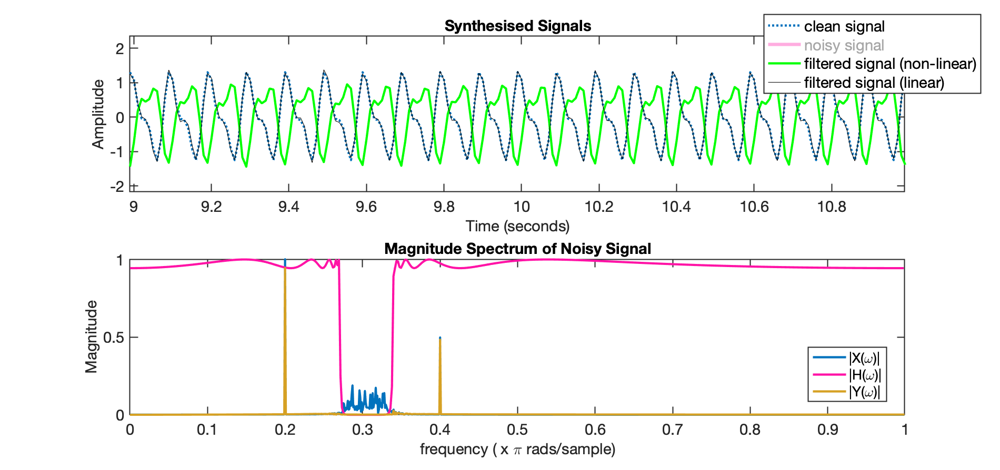
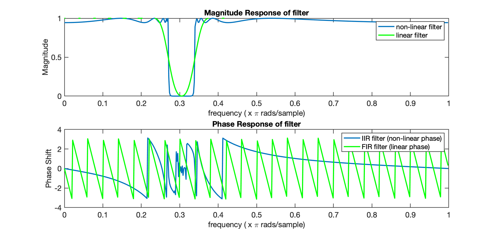

# Linear Phase Filters

Ref.: David Dorran, [Linear Phase Filters – why they are used](https://dadorran.wordpress.com/2014/10/01/linear-phase-filters-why-they-are-used/), October 1, 2014 (acessado em 22/04/2024).

**Objetivo**: Mostrar que filtros de fase linear (FIR), preservam a forma de um sinal filtrado.

Vídeo [YouTube: Why Linear Phase Filters are Used](https://www.youtube.com/watch?v=xPTe7ZWLVhQ), 25.733 visualizações  15 de out. de 2014.
Mostra que os filtros de fase linear preservam a forma de um sinal filtrado e compara isso com um filtro não linear.  

Segue código usado durante uma apresentação de vídeo do YouTube sobre filtros de fase linear

```matlab
%% Linear phase filters - preserve shape of a filtered signal
% This is the code used during a youtube video presentation dealing with linear phase filters
% Search for linear phase at http://youtube.com/ddorran
% Code available from https://dadorran.wordpress.com
% 
close all ; clear all; % clc
fs = 100;
T = 1/fs; 	%sampling interval
N = 2000; 	%length of signal being synthesised
n = 0:N-1; 	%samples of the signal
t = n*T;
  
plot_range = [N/2-100:N/2+100];
%% synthesise a signal
x = cos(2*pi*10*t) + 0.5*cos(2*pi*20*t + 1.4); 
subplot(2,1,1);
plot(t(plot_range),x(plot_range))
xlabel('Time (seconds)');
ylabel('Amplitude')
title('Synthesised Signals') 
axis tight
```

Sintetizando um sinal:



Adicionando ruído:

```matlab
% Add some noise
ns = randn(1,length(x)+100)*2;
%filter the noise to synthesise band limited noise
[b a] = butter(5, [0.28 0.33],'bandpass');
ns_filtered = filter(b,a,ns);
%add noise to clean signal
x_ns = x +ns_filtered(end-length(x)+1:end);
hold on
noisy_x = plot(t(plot_range), x_ns(plot_range),'r');
legend('clean signal', 'noisy signal')
```

Gráfico do Sinal $+$ ruído:



Plotando o gráfico o espectro do sinal ruidoso:

```matlab  
%% Plot frequency Content of Noisy Signal
subplot(2,1,2)
X_ns = fft(x_ns);
fax = [0:N-1]/(N/2); % normalised frequency axis
plot(fax(1:N/2), abs(X_ns(1:N/2))/(N/2)) ; %plot first half of spectrum
xlabel('frequency ( x \pi rads/sample)')
ylabel('Magnitude')
title('Magnitude Spectrum of Noisy Signal')
```

Gráfico o espectro do sinal ruidoso:


Filtrando o ruído do sinalusando filtro IIR (de fase não linear):

```Matlab
%% Filter out the noise using an IIR filter (non-linear phase)
[b_iir a_iir] = cheby1(10, 0.5, [0.27 0.34], 'stop');
y_iir = filter(b_iir,a_iir, x_ns);
 
[H_iir w] = freqz(b_iir,a_iir); %determine frequency response
subplot(2,1,2);
hold on
plot(w/pi, abs(H_iir),'r')
legend('|X(\omega)|','|H(\omega)|')
```

Espectro do sinal ruidoso filtrado usando filtro IIR (fase não linear):


```matlab 
% pause
Y_iir = fft(y_iir);
plot(fax(1:N/2), abs(Y_iir(1:N/2))/(N/2),'g') ; %plot first half of spectrum
legend('|X(\omega)|','|H(\omega)|','|Y(\omega)|')
```

Gráfico da primeira metade do espectro:



```matlab
% pause
subplot(2,1,1)
non_linear_y = plot(t(plot_range),y_iir(plot_range),'g')
legend('clean signal', 'noisy signal','filtered signal')
% pause 
set(noisy_x,'visible', 'off')
```

Novo espectro do sinal:



Examinando a magnitude e fase do **filtro IIR**:

```matlab  
%% Examine the magnitude and phase response of the IIR filter
figure(2)
subplot(2,1,1)
plot(w/pi,abs(H_iir))
xlabel('frequency ( x \pi rads/sample)')
ylabel('Magnitude')
title('Magnitude Response of filter')
subplot(2,1,2)
plot(w/pi,angle(H_iir))
xlabel('frequency ( x \pi rads/sample)')
ylabel('Phase Shift')
title('Phase Response of filter')
```

Resultado do Espectro do filtro IIR:


**Agora usando um filtro FIR (com fase linear)**:

```matlab  
%% Now filter using an FIR filter (with linear phase)
b_fir = fir1(100,  [0.27 0.34],'stop');
a_fir = 1;
y_fir = filter(b_fir,a_fir, x_ns);
 
figure(1)
subplot(2,1,1)
plot(t(plot_range),y_fir(plot_range),'k')
legend('clean signal', 'noisy signal','filtered signal (non-linear)','filtered signal (linear)')
```

Sinal filtrado usando filtro FIR (com fase linear):



Calculando espectro do sinal filtrado usando filtro FIR (com fase linear):

```matlab 
[H_fir, w ]= freqz(b_fir,a_fir);
subplot(2,1,2)
plot(w/pi, abs(H_fir),'k')
legend('|X(\omega)|','|H(\omega) Non-linear|','|Y(\omega)|','|H(\omega)| linear')
```

Espectro do sinal filtrado usando filtro FIR (com fase linear):


Comparando a resposta frequencial dos 2 filtros:

```matlab  
%% Compare the frequency responses of the two filter design approaches
figure(2)
subplot(2,1,1)
hold on
plot(w/pi,abs(H_fir),'g')
legend('non-linear filter','linear filter')
subplot(2,1,2)
hold on
plot(w/pi,angle(H_fir),'g')
legend('IIR filter (non-linear phase)','FIR filter (linear phase)')
% pause
```

Resposta frequencial dos 2 filtros:



**Por que a fase linear preserva o formato do sinal original?**

```matlab
%% Why does linear phase preserve the shape??
close all
clear all; % clc;
fs = 1000;
t = 0:1/fs:2;
x1 = cos(2*pi*3*t-pi/2);
x2 = cos(2*pi*5*t-(pi/2)/3*5);
  
% pause
subplot(3,1,1)
plot(t,x1)
subplot(3,1,2)
plot(t,x2)
subplot(3,1,3)
plot(t,x1+x2,'g')
hold on
```

Porque a fase linear preserva o formato do sinal original:


Fim.

---

Fernando Passold, em 23/04/2024.
