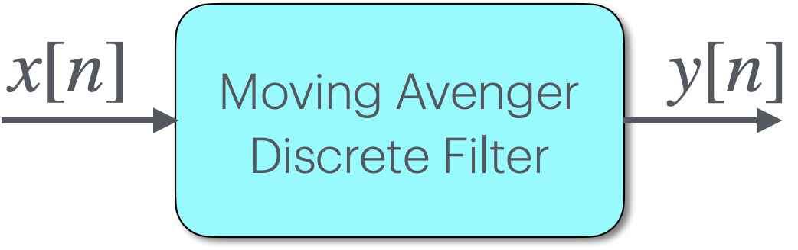
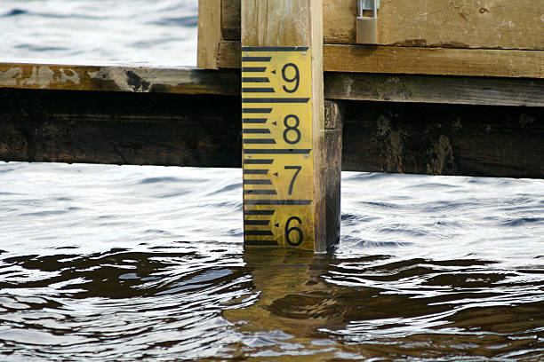
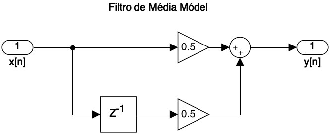
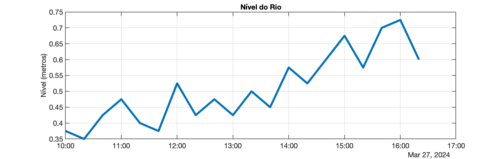
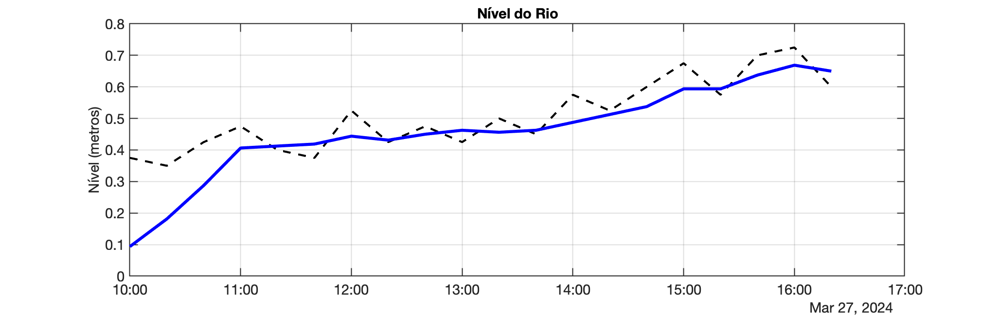
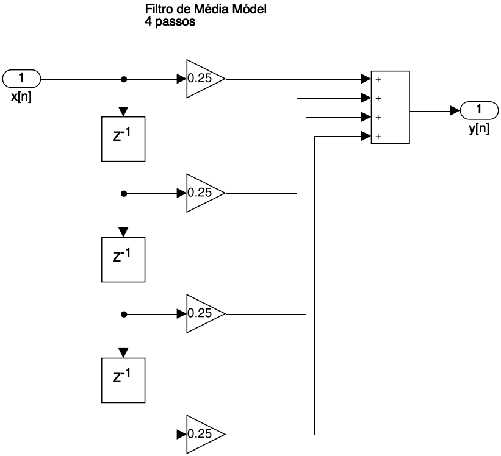

<font size="1">[The cherry blossoms along the Philosophers Path in spring, Kyoto (Japan)](https://www.japan-experience.com/all-about-japan/kyoto/attractions-excursions/the-path-of-philosophy)</font>

# Filtro de Média Móvel

Tópico anterior: [\<\< Intro. Processamento Siinais](intro_process_sinal.html) | Próximo tópico: [\>\> Modelagem de sistema térmico](modelo_termico.html).

Segue outro exemplo de sistema discreto.

## Exemplo 2) Problema do nível de um rio

<!--
Ref.: Digital Signal Processing Foundations, David Dorran, Technological University Dublin, david.dorran@tudublin.ie
(PDF: Digital Signal Processing Foundations.pdf), pág. 18 - 23... 
-->

Outro exemplo de sistema discreto que é relativamente simples de apreciar é um filtro de média móvel de dois passos (em inglês: *two-tap moving average filter*). Este sistema pega a média de duas amostras de entrada consecutivas e passa o resultado para a saída do sistema.



O filtro de média móvel é muito útil porque pode mitigar flutuações que podem ocorrer durante uma coleta de dados. 

### Filtro de média móvel de 2 passos

Por exemplo, considere a situação em que você está medindo o nível de um rio que é afetado por uma maré local. Essas medições irão flutuar à medida que a água se espalha o medidor. Ao tomar a média de duas medições consecutivas, o efeito do movimento agitado da água será reduzido (dê uma olhada nos gráficos no final desta subseção para ver o efeito de um filtro de média móvel).



O sistema de média móvel de dois passos pode ser representado matematicamente pela seguinte equação de diferença:

$y[n]=\dfrac{x[n]+x[n-1]}{2}=\dfrac{x[n]}{2}+\dfrac{x[n-1]}{2}$

$y[n]=0,5x[n]+0,5x[n-1]$

Mais uma vez, se você resolvesse esta equação de diferença para diferentes valores de $n$, determinaria a saída deste sistema para qualquer entrada $x[n]$. Eu encorajaria você a fazer isso por si mesmo e observar que quando você resolver para $n = 0$ você terá um termo $x[-1]$ na equação; este termo $x[-1]$ não está definido explicitamente, então você assume que é zero. Além disso, se você resolvesse $n = 6$ usando a entrada mostrada na figura acima, você deveria obter um valor de 0,5 para $y[6]$, já que $x[6]$ não está definido explicitamente. Resultaria algo como:

| Vetor entrada, $x[n]$ | Vetor saída, $y[n]$ |
| :--- | :--- |
| $x[0]=2$<br />$x[1]=1,1$<br />$x[2]=3,2$<br />$x[3]=-2$<br />$x[4]=0,3$<br />$x[5]=1$<br />$\vdots$ | $y[0]=0,5x[0]+0,5\cancel{x[-1]}^{0}=1$<br />$y[1]=0,5x[1]+0,5x[0]=1,55$<br />$y[2]=0,5x[2]+0,5x[1]=2,15$<br />$y[3]=0,5x[3]+0,5x[2]=0,6$<br />$y[4]=0,5x[4]+0,5x[3]=-0,8$<br />$y[5]=0,5x[5]+0,5x[4]=0,65$<br />$vldots$ |

O diagrama de fluxo de sinal da média móvel de dois passos é mostrado abaixo e contém dois multiplicadores, um somador e um operador de atraso (o quadrado com um $z^{-1}$ dentro dele):



Os filtros de média móvel podem calcular a média de mais do que apenas duas amostras consecutivas e podem obter a média de qualquer número de amostras consecutivas.

### Filtro de média móvel de 4 passos 

Como exemplo, um filtro de média móvel de quatro toques é aplicado à seguinte sequência de dados que representa o nível do rio (em metros) medido em intervalos de 20 minutos:

Nível = [.375 .35 .425 .475 .4 .375 .525 .425 .475 .425 .5 .45 .575 .525 .6 .675 .575 .7 .725 .6];

Esses dados brutos aparecem no gráfico abaixo à esquerda na figura abaixo. Você pode ver que as leituras flutuam significativamente. O gráfico à direita mostra o resultado da passagem dos dados por uma média móvel de quatro toques, que calcula a média de 4 amostras consecutivas. Você vê que as flutuações nas leituras foram suavizadas pelo filtro.

| Dados brutos | Dados Filtrados |
| :---: | :---: |
|  |  |

Você precebe que as flutuações nas leituras foram suavizadas pelo filtro.

A equação de diferençar de um filtro de média móvel de quatro passos é dada por:

$y[k]=0,25x[k]+0,25x[k-1]+0,25x[k-2]+0,25x[k-3]$

Você notará que as primeiras quatro três amostras dos dados filtrados do rio têm uma inclinação relativamente acentuada. Isso ocorre porque as três primeiras saídas ($y[0]$, $y[1]$ e $y[2]$) são todas calculadas usando valores de $x[n]$ que são indefinidos e, portanto, assumidos como zero. Isto tem o efeito de distorcer a saída do filtro e os profissionais de DSP precisam estar bem conscientes deste problema ao filtrar dados.

O diagrama de fluxo do sinal é mostrado à seguir:



### Calculando valores usando Matlab/Octave

Determinar a saída de sistemas discretos (implementar um sistema discreto) pode ser uma tarefa tediosa quando você lida com muitas amostras. Felizmente, os computadores podem realizar os cálculos para nós com extrema rapidez e precisão. Tanto o Matlab quanto o Octave são usados com muita frequência para esse propósito e possuem comandos/funções integrados que o tornam um processo muito simples, por exemplo a função [`filter()`](funcao_filter.html). Entretanto, essas funções exigem que os sistemas discretos sejam descritos em termos de coeficientes $b$ e $a$:

$\begin{array}{rcll}
a_1\,y[n] &=& b_1\,x[n] &+& b_2\,x[n-1] + \ldots + b_{n_b+1}\,x[n-n_b] +\\
          & &           &-& a_2\,y[n-1] - \ldots - a_{n_a+1}\,y[n-n_a] \end{array}$

ou resumidamente:

$a_0 \cdot y[n]=\displaystyle\sum_{i=0}^{n_b} b_i \cdot x[n-i] \quad - \quad \displaystyle\sum_{j=1}^{n_a} a_j \cdot y[n-j]$

a transformada$-\mathbb{Z}$ das expressões acima levam à:

$H(z)=\dfrac{Y(z)}{X(z)}=\dfrac{b_1\,z^{0} + b_2\,z^{-1} + b_3\,z^{-2} + \ldots + b_{n_b+1}\,z^{-n_b}}{a_1\,z^{0} + a_2 z^{-1} + a_3 z^{-2} + \ldots + a_{n_a+1} z^{-n_a}}$

ou resumidamente: 

$H(z)=\dfrac{Y(z)}{X(z)}=\dfrac{\displaystyle\sum_{i=0}^{n_b} b_i\,z^{-i}}{\displaystyle\sum_{j=0}^{n_a} a_j \,z^{-j}}$		(função transferência do filtro)

onde $n_a=$ número de amostras atrasadas do sinal $y$; e $n_b=$ número de amostras atrasadas do sinal $x$. Note que os termos $a_j$ e $b_i$ estão associados respectivamente com ponderações (ganhos ou atenuações) que devem ser usadas com os sinas $y$ e $x$.

Para entender melhor a função `filter()`, favor clicar [aqui](funcao_filter.html) .

Como a equação de diferenças do filtro de média móvel de 4 passos é dado por:

$y[k]=0,25x[k]+0,25x[k-1]+0,25x[k-2]+0,25x[k-3]$

Então os coeficientes $a$ e $b$ serão: $a=[1]$ e $b=[0,25 \quad 0,25 \quad 0,25 \quad 0,25]$

Codificando no Matlab/Octave, resulta algo como:

```matlab
>> nivel=[.375 .35 .425 .475 .4 .375 .525 .425 .475 .425 .5 .45 .575 .525 .6 .675 .575 .7 .725 .6];
>> % salvando dados num arquivo .txt -- opcional
>> save('nivel.txt', '-ascii', 'nivel')
>> u=length(nivel)
u =
    20
>> 
```

Único problema: se for traçado um gráfico usando apenas o comando `plot(nivel)`, não irá aparecer no gráfico os instantes de captura de cada dado.

#### Criando série de dados no formato HH:MM

O Matlab permite criar uma série de dados (vetor) baseado em data/hora:

```matlab
>> t0=datetime('10:00:00')		% amostra inicial
t0 = 
  datetime
   27-Mar-2024 10:00:00
>> tfim=t0+u*minutes(20)		% amostra final
tfim = 
  datetime
   27-Mar-2024 16:40:00
>> TimeStamp=[t0:minutes(20):tfim]
TimeStamp = 
  1×21 datetime array
Columns 1 through 3
   27-Mar-2024 10:00:00   27-Mar-2024 10:20:00   27-Mar-2024 10:40:00
Columns 4 through 6
   27-Mar-2024 11:00:00   27-Mar-2024 11:20:00   27-Mar-2024 11:40:00
Columns 7 through 9
   27-Mar-2024 12:00:00   27-Mar-2024 12:20:00   27-Mar-2024 12:40:00
Columns 10 through 12
   27-Mar-2024 13:00:00   27-Mar-2024 13:20:00   27-Mar-2024 13:40:00
Columns 13 through 15
   27-Mar-2024 14:00:00   27-Mar-2024 14:20:00   27-Mar-2024 14:40:00
Columns 16 through 18
   27-Mar-2024 15:00:00   27-Mar-2024 15:20:00   27-Mar-2024 15:40:00
Columns 19 through 21
   27-Mar-2024 16:00:00   27-Mar-2024 16:20:00   27-Mar-2024 16:40:00
>> TimeStamp.Format='HH:mm';	% formatando saída desejada
>> TimeStamp'
ans = 
  21×1 datetime array
   10:00
   10:20
   10:40
   11:00
   11:20
   11:40
   12:00
   12:20
   12:40
   13:00
   13:20
   13:40
   14:00
   14:20
   14:40
   15:00
   15:20
   15:40
   16:00
   16:20
   16:40
>> size(TimeStamp)
ans =
     1    21
>>      
```

Ops... Resultamos num pequeno erro no momento de criar vetor com horários das capturas... ele acabou ficando com 21 pontos. E deveriam ser 20 pontos. Corrigindo:

```matlab
>> tfim=t0+(u-1)*minutes(20)
tfim = 
  datetime
   27-Mar-2024 16:20:00
>> TimeStamp=[t0:minutes(20):tfim];		% criando string com dados das amostras
>> size(TimeStamp)
ans =
     1    20
>> 
```

Agora podemos tentar plotar o gráfico:

```matlab
>> plot(TimeStamp, nivel)
>> title('Nível do Rio')
>> ylabel('Nível (metros)');
>> grid
```


Aplicamos agora o filtro de média móvel de 4 passos:

```matlab
>> a=[1];
>> b=[0.25 0.25 0.25 0.25];
>> y4=filter(b,a,nivel);
>> figure; plot(TimeStamp, nivel, 'k--', TimeStamp, y4, 'b-')
```


---

**Exercício Proposto**: desenvolva uma função em C (para Arduino ou PC), ou em Python capaz de realizar filtragem por média móvel, onde o usuário entra com os coeficientes do filtros, o vetor de entrada e este programa retorna o vetor de saída (calculado).

Algo como:

```basic
% ./filterSignal signalData.txt
Filtered signal is:
[-0.152973994613, -0.435257852077, -0.136043429375, 0.697503328323, 0.656444668770, -0.435482501984, -1.089239478111, -0.537676513195, 0.517050027847, 1.052249789238, 0.961854338646, 0.695689916611, 0.424356251955, 0.196262300014, -0.027835100889, -0.211721956730, -0.174745574594, 0.069258421659, 0.385445863008, 0.651770770550]

%                                                                                     
```

*Dica*: o algoritmo pode ficar algo como:

```
FILTRO ({a} {b} {sinal} → {filtrado})
Inverter a e b
Para j = 1 até o último item de sinal
  extrair o que multiplicar por b
  acrescente 0's se necessário
  multiplique por b e some
  extrair o que multiplicar por a, exceto a[0]
  acrescente 0's se necessário
  multiplique por a, some e subtraia
  divida por a[0] que é o último item uma vez invertido
```

<!-- https://rosettacode.org/wiki/Apply_a_digital_filter_(direct_form_II_transposed)#RPL -->

---

Tópico anterior: [\<\< Intro. Processamento Siinais](intro_process_sinal.html) | Próximo tópico: [\>\> Modelagem de sistema térmico](modelo_termico.html).
Outro tópico: [Detalhes sobre a função `filter()` do Matlab](funcao_filter.html).


----

Fernando Passold, em 27-31/03/2024.

