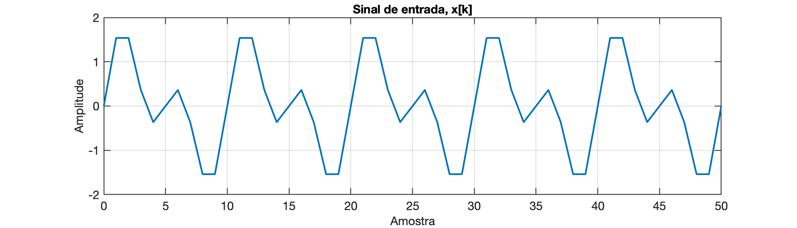
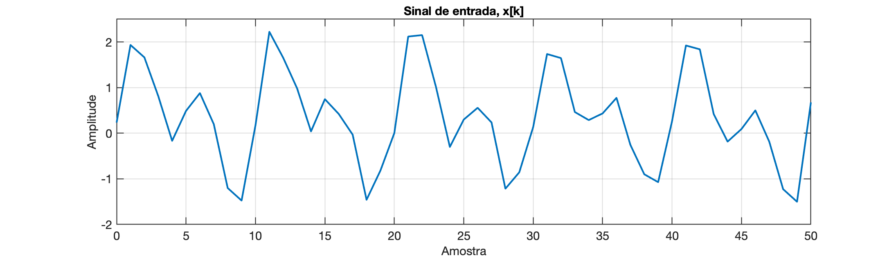
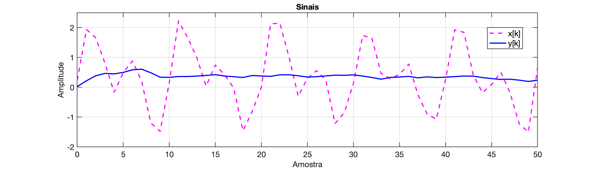

#  Filtro Média Móvel  n-passos

**Equação**

$y[k]=\dfrac{x[k]+x[k-1]+\ldots+x[k-n-1]}{n}=\dfrac{x[k]}{n}+\dfrac{x[k-1]}{n}+\ldots+\dfrac{x[k-n-1]}{n}$

$r=\dfrac{1}{n}$

$y[k]=r \cdot x[k] + r \cdot x[k-1] + \ldots + r \cdot x[k-n-1]$

Note que necessitamos $n-1$ amostras atrasadas do sinal de entrada $x[k]$.

ou generalizando:

$y[k]=\displaystyle\sum_{i=0}^{n-1} r \cdot x[k-i]=r \cdot \displaystyle \sum_{i=0}^{n-1} x[k-i]$


**Exemplo**: Seja $n=10$, um filtro de média móvel de 10 passos.

Simulando um sinal no Matlab e usando a função `filter()`:

```matlab
>> k=0:50;
>> x1=sin(2*pi*1/10*k);		% ciclo completo à cada 10 amostras
>> x2=sin(2*pi*1/5*k);		% ciclo completo à cada 5 amostras
>> x3=0.5*sin(2*pi*1/2*k);	% "ruido" sobre o soma dos sinais anteriores
>> x=x1+x2+x3;
Unrecognized function or variable 't'. 
>> plot(k,x)
>> xlabel('Amostra')
>> ylabel('Amplitude')
>> title('Sinal de entrada, x[k]')
```

Até aqui já temos o sinal $x[k]$:



Podemos "incrementar" um pouco mais o sinal de entrada, acrescentando valores aleatórios (ruído "branco"):

```matlab
>> x4=0.75*rand(1,length(k));
>> x=x1+x2+x3+x4;
>> figure; plot(k,x)
>> xlabel('Amostra')
>> ylabel('Amplitude')
>> title('Sinal de entrada, x[k]')
```



Passando o filtro de média móvel de 10 amostras sobre este sinal, obtemos:

```matlab
>> b=ones(1,10)
b =
     1     1     1     1     1     1     1     1     1     1
>> b=1/10*ones(1,10);
>> a=1;
>> y=filter(b, a, x);
>> figure;
>> plot(k,x,'m--', k,y,'b-')
>> xlabel('Amostra')
>> ylabel('Amplitude')
>> title('Sinais')
>> legend('x[k]', 'y[k]')
>> grid
```

E temos o gráfico:



Note que o valor de saída $y[k]$ nas primeiras 9 amostras está "subindo" e parte de zero! Porque não temos todas as amostras passadas de $x[k]$ diferentes de zero antes de $k=10$.

Se vamos imaginar o uso real do filtro, temos que calcular um novo valor de $y[k]$ a cada novo instante de amostragem, ou seja, a cada novo ponto $x[k]$ coletado. Modificando o código  no MATLAB para retratar a forma como é excutado uma rotinda de filtro de média móvel num micro-controlador, em tempo de execução e não "offline" como simulado acima, podemos fazer algo como:

Primeiramente declaramos um vetor para $amostra[k]$ e inicializamos seus valores com zero:

Em C++, ficaria algo como:

```c++
#define NUM_SAMPLES 10
int amostra[NUM_SAMPLES];

void Init_x(){
    for (int i = 0; i < NUM_SAMPLES; i++) {
        amostra[i] = 0;
    }    
}
```

No MATLAB, este procedimento seria mais simples, algo como:

```matlab
>> NUM_SAMPLES=10;
>> x=zeros(NUM_SAMPLES,1);
```

E podemos simular a rotina (tratamento de interrupção) que realiza a leitura de dados $amostra[k]$ à cada novo instante de amostragem. Note que nosso algoritmo não necessita saber do período de amostragem adotado. Esta rotina seria chamada a cada novo ponto adquirido. A fim de simular esta execução, vamos criar uma function no MATLAB representando a rotina de leitura de dados e vamos chamar esta função o tanto de vezes necessário para percorrer todo o vetor de entrada $x[k]$ criado anteriormente, simulando o sistema rodando nas últimas 50 amostragens.

```matlab

```

