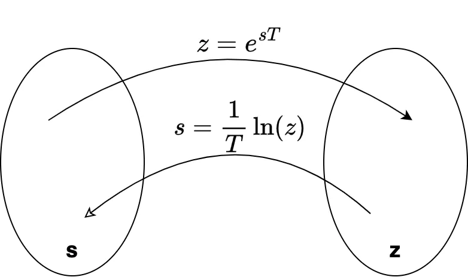
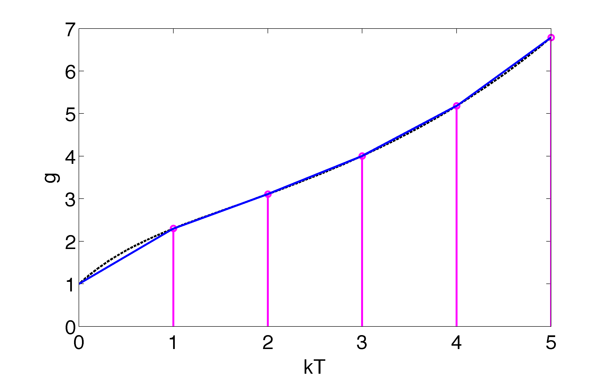

# Transformações Bilineares (Método de Tustin)

Podemos obter uma função transformada $H(z)$ à partir da sua homôloga no mundo contínuo, $H(s)$. Para tanto, podemos fazer uso da definição da transformada $\mathcal{Z}$ ou podemos partir para algum método de transformação bilinear entre plano-s ("mundo contínuo") e plano-z ("mundo discreto").

Da **definição da Transformada $\mathcal{Z}$** temos:

$$z=e^{sT}$$

Como: $s=\sigma+j\omega$:

$z=e^{T(\sigma+j\omega)}=e^{\alpha T} e^{j\omega T}$

$z=e^{\alpha T}\left[ \cos(\omega T) + j\sin(\omega T) \right]$

$z=e^{\alpha T} \; \angle \, \omega T$.

Note que: $\cos(\omega T)+j \sin(\omega T)=1 \, \angle \, \omega T$ (círculo unitário).

O "inverso" fica:

$s=\dfrac{1}{T}\,\ln(z)$.

Ou:




**Exemplo 1**: Se $H(s)=\dfrac{1}{s+a}$, obter $H(z)$.

Neste caso, temos um pólo em $s=-a$, a transformada-$z$ de $f(kT)$ seria:

$F(z)=\mathcal{Z}\{ e^{-a \cdot k \cdot T} \}$.

De uma tabela de transformadas de Laplace e Transformadas Z temos:

| $F(s)$           | $f[kT]$                  | $F(z)$                        |
| ---------------- | ------------------------ | ----------------------------- |
| $\dfrac{1}{s+a}$ | $e^{-a \cdot k \cdot T}$ | $\dfrac{z}{z-e^{-a \cdot T}}$ |

E assim:

$F(z)=\dfrac{z}{z-e^{-a \cdot T}}$

O pólo no mundo contínio em $s=-a$, no plano-$\mathcal{z}$ ficaria localizado em $z=e^{-a \cdot T}$.


Mas existem outros métodos:

* **Método de Euler**: baseado na derivada numérica;
* **[Método de Tustin](#tustin)**: baseado em integração numérica trapezoidal.


## Método de Euler

Este método também é conhecido como regra retangular direta (ou *forward rectangular rule*). Consiste na seguinte aproximação:

$\dfrac{d\,x }{dt}=\displaystyle\lim_{\Delta t \to 0} \dfrac{\Delta x}{\Delta t}$

ou mais simplesmente:

$\dot{x} \cong \dfrac{x[k+1]-x[k]}{T}$

Onde:
$T=$ período de amostragem (em segundos);
$x[k]=$ Valor de $x(t)$ no instante $t_k$;
$x[k+1]=$ Valor de $x(t)$ no instante $t_{k+1}$;
$t_k=k\cdot T$;
$k=$ Inteiro.

Esta aproximação pode ser usada no lugar de várias derivadas que apareçam na equação diferencial de um filtro e resulta num conjunto de equações que pode ser calculada por um computador digital. 

Estas *equações de diferenças* são resolvidas repetidamente a cada $T$ período de tempo. 

Para sistemas com margem de banda da ordem de uns poucos Hertz, taxas de amostragem resultam normalmente na ordem de 1 KHz, e assim os períodos de amostragem ficarão em torno de 1 ms e os erros envolvidos na aproximação resultarão bastante pequenos.

**Exemplo**: Se $H(s)=\dfrac{K(s+a)}{(s+b)}$, queremos obter $H(z)$, dado certo valor para $T$.

A eq. diferencial que originou a expressão acima vêm de:

$H(s)=\dfrac{Y(s)}{X(s)}=\dfrac{K(s+a)}{(s+b)}$

$(s+b)Y(s)=K(s+a)X(s)$

por inspeção a correspondente eq. diferencial fica:

$\dot{y}(t)+b\cdot y(t)=K(\dot{x}(t)+a\cdot x(t))$

Aplicando o método de Euler obtemos:

$\dfrac{y[k+1]-y[k]}{T}+b \cdot y[k] = K\left[ \dfrac{x[k+1]-x[k]}{T} + a \cdot x[k] \right]$

Rearanjando a expressão anterior podemos obter:

$y[k+1]=y[k]+T \left\{ -b\cdot y[k] +K\left( \dfrac{x[k+1]-x[k]}{T} + a\cdot x[k] \right) \right\}$

A expressão anterior, permite calcular o próximo valor de saída do filtro, $y[k+1]$, dado o valor passado do sinal filtrado, $y[k]$ e os novos valores e valores passados do sinal de entrada, $x[k+1]$ e $x[k]$.

Em termos de código ficaria algo como:

```
READ x;
y = y1 + T*( -b*y1 + K*( (x-x1)/T + a*e ));
OUTPUT y
y1 = y;
x1 = x;
```

Este método atinge um ==resultado razoável== para períodos de amostragem maiores que 20 vezes a maior frequência presentes no sinal de entrada.

**Exemplo 1**: Simular o caso de um Filtro Passa-Baixas contínuo $\times$ filtro digital obtido pelo método de Euler com a) $f_s=X$ e b) $f_s=2X$ Hz (o dobro da freq. amostragem anterior). Comparar os resultados obtidos. 


<a id="tustin"></a>

## Método de Tustin

Este método está baseado na integração numérica trapezoidal.

Suponha que:

$\dfrac{Y(s)}{X(s)}=H(s)=\dfrac{1}{s}$

o que é uma integração. Assim:

$y[kT]=\displaystyle\int_0^{kT-T} x(t)dt + \displaystyle\int_{kT-T}^{kT} x(t)dt$.

que pode ser re-escrito como:

$y[kT]=y[kT-T]+Area\left( x(t) \textrm{ em relação ao ultimo } T \right)$

onde $T=$ período de amostragem.

> Lembrando do Cálculo da área de um Trapézio:
>
> Suponha que é desejada a integral da curva $g(t)$:
>
> 
>
> A área de um trapézio é dada por:
>
> $A=\left( \dfrac{B+b}{2} \right) \cdot h$
>
> Onde: $B=$ base maior; $b=$ base menor e $h=$ altura do trapézio. Neste caso: $B=g[k]$, $b=g[k-1]$ e $h=T$.
>
> A integral de $g(t)$ resultaria:
>
> em $k=0 \quad \therefore \quad i[0]=0$;
>
> em $k=1 \quad \therefore \quad i[1]=i[0]+\frac{T}{2}\Big( g[1] + g[0] \Big)$;
>
> em $k=2 \quad \therefore \quad i[2]=i[1]+\dfrac{T}{2} \frac{T}{2}\Big( g[2] + g[1] \Big)$
>
> e assim por diante, ou generalizando:
>
> $i[k]=i[k-1]+\dfrac{T}{2} \Big( g[i] + g[i-1] \Big)$.

Usando Integração trapezoidal:

$y[k]=y[k-1]+\dfrac{T}{2}\Big( x[k] + x[k-1] \Big)$

aplicando a transformada-$\mathcal{Z}$ sobre a eq. anterior, teremos:

$Y(z)=z^{-1}Y(z)+\dfrac{T}{2} X(z) \Big(1 + z^{-1} \Big)$

$Y(z)[1-z^{-1}]=\dfrac{T}{2} X(z) \Big(1 + z^{-1} \Big)$

$\dfrac{Y(z)}{X(z)}=\dfrac{T}{2}\left( \dfrac{1+z^{-1}}{1-z^{-1}} \right)=\dfrac{1}{ \dfrac{2}{T}\left( \dfrac{1-z^{-1}}{1+z^{-1}} \right) }$

Para $H(s)=\dfrac{a}{s+a}$, esta aproximação integral levaria à:

$H(z)=\dfrac{a}{ \dfrac{2}{T} \left( \dfrac{1-z^{-1}}{1+z^{-1}} \right) }$

ou seja:

$s=\dfrac{2}{T}\left( \dfrac{1-z^{-1}}{1+z^{-1}} \right)$

Ou:

$s=\dfrac{2}{T} \left( \dfrac{z-1}{z+1} \right)$			(eq. (1))

E a transformação "inversa" ficaria então como:

$z=\dfrac{-\left( s+\dfrac{2}{T}\right) }{ \left( s - \dfrac{2}{T} \right)}$

ou mais simplesmente:

$z=\dfrac{ 1 + \dfrac{T}{2}s }{ 1 - \dfrac{T}{2}s }$

Quanto menor for o intervalo de amostragem, $T$ (ou maior a frequência de amostragem), mais a versão discretizada se aproxima do comportamento no domínio-frequência do compensador no domínio contínuo de tempo. A eq. (1) é a que entre os métodos de integração numérica, permite levar a um resultado mais próximo da resposta (em tempo e frequência) que realmente seria obtido usando o compensador no domínio contínuo de tempo.

**Exemplo 2**: Simular o caso de um Filtro Passa-Baixas contínuo $\times$ filtro digital obtido pelo método de Tustin, trabalhando com um período de amostragem $T=75\%$ de $X$ do Exemplo 1.


----

<script language="JavaScript">
<!-- Hide JavaScript...
var LastUpdated = document.lastModified;
document.writeln ("Fernando Passold, atualizado em " + LastUpdated); // End Hiding -->
</script>