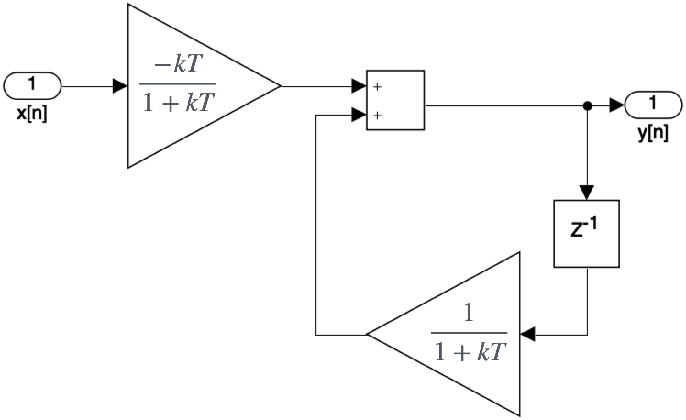
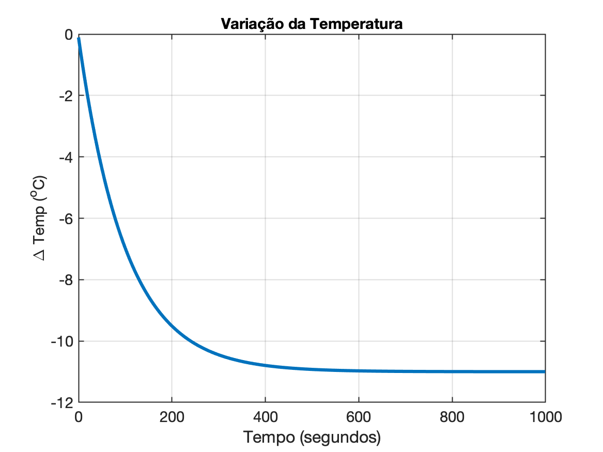

<font size="1">[Geothermal Power Plant At Dusk (Iceland)](https://www.theguardian.com/environment/2016/may/29/sustainable-energy-iceland-geothermal-plant), </font> 

# Processamento de Sinais

## Modelagem de um Sistema Térmico

<!--
Ref.: Digital Signal Processing Foundations, David Dorran, Technological University Dublin, david.dorran@tudublin.ie
PDF: Digital Signal Processing Foundations.pdf), Exemplo 3: pág. 20 -...
--> 

Este exemplo não é tão simples quanto os anteriores. A idéia com este exemplo é mostrar que a saída de um sistema pode ser realimentada (aproveitada) dentro do próprio sistema, isto é, neste sistema a saída depende de amostras de saída anteriores e não apenas das amostras de entrada, algo como:

$y[n]=\mathcal{f}\left\{ y[n-1], \ldots, y[n-n_a], x[x], \ldots, x[n-n_b] \right\}$

Um sistema discreto baseado numa equação de diferenças pode permitir determinar (aproximadamente) como a temperatura de um copo de água mudaria se ele fosse colocado em uma geladeira fria. Esperamos que você possa perceber que a temperatura do copo de água cairia gradativamente até atingir a mesma temperatura da geladeira.

Este modelo toma a diferença de temperatura inicial entre a água e a geladeira como a entrada $x[n]$ e fornece a mudança na temperatura relativa à temperatura inicial ao longo do tempo como a saída $y[n]$. Como a temperatura do copo de água acabará por corresponder à temperatura da geladeira, então $y[n]$ eventualmente atingirá um valor quase constante e atingirá um estado estacionário (valor constante em regime permanente).

Seria uma equação como:

$y[n]=\left( \dfrac{-kT}{1+kT} \right)x[n] + \left( \dfrac{1}{1+kT} \right)y[n-1]$	(eq. 1)

Este modelo foi derivado da Lei do Resfriamento de Newton. A constante $k$ é chamada de constante de resfriamento e depende da quantidade de água no vidro e do isolamento térmico fornecido pelo vidro que contém a água. A variável $T$ é o intervalo de amostragem usado pelo sistema. O produto $kT$ não deve ser superior a 0,01 para garantir que este modelo seja razoavelmente preciso.

A constante $k$ geralmente é determinada por meio de experimentação e, uma vez encontrada, você pode usar este modelo para prever como a temperatura de um copo de água mudaria ao longo do tempo para qualquer diferença de temperatura inicial e qualquer temperatura do refrigerador (uma vez que a água permaneça líquida!). Você também precisaria cobrir o vidro para evitar qualquer evaporação em caso de altas temperaturas!.

Transformando a eq. (1) num diagrama de fluxo de sinais teríamos:



Como exemplo, vamos tentar modelar como a temperatura de um copo de água mudaria se ele estivesse inicialmente em 15 °C e depois fosse colocado em uma geladeira a 4 °C. A diferença é, portanto, de 11 °C e a entrada será uma sequência de valores de amostragem que são todos valores iguais à 11:

$x[n]=[11, 11, 11, \ldots, 11]$

Neste exemplo, definiremos a constante de resfriamento $k$ como valendo 0,01. Como estamos sintetizando o sinal de entrada, podemos usar qualquer valor de $T$ que desejarmos  ($T=$ período de amostragem); quanto menor o valor de $T$, mais preciso será o modelo; no entanto, se $T$ for muito pequeno, teremos que realizar muitos cálculos antes que a saída alcance um estado estacionário. Um valor razoável para $T$ neste caso é 1.

A equação de diferenças (eq. (1)) fica portanto:

$y[n]=\underbrace{\left(\dfrac{-kT}{1+kT} \right)}_{=b}x[n] + \underbrace{\left( \dfrac{1}{1+kT} \right)}_{=a} y[n-1]$

Usando Matlab/Octave:

```matlab
>> k=0.01; T=1;
>> b=(-k*T)/(1+k*T)
b =
    -0.009901
>> a=1/(1+k*T)
a =
       0.9901
```

Assim a eq. (1) ficaria:

$y[n]=-0,009901\,x[n]+0,9901\,y[n-1]$

Para determinar a saída do sistema, você precisa resolver esta equação de diferenças para diferentes valores de $n$. Resolver para $n = 0$ resulta:

$y[0]=-0,009901\,x[0]+0,9901\,y[-1]$

Como $x[0]=11$ e $y[-1]$ não foi definido, teremos:

$y[0]=-0,009901\cdot(11) = -0.10891$

> Usando Matlab:
>
> Notar que no Matlab, os índices de vetores/matrizes iniciam em 1 e não em 0, então:
>
> ```matlab
> >> y(1)=b*11
> y =
>      -0.10891
> ```

Resolvendo agora para $n=1$, teremos:

$y[1]=-0,009901\,x[1]+0,9901\,y[0]$

$y[1]=-0,009901\cdot (11)+0,9901\cdot (-0,10891) = -0,21674 $

> Usando Matlab
>
> ```matlab
> >> y(2)=b*11+a*y(1)
> >> y(2)
> ans =
>      -0.21674
> ```

Todas as amostras de saída restantes podem ser determinadas de maneira semelhante, o que é possível, mas um tanto tedioso. Na prática, um computador seria usado para determinar as amostras de saída.

A tabela à abaixo mostra as primeiras 7 amostras de saída do modelo de sistema discreto e você deve certificar-se de poder resolvê-las manualmente para garantir que entendeu o processo. 

| n | x[n] | y[n] |
| :--- | :---: | ---: |
| 0 | 11 | -0.10891 |
| 1 | 11 | -0.21674 |
| 2 | 11 | -0.32351 |
| 3 | 11 | -0.42922 |
| 4 | 11 | -0.53388 |
| 5 | 11 | -0.6375 |
| 6 | 11 | -0.7401 |

O gráfico à seguir mostra um gráfico de 1.000 amostras de saída e você deve notar que a saída atinge o que é conhecido como estado estacionário após cerca de 400 amostras ($t_s=$ 393 segundos), o que corresponde a 500 segundos neste exemplo, já que o intervalo de amostragem é de 1 segundo.



Lembre-se de que a saída representa a alteração do valor de entrada inicial, portanto a leitura de estado estacionário de -11 °C significa que a temperatura do copo de água eventualmente atinge 4 °C (valor inicial de 15 °C menos 11 °C).


---

**Exercício Proposto**: use o Matlab ou Octave para gerar os valores de $y[n]$ para $n=0,\ldots,6$.

---

### Notas adicionais

Sobre a eq. (1) capaz de modelar um sistema térmico:

$y[n]=\left( \dfrac{-kT}{1+kT} \right)x[n] + \left( \dfrac{1}{1+kT} \right)y[n-1]$	

Note que se fizermos: $\alpha=\dfrac{kT}{1+kT}$

$(1-\alpha)=1-\dfrac{kT}{1+kT}=\dfrac{1+\cancel{kT}-\cancel{kT}}{1+kT}=\dfrac{1}{1+kT}$

A eq. (1) pode ser re-escrita como:

$y[n]=-\alpha\,x[n]+(1-\alpha)\,y[n-1]$

$Y(z)=-\alpha X(z)+(1-\alpha)z^{-1}Y(z)$

$Y(z)\left[ 1 - (1-\alpha)z^{-1}\right]=-\alpha X(z)$

$G(z)=\dfrac{Y(z)}{X(z)}=\dfrac{-\alpha}{1-(1-\alpha)z^{-1}} \cdot \dfrac{z^1}{z^1}$

$G(z)=\dfrac{-\alpha\,z}{z-(1-\alpha)}$

Como: $\alpha=\dfrac{kT}{1+kT}$, teremos:

$G(z)=-\left( \dfrac{kT}{1+kT} \right)\cdot \dfrac{z}{z-\left( 1 - \frac{kT}{1+kT} \right)}$

$G(z)=-\left( \dfrac{kT}{1+kT} \right)\cdot \dfrac{z}{z-\left( \frac{1 +\cancel{kT} -\cancel{kT}}{1+kT} \right)}$

$G(z)=-\left( \dfrac{kT}{1+kT} \right)\cdot \dfrac{z}{z-\left( \dfrac{1}{1+kT} \right)}$

ou seja, resultaria num sistema de 1a-ordem, com um zero na origem e um pólo.

A mesma conclusão poderia ser obtida  reescrevendo a eq. (1) no formato padrão de equações de diferença:

$y[n]=\underbrace{\left(\dfrac{-kT}{1+kT} \right)}_{=b}x[n] + \underbrace{\left( \dfrac{1}{1+kT} \right)}_{=a} y[n-1]$

ou:

$y[n]=b\,x[n]+a\,y[n-1]$

Aplicando a transformada-$\mathbb{Z}$, temos:

$Y(z)=b\,X(z)+a\,z^{-1}Y(z)$

$Y(z)\left( 1 -a\,z^{-1}\right)=b\,X(z)$

$H(z)=\dfrac{Y(z)}{X(z)}=\dfrac{b}{1-a\,z^{-1}}$

$H(z)=\dfrac{-0.009901}{1-0.9901\,z^{-1}} \cdot \dfrac{z^1}{z^1}$

$H(z)=\dfrac{-0.009901\,z}{z-0.9901}$

Adaptando para o uso com a função [`filter()`](funcao_filter.html) fica:

```matlab
>> x = 11*ones(7,1)	% inicializando o vetor x[n]
x =
    11
    11
    11
    11
    11
    11
    11
>> k = 0.01; T=1;
>> b = (-k*T)/(1+k*T);
>> a = 1/(1+k*T);
>> T = 1; 				% período de amostragem adotado (1 segundo = 1 Hz)
>> N = b;				% preparando o numerador
>> D = [1 -a];			% preparando o denominador
>> H = tf(N, D, T)		% montando a tf deste "filtro" (modelo)
H =
 
  -0.009901
  ----------
  z - 0.9901
 
Sample time: 1 seconds
Discrete-time transfer function.

>> y = filter(N, D, x)
>> n = 0:6;
>> [n' y]
```

**Obs.** sobre a funçao `filter()` do Matlab, clique [ [aqui](funcao_filter.html) ].

Fim.

---

Fernando Passold, 29/03/2024.