# Impacto dos pólos e zeros na magnitude da resposta em frequência.

- [Impacto dos pólos e zeros na magnitude da resposta em frequência.](#impacto-dos-pólos-e-zeros-na-magnitude-da-resposta-em-frequência)
  - [Intro](#intro)
  - [Exemplo 1](#exemplo-1)
  - [Diagrama de Bode no mundo discreto](#diagrama-de-bode-no-mundo-discreto)
    - [Uso da função freqz()](#uso-da-função-freqz)
  - [Notas sobre *pólos* e *zeros* localizados na origem](#notas-sobre-pólos-e-zeros-localizados-na-origem)
    - [Por que acrescentar pólos e zeros na origem do plano-z?](#por-que-acrescentar-pólos-e-zeros-na-origem-do-plano-z)
  - [Exemplo 2](#exemplo-2)


## Intro

<!-- Continuação da pág. 26/99 de 5-TheZ-transform-Apracticaloverview.pdf -->

Como os pólos e zeros afetam a magnitude da resposta em frequência de um sistema?

Anteriormente (no tópico: [[Funções Trasferência](funcao_transferencia.html)]) foi mostrado como a localização dos pólos e zeros afeta os contornos da superfície $H(z)$ de um sistema:

* Os pólos ficam associados a "cones positivos" no gráfico de superfície de $H(z)$ $\Longrightarrow$ resulta em ganhos no sinal de entrada.
* Os zeros ficam associados a "cones negativos" no gráfico de superfície de $H(z)$ $\Longrightarrow$ resulta em atenuações no sinal de entrada. 

<!-- Sinal de ECG bruto: arquivo texto: `noisy_ecg.txt` , usado na pág. 46, aplicando filtro PB de 50 Hz sobre o mesmo, simulação usando Matlab -- disponível em: https://pzdsp.com/wavs/noisy_ecg.txt ? Yes! 15/04/2024 -->

Neste documento, será mostrado como os pólos e zeros afetam a resposta de frequência de um sistema usando vários exemplos. Você pode achar que o primeiro exemplo não é muito claro, mas se você relacionar cada um dos exemplos entre si, isso pode ajudar na sua compreensão. 

<!--Observe que não explico por que a resposta de frequência pode ser determinada da maneira que descrevo aqui; no entanto, esses detalhes são fornecidos na seção intitulada “Por que avaliar o H(z) ao longo do ‘círculo unitário’”. pág. 27-->

## Exemplo 1

Para o primeiro exemplo, será usado o sistema fornecido pelo diagrama de fluxo de sinal mostrado abaixo. Também são fornecidas a equação de diferenças de sistemas e a função de transferência.

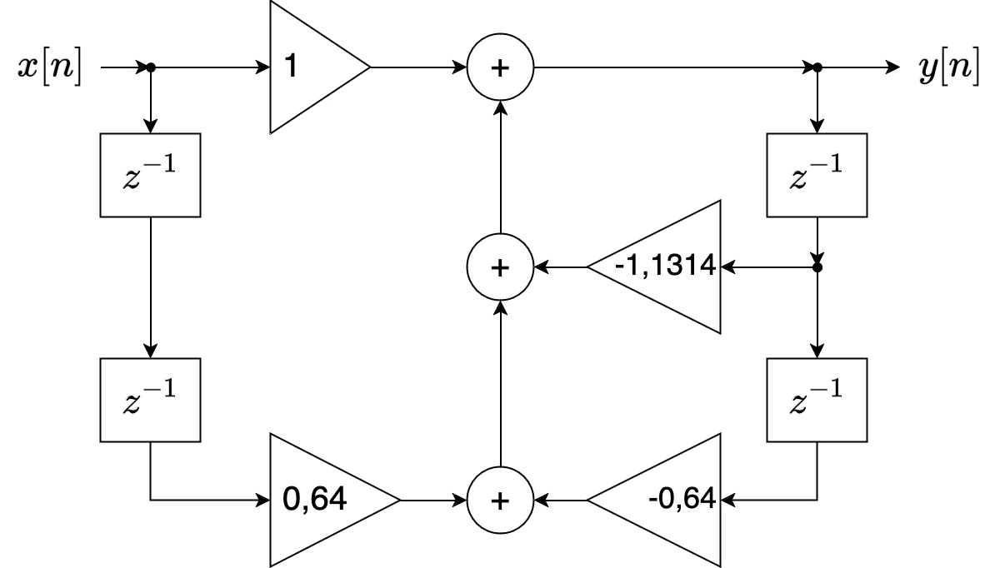

A eq. de diferenças do sistema ilustrado acima fica:

$y[n]=x[n]+0,64x[n-2]-1,1314y[n-1]-0,64y[n-2]$

Trabalhando esta expressão algebricamente:

$y[n]+1,1314y[n-1]+0,64y[n-2]=x[n]+0,64x[n-2]$

$Y(z)+1,1314z^{-1}Y(z)+0,64z^{-2}Y(z)=X(z)+0,64z^{-2}X(z)$

$Y(z)\left( 1+1,1324z^{-1}+0,64z^{-2}\right)=X(z)\left( 1+0,64z^{-2}\right)$

Que rende a seguinte função transferência:

$H(z)=\dfrac{Y(z)}{X(z)}=\dfrac{1+0,64z^{-2}}{1+1,1314z^{-1}+0,64z^{-2}} \cdot \dfrac{z^{+2}}{z^{+2}}$

eue rende a seguinte função transferência

$H(z)=\dfrac{z^2+0,64}{z^2+1,1314z+0,64}$

Neste função percebemos 2 zeros (raízes do numerador), localizados em $z=\pm \sqrt{-0,64}=\pm j\,0,8=0,8 \angle{(\pm 1,5708 \text{ (rad)})}= 0,8 \angle \pm{90^o}$. 

Adicionalmente temos pólos em $z=-0.5657 \pm j\,0.56567=0,8 \angle{(\pm 2,3562 \text{ (rad)})}=0,8 \angle{(\pm 135^o)}$. 

Os pólos correspondem às raízes do denominador de $H(z)$. 

Um diagrama pólo-zero deste sistema rende:

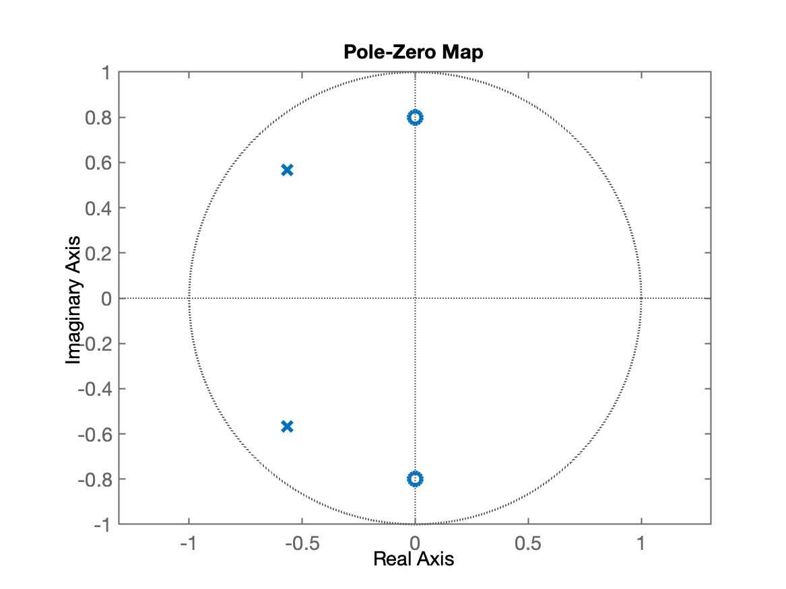

Usando a função `bode()` do Matlab para sistemas discretos (no plano-z), rende algo como:

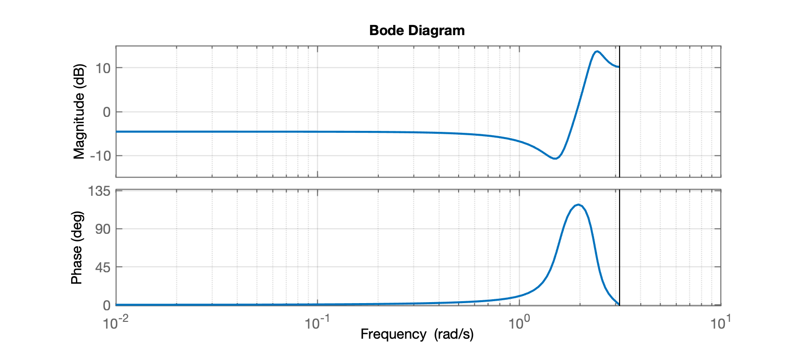

Note que o próprio Matlab alerta para a forma como calcula este diagrama:

> Para modelos de tempo discreto com tempo de amostragem $T_s$, `bode()` usa a transformação $z = \exp(j \cdot \omega \cdot T_s)$ para mapear o círculo unitário para o eixo real de frequência. A resposta de frequência é plotada apenas para frequências menores que a frequência de Nyquist $\pi/T_s$ (rad) ou $180^o/T_s$ (graus), e ==o valor padrão 1, para unidade de tempo (= 1 segundo), é assumido quando $Ts$ não é especificado==.

O gráfico anterior foi feito usando os comandos:

```matlab
>> H=tf([1 0 0.64],[1 1.1314 0.64],1)

H =
 
       z^2 + 0.64
  --------------------
  z^2 + 1.131 z + 0.64
 
Sample time: 1 seconds
Discrete-time transfer function.

>> bode(H)
```

Podemos usar a função `bodeplot()` que agrega mais opções para melhorar o gráfico anterior:

```matlab
>> handler=bodeplot(H);
>> setoptions(handler,'FreqUnits','Hz','PhaseVisible','off');
>> xlim([1/(2*10) 1/2])
```

E então temos o gráfico:

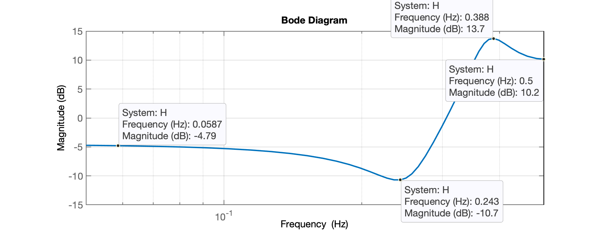

Note que o "eixo $x$" (das frequências), ainda está na escala logarítmica ($\log(\omega)$). 

Modificando para variação linear do eixo $x$ (frequências) obtemos um gráfico mais útil:

```matlab
>> setoptions(handler,'FreqScale','linear');
```

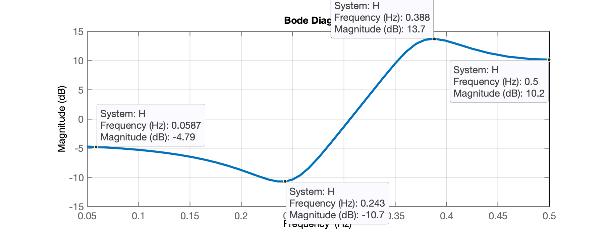

Note que o Matlab vai variar a frequência deste "Diagrama de Bode" até a metade da frequência de Nyquist. Neste caso: $f_s=1/T=1$ Hz, então, o diagrama só avança até $f_{max}=$ 0,5 Hz.

Este gráfico indica um pico de atenuação do sinal de entrada na frequência aproximada de 0,243 Hz ou, se considerarmos um gráfico genérico, temos que considerar que $180^o=\pi$ corresponde à $f_s/2$. 

No caso anterrior, quando ingressamos a *transfer function* no Matlab, somos "obrigados" à especificar um período de amostragem, e neste caso foi adotado $T=1$ segundo, o que corresponde à $f_s=1$ Hz. Mas o sistema será implementado usando $T=1$ segundos !? 

Se este sistema for amostrado à $f_s=100$ Hz, o pico de atenuação de sinal ($-10,7$ dB) terá ocorrido em $0,243*100=24,3$ Hz. Ou:

```matlab
>> H=tf([1 0 0.64],[1 1.1314 0.64], 1/100)

H =
 
       z^2 + 0.64
  --------------------
  z^2 + 1.131 z + 0.64
 
Sample time: 0.01 seconds
Discrete-time transfer function.

>> % Note que H(z) não mudou (em relação à fs = 1 Hz)
>> % Mas o "diagrama de Bode" vai mudar
>> handler=bodeplot(H);
>> setoptions(handler,'FreqUnits','Hz','FreqScale','linear','PhaseVisible','off');
>> xlim([100/(2*10) 100/2]) % iniciando uma década abaixo de fs/2 até fs/2
>> grid
```

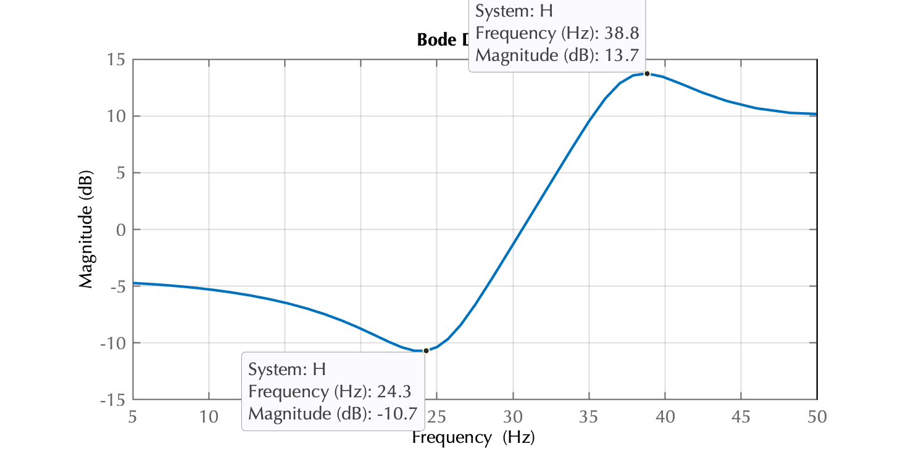


Voltando ao primeiro gráfico usando $f_s=1$ Hz, seu diagrama completo (amplitudes e fase $\times$ frequência) rende:

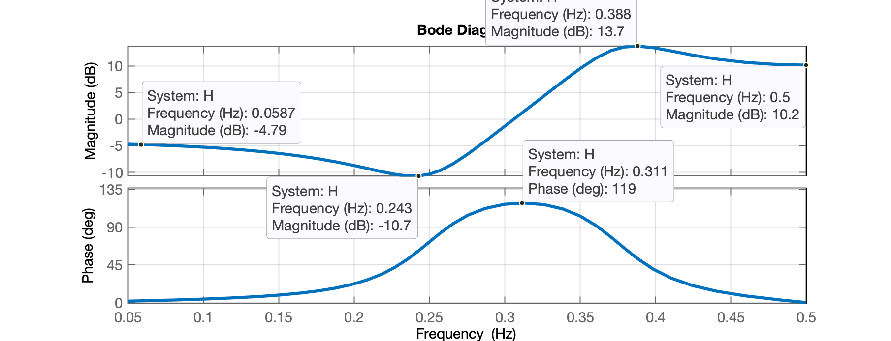

<!--Avançando até pág. 38 -- mau explicado, gráfico de "Bode" não serve para sistema discreto -->

Note que o gráfico anterior corresponde à vista superior de um gráfico de superfície da função $H(z)$:

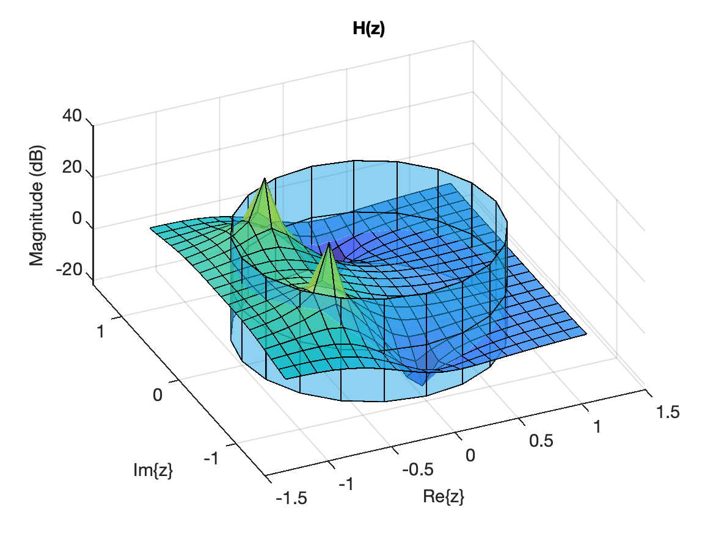

Pode-se perceber os picos positivos associados com os zeros de $H(z)$ e os picos negativos associados com os pólos de $H(z)$. Uma "vista superior" rende:

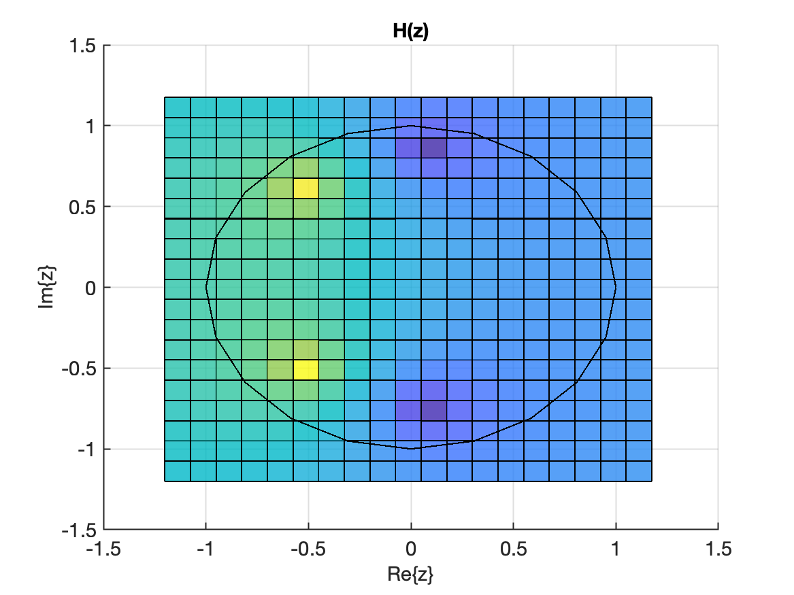

> Gráficos gerados usando *script*:
>
> ```matlab
> z_real_vals = [-1.2:0.125:1.2]; % z_real_vals = [-1.2:0.02:1.2];
> z_imag_vals = [-1.2:0.125:1.2];
> for m = 1: length(z_real_vals)
>     for n = 1: length(z_imag_vals)
>         z = z_real_vals(m)+z_imag_vals(n)*j;
>         H_z(n,m) = (z*z+0.64)/(z*z+1.1314*z+0.64);
>     end
> end
> figure
> [X,Y,Z]=cylinder(1);	% cria cilindro "3D", raio=1
> Z1=Z*20;				% alturas -20 e +20 para anéis circulares cilindro
> Z2=Z*(-20);
> u=length(Z);
> h1=surf (X, Y, Z1);
> h1.FaceAlpha = 0.5;
> hold on
> h2=surf (X, Y, Z2);
> h2.FaceAlpha = 0.5;
> 
> % gráfico de superfície de H(z)
> h3=surf(z_real_vals, z_imag_vals, 20*log10(abs(H_z)));
> h3.FaceAlpha = 0.8;
> 
> xlabel('Re\{z\}')
> ylabel('Im\{z\}')
> zlabel('Magnitude (dB)')
> title('H(z)')
> ```

Perceba mais alguns detalhes comparando o gráfico anterior com o diagrama de pólos e zeros:

| Gráfico de superfície de $H(z)$ | Diagrama pólo-zero |
| :---: | :---: |
| 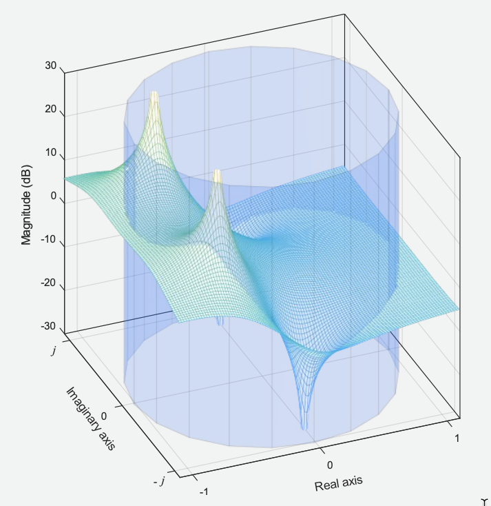 |  |

Perceba a intersecção entre o círculo unitário e a superfície formada por $H(z)$. A figura abaixo mostra os pontos de intersecção que o cilindro faria com o superfície de $H(z)$, mostrada como linhas de cores diferentes (azul, verde, vermelho e amarelo):

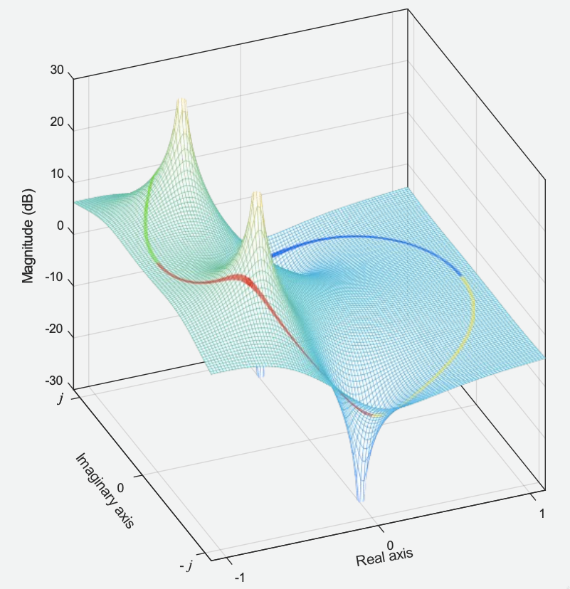

Uma vista superior plana (com um diagrama de pólo zero sobreposto) mostra que a linha azul está associada ao intervalo de ângulos de $0$ a $\frac{\pi}{2}=0,5\pi$ (rad) (0 à $90^o$) e a linha verde está associada aos ângulos de $0,5\pi$ à $\pi$ radianos ($90^o$ à $180^o$). Você também deve observar que os contornos das linhas azuis e amarelas serão “espelhados” no eixo real. Da mesma forma, as linhas de contorno verdes e vermelhas serão “espelhadas” ao longo do eixo real:

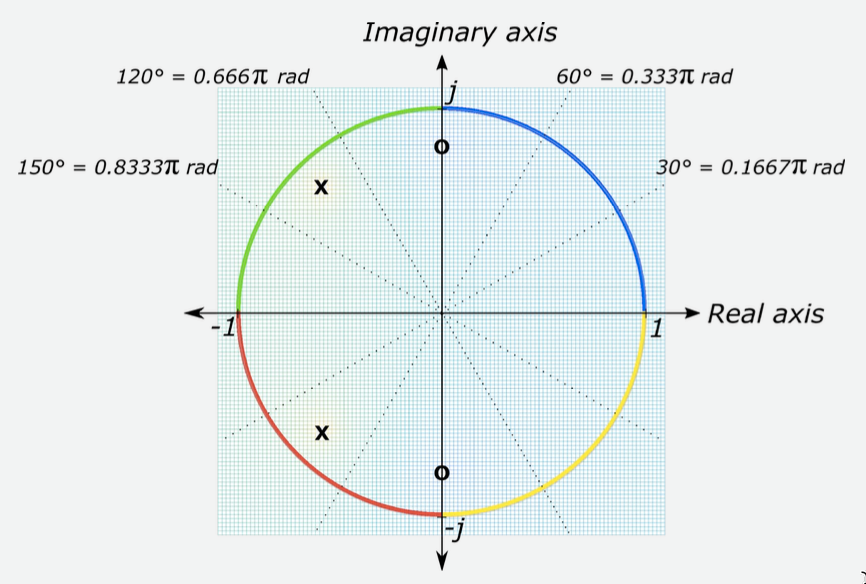

Se você traçasse a magnitude dos pontos de intersecção em relação ao ângulo feito com o eixo real, na faixa de ângulos de $-\pi$ a $\pi$ radianos ($-180^o$ à $+180^o$), (ou seja, plotasse a amplitude das linhas coloridas de interseção em relação ao ângulo), você obteria o gráfico mostrado abaixo:

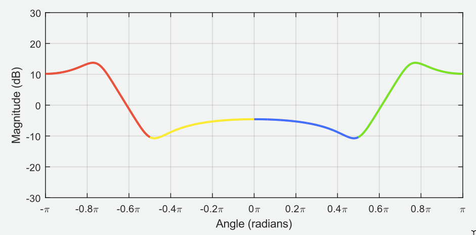

Você notará que o lado esquerdo do gráfico acima "espelha” o lado direito. Traçar o lado direito, de 0 a $\pi$ radianos (ou de 0 até $180^o$), por si só resulta no gráfico a seguir:


Note que o aumento da magnitude no ângulo de $0,5\pi$ é causado pelo "contorno do cone" associado ao pólo localizado em $-0,5657+j0,5657$. Observe também que a redução na magnitude em um ângulo de $0,5\pi$ é causada pelo "contorno do cone invertido" associado ao zero localizado em $0+j0,8$.

## Diagrama de Bode no mundo discreto

Acontece que se o eixo do ângulo horizontal for interpretado como frequência com unidades de **radianos por amostra**, então o gráfico acima é a **magnitude da resposta em frequência do sistema**, conforme mostrado na figura abaixo:

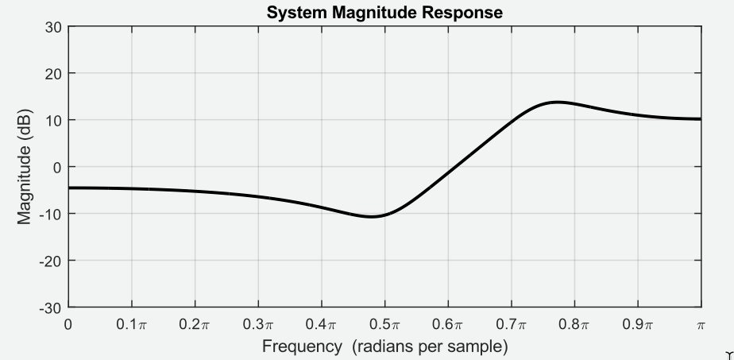

Observe que se você quisesse interpretar a resposta de frequência em Hertz (em vez de radianos por amostra), então você precisaria saber a taxa de amostragem associada ao sinal que estava passando pelo sistema. Para converter o eixo horizontal para Hertz, substitua $\pi$ por "metade da taxa de amostragem". Por exemplo, se a taxa de amostragem fosse de 100 Hz, então o ponto médio de $0,5\pi$ radianos por amostra no gráfico acima equivaleria a 25 Hz ($0,5*100/2=25$):

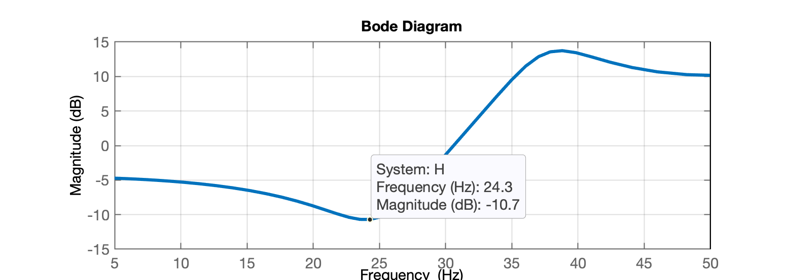

<!--Observe que não expliquei por que esse é o caso, no entanto, o leitor interessado pode obter uma visão sobre por que a resposta de frequência de um sistema pode ser determinada dessa maneira na seção intitulada “Por que avaliar o H(z) ao longo do ' círculo unitário'”.-->

==Note que o gráfico só avança até a frequência de Nyquist ($=f_s/2$)==.

### Uso da função freqz()

O Matlab pode facilitar as coisas ao disponibilizar a função:

[ [h, w] = **freqz**(b, a, n, fs) ](https://www.mathworks.com/help/signal/ref/freqz.html)

Esta função retorna o diagrama de  resposta frequêncial (magnitude e fase) e o vetor $f$ que corresponderá a frequência física real (em Hz), de $n-$pontos da função transferência do filtro fornecida com base nos seus coeficientes $b$ e $a$.
$n=[\; ]$ se o usuário não quiser especificar o número desejado de pontos.

Note:

$H(z)=\dfrac{Num(z)}{Den(z)} = \dfrac{b_0z^{n_b}+b_1z^{n_b-1}+\ldots+b_{n_b}z^0}{a_0z^{n_a}+a_1z^{n_a-1}+\ldots+a_{n_a}z^0}=\dfrac{Y(z)}{X(s)}$

Onde:
$n_b=$ grau do numerador, $Num(z)$ (ou $n_b=$ número de zeros de $H(z)$);
$n_a=$ grau do denominador, $Den(z)$ (ou $n_a=$ número de pólos de $H(z)$).

$H(z)=\dfrac{b_0z^0 + b_1z^{-1}+b_2z^{-2}+\ldots+b_{n_b}z^{-n_b}}{ a_0z^0 + a_1z^{-1}+a_2z^{-2}+\ldots+a_{n_a}z^{-n_a} } = \dfrac{Y(z)}{X(z)}$

$Y(z)\left(a_0 + a_1z^{-1} + a_2z^{-2} + \ldots + a_{n_a}z^{-n_a} \right) = X(z)\left( b_0 + b_1z^{-1} + b_2z^{-2} + \ldots + b_{n_b}z^{-n_b} \right)$

$\begin{array}{rcll}
a_0\,y[n] &=& b_0\,x[n] &+& b_1\,x[n-1] + b_2\,x[n-2] + \ldots + b_{n_b}\,x[n-n_b] +\\
          & &           &-& a_1\,y[n-1] - a_2\,x[n-2] - \ldots - a_{n_a}\,y[n-n_a] \end{array}$

Lembre-se eventualmente da função **[filter()](funcao_filter.html)**.

A função **freqz()** aplicada no caso anterior, resultaria em:

```matlab
>> figure;
>> zpk(H)

ans =
 
      (z^2 + 0.64)
  ---------------------
  (z^2 + 1.131z + 0.64)
 
Sample time: 0.01 seconds
Discrete-time zero/pole/gain model.

>> [numd, dend]=tfdata(H,'v')
numd =
            1            0         0.64
dend =
            1       1.1314         0.64
>> freqz(numd, dend, [], 100)
```

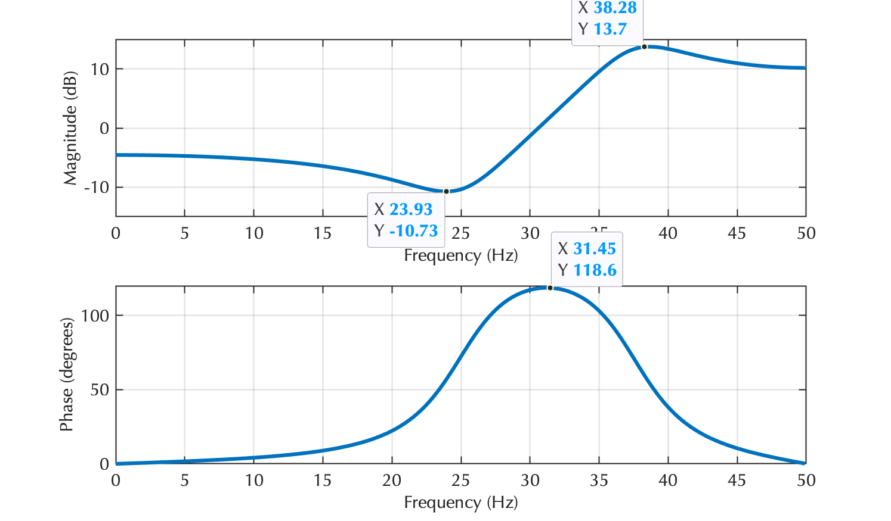


## Notas sobre *pólos* e *zeros* localizados na origem

<!-- até pág. 37-->

⚠️ **Detalhes**:  você verá que um pólo ou zero localizado na origem ($0 + 0𝑗$) ==não afeta a resposta em frequência de um sistema==. 

Considere a função transferência abaixo:

$H(z)=\dfrac{1}{z}$

Este sistema possui um pólo localizado em $z=0=0j$, isto é, na origem do plano-z.

Num sistema com um único pólo na origem, a intersecção da superfície $H(z)$ com o cilindro unitário seria tal que a amplitude dos pontos de interseção seria igual, conforme mostrado nas ilustrações abaixo. Na verdade, você descobrirá que a amplitude dos pontos de interseção seria de 0 dB.

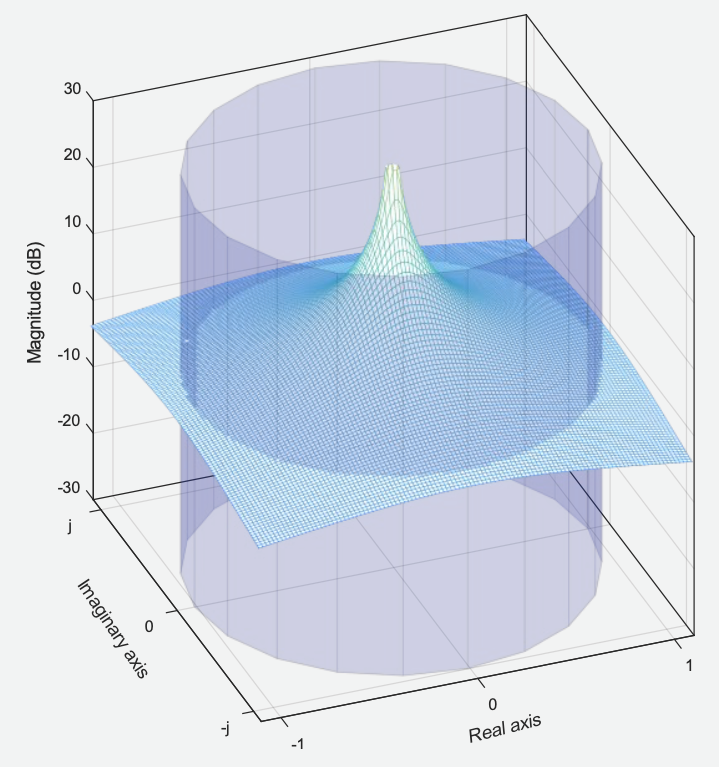

Outra interpretação pode ser feita de um ponto de vista matemático. Recorde que a superfície de $H(z)$ mostra a magnitude de $𝐻(𝑧)$ na escala de decibéis (ou seja, $20\log_{10}(\vert H(z) \vert)$) para um intervalo de valores de $z$ e $z$ é um número complexo. Na imagem anterior, para gerar a superfície $H(z)$, foram calculados pontos para vários valores de $z$, com a parte real variando no intervalo: $[-1.1, 1.1]$ e a parte imaginária variando no intervalo: $[-1.1j, 1.1j]$.

As interseções ocorrem quando a magnitude de $z$ é igual à 1, ou $|z|=1$. Alguns pontos de interseção são fáceis de serem identificados, por exemplo quando $z$ é igual à: $-1$, $1$, $j$ e $-j$, os quais possuem magnitude de 1.

Para encontrar todos os pontos de intersecção será necessário avaliar a expressão $20\log_{10}(|H(z|)$ para todos os casos de magnitude de $z$ igual à 1. Uma vez que $H(z)=1/z$, então $|H(z)|=1/|z|$, assim, a magnitude de $H(z)$ será igual à 1 quando $|z|=1$:

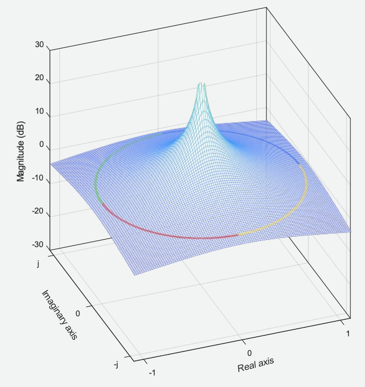

Ou do ponto de vista "superior":

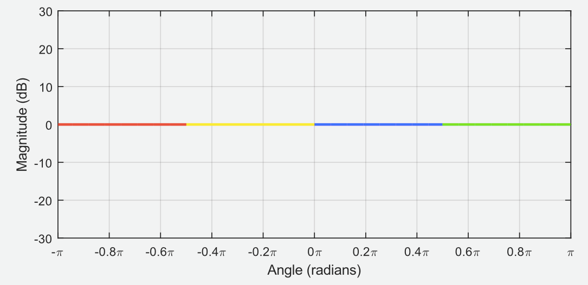

Uma situação muito semelhante surgiria se existisse um único zero na superfície $H(z)$. Desta vez você descobriria que a interseção da superfície $H(z)$ com o cilindro unitário seria tal que a amplitude dos pontos de interseção seria igual a 0 dB ($=|z|=1$).

==**Atenção:**==

👋 O que isso mostra é que: ==pólos ou zeros colocados na origem não afetarão a magnitude da resposta em frequência de um sistema==. 


### Por que acrescentar pólos e zeros na origem do plano-z?

Isto levanta a questão: 

**− Por que então é que existem pólos e zeros na origem se eles não afectam o comportamento de “magnitude” do sistema?** 

A resposta é que, embora não afetem a resposta de magnitude, ==afetam os atrasos no sistema== (que está associado ao diagrama de fase (ou defasagens) na resposta frequêncial de um sistema).

Em geral, você descobrirá que um sistema normalmente possui um número igual de pólos e zeros. Sistemas que não possuem um número igual de pólos e zeros terão atrasos “desnecessários” introduzidos no sistema.

<!--Isto pode ser explicado através de um exemplo, que darei agora, mas gostaria de salientar que esta não é realmente uma questão muito importante para se preocupar e é incluída apenas para o leitor interessado. Se você achar o exemplo a seguir confuso, sinta-se à vontade para ignorá-lo. - pag. 41/99-->

Voltando ao sistema anterior (com pólo na origem do plano-z):

$H(z)=\dfrac{1}{z}$

Se multiplicarmos o numerador e denominador por $z^{-1}$, a função transferência fica:

$H(z)=\left(\dfrac{1}{z}\right) \cdot \left( \dfrac{z^{-1}}{z^{-1}}\right)= \dfrac{z^{-1}}{1} = \dfrac{1z^{-1}+0z^0}{1z^0}$

Adaptando esta expressão para o formato usualmente adotado para filtros, podemos determinar os componentes $b$ a $a$. Neste caso, $b_1=1$, $b_0=0$ e $a_0=1$. A equação de diferenças fica:

$H(z)=\dfrac{Y(z)}{X(z)}=\dfrac{z^{-1}}{1}$

$Y(z)=z^{-1}X(z)$

$y[n]=x[n-1]$

Na forma de um diagrama de fluxo de sinais teríamos algo como:

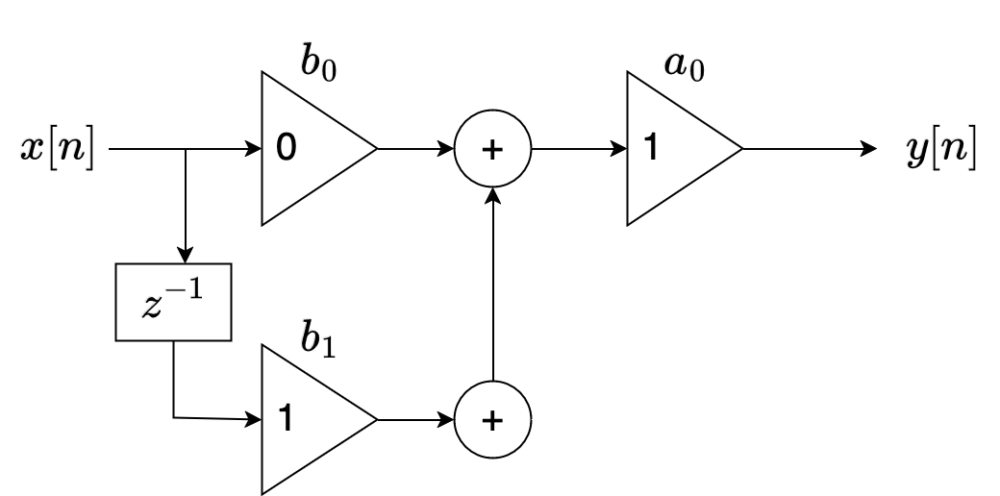

Que rende uma estrutura simplificada como:

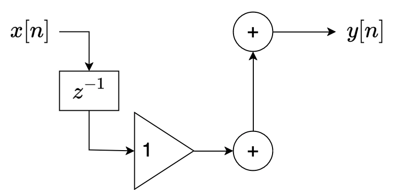

O que você deve perceber é que este sistema simplesmente ==atrasa a entrada em uma amostra== e nada mais. Embora possa haver razões práticas para querer atrasar um sinal por uma amostra, em muitos casos, como na filtragem de sinais, o atraso pode não ser desejável e serve simplesmente para desacelerar um processo em uma amostra.

Na maioria dos casos, você descobrirá que os sistemas terão o mesmo número de pólos e zeros; caso contrário, atrasos desnecessários poderão ser introduzidos no sistema, como demonstrado no exemplo anterior.


## Exemplo 2

Neste segundo exemplo, como no primeiro exemplo, há também um par de pólos e um par de zeros. No entanto, os pólos e zeros estão em locais diferentes. Observe que os pólos estão mais próximos do círculo unitário e em um ângulo diferente, quando comparados ao primeiro exemplo. Os zeros estão à mesma distância do círculo unitário, mas estão localizados em um ângulo de 45 graus ($\pi/4=0,25\pi$ radianos). Esta mudança na localização dos pólos e zeros resulta em contornos diferentes na superfície H(z) e, portanto, as interseções do ‘cilindro unitário’ com a superfície H(z) também serão diferentes.

A expressão para $H(z)$ neste caso é:

$H(z)=\dfrac{z^2-1,1314z+0,64}{z^2+0,95z+0,9025}$

Trabalhando esta expressão no Matlab/Ocatve, descobrimos que:

```matlab
>> T=1; % definindo uma taxa de amostragam arbitrária de 1 Hz
>> H=tf([1 -1.1314 0.64], [1 0.95 0.9025], T)

H =
 
  z^2 - 1.131 z + 0.64
  ---------------------
  z^2 + 0.95 z + 0.9025
 
Sample time: 1 seconds
Discrete-time transfer function.

>> pole(H)
ans =
       -0.475 +    0.82272i
       -0.475 -    0.82272i
>> zero(H)
ans =
       0.5657 +    0.56567i
       0.5657 -    0.56567i
>> pzmap(H)
>> axis equal
>> % isolando magnitude e fase de um dos zeros:
>> angle([0.5657 +    0.56567i])
ans =
      0.78537
>> ans*180/pi	% resposta em graus
ans =
       44.998
>> abs(0.5657 +    0.56567i)
ans =
          0.8
>> % calculando magnitude e fase de um dos pólos:
>> angle([-0.475 +    0.82272i])
ans =
       2.0944
>> ans*180/pi
ans =
          120
>> abs([-0.475 +    0.82272i])
ans =
         0.95
>> % observando os resultados no gráfico do plano-z...
```

Percebemos a seguinte disposição no plano-z:

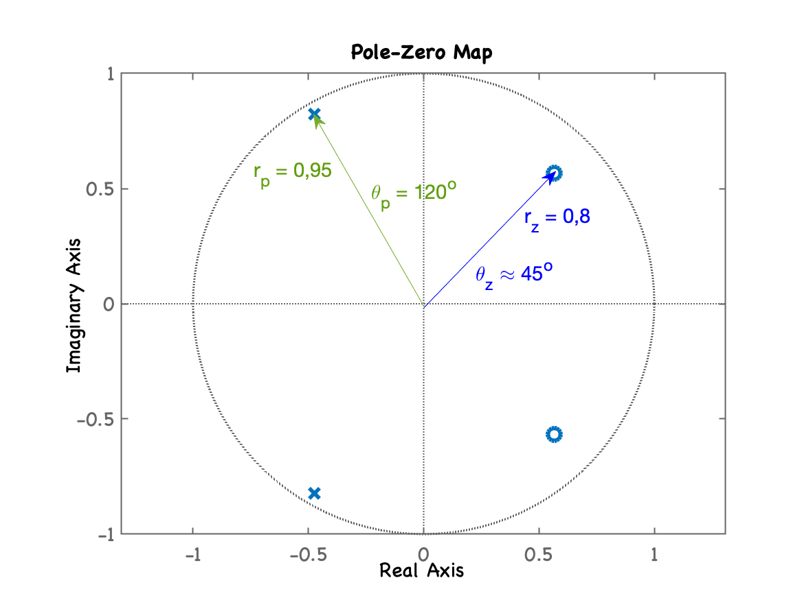

Um gráfico de superfície de $H(z)$ gera:

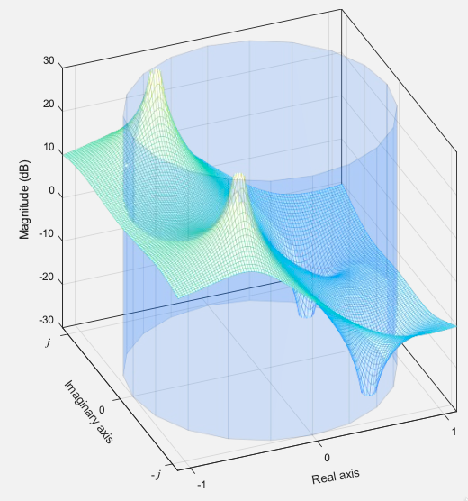

Destacando a intersecção com o círculo unitário temos:

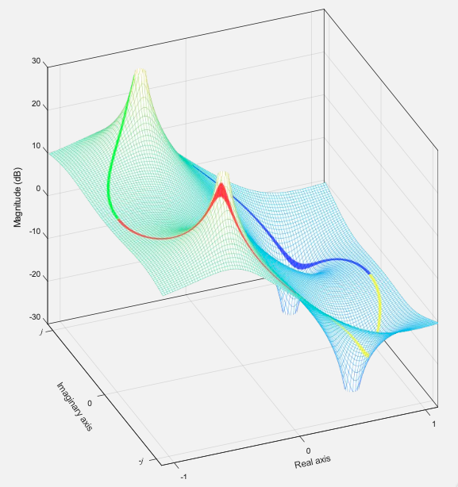

O gráfico à seguir mostra a amplitude dos pontos de intersecção em relação ao ângulo feito com o eixo real, na faixa de ângulos de $-180^o$ a $180^o$ para este segundo exemplo. 

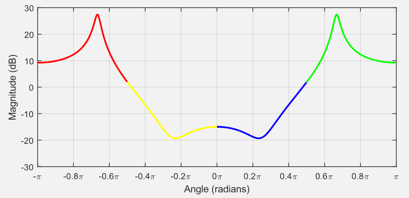

Você deve comparar isso com o primeiro exemplo e notar a **amplificação** significativa em $0,66\pi$ e $-0,66\pi$ radianos ($0,66\pi = 118,8^o$), **causada pelos pólos** estarem mais próximos do círculo unitário e posicionados na linha de ângulo radial 0,66π radianos e -0,66π radianos. Note, que a antenução (cones negativos) está concentrada próxima dos $45^o= \pi/4=0,25 \pi$ (onde estão localizados os zeros de $H(z)$).

Mais uma vez, os lados esquerdo e direito são versões espelhadas um do outro e vamos nos concentrar no lado direito de 0 a $\pi$ radianos (ou de 0 à $180^o$) (que corresponde à freq. de Nyquist, ou $f_s/2$):


Gráfico similar pode ser obtido no Matlab fazendo-se:

```matlab
>> figure; handler=bodeplot(H);
>> setoptions(handler,'FreqUnits','Hz','PhaseVisible','off');
>> xlim([1/(2*10) 1/2])
>> setoptions(handler,'FreqScale','linear');
>> grid
```

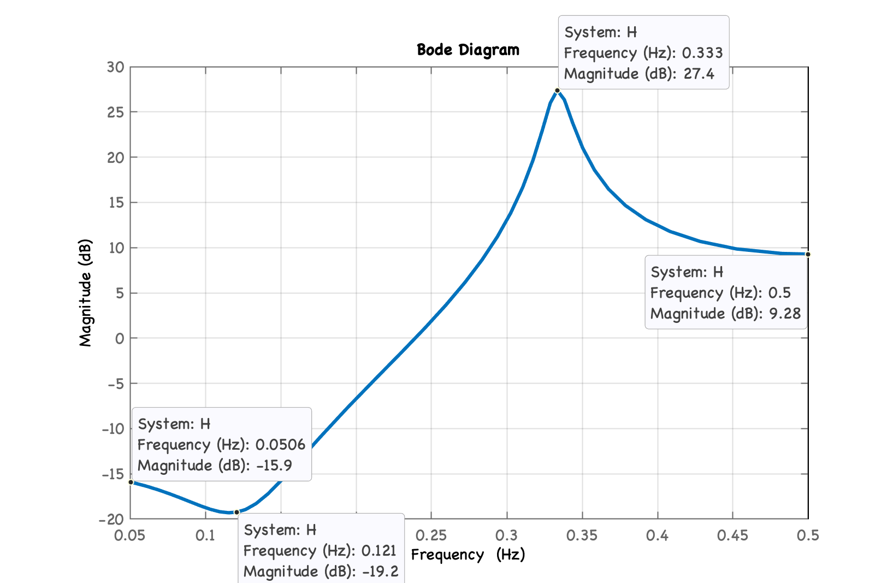


---

**Opcional**:

* O site do Matemática/Wolfrang traz um aplicativo Java capaz de gerar os gráficos acima para filtros de 1a-ordem:

  [First-Order Digital Filter Design](https://demonstrations.wolfram.com/FirstOrderDigitalFilterDesign/) (acessado em 13/05/2024);

  

⏩ Próximo tópico sugerido: [projeto de sistema usando alocação pólo-zero](projeto_polo_zero.html).

----

<font size="1">Theme: Fluent.</font>

<script language="JavaScript">
<!-- Hide JavaScript...
var LastUpdated = document.lastModified;
document.writeln ("🌊 Fernando Passold, página atualizada em " + LastUpdated); // End Hiding -->
</script>

