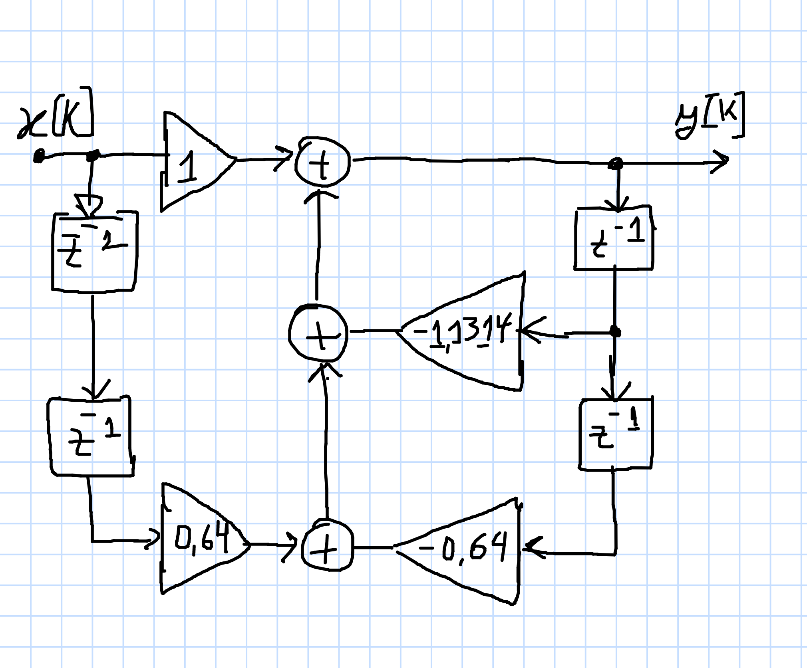

# Papel dos pólos e zeros na magnitude da resposta em frequência.

<!-- Continuação da pág. 26/99 de 5-TheZ-transform-Apracticaloverview.pdf -->

Como os pólos e zeros afetam a magnitude da resposta em frequência de um sistema?

Anteriormente (no tópico: [[Funções Trasferência](funcao_transferencia.html)]) foi mostrado como a localização dos pólos e zeros afeta os contornos da superfície $H(z)$ de um sistema, com pólos associados a "cones" na superfície $H(z)$ e zeros associados a "cones invertidos". 

<!-- Sinal de ECG bruto: arquivo texto: `noisy_ecg.txt` , usado na pág. 46, aplicando filtro PB de 50 Hz sobre o mesmo, simulação usando Matlab -- disponível em: https://pzdsp.com/wavs/noisy_ecg.txt ? Yes! 15/04/2024 -->

Neste documento, será mostrado como os pólos e zeros afetam a resposta de frequência de um sistema usando vários exemplos. Você pode achar que o primeiro exemplo não é muito claro, mas se você relacionar cada um dos exemplos entre si, isso pode ajudar na sua compreensão. 

<!--Observe que não explico por que a resposta de frequência pode ser determinada da maneira que descrevo aqui; no entanto, esses detalhes são fornecidos na seção intitulada “Por que avaliar o H(z) ao longo do ‘círculo unitário’”. pág. 27-->

**Exemplo 1**:

Para o primeiro exemplo, será usado o sistema fornecido pelo diagrama de fluxo de sinal mostrado abaixo. Também são fornecidas a equação de diferenças de sistemas e a função de transferência.



A eq. de diferenças do sistema ilustrado acima fica:

$y[n]=x[n]+0,64x[n-2]-1,1314y[n-1]-0,64y[n-2]$

Trabalhando esta expressão algebricamente:

$y[n]+1,1314y[n-1]+0,64y[n-2]=x[n]+0,64x[n-2]$

$Y(z)+1,1314z^{-1}Y(z)+0,64z^{-2}Y(z)=X(z)+0,64z^{-2}X(z)$

$Y(z)\left( 1+1,1324z^{-1}+0,64z^{-2}\right)=X(z)\left( 1+0,64z^{-2}\right)$

Que rende a seguinte função transferência:

$H(z)=\dfrac{Y(z)}{X(z)}=\dfrac{1+0,64z^{-2}}{1+1,1314z^{-1}+0,64z^{-2}} \cdot \dfrac{z^{+2}}{z^{+2}}$

eue rende a seguinte função transferência

$H(z)=\dfrac{z^2+0,64}{z^2+1,1314z+0,64}$

Neste função percebemos 2 zeros (raízes do numerador), localizados em $z=\pm \sqrt{-0,64}=\pm j\,0,8=0,8 \angle{(\pm 1,5708 \text{ (rad)})}= 0,8 \angle \pm{90^o}$. Adicionalmente temos pólos em $z=-0.5657 \pm j\,0.56567=0,8 \angle{(\pm 2,3562 \text{ (rad)})}=0,8 \angle{(\pm 135^o)}$. Os pólos correspondem às raízes do denominador de $H(z)$. Um diagrama pólo-zero deste sistema rende:


Usando a função `bode()` do Matlab para sistemas discretos (no plano-z), rende algo como:


Note que o próprio Matlab alerta para a forma como calcula este diagrama:

> Para modelos de tempo discreto com tempo de amostragem $T_s$, `bode()` usa  transformação $z = \exp(j \cdot \omega \cdot T_s)$ para mapear o círculo unitário para o eixo real de frequência. A resposta de frequência é plotada apenas para frequências menores que a frequência de Nyquist $\pi/T_s$, e o valor padrão 1, para unidade de tempo (= 1 segundo), é assumido quando $Ts$ não é especificado.

O gráfico anterior foi feito usando os comandos:

```matlab
>> H=tf([1 0 0.64],[1 1.1314 0.64],1)

H =
 
       z^2 + 0.64
  --------------------
  z^2 + 1.131 z + 0.64
 
Sample time: 1 seconds
Discrete-time transfer function.

>> bode(H)
```

Podemos usar a função `bodeplot()` que agrega mais opções para melhorar o gráfico anterior:

```matlab
>> handler=bodeplot(H);
>> setoptions(handler,'FreqUnits','Hz','PhaseVisible','off');
>> xlim([1/(2*10) 1/2])
```

E então temos o gráfico:


Note que o eixo X (das frequências), ainda está na escala logarítmica. 

Modificando para variação linear do eixo X (frequências) e então temos um gráfico mais útil:

```matlab
>> setoptions(handler,'FreqScale','linear');
```


Note que o Matlab vai variar a frequência deste "Diagrama de Bode" até a metade da frequência de Nyquist. Neste caso: $f_s=1/T=1$ Hz, então, o diagrama só avança até $f_{max}=$ 0,5 Hz.

Este gráfico indica um pico de atenuação do sinal de entrada na frequência aproximada de 0,243 Hz ou, se considerarmos um gráfico genérico, temos que considerar que $180^p=\pi$ corresponde à $f_s/2$. No caso anterrior, quando ingressamos a *transfer function* no Matlab, somos "obrigados" à especificar um período de amostragem, e neste caso foi adotado $T=1$ segundo, o que corresponde à $f_s=1$ Hz.

Se este sistema for amostrado à $f_s=100$ Hz, o pico de atenuação de sinal ($-10,7$ dB) teria ocorrido em $0,243*100/2=12,5$ Hz.

Um diagrama completo renderia:


<!--Avançando até pág. 38 -- mau explicado, gráfico de "Bode" não serve para sistema discreto -->

Note que o gráfico anterior corresponde à vista superior de um gráfico de superfície da função $H(z)$:


Pode-se perceber os picos positivos associados com os zeros de $H(z)$ e os picos negativos associados com os pólos de $H(z)$. Uma "vista superior" rende:


> Gráficos gerados usando *script*:
>
> ```matlab
> z_real_vals = [-1.2:0.125:1.2]; % z_real_vals = [-1.2:0.02:1.2];
> z_imag_vals = [-1.2:0.125:1.2];
> for m = 1: length(z_real_vals)
>     for n = 1: length(z_imag_vals)
>         z = z_real_vals(m)+z_imag_vals(n)*j;
>         H_z(n,m) = (z*z+0.64)/(z*z+1.1314*z+0.64);
>     end
> end
> figure
> [X,Y,Z]=cylinder(1);	% cria cilindro "3D"
> Z1=Z*20;				% alturas -20 e +20 para anéis circulares cilindro
> Z2=Z*(-20);
> u=length(Z);
> h1=surf (X, Y, Z1);
> h1.FaceAlpha = 0.5;
> hold on
> h2=surf (X, Y, Z2);
> h2.FaceAlpha = 0.5;
> 
> % gráfico de superfície de H(z)
> h3=surf(z_real_vals, z_imag_vals, 20*log10(abs(H_z)));
> h3.FaceAlpha = 0.8;
> 
> xlabel('Re\{z\}')
> ylabel('Im\{z\}')
> zlabel('Magnitude (dB)')
> title('H(z)')
> ```


**Notas sobre *pólos* e *zeros* localizados na origem**


