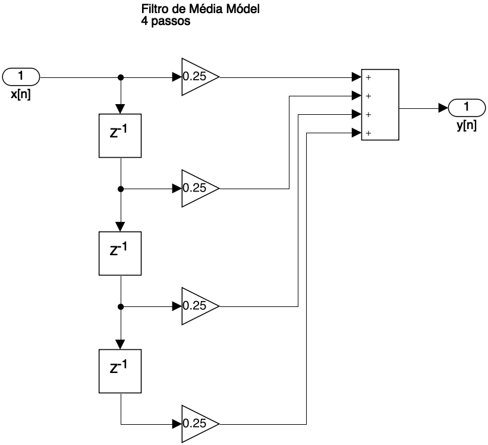

<font size="1">[Philosopher's Path - Kyoto](https://www.japan-experience.com/all-about-japan/kyoto/attractions-excursions/the-path-of-philosophy)</font>

<!--
Ref.: Digital Signal Processing Foundations, David Dorran, Technological University Dublin, david.dorran@tudublin.ie
(PDF: Digital Signal Processing Foundations.pdf), pág. 19 - 23... 
-->

# Intro Sistemas Discretos

Sistemas discretos são usados para manipular ou modificar sinais discretos de maneira significativa. Eles recebem um sinal discreto (sequência de números) como entrada e geram um sinal discreto em sua saída, ver próxima figura.


Uma aplicação comum de sistemas discretos é remover alguma interferência ou componente de “ruído” de um sinal. Por exemplo, sinais de ECG podem ser afetados pela introdução de ruído de equipamentos elétricos nas proximidades dos sensores usados para capturar o sinal. Este tipo de ruído está normalmente presente em frequências de 50 Hz ou 60 Hz, dependendo de onde você mora, e sistemas discretos, conhecidos como filtros, podem ser projetados para remover tais artefatos -- ver próxima figura.


Outra aplicação comum de sistemas discretos é modelar o comportamento de sistemas do mundo real, como uma ponte ou a suspensão de um carro. Usando a suspensão do carro como exemplo, imagine que você queira experimentar um novo design de suspensão para um carro de corrida e gostaria de ver como ele se comporta em pistas de corrida acidentadas. Uma maneira seria construir a suspensão, alugar uma pista para o dia, testar seu projeto, voltar à oficina para fazer os ajustes e repetir este procedimento quantas vezes for necessário. Isso pode ser muito caro se você precisar testar com frequência! Uma alternativa é construir um sistema discreto que modele o design da sua suspensão; em seguida, criar um sinal que modele as forças aplicadas ao carro conforme ele passa por solavancos; e, finalmente, usar o computador para analisar e ajustar o funcionamento do projeto antes de passar o caro pelo processo de fabricação.

Os sistemas discretos são capazes de alcançar resultados surpreendentes e são fundamentais para o processamento digital de sinais. Na próxima seção você aprenderá sobre os três componentes básicos de sistemas discretos: somadores, multiplicadores e atrasos. Você também verá como visualizar sistemas discretos usando diagramas de fluxo de sinal e como eles se relacionam com a descrição matemática de um sistema discreto, ou seja, com as **equações de diferenças**.

### <!--Equações diferenciais e diagramas de fluxo de sinal-->

<!--Nesta seção, você verá como operam alguns sistemas discretos práticos e também verá seus **diagramas de fluxo de sinal** e suas **equações de diferenças**. Depois de concluir esta seção, será importante que você seja capaz de associar as equações de diferenças com os diagramas de fluxo de sinal para cada caso.--> 

<!-- Também serão mostrados alguns exemplos de código que podem ser usados para implementar cada sistema; se você deseja apenas ter uma ideia do DSP, não é importante que você entenda totalmente esse código, mas se quiser poder aplicar o DSP, você o fará.-->

## Ex.1) Caso do Amplificador

Talvez o sistema discreto mais básico seja um amplificador. A figura abaixo mostra um sinal discreto $x[n]$ sendo amplificado por um fator de 2, com todas as amostras do sinal de entrada sendo multiplicadas por 2. Guiar-se pela próxima figura:


Embora este seja um sistema muito básico, ainda assim é muito útil. Por exemplo, em aplicações de áudio, um tal sistema teria o efeito de aumentar o volume do sinal de áudio.

Sistemas discretos são frequentemente descritos matematicamente e este sistema amplificador pode ser descrito usando a seguinte equação (referida como equação de diferenças):

$y[n]=2\cdot x[n]$

onde $x[n]$ representa a entrada do sistema, $y[n]$ representa a saída e $n$ representa o número da amostra.

Ao resolver esta equação de diferenças para diferentes valores de $n$ você pode determinar a saída do sistema para qualquer sinal discreto de entrada (sequência de números). Por exemplo, vamos descobrir qual será a saída do amplificador se a entrada do sistema for dada pela seguinte sequência:

$x[n]=[10 \quad 20 \quad 5 \quad 50 \quad 60]$

Vamos primeiro resolver para $n = 0$, portanto:

$y[0]=2 \cdot x[0]$

Substituindo $x[0]$ por $10$ obtemos:

$y[0]=2 \cdot 10 = 20$

Se você resolvesse para $n = 1$, descobriria que $y[1]=40$; para $n = 2$ dá $y[2]=10$; $y[3]=100$; etc.

Tenho certeza de que você achará que resolver essas equações é uma tarefa trivial; no entanto, seria extremamente tedioso determinar a saída do sistema manualmente se você estivesse lidando com milhares ou milhões de amostras de entrada. É aqui que os computadores são extremamente úteis, pois podem facilmente multiplicar milhões de números a cada segundo. 

Usando Matlab/Octave:

```matlab
>> x = [10 20 5 50 60];
>> y = 2*x;
>> y
y =
    20    40    10   100   120
>> [x' y']
ans =
    10    20
    20    40
     5    10
    50   100
    60   120
>> 
```

Outra maneira de representar um sistema discreto é usar o que chamamos de **diagrama de fluxo de sinal**. O diagrama de fluxo de sinal é uma representação gráfica de um sistema discreto que ilustra como o sistema se comporta. A figura abaixo mostra o diagrama de fluxo de sinal para o sistema amplificador. O diagrama de fluxo de sinal contém um operador multiplicador que multiplica qualquer entrada por um fator de 2:


<font size="2">
> Obs.: Para transformar um diagrama de blocos do Matlab/Simulink em uma imagem, fazer:
>
> ```matlab
> >> print(‘-samplificador','-dpng','-r150','amplificador.png')
> ```
>
> onde: `-s<nome do arquivo SLX (sem a extensão)>` indica que certo "sistema" (ou diagrama de blocos) deve ser "impresso"; `-dpng` indica que deve ser gerado um arquivo de imagem PNG, `-r150` indica a resolução desejada (150 dpi).

</font>

## Ex. 2) Filtro de Média Móvel

### Exemplo de uso de filtro de média móvel

Problema do nível de um rio:


<!--
Ref.: Digital Signal Processing Foundations, David Dorran, Technological University Dublin, david.dorran@tudublin.ie
(PDF: Digital Signal Processing Foundations.pdf), pág. 19 - 23... 
-->

Níveis de um rio capturados a cada 20 minutos:

```matlab
>> nivel=[.375 .35 .425 .475 .4 .375 .525 .425 .475 .425 .5 .45 .575 .525 .6 .675 .575 .7 .725 .6];
>> % salvando dados num arquivo .txt
>> save('nivel.txt', '-ascii', 'nivel')
>> u=length(nivel)
u =
    20
>> 
```

Único problema: se for traçado um gráfico não irá aparecer no gráfico o instante de captura de cada dado.

Criando vetor com dados das supostas coletas:

```matlab
>> minute(datetime('now'))
ans =
    42
>> minute(datetime('11:42:30'))
ans =
    42
>> t0=datetime('10:00:00')
t0 = 
  datetime
   27-Mar-2024 10:00:00
>> tfim=t0+u*minutes(20)
tfim = 
  datetime
   27-Mar-2024 16:40:00
>> TimeStamp=[t0:minutes(20):tfim]
TimeStamp = 
  1×21 datetime array
Columns 1 through 3
   27-Mar-2024 10:00:00   27-Mar-2024 10:20:00   27-Mar-2024 10:40:00
Columns 4 through 6
   27-Mar-2024 11:00:00   27-Mar-2024 11:20:00   27-Mar-2024 11:40:00
Columns 7 through 9
   27-Mar-2024 12:00:00   27-Mar-2024 12:20:00   27-Mar-2024 12:40:00
Columns 10 through 12
   27-Mar-2024 13:00:00   27-Mar-2024 13:20:00   27-Mar-2024 13:40:00
Columns 13 through 15
   27-Mar-2024 14:00:00   27-Mar-2024 14:20:00   27-Mar-2024 14:40:00
Columns 16 through 18
   27-Mar-2024 15:00:00   27-Mar-2024 15:20:00   27-Mar-2024 15:40:00
Columns 19 through 21
   27-Mar-2024 16:00:00   27-Mar-2024 16:20:00   27-Mar-2024 16:40:00
>> TimeStamp.Format='HH:mm';
>> TimeStamp'
ans = 
  21×1 datetime array
   10:00
   10:20
   10:40
   11:00
   11:20
   11:40
   12:00
   12:20
   12:40
   13:00
   13:20
   13:40
   14:00
   14:20
   14:40
   15:00
   15:20
   15:40
   16:00
   16:20
   16:40
>> size(TimeStamp)
ans =
     1    21
>>      
```

Pequeno erro no momento de criar vetor com horários das capturas... ele acabou ficando com 21 pontos. E deveriam ser 20 pontos. Corrigindo:

```matlab
>> tfim=t0+(u-1)*minutes(20)
tfim = 
  datetime
   27-Mar-2024 16:20:00
>> TimeStamp=[t0:minutes(20):tfim];
>> size(TimeStamp)
ans =
     1    20
>> 
```

Agora podemos tentar plotar o gráfico:

```matlab
>> plot(TimeStamp, nivel)
>> title('Nível do Rio')
>> ylabel('Nível (metros)');
>> grid
>> 
```


Aplicar o filtro de média móvel de 4 passos rende:

Obs.: aparentemente pode-se usar a função `filter()` do Matlab para computar a saída resultante:

```matlab
>> a=[1];
>> b=[0.25 0.25 0.25 0.25];
>> y4=filter(b,a,nivel);
>> figure; plot(TimeStamp, nivel, 'k--', TimeStamp, y4, 'b-')
```


Segue abaio o Diagrama de fluxo de sinal deste filtro digital:




### Detalhes sobre a função `filter()` do Matlab

Uso:

```matlab
>> y = filter(b, a, x)
```

onde $x=$ vetor do sinal de entrada;
$y=$ vetor de saída (sinal filtrado);
$a$ e $b$ são coeficientes do filtro de tal modo que:

$\begin{array}{rcll}
a(1)*y(n) &=& b(1)*x(n) &+& b(2)*x(n-1) + ... + b(nb+1)*x(n-nb) +\\
          & &           &-& a(2)*y(n-1) - ... - a(na+1)*y(n-na) \end{array}$

O que dá no mesmo que:

$\begin{array}{rcll}
a_1\,y[n] &=& b_1\,x[n] &+& b_2\,x[n-1] + \ldots + b_{n_b+1}\,x[n-n_b] +\\
          & &           &-& a_2\,y[n-1] - \ldots - a_{n_a+1}\,y[n-n_a] \end{array}$

Obs.: índices de matrizes (ou vetores) no Matlab, **não iniciam** em zero.

$\begin{array}{rcll}
a_1\,Y(z) &=& b_1\,X(z) &+& b_2\,z^{-1}X(z) + b_3\,z^{-2}X(z) + \ldots + b_{n_b+1}\,z^{-n_b}X(z) +\\
          & &           &-& a_2\,z^{-1}Y(z) - a_3\,z^{-2}Y(z) - \ldots - a_{n_a+1}\,z^{-n_a}Y(z) \end{array}$

Percebe-se que esate filtro trabalha com até $n_b$ amostras atrasadas do sinal de entrada $X(z)$ e $n_a$ amostras atrasadas do sinal filtrado $Y(z)$.

Por exemplo, se $n_b=3$ e $n_a=3$, teríamos:

$\begin{array}{rcll}
a_1\,Y(z) &=& b_1\,X(z) &+& b_2\,z^{-1}X(z) + b_3\,z^{-2}X(z) + b_4\,z^{3}X(z) +\\
          & &           &-& a_2\,z^{-1}Y(z) - a_3\,z^{-2}Y(z) - a_4\,z^{3}Y(z) \end{array}$

Rearajando os termos:

$\dfrac{Y(z)}{X(z)}=\dfrac{b_1+b_2z^{-1}+b_3z^{-2}+b_4z^{-3}}{a_1+a_2z^{-1}+a_3z^{-2}+a_4z^{-3}} \cdot \dfrac{z^3}{z^3}$

$\dfrac{Y(z)}{X(z)}=\dfrac{b_1z^3+b_2z^2+b_3z+b_4}{a_1z^3+a_2z^2+a_3z+a_4} = H(z)$

Note que isto resulta na seguinte transfer function para o Matlab:

```matlab
>> H = tf([b1 b2 b3 b4], [a1 a2 a3 a4], T)
```

Então o filtro de média móvel de 4 passos resultaria em:

$y[k]=0,25x[k]+0,25x[k-1]+0,25x[k-2]+0,25x[k-3]$

$Y(z)=0,25X(z)+0,25z^{-1}X(z)+0,25z^{-2}X(z)+0,25z^{-3}X(z)$

$H(z)=\dfrac{Y(z)}{X(s)}=\dfrac{0,25+0,25z^{-1}+0,25z^{-2}+0,25z^{-3}}{1} \cdot \dfrac{z^3}{z^3}$

$H(z)=\dfrac{0,25z^3+0,25z^2+0,25z+0,25}{z^3}$


**Exercício Proposto:** desenvolva uma função em C (para um Arduino), Matlab ou Python capaz de realizar filtragem por média móvel, onde o usuário entra com os d)ados, e o tamanho do filtro (número de passos).


----

Fernando Passold, em 28/03/2024.

