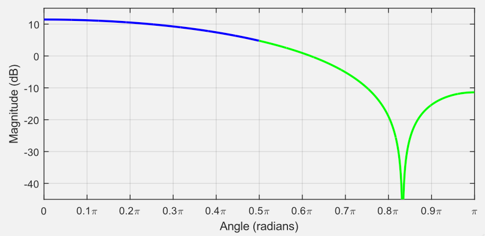

# Projeto usando Alocação Pólo-Zero

<!--pág. 42/99 de 5-TheZ-transform-Apracticaloverview.pdf - em 07/05/2024
-->

No tópico anterior ([Papel dos pólos e zeros na magnitude da resposta em frequência](papel_polos_zeros.html)), você deve ter percebido que os pólos próximos ao círculo unitário tenderão a amplificar certas frequências, enquanto os zeros próximos ao círculo unitário tenderão a atenuar certas frequências.

Depois de entender como a posição dos pólos e zeros afeta a resposta de frequência, você poderá projetar um sistema para ter uma resposta de frequência específica posicionando pólos e zeros em locais apropriados e derivando a função de transferência do sistema usando esses locais, como mostrado no exemplo abaixo. Depois de ter a função de transferência, os coeficientes $b$ e $a$ da equação de diferenças do sistema pode ser determinada.

O exemplo a seguir descreve o processo para projetar um **filtro Notch**, que remove uma faixa muito pequena de componentes de frequência de um sinal, usando posicionamento de pólo zero. Isto pode ser usado para remover o ruído de “zumbido da rede elétrica” (normalmente 50 Hz ou 60 Hz, dependendo da frequência da fonte de alimentação elétrica local) de um sinal, por exemplo.

## Filtro Notch

Neste exemplo, vamos considerar uma situação em que um sinal de ECG (uma medida da atividade elétrica do coração), que foi amostrado em 120 Hz, foi corrompido com ruído de rede de 50 Hz (um exemplo de sinal de ECG pode ser baixado em [noisy_ecg.txt](noisy_ecg.txt)).

Nesta frequência de amostragem, os 50 Hz equivalem à $50/60\pi$ radianos por amostra (isto é, $0,83333\pi$ radianos ($=150^o$). Para reduzir o ruído em 50 Hz do sinal de ECG, podemos então posicionar um par de zeros na localização: $1 \angle \pm 0,8333\pi$ (ou: $-0.86603 \pm j0,5$; parte real: $1\cdot\cos(0,8333\pi)=-0,86603$; parte imaginária: $1\cdot \sin(0,83333\pi)=0,5$), como mostra o gráfico à seguir:


Um ==par de pólos também deve ser colocado **na origem**, para garantir que não sejam introduzidos atrasos desnecessários no sistema==, conforme explicado no tópico anterior. Observe que esses pólos não afetarão a resposta de frequência do sistema (consulte o tópico anterior).

O gráfico de superfície de $H(z)$ associado a este sistema é mostrado à seguir:

```matlab
>> % fazendo os cálculos no Matlab
>> fs=120; 	% freq de amostragem em Hz
>> T=1/fs	% taxa de amostragem em segundos
T =
    0.0083333
>> ang=50/60
ang =
      0.83333
>> x=1*cos(ang*pi)
x =
     -0.86603
>> y=1*sin(ang*pi)
y =
          0.5
>> (ang*pi)*180/pi	% valor em graus
ans =
          150
ze=[x+i*y x-i*y]	% zeros de H(z)
ze =
     -0.86603 +        0.5i     -0.86603 -        0.5i
>> H=tf(1,poly(ze),1)	% se fs = 1 Hz (apenas para fins didáticos)

H =
 
          1
  -----------------
  z^2 + 1.732 z + 1
 
Sample time: 1 seconds
Discrete-time transfer function.
>> pzmap(H)		% gera o gráfico anterior
>> % Acrescentando os 2 pólos na origem e considerando fs=120 Hz:
>> H=tf(poly(ze),[1 0 0],T)

H =
 
  z^2 + 1.732 z + 1
  -----------------
         z^2
 
Sample time: 0.0083333 seconds
Discrete-time transfer function.

>> % Segue gráfico de superfície:
```


Observe como o efeito dos dois pólos se acumula na origem. Observe, no entanto, que os pólos não afetam a superfície $H(z)$ nos pontos correspondentes ao círculo unitário, ou seja, se os pólos foram removidos, a amplitude da superfície $H(z)$ nos pontos correspondentes ao círculo unitário ficaria inalterado.

A amplitude da superfície $H(z)$ nos pontos correspondentes ao círculo unitário é mostrada abaixo e plotada em relação ao ângulo feito com o eixo real:


O gráfico à seguir é igual ao gráfico acima, exceto que apenas os pontos de amplitude da superfície $H(z)$ de 0 a $\pi$ radianos são mostrados, uma vez que esses pontos refletem os pontos entre $-\pi$ e 0 radianos.



Neste tipo de gráfico (como antes), a resposta de frequência associada a este sistema pode ser obtida substituindo as unidades do gráfico acima por unidades de frequência de radianos por amostra.

O diagrama equivalente de Bode equivalente, usando Matlab, resultaria:

```matlab
>> figure; handler=bodeplot(H);
>> setoptions(handler,'FreqUnits','Hz')
>> xlim([fs/(2*10) fs/2])
>> setoptions(handler,'FreqScale','linear');
>> grid
```


Pode-se ver que um sistema associado ao diagrama pólo-zero acima atenuaria significativamente o ruído de 50 Hz (lembre-se que 50 Hz equivale a $0,833\pi$ radianos por amostra), no entanto, você deve apreciar que uma ampla faixa de frequências fora de 50 Hz também seria alterado (o que não é o ideal, uma vez que a forma do sinal de ECG pode ser significativamente alterada, talvez dificultando a interpretação do profissional de saúde). Uma melhoria neste projeto será fornecida posteriormente, mas por enquanto vamos determinar os coeficientes $b$ e $a$ associados ao sistema, para que possamos implementar o filtro.

A função transferência associada com este filtro fica:

$H(z)=\dfrac{(z +0.86603 + j0.5)(z +0.86603 - j0.5)}{z^2}=\dfrac{z^2 + 1.732 z + 1}{z^2}$

Multiplicando numerador e denominador por $z^{-1}$, obtemos:

$H(z)=\dfrac{1 + 1.732 z^{-1} + z^{-2}}{1}$

Sendo assim:

$H(z)=\dfrac{Y(z)}{X(z)}=\dfrac{1 + 1.732 z^{-1} + z^{-2}}{1}$

Resulta na seguinte equação de diferenças:

$y[n]=x[n]+1,732x[n-1]+x[n-2]$

e assim teremos: $a_0=1$, $b_0=1$, $b_2=1,732$ e $b_2=1$.

> Obs: Note que os coeficientes de $a$ correspondem ao denominador da *transfer function* $H(z)$ e que os coeficientes de $b$ correspondem ao numerador da *transfer function* $H(z)$, mas considerando a notação de $H(z)$ expressa como expoentes negativos em $z$ ($z^{-n}$).

Podemos usar o Matlab/Octave para comprovar o funcionamento deste filtro:

```matlab
>> [num,den]=tfdata(H,'v')
num =
            1       1.7321            1
den =
     1     0     0
>> a=den;
>> b=num;
>> dir *.txt	% verificando presença do arquivo
noisy_ecg.txt           

>> x=load('noisy_ecg.txt');
>> y=filter(b,a,x);
>> subplot(2,1,1);
>> plot(x);title('Sinal de ECG com ruído'); xlim([0 1000])
>> xlabel('Amostras'); ylabel('Atividade Elétrica');
>> subplot(2,1,2)
>> plot(y); title('Sinal ECG filtrado'); xlim([0 1000])
>> xlabel('Amostras'); ylabel('Atividade Elétrica');
```

E então temos o resultado:


Você pode ver nos gráficos no domínio do tempo do ECG e nos sinais de ECG filtrados acima que o “ruído” foi reduzido. Entretanto, a amplitude do sinal também foi alterada. A relação entre a amplitude do pico dominante da "onda R" e da "onda T" vizinha também foi ligeiramente alterada.

<!--Pág. 56/99 de 5-TheZ-transform-Apracticaloverview.pdf-->

<!--save filtro_notch1; até aqui em 13/05/2024-->


---

Fernando Passold, 13/05/2024.