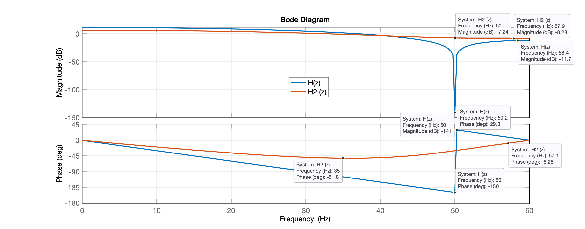
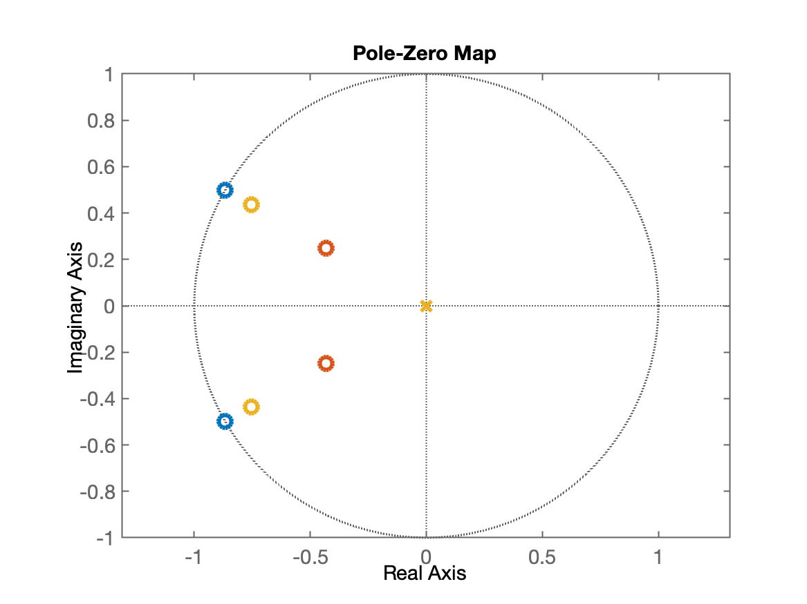
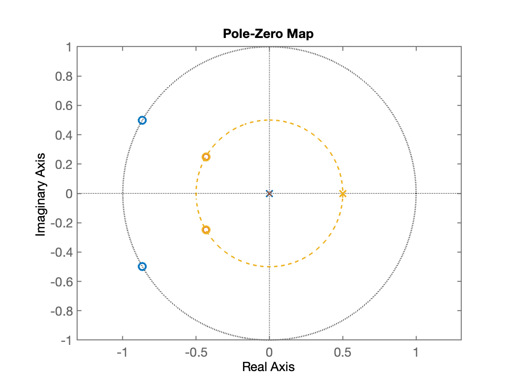
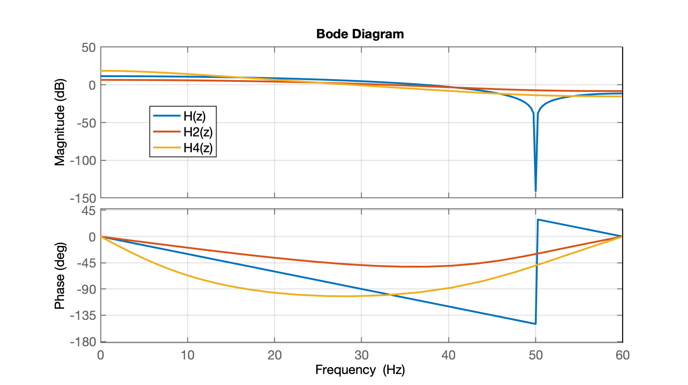
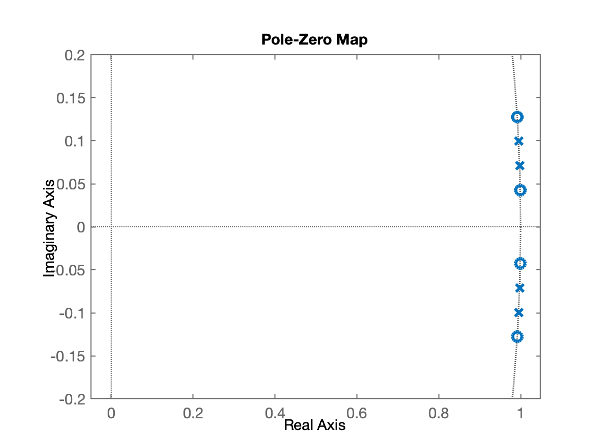
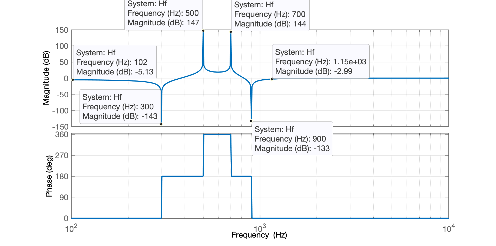

# Projeto Pólo-Zero #2

Testando projeto de filtros por alocação de pólo-zero.

Supondo que se queira um filtro do tipo passa-faixa que "corta" amplitudes acima de determinada frequência, mas limita o ganho aplicado ao sinal em frequências maiores que a determinada.

**Embasamento**

Se quero atenuar sinais acima de $f_1$ devemos acrescentar zeros nesta frequência.

E se queremos voltar a dar ganho para este sinal, devemos acrescentar pólos à partir de determinada frequência, $f_2$.

Algo como:

```
   Mag ^
       |
Dcgain +--------------+
       |              :\
       |              : \
       |              :  \
    G2 +              :   +--------------  
       |              +   :
       |              :   :
       +--------------+---+-------------->
       0             f1  f2              Freq
```

**Problema**

Não se sabe o "impacto" do "raio" dos pólos e zeros na magnitude dos sinais sendo processados.

**Ideia**

Voltando ao projeto do filtro Notch, mas desta vez realiando algumas variações:

* a) diminuindo "raio" (módulo) **dos zeros** dos pólos do filtro;
* b) acrescentando um duplo par de pólos e zeros na mesma frequência, mas **variando a magnitude dos 2 zeros conjugados complexos** para verificar como fica impactada o diagrama de Magnitudes na resposta espectral deste filtro

Voltando ao projeto...

No projeto original $f_s=120$ Hz, e $f_c=50$ Hz. Isto implicava em:

$\begin{array}{rcl}0 \text{ (rad)} & \longleftrightarrow & 0 \text{ (Hz)}\\ \pi=180^o & \longleftrightarrow & f_s/2=120/2=60 \text{ (Hz)}\\ \Omega & \longleftrightarrow & 50 \text{ (Hz)} \end{array}$

Nesta frequência de amostragem, os 50 Hz equivalem à $50/60\pi$ radianos por amostra (isto é, $0,83333\pi$ (rad) $=150^o$):

$\Omega=\dfrac{50}{60}\pi \text{ (rad)} = 0,83333\pi \text{ (rad)}$,  ou:

$\Omega=\dfrac{50\cdot 180^o}{60} = 150^o$.

Cálculos no Matlab:

```matlab
>> fc=50; % freq em Hz
>> fs=120; % freq de amostragem (em Hz)
>> angulo_zero_deg=(fc*180)/(fs/2)
angulo_zero_deg =
   150
>> angulo_zero_rad=(fc*pi)/(fs/2)
angulo_zero_rad =
        2.618
>>
```

Temos que separar as partes reais e imagnárias destes zeros para localizar-los no diagrama de pólo-zero (ou ROC):

```matlab
>> Re=1*cos(deg2rad(150))
Re =
     -0.86603
>> Im=1*sin(deg2rad(150))
Im =
          0.5
```

No caso acima, os módulos dos zeros implica que ficaram em: $z=1 \; \angle\,\pm 150^p$.

Mas e se reduzimos o módulo para 0,5 ? O que acontece com a resposta frequencial deste filtro? Provavelmente vamos reduzir a atenuação imposta ao sinal.

Recalculando novas posições para estes zeros:

```matlab
>> Re2=0.5*cos(deg2rad(150))
Re2 =
     -0.43301
>> Im2=0.5*sin(deg2rad(150))
Im2 =
         0.25
```

Agora vamos alocar os zeros em: $z=0,5\;\angle \,\pm 150^o=  -0,43301 \pm j0.25$.

Completando os cálculos para este filtro:

```matlab
>> ze = [Re+i*Im   Re-i*Im]     % cria vetor/polinômio contendo os 2 zeros conjungados originais
ze =
     -0.86603 +        0.5i     -0.86603 -        0.5i
>> ze2 = [Re2+i*Im2   Re2-i*Im2]     % cria vetor/polinômio contendo os 2 novos zeros conjungados
ze2 =
     -0.43301 +       0.25i     -0.43301 -       0.25i
>> 
```

Montando a equação, função transferência destes fiultros:

$H(z)=(z+0,86603+j0,5)(z+0,86603-j0,5) = z^2 + 1.732 z + 1$

e

$H_2(z)=(z+0,43301+j0,25)(z+0,43301-j0,25)$

Lembrando que falta acrescentar o par de pólos na origem para compensar o atraso que seria causado por usar apenas zeros nas funções transferência. Então vamos ter:

```matlab
>> H=tf(poly(ze), poly([0 0]), 1/fs)
H =
 
  z^2 + 1.732 z + 1
  -----------------
         z^2
 
Sample time: 0.0083333 seconds
Discrete-time transfer function.

>> H2=tf(poly(ze2), poly([0 0]), 1/fs)
H2 =
 
  z^2 + 0.866 z + 0.25
  --------------------
          z^2
 
Sample time: 0.0083333 seconds
Discrete-time transfer function.

>> 
```

Analisando o impacto na resposta frequencial causada por estes 2 filtros teremos:

```matlab
>> h=bodeplot(H, H2);
>> setoptions(h,'FreqUnits','Hz','FreqScale','linear')
>> xlim([0 fs/2])
>> grid
```

Respostas obtidas:



**Questão:** - e se o módulo dos zeros em $\angle\,\pm150^o$ ficasse em 0,87 ?

```matlab
>> [Re3, Im3]=pol2cart(deg2rad(150), 0.87)
Re3 =
     -0.75344
Im3 =
   ze     0.435
Re3 =
     -0.75344
Im3 =
        0.435
>> ze3 = [Re3+i*Im3   Re3-i*Im3]     % cria novo vetor/polinômio de zeros
ze3 =
     -0.75344 +      0.435i     -0.75344 -      0.435i
>> H3=tf(poly(ze3), poly([0 0]), 1/fs)

H3 =
 
  z^2 + 1.507 z + 0.7569
  ----------------------
           z^2
 
Sample time: 0.0083333 seconds
Discrete-time transfer function.

>> 
```

Isto resulta na:

$H_3(z)=\dfrac{(z+0,75344 + j0,435)(z+0,75344 - j0,435)}{z^2}=\dfrac{z^2 + 1.507 z + 0.7569}{z^2}$

Comparando as 3 respostas e o diagrama ROC teremos:

```matlab
>> figure
>> h=bodeplot(H, H2, H3);
>> setoptions(h,'FreqUnits','Hz','FreqScale','linear')
>> xlim([0 fs/2])
>> grid
>> legend('H(z)', 'H2(z)', 'H3(z)')
```

| Resposta Frequencial | Diagrama ROC |
| :---: | :---: |
|  |  |

**Conclusão?**

**Questão:** - E se os pólos extras (reais) mudarem de lugar? O que ocorre se a parte real assume o mesmo valor do módulo dos zeros?

```matlab
>> ze2
ze2 =
     -0.43301 +       0.25i     -0.43301 -       0.25i
>> abs(ze2)
ans =
          0.5          0.5
>> H4=tf(poly(ze2), poly([0.5 0.5]), 1/fs)

H4 =
 
  z^2 + 0.866 z + 0.25
  --------------------
     z^2 - z + 0.25
 
Sample time: 0.0083333 seconds
Discrete-time transfer function.

>> % Criando gráfico ROC
>> figure; pzmap(H, H2, H4)
>> th=0:2*pi/360:2*pi;
>> hold on;
>> x=0.5*sin(th);
>> y=0.5*cos(th);
>> plot(x,y,'c--')
>> axis equal
>> % Criando gráfico das respostas frequenciais

```

Resultado final:

| Diagrama ROC | Resposta Frequencial |
| :---: | :---: |
|  |  |

**Conclusão**: Apenas mudou a frequência na qual vai ocorrer o maior atraso no sinal (maior magnitude de defasagem).

---

Voltando a questão do início deste documento...

Supondo que estamos querendo criar um filtro do tipo:

```
   Mag ^
       |
Dcgain +--------------+             +-------
       |              :\           /:
       |              : \         / : 
       |              :  \       /  :
    G2 +              :   +-----+   :  
       |              :   :     :   :
       |              :   :     :   :
       +--------------+---+-----+---+------->
       0             f1  f2     f3  f4      Freq
                          : Voz :
```

Neste caso, estamos querendo filtrar a frequência onde está situado o espectro da voz humana: entre os 300 à 900 Hz e verificar se realmente, quando usamos este filtro, estamos "cortando" a voz de pessoas dentro de alguma faixa musical?

Aparentemente, bastaria:

* Introduzir um par de zeros complexos na freq. angular correspondente à $f_1$;
* Acrescentar um par de pólos na freq. angular correspondente á $f2$;
* Acrescentar outr par de pólos complexos na freq. angular correspondente à $f_3$, e;
* introduzir outro par de zeros complexos na freq. angular correspodente à $f_4$.

Testando...

Vamos testar esta tentativa de filtro sobre a faixa musical Lionsing de Björk (album Vulnicura):```

```matlab
>> [x,fs]=audioread('02 Lionsong-wav.wav');
>> size(x)
ans =
    16260032           2
>> fs
fs =
       44100
>> % projetando o filtro...
>> freq_zeros=[300 900];
>> freq_polos=[500 700];
>> angulos_zeros=(freq_zeros*180)/(fs/2);
>> % Verificando:
>> [freq_zeros'   angulos_zeros']
ans =
          300        2.449
          900       7.3469
>> angulos_polos=(freq_polos*180)/(fs/2);
>> % Verificando:
>> [freq_polos'   angulos_polos']
ans =
          500       4.0816
          700       5.7143
>> [Re_z Im_z]=pol2cart(deg2rad(angulos_zeros), 1);
>> [freq_zeros'   angulos_zeros'   Re_z'   Im_z']
ans =
          300        2.449      0.99909      0.04273
          900       7.3469      0.99179      0.12788
>> [Re_p Im_p]=pol2cart(deg2rad(angulos_polos), 1);
>> [freq_polos'   angulos_polos'   Re_p'   Im_p']
ans =
          500       4.0816      0.99746     0.071178
          700       5.7143      0.99503     0.099568
>> % Montando a função transferência:
>> ze = [Re_z+i*Im_z   Re_z-i*Im_z];
>> % Os zeros ficaram localizados em:
>> ze'
ans =
      0.99909 -    0.04273i
      0.99179 -    0.12788i
      0.99909 +    0.04273i
      0.99179 +    0.12788i
>> po = [Re_p+i*Im_p   Re_p-i*Im_p];
>> % Os pólos ficaram localizados em:
>> po'
ans =
      0.99746 -   0.071178i
      0.99503 -   0.099568i
      0.99746 +   0.071178i
      0.99503 +   0.099568i
>> Hf=tf(poly(ze), poly(po), 1/fs)

Hf =
 
  z^4 - 3.982 z^3 + 5.964 z^2 - 3.982 z + 1
  -----------------------------------------
  z^4 - 3.985 z^3 + 5.97 z^2 - 3.985 z + 1
 
Sample time: 2.2676e-05 seconds
Discrete-time transfer function.

>> zpk(Hf)
 
  (z^2 - 1.998z + 1) (z^2 - 1.984z + 1)
  -------------------------------------
  (z^2 - 1.995z + 1) (z^2 - 1.99z + 1)
 
Sample time: 2.2676e-05 seconds
Discrete-time zero/pole/gain model.

>> % Verificando o ROC e resposta frequencial
>> figure; pzmap(Hf)
>> axis equal
>> axis([-0.05 1.05 -0.2 0.2])
>> figure; h=bodeplot(Hf);
>> setoptions(h,'FreqUnits','Hz','FreqScale','log')
>> xlim([1 fs/2])
>> grid
```

Resultados do projeto do filtro:

| Diagrama ROC | Resposta Frequencial |
| :---: | :---: |
|  |  |

Notamos algums "problemas":

* Esta técnica não prevê estabelecer os platos de atenuanção e ganhos máximos desejados para certas faixas de frequência. Temos picos de atenuação e ganhos em certas frequências:
  * em 300 Hz o sinal vai ser atenuado (de 1 Vpp para $0,000000070795$ Vpp ou $=-143$ dB);
  * em 700 Hz teremos um pico de ganho de 144 dB (de 1 Vpp para 15.849.000 Vpp) -- o que vai implicar em saturação no D/A usado para sintetizar componentes muito próximos desta frequência;
  * Na faixa intermediária entre 540 à 679, este filtro vai realçar o sinal (dar um ganho entre 18,6 dB à 27,2) -- na média, um sinal de 1 Vpp nesta faixa de frequências vai ter sua amplitude aumentada em $\cong 20$ db ou 10,0 Vpp (o que também deve provocar saturação no D/A que pode ser usado para resintetizar o sinal passando por este filtro).

Aplicando o filtro:

```matlab
>> [numd, dend]=tfdata(Hf, 'v')
numd =
            1      -3.9818       5.9635      -3.9818            1
dend =
            1       -3.985         5.97       -3.985            1
>> y = filter(numd, dend, x);
>> % Reproduzindo apenas um certo intervalo de tempo: [0:30 0:40]
>> ki=30*fs;
>> kf=45*fs;
>> sound(y(ki:kf), fs)
>> (kf-ki)/fs
ans =
    15
>> % Corresponde ao intervalo de 15 segundos
>> sound(y(ki:kf)/1000, fs)
>> % Com certeza não corresponde ao efeito pretendido!
>> audiowrite('02 Lionsong-snap.wav', x(ki:kf), fs)
>> audiowrite('02 Lionsong-snap_filtro.wav', y(ki:kf)/1000, fs)
```

Testando:

Trecho original da faixa: <audio controls><source src="02 Lionsong-snap.wav" type="audio/wav"></audio>

Trecho filtrado da faixa: <audio controls><source src="02 Lionsong-snap_filtro.wav" type="audio/wav"></audio>

Fim.

---

<font size="2">🌊 [Fernando Passold](https://fpassold.github.io/)[ 📬 ](mailto:fpassold@gmail.com), <script language="JavaScript"><!-- Hide JavaScript...
var LastUpdated = document.lastModified;
document.writeln ("página criada em 16/06/2024; atualizada em " + LastUpdated); // End Hiding -->
</script></font>


