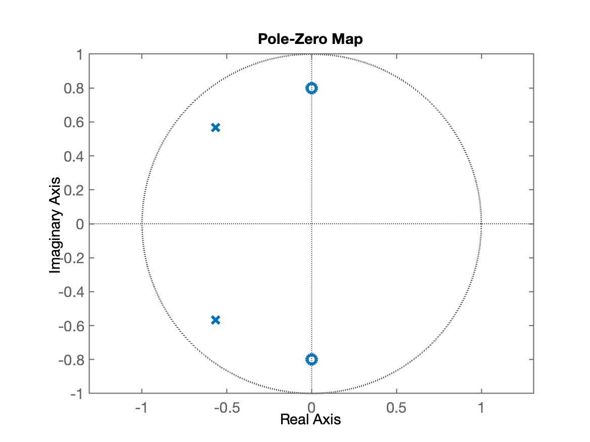
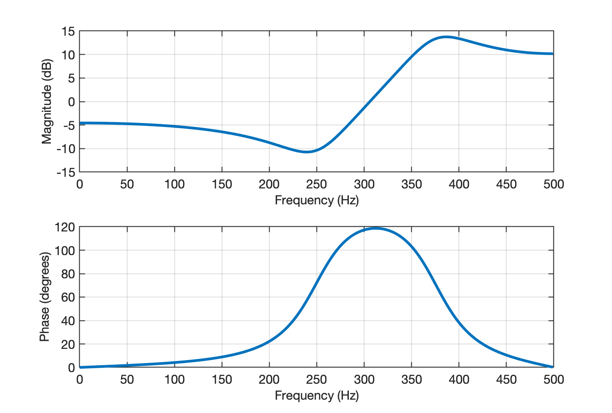

# Teste Filtros

Filtros por alocação de pólos-zeros.

**Exemplo 1**: Seja: $H(s)=\dfrac{z^2+0,64}{z^2+1,1314z+0,64}$

Suponha $f_s=1$ KHz.

Esta função é similar ao do exemplo 1 inicial mostrado na página: [Impacto dos pólos e zeros na magnitude da resposta em frequência](papel_polos_zeros.html).

Ela possui pólos e zeros em:

```matlab
>> fs=1E3;
>> T=1/fs
T =
        0.001
>> 
>> H=tf([1 0 0.64], [1 1.1314 0.64], T)

H =
 
       z^2 + 0.64
  --------------------
  z^2 + 1.131 z + 0.64
 
Sample time: 0.001 seconds
Discrete-time transfer function.

>> pole(H)	% pólos dão "ganho"
ans =
      -0.5657 +    0.56567i
      -0.5657 -    0.56567i
>> zero(H)	% zeros atenuam sinal de entrada
ans =
            0 +        0.8i
            0 -        0.8i
>>
```



Os ângulos nos quais ocorrem os pólos e zeros possuem relação com as frequências onde ocorrem ganhos e atenuações no sinal de entrada. Sabe-se que no círculo unitário: $\pi$ (rad) $= 180^o$ corresponde à frequència de Nyquist. Então, neste caso: $\pi$ (rad) $=180^p=\omega_s/2=2\pi f_s/2$, ou:

$\begin{array}{rcl}180^o & \longleftrightarrow & f_s/2\\ Ang & \longleftrightarrow & freq \end{array}$ 

Então:

$freq = \dfrac{Ang \cdot f_s/2}{180^o}$

```matlab
>> % ângulos formados perlos zeros:
>> angulos_zeros=rad2deg(angle(zero(H)))
angulos_zeros =
    90
   -90
>> % Nas frequências abaixo teremos atenuações
>> freqs=(angulos_zeros*(fs/2))/180
freqs =
   250
  -250
>> % Mas... não existe freq. negativas, isto é, o valor negativo se deve ao angulo = -90^o
>> % que é igual à:
>> angulos_zeros(2)=360+angulos_zeros(2)
angulos_zeros =
    90
   270
>> % "corrigimos" o angulo negativo e recalculamos frequências. Deste vez teremos:
>> freqs=(angulos_zeros*(fs/2))/180
freqs =
   250
   750
>> % Isto significa que à partir destas freqs. estamos atenuando o sinal (ganho negativo)
>> 
>> % ângulos formados pelos pólos:
>> angulos_polos=rad2deg(angle(pole(H)))
angulos_polos =
          135
         -135
>> % corrigindo o valor negtaivo de angulos_polos:
>> angulos_polos(2)=360+angulos_polos(2)
angulos_polos =
          135
          225
>> % Significa que nas frequências abaixo teremos ganhos
>> freqs2=(angulos_polos*(fs/2))/180
freqs2 =
          375
          625
>> 
```

Observando isto no equivalente ao diagrama de Bode de $H(z)$ teremos:

```matlab
>> [numd,dend]=tfdata(H,'v')	% para "destacar" numerador e denominador de H(z)
numd =
            1            0         0.64
dend =
            1       1.1314         0.64
>> figure; freqz(numd, dend, [], fs)
```



Sobrepondo "barras" nos gráficos para destacar as frequências determinadas antes:

```matlab
>> y_barra=[-15 15]'
y_barra =
   -15
    15
>> x_barra=[freqs(1) freqs(1)]'
x_barra =
   250
   250
>> hold on;		% "avisando" que queremos sobrepor gráficos aos já existentes
>> subplot(211); hold on;	% isolando apenas a parte de Magnitude
>> plot(x_barra, y_barra, 'b--')	% 1a-barra, 1a-freq em 250 Hz
>>
>> % Poderíamos "automatizar" a questão das barras...
>> % Note:
>> x_barra=[freqs freqs]'
x_barra =
   250   750
   250   750
>> ones(2)
ans =
     1     1
     1     1
>> ones(1,length(freqs))
ans =
     1     1
>> y_barra=[-15 15]'*ones(1,length(freqs))
y_barra =
   -15   -15
    15    15
>> plot(x_barra, y_barra, 'b--')
```

afasf

---

**Exemplo 2**: Filtro rejeita faixa (Notch) para sinal de ECG (baseado em [Projeto usando Alocação Pólo-Zero](projeto_polo_zero.html)).

A idéia aqui é filtrar o ruído na faixa de 50 Hz, presente no sinal de ECG: [noisy_ecg.txt](noisy_ecg.txt). Este sinal foi originalmente amostrado à $f_s=$ 120 Hz.

```matlab
>> fs=120;
>> T=1/fs
T =
    0.0083333
```

Considerando que um diagrama de resposta em frequência varia de 0 até $f_s/2$ e que $f_s/2=180^p=\pi$, a frequência do filtro em $f_c=$ 50 Hz, equivale à:

$\begin{array}{rcl}180^o & \longleftrightarrow & f_s/2\\ Ang & \longleftrightarrow & freq \end{array}$ 

Então:

$Ang = \dfrac{freq \cdot 180^o}{f_s/2}$

```matlab
>> ang=(50*180)/(120/2)
ang =
   150
>> ang_rad=deg2rad(ang)
ang_rad =
        2.618
```

Como queremos atenuar esta frequência, temos que introduzir um par de zeros obedecendo este ângulo. Se o módulo destes zeros for igual à 1, teremos 2 zeros em $z=1 \, \angle\,\pm 150^o$, o que resulta em:

```matlab
>> help pol2cart
 pol2cart Transform polar to Cartesian coordinates.
    [X,Y] = pol2cart(TH,R) transforms corresponding elements of data
    stored in polar coordinates (angle TH, radius R) to Cartesian
    coordinates X,Y.  The arrays TH and R must the same size (or
    either can be scalar).  TH must be in radians.
>> [re_zeros, im_zeros]=pol2cart([ang_rad -ang_rad], [1 1])
re_zeros =
     -0.86603     -0.86603
im_zeros =
          0.5         -0.5
>> H_zeros=[re_zeros+i*im_zeros]	% cria vetor/polinômio contendo os 2 zeros conjungados
H_zeros =
     -0.86603 +        0.5i     -0.86603 -        0.5i
>> size(H_zeros)
ans =
     1     2
```

E podemos então montar o polinômio para a função transferência do filtro:

```matlab
>> H=tf(poly(zeros),1,1/120)

H =
 
  z^2 + 1.732 z + 1
 
Sample time: 0.0083333 seconds
Discrete-time transfer function.

>> 
```

Note que a eq. de diferenças associada com esta função transferência rende:

$H(z)=(z+0,86603+j0,5)(z+0,86603-j0,5)$

ou:

$H(z)=\dfrac{Y(z)}{X(z)}=\left( z^2 + 1,732 z + 1 \right) \cdot \dfrac{z^{-2}}{z^{-2}}$

$\dfrac{Y(z)}{X(z)}=\dfrac{1+1,732z^{-1}+1z^{-2}}{z^{-2}}$

$z^{-2}Y(z)=\left( 1+1,732z^{-1}+1z^{-2} \right)X(z)$

$y[n-2]=x[n]+1,732x[n-1]+x[n-2]$		(eq. (1))

Note que não existem os termos $y[n]$ ou $y[n-1]$.

Apenas temos $y[n-2]$, isto significa que ==este filtro só passará a emitir um sinal de saída depois da 2a-amostragem realizada sobre o sinal de entrada== (ver simulação mais aditante).

Lembrando que a função filter tabalha com eq. do tipo:

$y[n]=\displaystyle\sum_{i=0}^{b_n} b_i \cdot x[n-i] - \displaystyle\sum_{j=1}^{n_a} a_j \cdot y[n-j]$

Então:

$b_0=1$, $b_1=1,732$, $b_2=1$, $a_0=0$, $a_1=0$ e $a_2=1$.

O detalhe é que a funçao filter() não aceita $a_0=0$, então a forma de compensar isto, é "atrasando" o sistema em 2 períodos de amostragem (ou 2 amostras):

$z^{-2}Y(z) \cdot z^{2}=\left( 1+1,732z^{-1}+1z^{-2} \right)X(z) \cdot z^{2}$

$Y(z)=(z^2+1,732z^1+1)X(z)$

Ou:

$y[n]=x[n+2]+1,732x[n+1]+x[n]$

O problema é que $x[n+2]$ representa uma amostra do sinal $x(t)^*$ **adiantado** de 2 amostras e $x[n+1]$ uma amostra do sinal $x(t)^*$ **adiantado** de 2 amostras. Valores impossíveis de serem computados. Este sistema desta forma seria o que chamamos de um "sistema antecipativo". 

Voltando a eq. (1) podemos tentar computar os termos de $y[n]$ usando um Diagrama de Fluxo de sinal e o Simulink ([filtro_ECG0.slx](filtro_ECG0.slx)):


Note que o último bloco de ganho trabalha com um ganho com valor $1/3.7321$ para compensar o "ganho DC" de $H(z)$:

```matlab
>> dcgain(H)
ans =
       3.7321
```

A simulação rende:


Note na figura anterior, que $x0=$ sinal composto pela soma das 2 senóides (uma oscilando à 2 Hz e outra oscilando à 5 Hz) e que $x1=$ sinal entregue ao filtro, "contaminado" pelo ruído de 50 Hz. 

Perceba que a saída do filtro $yc$, corresponde ao sinal amostrado $x0$, mas atrasado de 2 períodos de amostragem (neste caso: 0,0167 segundos).

---

**Exemplo 2**: Melhorando filtro anterior, mas "removendo" o atraso indesejável na resposta.

Foi percebido na exemplo anterior, que a função transferência possuia grau do numerador maior que o grau do denominador, uma diferença de 2a-ordem, o que culminou no atraso de 2 amostras na saída do filtro.

Note que podemos "compensar" este atraso, ==acrescentando pólos ou zeros, desde que localizados na origem do plano-z== para compensar estes atrasos. Pode-se até mesmo dizer que estes atrasos eram "desnecessários". Estes pólos ou zeros acrescentados desta forma, **não** afetam a resposta do sistema (não causam impacto no gráfico de magnitude do sinal).

No exemplo anterior, chegamos à função:

$H(z)=z^2 + 1,732 z + 1$

Para compensar os "atrasos desncessários" devemos acrescentar 2 pólos localizados na origem do plano-z. Com isto, vamos obter:

$H(z)=\dfrac{z^2 + 1,732 z + 1}{z^2}$

Note que:

$H(z)=\dfrac{z^2 + 1,732 z + 1}{z^2} \cdot \dfrac{z^{-2}}{z^{-2}}$

$H(z)=\dfrac{Y(z)}{X(z)}=\dfrac{1+1,732z^{-1}+z^{-2}}{1}$

Rendendo a seguinte eq. de diferenças:

$y[n]=x[n]+1,732x[n-1]+x[n-2]$

uma equação mais simples que a equação encontrada no exemplo anterior, e sem o "inconveniente" da saída ser gerada com atraso.


