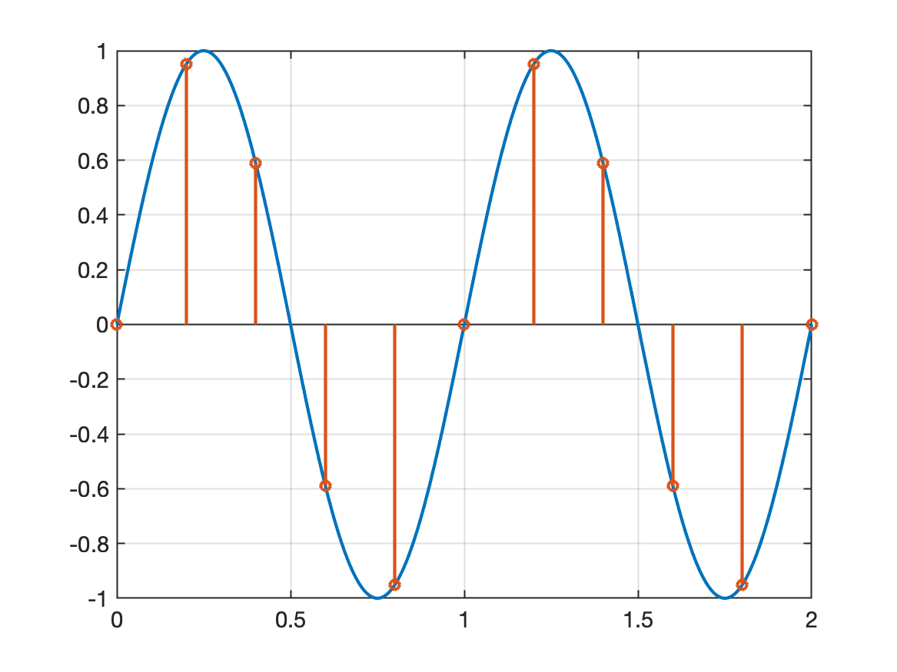
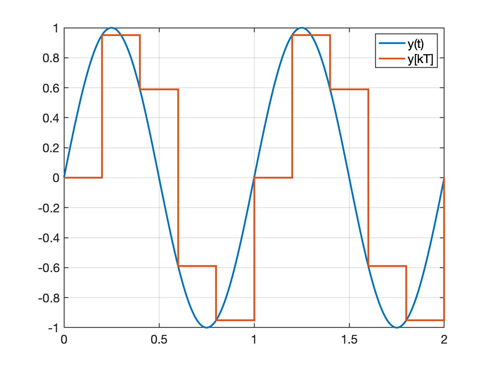

# Trabalho #1

Sobre Teorema de Amostragem e Transformada-$\mathcal{Z}$.

1. (70%) Suponha uma onda senoidal de 1 Volt de pico, oscilando na frequência de 100 Hz.

   Demonstre matematicamente (50%) e considere os teoremas de amostragem (50%), para explicar o que acontece quando:

   a) Este sinal é amostrado à $f_s=$ 200 Hz;

   b) Este sinal é amostrado à $f_s=$ 400 Hz;

   c) Este sinal é amostrado à $f_s=$ 1 KHz;

   Faça acompanhar equações, cálculos, tabelas e gráfico mostrando na mesma figura, duas curvas: uma do sinal original contínio no tempo e outra (sobreposta) sinal amostrado.

---

2. (30%) Considere agora que seu sistema está amostrando uma onda quadrada oscilando na frequência de 100 Hz, e que você resolveu amostrar a mesma à $f_s=$ 500 Hz. Você é capaz de:

   a) Recorde da Série de Fourier e verifique o espectro (harmônicas e amplitudes) de uma onda quadrada. Considere este sinal e mostre uma tabela mostrando harmônica (sua frequência) x amplitude (de cada harmônica). Sugere-se plotar este gráfico.

   b) Suponha que seu sistema de aquisição seja precedido de um filtro passa-baixas ideal com frequência de corte, $f_c=$ 250 Hz. Explique o que ocorre com o sinal original depois de passar por este filtro.

   c) Aplique o teorema da amostragem sobre o sinal anterior. Não é necessário considerar a função Sampling e seu efeito na modulação da amplitude do sinal amostrado envolvido. Pode ser considerado uma amostragem ideal.

   d) Considere que seu sistema de amostragem apenas aplica um ganho unitário sobre o sinal adquirido e que a saída D/A do mesmo é acompanhada do mesmo filtro passa-baixas do item (b).

   e) Complete uma tabela como a mostrada abaixo

   | Harmônica | 1 | 2 | 3 | 4 | 5 | 6 | 7 | 8 | 9 | 10 | 11 | 12 | 13 | 14 | 15 | 16 | 17 |
   | :--- | :---: | :---: | :---: | :---: | :---: | :---: | :---: | :---: | :---: | :---: | :---: | :---: | :---: | :---: | :---: | :---: | :---: |
   | Frequência (Hz) | 100 | 200 | 300 | 400 | 500 | 600 | 700 | 800 | 900 | 1000 | 1100 | 1200 | 1300 | 1400 | 1500 | 1600 | 1700 |
   | Amplitude (pico)  | \_ |  \_ | \_ | \_ | \_ | \_ | \_ | \_ | \_ | \_ | \_ | \_ | \_ | \_ | \_ | \_ | \_ |

   para:

      e.1) A onda quadrada original (não filtrada, não amostrada);

      e.2) O resultado da onda quadrada depois que passa pelo filtro passa-baixas (antes do A/D);

     e.3) O resultado da onda do item (2) depois que é amostrada (eventualmente considere a função Sampling; neste caso: $\tau=T$);

      e.4) O resultado da onda reconstituída (depois que passa pelo filtro passa-baixas depois do D/A).

   f) Use os resultados numéricos obtidos na tabela anterior para mostrar num mesmo gráfico, o que aconteceu com o espectro original da onda quadrada.

   g) Use o Matlab (ou outro software) para recompor e mostrar num gráfico, o sinal reconstituído (sinal amostrado à 500Hz) sobreposto ao sinal original da onda quadrada (sintetizada usando série de Fourier até a 17a-harmônica).

   h) Explique o que aconteceu.
   
   Ref:
   
   * [Síntese de Onda Quadrada usando Série de Fourier (e Matlab)](https://fpassold.github.io/Controle_3/estudo_dirigido/Síntese_Onda_Quadrada.html);
   * [Amostragem de Onda Dente de Serra (uso de Matlab)](https://fpassold.github.io/Controle_3/Teste_Amost/teste_amostragem.html).

----

**Obs.:** Sugere-se o uso do Matlab para cálculos e composição dos gráficos.

---

**Exemplo de códigos Matlab**:

Por exemplo, a figura abaixo mostra uma onda senoidal de 1 Hz, amostrada à 5 Hz:



Código Matlab:

```matlab
>> f=1;					% freq. original do sinal em Hz
>> w=2*pi*f; 		% freq angular em rad/s
>> Toriginal=1/f;
>> t=0:Toriginal/200:Toriginal*2; 	% cria vetor tempo para 2 ciclos do sinal continuo, 200 pontos por ciclo
>> y=sin(w*t);	% calcula vetor do sinal original
>> plot(t,y)		% mostra gráfico do sinal original
>> fs=2; 				% amostragem à 2 Hz
>> fs=5; 				% amostragem à 5 Hz
>> T=1/fs				% calcula período de amostragem (em segundos) e mostra resultado
T =

          0.2
>> kT=0:Toriginal/fs:Toriginal*2; 	% cria vetor tempo das amostras 
>> size(kT) 												% tamanho do vetor - qtdade amostras geradas em 2 ciclos
ans =
     1    11
>> yd=sin(w*kT);	% cria vetor do "sinal digital"
>> hold on 				% comando para permitir sobreposição de gráficos
>> stem(kT,yd) 		% plota sinais amostrados
>> grid
```

Você pode trocar a linha do comando `stem(kT,yd)` por `stairs(kT,yd)` e acrescentar o comando `legend('y(t)','y[kT]')`, o que resultará em:



---

Fernando Passold, em 11/03/2024.

