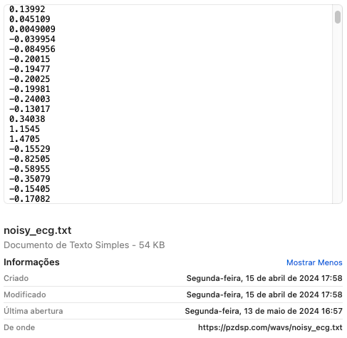

# Trabalho #2

## Processamento Digital de Sinais

A idéia aqui é avaliar diferentes filtros digitais aplicados sobre um mesmo sinal. No caso, um sinal bruto extraído de uma máquina de ECG ([EletroCardioGrama](https://maislaudo.com.br/blog/ritmo-sinusal-no-ecg/)) onde é comum aparecer sobreposto ao sinal capturado, o ruído da rede elétrica (em 50 Hz ou 60 Hz).

Sinal de ECG disponível $\longrightarrow$ [noisy_ecg.txt](noisy_ecg.txt).

Este arquivo é um simples arquivo texto contendo uma longa sequência de números, um por linha. 

Ente uma linha e outra de dado (amplitude do sinal capturado) passou um intervalo de tempo que corresponde ao período de amostragem adotado. Sabe-se que o sistema que capturava (amostrava/diitalizava) estes dados, trabalhou com frequência de amostragem $f_s=$ 120 Hz.

Como este sinal foi amostrado à 120 Hz, filtros digitais só fazem sentido para frequências menores que a freq. de Nyquist, ou seja, $f_c < f_s/2$, neste caso: $f_c < 60$ Hz.

Projete e mostre o resultado do sinal filtrado quando o mesmo é processado pelos seguintes filtros:

* Filtro de média móvel - teste com a) média móvel para 5 amostras; b) média móvel para 10 amostras.
* Filtro Passa-baixas Butterworth de 5a-ordem, com $f_c=$ 50 Hz - usar método de Tustin;
* Filtro Notch (projeto por alocação de pólo-zdero) em $f_c=$ 50 Hz.
* Filtro Notch (projeto usando método de Tustin), filtro de 5a-ordem.

Apresente as equações e código comentado usando para resolver cada projeto e simulação.

**Dado**

## Filtro Passa-baixas Butterworth

Este tipo de filtro segue a seguinte equação genérica:

$|H(\omega)|=\dfrac{1}{\sqrt{1+\omega^{2n}}}$

Onde:
$|H(\omega)|=$ ganho (ou módulo) da função transferência do filtro, no mundo contínuo (valor adimensional);
$\omega=$ frequência angular do filtro (em rad/s). Lembrar que $\omega=2\pi \cdot f_c$, onde $f_c=$ freq. de corte do filtro (em Hz);
$n=$ ordem do filtro.

Note que este tipo de filtro deve atenuar os componestes espectrais acima de $f_c$, neste caso, promovendo uma atenuação de $n \times$ 20 dB/déc. 

⚠️ Note que uma **queda** na amplitude de 20db, equivale a **reduzir** a amplitude do sinal de entrada em 10%:

Lembrar que:

$G(f)=20 \cdot \log_{10}\left( \dfrac{\text{Amplitude_sinal_saida(na freq. }f \text{)}}{\text{Amplitude_sinal_entrada (na freq. }f \text{)}} \right)$

ou mais simplesmente:

$G(\omega)=20 \cdot \log_{10} \left( \dfrac{Y(\omega)}{X(\omega)} \right)$

Onde
$Y(\omega)=$ amplitude do sinal de saída na frequênica $\omega$;
$X(\omega)=$ amplitude do sinal de entrada na frequência $\omega$.

Note que este ganho varia conforme a frequência ($f$ em Hz; ou $\omega$ em rad/s).

Então:

$-20 = 20 \cdot \log_{10}(g)$

$\log_{10}(g)=-1$

$g=10^{-1}=\dfrac{1}{10^{1}}=0,1$

Então este filtro, de 5a-ordem na freq. de 50 Hz vai render a seguinte equação ou função transferência:

$|H(s)|=\dfrac{1}{\sqrt{1+(2\pi \cdot 50)^5}}$

### Função butter()

O Matlab/Octave  facilita o projeto deste filtro, calculando sua função transferência, através do uso da função `[b, a] = butter(n, Wn)`(ver [butter()](https://www.mathworks.com/help/signal/ref/butter.html) no site da MathWorks). Esta função retorna os coeficientes de função de transferência de um filtro digital Butterworth de ordem$-n$ com frequência de corte normalizada $w_n$.

Esta função espera uma função transferência no formato:

$H(s)=\dfrac{Y(s)}{X(s)}=\dfrac{B(s)}{A(s)}$

---

Fernando Passold, em 03/06/2024

