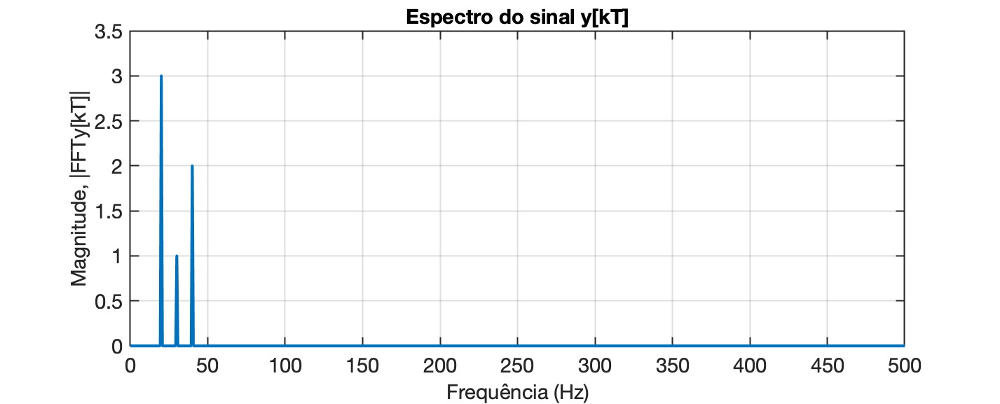
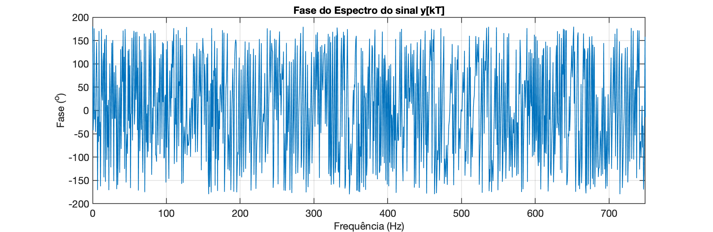

<font size="1">[Koizumi Junsaku's twin dragons - Kennin-ji Buddhist temple (Kyoto)](https://www.discoverkyoto.com/places-go/kennin-ji/)</font>

# Usando função *fft* do Matlab

<!--Ref.: YouTube, David Doran: [Using Matlab's fft function](https://www.youtube.com/watch?v=dM1y6ZfQkDU)-->

Seja o seguinte exemplo:

Vamos sintetizar uma onda formada por 3 senóides de diferentes frequências, defasadas entre si. Podemos considerar que estamos amostrando este sinal usando a frequência de amostragem $f_s$.

Então: $T=\dfrac{1}{f_s}$

Usando o Matlab, poderia ser feito.

```matlab
>> fs=1000;
>> t=0: 1/fs: 1.5 - 1/fs; % até 1,5 segundos excluindo a última amostra
>> size(t)
ans =
           1        1500
>> f1=20;
>> f2=30;
>> f3=40;
>> y=3*cos(2*pi*f1*t +0.2) + 1*cos(2*pi*f2*t -0.3) + 2*cos(2*pi*f3 +2.4);
>> 0.2*180/pi
ans =
       11.459
>> -0.3*180/pi
ans =
      -17.189
>> 2.4*180/pi
ans =
       137.51
>> % Verificando dados dos vetores t e y:
>> [t(1:10)' y(1:10)']
ans =
            0       2.4207
        0.001       2.3613
        0.002       2.2219
        0.003       2.0045
        0.004       1.7133
        0.005       1.3542
        0.006      0.93469
        0.007      0.46395
        0.008    -0.047653
        0.009     -0.58874
>> % Note que 1/1000 = 1/fs = T = período de amostragem (== 1 ms)
```

Note que temos:

* uma senóide oscilando à 20 Hz ($f_1$) e adiantada de 0,2 radianos ($11,459^o$);
* outra senóice oscilando à 30 Hz ($f_2$), atrasada de -0,3 radianos ($-17.189^o$);
* uma terceira senóide oscilando à 40 Hz ($f_3$) adiantada de 2,4 radianos ($137,51^o$).

O vetor $y$ acima, transformada num gráfico gera:

```matlab
>> plot(t,y)
>> title('Sinal')
>> xlabel('tempo (segundos)')
>> ylabel('Amplitude (Volts)')
```

E teríamos o gráfico:


Realizando a `fft()` sobre este sinal, resulta:

```matlab
>> Y=fft(y);
>> length(Y)
ans =
        1500
>> size(y)
ans =
           1        1500
>> % os 2 vetores possuem o mesmo tamanho
```

Averiguando o conteúdo dos vetores:

```matlab
>> y(1:5)
ans =
       2.4207       2.3613       2.2219       2.0045       1.7133
>> y(1:5)'
ans =
       2.4207
       2.3613
       2.2219
       2.0045
       1.7133
>> 
>> % Já o vetor com o resultado da FFT deve conter números complexos:
>> Y(1:5)'
ans =
      -2212.2 +          0i
   5.9813e-13 + 4.3249e-13i
    7.832e-13 -  5.609e-13i
  -1.4919e-12 -  2.356e-14i
   9.0946e-13 + 1.7577e-13i
>> % mostrando uma outra faixa de valores:
>> Y(30:34)'
ans =
  -6.3857e-13 + 5.4089e-12i
       2205.1 -     447.01i
   9.4815e-13 + 4.9884e-12i
   4.9045e-12 - 1.7524e-12i
  -3.3064e-12 - 3.5547e-13i
>> 
```

O vetor $Y$ (vetor `Y`) é formado por números complexos porque representam amplitudes e fases das senóides presentes no sinal  de entrada $y$ (vetor `y`).

Porém os dados brutos de $Y$ são complicados para serem entendidos. É mais interessante mostrar a amplitude (magnitude) dos valores envolvidos com o vetor $Y$:

```matlab
>> Y_mag = abs(Y);
```

Podemos verificar a magnitude de $Y$ na mesma faixa de valores já explorada anteriormente:

```matlab
>> Y_mag(30:34)'
ans =
   5.4464e-12
         2250
   5.0777e-12
   5.2082e-12
   3.3255e-12
>> 
```

Note que os valores como `5.4464e-12` $=5,4464 \times 10^{-12}$ são praticamente nulos (0 = zero).

Obs.: Dependendo do formato adotado para mosrtrar dados, o Matlab pode parecer que gera outra resposta:

```matlab
>> format short
>> Y_mag(30:34)'
ans =
   1.0e+03 *
    0.0000
    2.2500
    0.0000
    0.0000
    0.0000
>> 
```

Neste documento, está sendo usando `>> format shortg`.

Podemos transformar num gráfico o vetor $Y$:

```matlab
>> figure; plot(Y_mag)
```

Com isto, será gerada uma figura como:


Note que aparecem alguns picos (correspondentes às frequências das senóides presentes no sinal) e há vales. O vetor é composto por 1500 pontos porque nosso vetor de entrada para a função `fft` possuia 1500 amostras. O gráfico original da função `fft` é "refletido" entre seu lado esquerdo e seu lado direito (são simétricos). Para analisar o espectro resultante, basta então escolher um dos lados, normalmente o lado esquerdo. Podemos realizar um "zoom", separar o lado esquerdo na figura:

```matlab
>> length(Y)
ans =
        1500
>> length(Y)/2
ans =
   750
>> axis([0 749 0 2500])
```

O gráfico agora deve ter ficado como:


O detalhe é que o eixo X corresponde à frequência (mas não em Hz; na realidade, o cálculo da *fft* retorna a frequência na unidade de "bins", onde cada "bin" corresponde à $bin=f_s/L$; $L=$ quantidade de amostras do sinal de entrada) e o eixo Y corresponde à magnitude:


Podemos criar um vetor de frequências em Hz para o eixo X e melhorar um pouco o entendimento do gráfico anterior:

```matlab
>> L=length(y)
L =
        1500
>> eixo_f = (fs/L)*(0:L-1);
>> length(eixo_f)
ans =
        1500
>> figure; plot(eixo_f, Y_mag)
>> axis([0 749 0 2500])
>> xlabel('Frequencia (Hz)')
>> ylabel('|fft(y)|')
```


Note que o intervalo de frequência onde termina a parte útil da FFT (lado esquerdo do gráfico) corresponde à metade do número de amostras multiplicado pelo fator *bin*. Podemos realizar um "zoom" na parte de baixas frequênicias e perceber que:

```matlab
>> axis([0 100 0 2500]) % mostra até freq de 100 Hz
```

E o gráfico fica então:


e agora fica fácil de perceber que o sinal usado para a FFT possui componente DC (frequência nula, 0 Hz) e componentes nas frequencias de 20 e 30 Hz.

> Ver também: [Help Center da MathWorks: **fft**](https://www.mathworks.com/help/matlab/ref/fft.html#).

Para "corrigir" o eixo de magnitudes do espectro, devemos considerar que o algoritmo de FFT, escalona o vetor $Y$ gerado, de um fator de $L$ (quantidade de amostras usadas). Então inicialmente temos que redimencionar o vetor $Y$ fazendo a divisão por $L$: $P2=|\text{fft}(y)|/L$. E depois temos que considerar o espectro "refletido" gerado pelo algoritmo FFT. Na realidade este espectro refletido é composto por conjugados complexos, e o espectro originalmente é bilateral (vetor $P2$ abaixo). E ainda deve ser considerado que o primeiro elemento calculado no espectro, corresponde à frequência nula (0 Hz, nível DC do sinal).

Considerando os fatores anteriores, podemos gerar um novo gráfico do espectro do sinal de entrada $y$ , fazendo:

```matlab
>> L=length(y);
>> Y=fft(y);
>> P2=abs(Y/L);						% re-escalona magnitudes pelo fator L
>> P1 = P2(1:L/2+1);				% estamos interessados apenas na primeira metade do espectro
>> P1(2:end-1) = 2*P1(2:end-1);		% convertendo magnitudes para espectro unilateral
>> f = fs/L*(0:(L/2));				% monta vetor das frequencias
>> figure; plot(f,P1,"LineWidth",3) 
>> title('Espectro do sinal y(t)')
>> xlabel("freq. (Hz)")
>> ylabel('|fft(y)|')
```



O cálculo anterior poderia ser simplificado para:

```matlab
>> L/2
ans =
   750
>> f = (fs/L)*(0:L-1);	
>> figure; plot(f, Y_mag/(L/2));
```

Que gera o mesmo gráfico anterior, mas com o gráfico ainda mostrando todo o espectro bilateral gerado originalmente pela função FFT:


Um zoom na frequencia até 100 Hz, usando o comando `axis([0 100 0 3.5])`, resulta em:


### Calculando informação da Fase do sinal

Podemos ainda separar a informação de fase espectral do sinal de entrada:

```matlab
>> Y_phase = angle(Y);
>> f = (fs/L)*(0:L-1);
>> figure; plot(f,Y_phase)
>> xlabel("freq. (Hz)")
>> ylabel('\angle (rad)')
>> title('Fase do Espectro do sinal y(t)')
>> axis([0 749 -pi pi])
```

E obtemos a seguinte figura:



Este diagrama não parece tão útil quanto a magnitude do espectro do sinal.

No caso da obtenção do vetor de fase do espectro de um sinal, é melhor primeiro identificar os componentes frequências importantes no gráfico de magnitude do espectro do sinal e então, observar na janela de comandos do Matlab, a fase correspondente:

```matlab
>> % Por exemplo, notamos que em 20 Hz ocorre um primeiro pico de magnitude
>> f(20)
ans =
       12.667
>> % Note que o elemento 20 do vetor dde frequencias não corresponde aos 20 Hz
>> % Lembramos que antes definimos o fator "bin" como sendo fs/L, então
>> 20/(fs/L)
ans =
    30
>> f(30)
ans =
       19.333
>> f(31)
ans =
    20
>> Y_phase(31) % retorna a fase na frequencia dos 20 Hz (em radianos)
ans =
          0.2
>> % Testando para a freq. de 30 Hz:
>> 30/(fs/L)
ans =
    45
>> f(45)
ans =
       29.333
>> f(46)
ans =
    30
>> Y_phase(46)
ans =
         -0.3
```

---

### Resumindo

A sequencia final de comandos que leva ao espectro de Magnitude do sinal de entrada $y$ pode ser feito da seguinte forma:

```matlab
>> Y=fft(y);
>> L=length(Y);
>> P2 = abs(Y/L);
>> P1 = P2(1:L/2+1);
>> P1(2:end-1) = 2*P1(2:end-1);
>> f = fs/L*(0:(L/2));
>> figure;
>> plot(f,P1,"LineWidth",3)
>> title('Espectro do sinal y(t)')
>> xlabel("freq. (Hz)")
>> ylabel('|fft(y)|')
>> % aplicando um "zoom" na região até 100 Hz:
>> axis([0 100 0 3.5]) % mostra até freq de 100 Hz
```


Se for desejado mostrar uma espécie de tabela com os resultados obtidos:

```matlab
>> [f(1:10)' P1(1:10)']
ans =
            0       1.4748
      0.66667   9.8415e-16
       1.3333   1.2844e-15
            2   1.9895e-15
       2.6667   1.2351e-15
       3.3333   2.7656e-16
            4   3.3826e-16
       4.6667   1.6592e-16
       5.3333   2.9896e-16
            6   2.0694e-15
>> [f(25:35)' P1(25:35)']
ans =
           16   4.9917e-16
       16.667   2.2106e-15
       17.333   2.3668e-15
           18   4.0074e-15
       18.667   5.6471e-15
       19.333   7.2619e-15
           20            3
       20.667   6.7703e-15
       21.333   6.9443e-15
           22    4.434e-15
       22.667   3.1823e-15
>> 
```

Fim.

---

## Exercícios Propostos.

1. Sintetize um sinal oscilante usando a eq. abaixo:

   $y(t)=A\cdot \cos(2\pi\cdot f + \phi)$

   onde $A=$ amplitude (de pico) da onda, $f=$ frequência da onda (em Hz) e $\phi=$ defassagem do sinal (em radianos).

   Plote as diferentes ondas para 1,5 ciclos da mesma quando:

   a) $\phi=0^o$;

   b) $\phi=-90^o$

   Gráfico desta parte:

   

   c) $\phi=60^o$

   d) $\phi=-60^o$

   Gráfico destes últimos 2 itens (comparados com uma cosenoóide defasada de $0^o$):

   

   Obs.: considere para os 3 casos, $A=1$ e $f=200$ Hz.

   Perceba que:

   $\sin(\omega t)=\cos(\omega t - 90^o)$ -- ou seja, uma senóide = coseno atrasado de $90^o$.

   $\cos(30^o)=\cos(0,5236)=0,86603$

   $\cos(45^o)=\cos(0,7854)=0.70711$

   $\cos(60^o)=\cos(1,0472)=0,5$

---

Possível solução:

```matlab
>> A=1; f=200;
>> T=1/f; t_fim=1.5*T;
>> t=linspace(0,t_fim,500); % 500 pontos no intervalo 
>> phi=0;
>> y=A*cos(2*pi*f*t+phi);
>> figure; plot(t,y)
>> t_fim
t_fim =
       0.0075
>> axis([0 t_fim -1 1])
>> title('cos(\omega t + 0^o)')
>> % incluindo os outros casos à serem simulados
>> phi_b=-90;
>> yb=A*cos(2*pi*f*t+phi*pi/180);
>> yb=A*cos(2*pi*f*t+phi_b*pi/180);
>> phi_c=60;
>> phi_d=-60;
>> yc=A*cos(2*pi*f*t+phi_c*pi/180);
>> yd=A*cos(2*pi*f*t+phi_d*pi/180);
>> close all
>> % 1o-gráfico
>> figure; plot(t,y,'b-', t,yb,'m-')
>> axis([0 t_fim -1 1])
>> grid
>> xlabel('tempo (segundos)')
>> ylabel('Amplitude (Volts)')
>> title('Sinais')
>> legend('cos(\omega t+0^o)', 'cos(\omega t-90^o')
>> % 2o-gráfico
>> figure; plot(t,y,'b--', t,yc,'b-', t,yd,'m-')
>> xlabel('tempo (segundos)')
>> ylabel('Amplitude (Volts)')
>> title('Sinais')
>> legend('cos(\omega t+0^o)', 'cos(\omega t+60^o)', 'cos(\omega t-60^o)')
>> axis([0 t_fim -1 1])
```


---

Fernando Passold, em 29/03/2024

