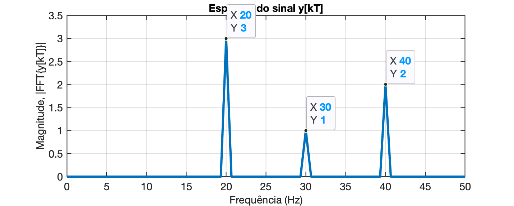

<font size="1">[Koizumi Junsaku's twin dragons - Kennin-ji Buddhist temple (Kyoto)](https://www.discoverkyoto.com/places-go/kennin-ji/)</font>

# Usando função *fft* do Matlab

<!--Ref.: YouTube, David Doran: [Using Matlab's fft function](https://www.youtube.com/watch?v=dM1y6ZfQkDU)-->

Seja o seguinte **exemplo**:

Vamos sintetizar uma onda formada por 3 senóides de diferentes frequências, defasadas entre si. 

* $y_1(t)$: uma senóide oscilando à 20 Hz ($f_1$) e adiantada de 0,2 radianos ($11,459^o$);
* $y_2(t)$: outra senóice oscilando à 30 Hz ($f_2$), atrasada de -0,3 radianos ($-17.189^o$);
* $y_3(t)$: uma terceira senóide oscilando à 40 Hz ($f_3$) adiantada de 2,4 radianos ($137,51^o$).
* Estes 3 sinais se somam para compor o **sinal**: $y(t)=y_1(t)+y_2(t)+y_3(t)$.

e vamos considerar que estamos amostrando este sinal usando a frequência de amostragem $f_s$.

Então, período de amostragem seria: $T=\dfrac{1}{f_s}$

Usando o Matlab, podemos sintetizar estas formas de onda:.

```matlab
>> fs=1000;
>> t=0: 1/fs: 1.5 - 1/fs; 	% até 1,5 segundos excluindo a última amostra
>> % Note que 1/1000 = 1/fs = T = período de amostragem (== 1 ms)
>> size(t)					% confirmando tamanho do vetor criado
ans =
           1        1500
>> f1=20;
>> f2=30;
>> f3=40;
>> % Note que a eq. das ondas trabalha com frequência em rad/s e defasagem em radianos
>> % Criando um vetor para cada onda que compôe o sinal y(t)
>> y1=3*cos(2*pi*f1*t +0.2);
>> y2=1*cos(2*pi*f2*t -0.3);
>> y3=2*cos(2*pi*f3*t +2.4);
>> % calculando a defasagem (angulo) de cada sinal em graus (e não radianos)
>> 0.2*180/pi
ans =
       11.459
>> -0.3*180/pi
ans =
      -17.189
>> 2.4*180/pi
ans =
       137.51
>> % Criando o vetor do sinal y(t) ou y[kT]
>> y=y1+y2+y3;
>> % Verificando os primeiros 10 valores contidos nos vetores t e y's:
>> [t(1:10)' y1(1:10)' y2(1:10)' y3(1:10)' y(1:10)']
ans =
            0       2.9402      0.95534      -1.4748       2.4207
        0.001       2.8423      0.99379      -1.7644       2.0717
        0.002       2.6996      0.99704      -1.9432       1.7535
        0.003       2.5143      0.96496      -1.9998       1.4794
        0.004       2.2894      0.89871      -1.9309       1.2572
        0.005       2.0283      0.80061      -1.7405       1.0884
        0.006       1.7353      0.67416      -1.4409      0.96861
        0.007       1.4149      0.52382      -1.0507      0.88809
        0.008       1.0722      0.35492     -0.59442      0.83271
        0.009      0.71259      0.17345     -0.10084       0.7852
>> % Podemos criar gráficos para entender melhor o que está sendo realizado:
>> subplot(4,1,1)	% cria e divide janela para 4 "linhas" x 1 "coluna" de gráficos
>> plot(t,y1)
>> axis([0 1.5 -3 3])
>> ylabel('y_1(t)')
>> subplot(4,1,2);
>> plot(t,y2);
>> axis([0 1.5 -3 3])
>> ylabel('y_2(t)')
>> subplot(4,1,3);
>> plot(t,y3);
>> axis([0 1.5 -3 3])
>> ylabel('y_3(t)')
>> subplot(4,1,4);
>> plot(t,y)
>> axis([0 1.5 -3 3]) % adequando "range" dos dados à ser mostrado
>> axis([0 1.5 -4 4])
>> axis([0 1.5 -5 5])
>> ylabel('y(t)')
>> xlabel('tempo (s)')

```

Com isto acabamos obtendo uma figura (janela) com os seguintes gráficos:


Realizando a `fft()` sobre este sinal, resulta:

```matlab
>> Y=fft(y);	% apenas executando o algoritmo "FFT"
>> length(Y)	% descobrindo tamanho do vetor criado
ans =
        1500
>> size(y)		% note que size(Y) == size(y)
ans =
           1        1500
>> % os 2 vetores possuem o mesmo tamanho
```

Averiguando o conteúdo dos vetores:

```matlab
>> y(1:5)
ans =
       2.4207       2.3613       2.2219       2.0045       1.7133
>> y(1:5)'
ans =
       2.4207
       2.3613
       2.2219
       2.0045
       1.7133
>> 
>> % O vetor com o resultado da FFT deve conter números complexos (como esperado):
>> Y(1:5)'
ans =
  -1.4619e-12 +          0i
   4.9198e-13 + 4.5089e-13i
   5.6033e-13 + 1.3287e-13i
  -1.9843e-12 - 1.3565e-13i
   1.3518e-12 + 4.6719e-13i
>> % mostrando uma outra faixa de valores:
>> Y(30:34)'
ans =
ans =
  -1.3512e-12 + 4.7564e-12i
       2205.1 -     447.01i
   9.4282e-13 + 4.9381e-12i
    5.111e-12 - 2.1211e-12i
   -3.011e-12 + 4.8694e-13i
>>
```

Note que alguns valores calculados correspondem praticamente à valores nulos (por exemplo: $4,9198 \times 10^{-13} + j\,4,5089 \times 10^{-13} \cong 0+j0 \cong 0$). Mas nem todos os valores calculados são nulos (por exemplo: $2205,1 -     j\,447,01 = 2250 \, \measuredangle -11,46^o$).

O vetor $Y$ (ou variável `Y`) é formado por **números complexos** porque representam **amplitudes** e **fases** das senóides presentes no sinal  de entrada $y$ (vetor `y`).

Porém os dados brutos de $Y$ são complicados para serem entendidos. É mais interessante calcular a amplitude (**magnitude**) dos valores envolvidos com o vetor $Y$:

```matlab
>> Y_mag = abs(Y);
```

Podemos verificar a magnitude de $Y$ na mesma faixa de valores já explorada anteriormente:

```matlab
>> Y_mag(30:34)'
ans =
   4.9446e-12
         2250
   5.0273e-12
   5.5337e-12
   3.0501e-12
>> 
```

Obs.: Dependendo do formato adotado para mosrtrar dados, o Matlab pode parecer que gera outra resposta:

```matlab
>> format short
>> Y_mag(30:34)'
ans =
   1.0e+03 *
    0.0000
    2.2500
    0.0000
    0.0000
    0.0000
>> 
```

Neste documento, está sendo usando `>> format shortg`.

Podemos transformar o vetor `y_mag` num gráfico:

```matlab
>> figure; plot(Y_mag)
```

Com isto, será gerada uma figura como:

<!---->


Note que aparecem alguns picos (correspondentes às frequências das senóides presentes no sinal) e há vales. O vetor é composto por 1500 pontos porque nosso vetor de entrada para a função `fft` possuia 1500 amostras. 

O **gráfico original do algortimo FFT** é "refletido" entre seu lado esquerdo e seu lado direito (são simétricos). Para analisar o espectro resultante, basta então escolher um dos lados, normalmente o lado esquerdo. Podemos realizar um "zoom", separar o lado esquerdo na figura:

```matlab
>> length(Y)
ans =
        1500
>> length(Y)/2
ans =
   750
>> axis([0 749 0 2500])
```

O gráfico agora deve ter ficado como:

<!---->


O detalhe é que o eixo X corresponde à frequência., mas não em Hz. Na realidade, o algoritmo FFT retorna a frequência na unidade de "**bins**", onde cada "bin" corresponde à $bin=f_s/L$; onde: $L=$ quantidade de amostras do sinal de entrada) e $f_s=$ frequênica de amostragem adotada no vetor de entrada. O eixo Y corresponde à magnitude.

<!---->

Podemos criar um vetor de frequências em Hz para o eixo X e melhorar um pouco o entendimento do gráfico anterior:

```matlab
>> L=length(y)
L =
        1500
>> eixo_freq=(fs/L)*(0:L-1);
>> size(eixo_freq)
ans =
           1        1500
>> figure; plot(eixo_freq, Y_mag);
>> axis([0 749 0 2500])
>> xlabel('Frequencia (Hz)')
```

<!---->


No gráfico gerado anteriormente se aproveitou e foram acrescentados "Data Tips" para comprovar as frequências e aplitudes inicialmente calculadas para os picos da FFT executada sobre o sinal de entrada. Perceba que com exceção da amplitude, a frequência em que ocorrem os picos corresponde ao esperado.

Note que o intervalo de frequência onde termina a **parte útil da FFT (lado esquerdo do gráfico)** corresponde à metade do número de amostras multiplicado pelo fator *bin*. Podemos realizar um "zoom" na parte de baixas frequênicias e perceber que:

```matlab
axis([0 50 0 2500]) % mostra da freq 0 até 50 Hz
```

E o gráfico fica então:

<!---->


Agora ficou fácil de perceber que o sinal usado para a FFT possui componente DC nula (na frequência de 0 Hz, a aplitude é nula) e que o sinal de entrada só possui componentes nas frequencias de 20, 30 e 40 Hz. O único "detalhe" é que a amplitude calculada pelo algoritmo de FTT não corresponde às amplitudes reais das senóides presentes no sinal (na realizada está relacionado com o número de amostras do sinal ingressado no algoritmo de FFT).

> Ver também: [Help Center da MathWorks: **fft**](https://www.mathworks.com/help/matlab/ref/fft.html#).

Para **"corrigir" o eixo de magnitudes do espectro**, devemos considerar que o algoritmo de FFT, escalona o vetor $Y$ gerado, de um fator de $L$ (quantidade de amostras usadas). Então inicialmente temos que redimencionar o vetor $Y$ fazendo a divisão por $L$: $P2=|\text{fft}(y)|/L$. E depois temos que considerar o espectro "refletido" gerado pelo algoritmo FFT. Na realidade este espectro refletido é composto por pares conjugados complexos, e o espectro originalmente é bilateral (vetor $P2$ abaixo). E ainda deve ser considerado que o primeiro elemento calculado no espectro, corresponde à frequência nula (0 Hz, nível DC do sinal).

Considerando os fatores anteriores, podemos gerar um novo gráfico do espectro do sinal de entrada $y$ , fazendo:

```matlab
>> L=length(y);
>> Y=fft(y);
>> P2=abs(Y/L);					% re-escalona magnitudes pelo fator L
>> P1=P2(1:L/2+1);				% estamos interessados apenas na primeira metade do espectro
>> P1(2:end-1) = 2*P1(2:end-1);	% convertendo magnitudes para espectro unilateral
>> % Note que o primeiro valor, P1(1) não deve ser "duplicado" == nível DC do sinal
>> f = fs/L*(0:(L/2));			% monta vetor das frequencias
>> figure; plot(f,P1,"LineWidth",2) 
>> title('Espectro do sinal y[kT]')
>> xlabel("Frequência (Hz)")
>> ylabel('Magnitude, |FFT{y[kT]}|')
>> grid
```


O cálculo anterior poderia ser simplificado para:

```matlab
>> L/2
ans =
   750
>> f2 = (fs/L)*(0:L-1);	
>> figure; plot(f2, Y_mag/(L/2));
```

Que gera o mesmo gráfico anterior, mas com o gráfico ainda mostrando todo o **espectro bilateral** gerado originalmente pela função FFT:


Um zoom na frequencia até 50 Hz, usando o comando `axis([0 50 0 3.5])`, resulta em:




### Calculando informação da Fase do sinal

Podemos ainda separar a informação de fase espectral do sinal de entrada:

```matlab
>> Y_phase = angle(Y);	% calcula o ângulo (defasagem) em cada freq. mas em radianos
% calculando angulo com graus e não radianos
>> Y_phase_deg = Y_phase.*(180/pi);
>> figure; plot(eixo_freq, Y_phase_deg);
>> xlabel("Frequência (Hz)")
>> ylabel('Fase (^o)')
>> title('Fase do Espectro do sinal y[kT]')
>> axis([0 749 -pi pi])
```

E obtemos a seguinte figura:


Este diagrama não parece tão útil quanto o da magnitude do espectro do sinal. E note que os ângulos variam no intervalo: $[-180^o \ldots +180^o]$.

Podemos realizar um "zoom" na região de interesse:

```matlab
>> axis([0 50 -200 200])
```


Mas provavelmente será melhor primeiro identificar os componentes frequênciaiss importantes (os "picos") no gráfico de magnitude do espectro do sinal e então, isolar na janela de comandos do Matlab, as fases que importam:

```matlab
>> % Podemos descobrir as defasagens correspondendo aos picos encontrados no
>> % espectro de magnitude do sinal
>> index=find(eixo_freq>=20);	% comando find localiza posições com resultado pesquisa
>> index(1)						% só nos interessa primeiro resultado da pesquisa
ans =
    31
>> eixo_freq(31)
ans =
    20
>> Y_phase(31)
ans =
          0.2
>> Y_phase_deg(31)
ans =
       11.459
>> index=find(eixo_freq>=30);
>> index(1)
ans =
    46
>> % Agrupando alguns resultados
>> [eixo_freq(46) Y_mag(46) Y_phase_deg(46)]
ans =
           30          750      -17.189
>> [eixo_freq(46) Y_mag(46)/(L/2) Y_phase_deg(46)]
ans =
           30            1      -17.189
>> [eixo_freq(31) Y_mag(31)/(L/2) Y_phase_deg(31)]
ans =
           20            3       11.459
>> [eixo_freq(61) Y_mag(61)/(L/2) Y_phase_deg(61)]
ans =
           40            2       137.51
>> % Comparando com a forma como geramos y[kT], coindide.
>> % Outra forma de determinar alguns valores de fase:
>> % Testando para a freq. de 30 Hz
>> 30/(fs/L)
ans =
    45
>> f(45)
ans =
       29.333
>> f(46)
ans =
    30
>> Y_phase(46)
ans =
         -0.3
```

> O arquivo de dados refletindo os cálculos e variáveis criadas pode ser carregado aqui: [fft_onda1.mat](fft_onda1.mat). E um arquivo de registros dos comandos usados, criado usando o comando `diary aula_23042024.txt` pode ser obtido aqui: [aula_23042024.txt](aula_23042024.txt).

---

### Resumindo

A sequencia final de comandos que leva ao espectro de Magnitude do sinal de entrada $y$ pode ser feito da seguinte forma:

```matlab
>> Y=fft(y);
>> L=length(Y);
>> P2 = abs(Y/L);
>> P1 = P2(1:L/2+1);
>> P1(2:end-1) = 2*P1(2:end-1);
>> f = fs/L*(0:(L/2));
>> figure;
>> plot(f,P1,"LineWidth",3)
>> title('Espectro do sinal y(t)')
>> xlabel("freq. (Hz)")
>> ylabel('|fft(y)|')
>> % aplicando um "zoom" na região até 100 Hz:
>> axis([0 100 0 3.5]) % mostra até freq de 100 Hz
```


Se for desejado mostrar uma espécie de tabela com os resultados obtidos:

```matlab
>> [f(1:10)' P1(1:10)']
ans =
            0       1.4748
      0.66667   9.8415e-16
       1.3333   1.2844e-15
            2   1.9895e-15
       2.6667   1.2351e-15
       3.3333   2.7656e-16
            4   3.3826e-16
       4.6667   1.6592e-16
       5.3333   2.9896e-16
            6   2.0694e-15
>> [f(25:35)' P1(25:35)']
ans =
           16   4.9917e-16
       16.667   2.2106e-15
       17.333   2.3668e-15
           18   4.0074e-15
       18.667   5.6471e-15
       19.333   7.2619e-15
           20            3
       20.667   6.7703e-15
       21.333   6.9443e-15
           22    4.434e-15
       22.667   3.1823e-15
>> 
```

Fim.

---

## Exercícios Propostos.

1. Sintetize um sinal oscilante usando a eq. abaixo:

   $y(t)=A\cdot \cos(2\pi\cdot f + \phi)$

   onde $A=$ amplitude (de pico) da onda, $f=$ frequência da onda (em Hz) e $\phi=$ defassagem do sinal (em radianos).

   Plote as diferentes ondas para 1,5 ciclos da mesma quando:

   a) $\phi=0^o$;

   b) $\phi=-90^o$

   Gráfico desta parte:

   

   c) $\phi=60^o$

   d) $\phi=-60^o$

   Gráfico destes últimos 2 itens (comparados com uma cosenoóide defasada de $0^o$):

   

   Obs.: considere para os 3 casos, $A=1$ e $f=200$ Hz.

   Perceba que:

   $\sin(\omega t)=\cos(\omega t - 90^o)$ -- ou seja, uma senóide = coseno atrasado de $90^o$.

   $\cos(30^o)=\cos(0,5236)=0,86603$

   $\cos(45^o)=\cos(0,7854)=0.70711$

   $\cos(60^o)=\cos(1,0472)=0,5$

---

Possível solução:

```matlab
>> A=1; f=200;
>> T=1/f; t_fim=1.5*T;
>> t=linspace(0,t_fim,500); % 500 pontos no intervalo 
>> phi=0;
>> y=A*cos(2*pi*f*t+phi);
>> figure; plot(t,y)
>> t_fim
t_fim =
       0.0075
>> axis([0 t_fim -1 1])
>> title('cos(\omega t + 0^o)')
>> % incluindo os outros casos à serem simulados
>> phi_b=-90;
>> yb=A*cos(2*pi*f*t+phi*pi/180);
>> yb=A*cos(2*pi*f*t+phi_b*pi/180);
>> phi_c=60;
>> phi_d=-60;
>> yc=A*cos(2*pi*f*t+phi_c*pi/180);
>> yd=A*cos(2*pi*f*t+phi_d*pi/180);
>> close all
>> % 1o-gráfico
>> figure; plot(t,y,'b-', t,yb,'m-')
>> axis([0 t_fim -1 1])
>> grid
>> xlabel('tempo (segundos)')
>> ylabel('Amplitude (Volts)')
>> title('Sinais')
>> legend('cos(\omega t+0^o)', 'cos(\omega t-90^o')
>> % 2o-gráfico
>> figure; plot(t,y,'b--', t,yc,'b-', t,yd,'m-')
>> xlabel('tempo (segundos)')
>> ylabel('Amplitude (Volts)')
>> title('Sinais')
>> legend('cos(\omega t+0^o)', 'cos(\omega t+60^o)', 'cos(\omega t-60^o)')
>> axis([0 t_fim -1 1])
```

Fim.

---

Fernando Passold, em 29/03/2024

