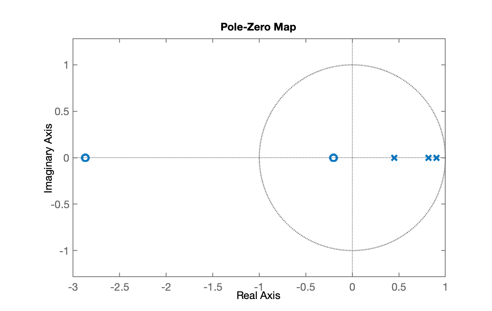
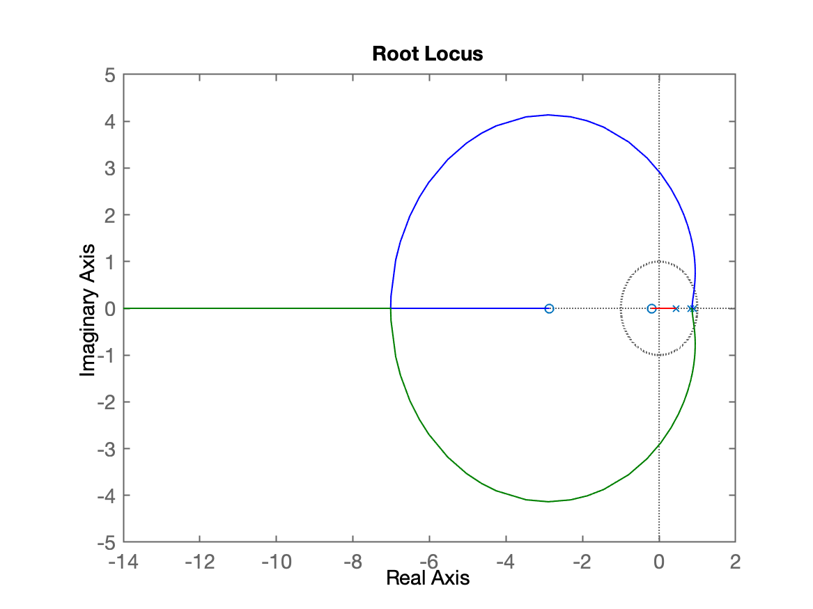
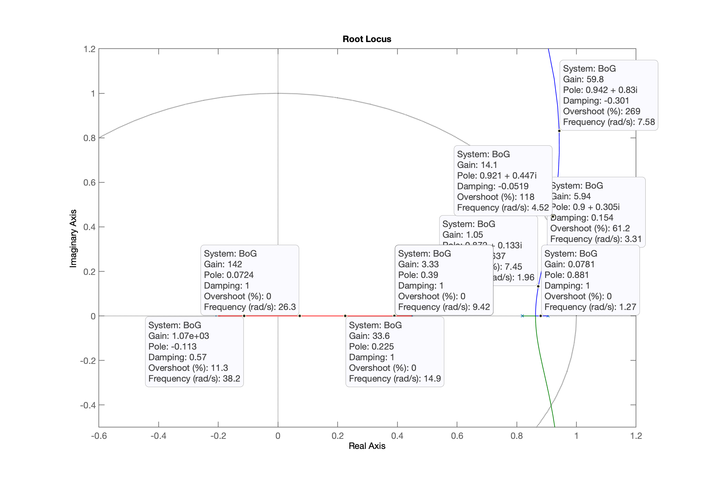
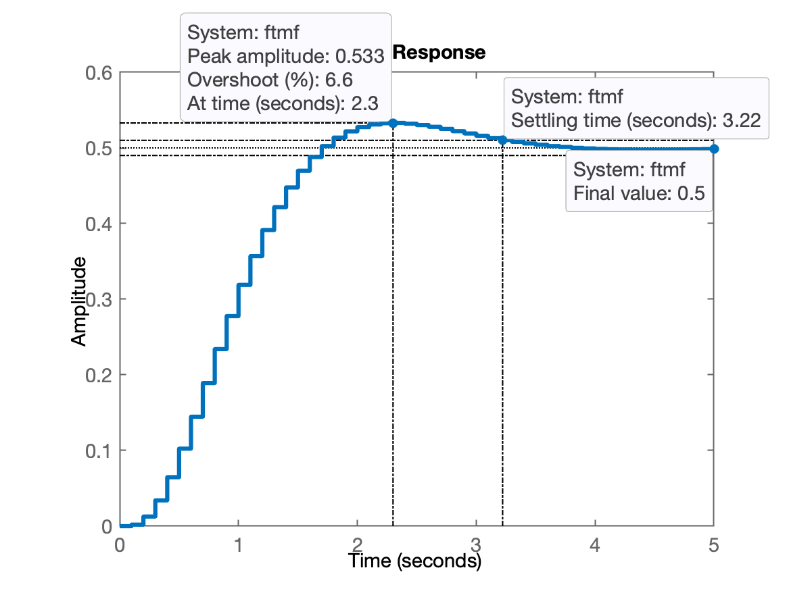
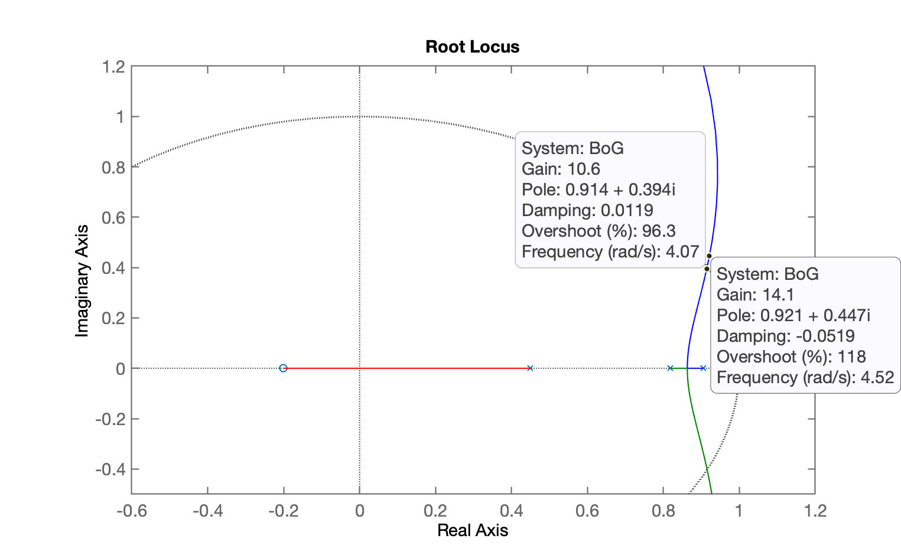
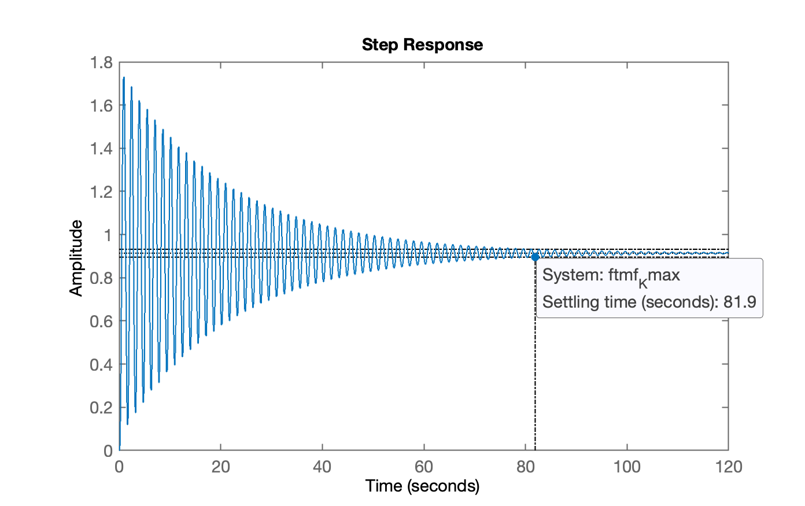
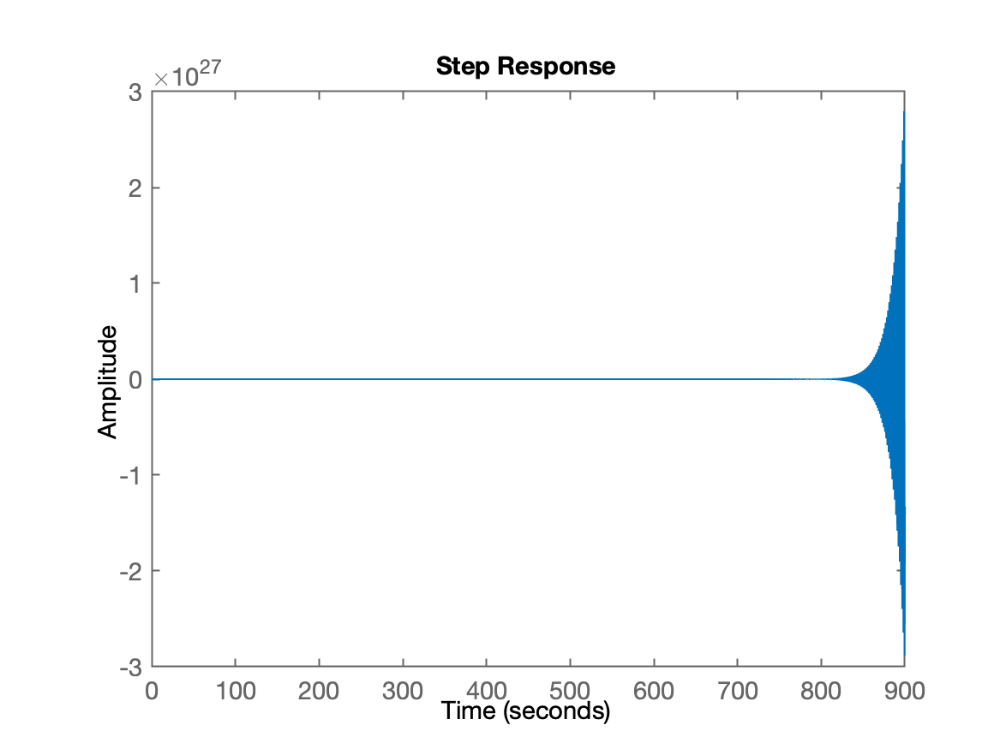
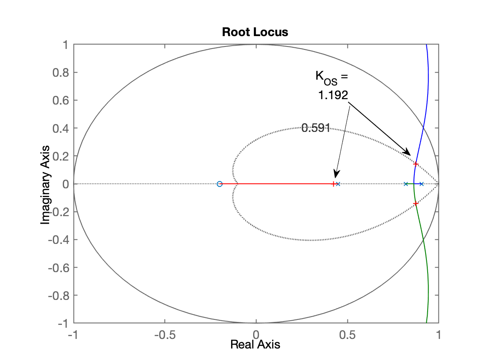

<font size="1">[Keppel South Central, Singapura](https://www.cnnbrasil.com.br/lifestyle/10-projetos-de-design-e-arquitetura-que-prometem-moldar-o-mundo-em-2024/)</font>

# Projeto de Controladores (Digitais)

Aula de 08/04/2024.

>  **Observações iniciais**:
>  Doravante na nossa aulas vamos usar a ferramenta numérica (computacional) Matlab para realizar os cálculos e esboçar os gráficos necessários. Mas além disto, vamos aproveitar facilidades que o Matlab traz para criação de um "diário" (arquivo texto) retratando os comandos usados numa seção de trabalho no Matlab e vamos salvar o dados num arquivo de dados do Matlab para facilitar a continuação de projetos de uma aula para a próxima.
>
>  📄 **Sugere-se fortemente** que o usuário inicie os trabalhos no Matlab com o comando `diary('<nome_arquivo_texto>')` em cada aula (seção de trabalho com o Matlab). Isto facilita a criação de um documento digital que reflete o que está sendo realizado em cada aula.
>
>  No caso deste registro em particular, avançaremos um pouco mais, e vamos aplicar comandos no Matlab, já supondo a criação de um arquivo texto compatível com [**notação Markdown**](https://www.markdownguide.org). No entanto, estes comandos que só servem para editores compatíveis com Markdown (por exemplo, o [Harropad](http://pad.haroopress.com), [Typora](https://typora.io) ou Visual Estudio Code usando extensões como: [Markdown All in One](https://marketplace.visualstudio.com/items?itemName=yzhang.markdown-all-in-one), [GitHub Markdown Preview](https://marketplace.visualstudio.com/items?itemName=bierner.github-markdown-preview), entre outros) serão precedidos pelo caracter `%` que para o Matlab significa um comentário (e assim evitamos mensagens de erro do Matlab tentando interpretar estes comandos). Para saber mais sobre como usaremos Markdown e o comando `diary()`nestas aulas, você pode consultar a página [Sugestões para uso do MATLAB nas aulas de Controle](https://fpassold.github.io/Controle_2/sugestao_uso_matlab_em_controle.html).
>
>  Este texto inclusive, foi iniciado aplicando-se o comando:
>
>  ```matlab
>  > diary aula_080402024.md
>  ```
>
> **Obs**.: Só existe um leve inconveniente em gerar arquivo `.md` diretamente do Matlab. Por padrão o Matlab cria arquivos texto ASCII usando codificação ISO do Windows antigo para os caracteres com acentuação e não o novo formato UTF-8 adotado pelos modernos editores Markdown. O que significa que antes de editar o arquivo gerado pelo Matlab num editor Markdown, seja bastante interessante mudar a codificação dos caracteres para o formato **UTF-8**.

Iniciando então os trabalhos... [:musical_note:](https://youtu.be/VImDFJyIrr4?si=O-bnNk3w1880RXQQ).

## Ingressando a planta

Suponha um sistema mecânico (ou "planta") caracterizado pela equação:

$G(s)=\dfrac{16}{(s+1)(s+2)(s+8)}$

Vamos amostrar este sistema usando período de amostragem de $T=0,1$ segundos.

Nossa malha fica algo como:


Devemos considerar o sustentador de ordem zero presente numa malha de controle digital e calcular o $BoG(z)$:

$BoG(z)=(1-z^{-1}) \mathbb{Z} \left\{ \dfrac{G(s)}{s}\right\}$

ou podemos usar a função `c2d()` do Matlab para realizar este cálculo:

```matlab
>> T = 0.1;
>> BoG = c2d(G, T)

BoG =

  0.002045 z^2 + 0.006274 z + 0.00118
  -----------------------------------
  z^3 - 2.173 z^2 + 1.515 z - 0.3329

Sample time: 0.1 seconds
Discrete-time transfer function.

>> zpk(BoG)         % apresenta a função BoG(z) num formato mais "amigável"

ans =

   0.0020446 (z+2.867) (z+0.2013)
  --------------------------------
  (z-0.9048) (z-0.8187) (z-0.4493)

Sample time: 0.1 seconds
Discrete-time zero/pole/gain model.
```

Podemos aproveitar para traçar um diagrama de pólo-zero no plano-z:

```Matlab
>> pzmap(BoG)
>> axis equal       % para o círculo unitário no plano-z parecer um círculo
```

O resultado por ser visto abaixo:



Vamos usar esta planta (sistema) para realizar projetos de diferentes controladores.


## Controlador Proporcional - Projeto 1

Nosso primeiro controlador é um simples controlador proporcional. Ou seja, simplesmente vamos fechar uma malha para o sistema anterior, apenas com um ganho. Inicialmente, vamos considerar que este ganho seja unitário, $K=1$.

Para simular este sistema em malha-fechada temos que determinar a função transferência da malha-fechada, dada pela equação:

$FTMF(z)=\dfrac{C(z)\cdot BoG(z)}{1 + H(z) \cdot C(z) \cdot BoG(z)}$

onde: $C(z)=$ equação (função transferência do controlador (neste caso, $C(z)=K$); 
$BoG(z)=$ versão "digitalizada" da planta considerando um sustentador de ordem-zero, e; 
$H(z)=$ função transferência do sensor usado para fechar a malha de controle.

>  Note que alguns sistemas de controle, quando modelados, incorporam a função transferência do sensor ou bloco de comunicação usado para medir a saída da planta e comunicar os dados. Esta função transferência, normalmente é chamada de $H(s)$. Na prática, quando usada, se assemelha à um filtro passa-baixas onde a frequência de corte corresponde à "banda passante" do sensor e eventualmente ainda incorpora um atraso no tempo (termo $e^{-\Delta\,t\cdot s}$) se for considerado algum atraso não desprezível na comunicação do sinal do sensor para a malha de controle (caso de sistemas de comunicação, sistemas com latência elevada). 
>
>  Normalmente se considera $H(s)=1$ o que significa que estamos negligenciando limitações de banda passante do sensor ou atrasos de comunicação. Normalmente se adota um sensor rápido o suficiente para controle do sistema e se existe atraso de comunicação ele é desprezível (mínimo) em relação aos tempos de resposta da planta (do sistema que se quer controlar).
>
>  Quando $H(z)=1$, estamos lidando com um sistema de **realimentação unitária**, e então:
>
>  $FTMF(z)=\dfrac{FTMA(z)}{1+FTMA(z)}$
>
>  onde: $FTMA(z) = $ equação de malha-direta do sistema (ou função transferência de malha aberta para sistemas com realimentação unitária).

O Matlab permite determinar a $FTMF(z)$ usando a função `feedback()` cuja sintaxe ou uso seria:

```Matlab
>> <tf-MF> = feedback(<tf-MA>, <tf-H>, <sinal-realimentação>)
```

onde: `tf=MF =` função transfência resultante do cálculo, a $FTMF(z)$; 
`tf-MA =` transfer function da equação de malha-direta, ou $FTMA(z) = C(z) \cdot BoG(z)$; 
`tf-H = ` transfer fucntion do sensor (ou canal de comunicação), no nosso caso, de realimentação unitária, $H(z)=1$; e,
`sinal-realimentação = ` sinal correspondente correspondente à realimentação adotada, no caso, um número: $1$ ou $-1$ que indica realimentação positiva (incomum) ou negativa respectivamente. Na maior parte dos casos, a realimentação é sempre negativa, então este terceito parâmetro seria $=-1$, mas o próprio Matlab já assume que normalmente a realimentação seja negativa, então o ingresso do 3o-parâmetro não é necessário (e neste caso, o Matlab interpreta que a realimentação seja negativa).

Voltando ao nosso caso:

```matlab
>> K=1;         % deixando claro que o ganho do controlador é unitário (estamos testando)
>> % fechando a malha...
>> ftmf = feedback(K*BoG, 1)    

ftmf =
 
  0.002045 z^2 + 0.006274 z + 0.00118
  -----------------------------------
  z^3 - 2.171 z^2 + 1.522 z - 0.3317
 
Sample time: 0.1 seconds
Discrete-time transfer function.
```

Note que esta equação em si não é importante. Mas pode nos interessar os **pólos de malha-fechada** do sistema. Eles nos permitem concluir se o sistema em MF ficou estável (todos os pólos de MF dentro do círculo unitário) ou instável (algum pólo de MF fora do círculo unitário)

Podemos separar os pólos de MF de um sistema de controle no Matlab usando a função `pole()`:

```matlab
>> pole(ftmf)       % mostra os pólos da FTMF(z)
ans =
      0.87205 +     0.1295i
      0.87205 -     0.1295i
      0.42676 +          0i
```

### Gráfico do *Root-Locus*

👉 Mas, mais interessante que isto, é plotar um gráfico que mostra **como os pólos de MF "caminham" no plano-z** se o usuário variasse o ganho de malha-fechada. Neste caso, como os pólos de MF caminhariam se o ganho do controlador fosse variado de um valor muito próximo de zero até um valor bem elevado ($0 < K < \infty$). Poderíamos fazer isto, realizando o cálculo de MF anterior para valores crescentes de $K$ e pedindo para o Matlab plotar o "caminho" formado pelas diferentes possições que seriam assumidas pelos pólos de MF. Este procedimento é conhecido como **diagrama do lugar geométrico das raízes**, ou mais simplesmente ***root-locus***. Para nossa sorte, o Matlab automatiza estes cálculos e já apresenta o resultado na forma de um gráfico no plano-z usando-se a função `rlocus()`:

```matlab
>> figure; rlocus(BoG)
```

Deve ter sido gerada uma figura como:



Podemos realizar um "zoom" manual sobre a figura ou amplificar a zona de observação no gráfico usando o comando `axis`:

```matlab
>> axis([-0.6 1.2 -0.5 1.2])
```

O "zoom" anterior concentrou a observação do *root-locus* (ou simplemente RL) sobre uma certa região:



Note que, clicando com o botão direito do mouse sobre pontos da curva, podemos incluir os "**data-tips**" ("balões") que  aparecem na figura anterior mostrando informações relevantes sobre o ponto selecionado.

>  Matematicamente é possível provar que todos os pólos de malha-aberta, à medida que o ganho de malha-fechada aumenta, "caminham" para os zeros de malha-aberta da $FTMA(z)$. O que "caminha" são os pólos de malha-fechada, e sua posição depende do ganho adotado -- como ser reparado nos *data-tips* mostrados na figura anterior. Repare na figura anterior, que quando se usa um ganho muito baixo, o pólo de MF está próximo do pólo de MA (ponto de partida dos traçados num RL). **Qualquer traçado no RL parte sempre dos pólos de MA da $FTMA(z)$ de um sistema**. A medida que o ganho aumenta, repare o pólo de MF "caminha". Para traçado manual do RL (sim, isto é possível, usando-se certas regras), parte-se sempre do pólo de MA localizado no lado mais extremo à direita no plano-z e se realiza um traçado na direção de $z=-\infty$. Eventualmente nesta trajetória, um pólo de MF encontra outro pólo de MF e então se produz um "choque", caracterizando um **ponto de partida**, ou ***break-out*** no *root-locus* e neste caso, os pólos de MF "sobem" e "descem" no plano-z, isto é, assumem números complexos (sempre foram números complexos) com parte imaginária não nula. Em alguns casos, estes pólos continuam sua trajetória descrevendo retas que apenas "sobem" ou "descem" (a parte imaginária do númere assume valores cada vez maiores). Em outros casos, como este, os pólos de MF, descrevem uma espécie de círculo no plano-z e à partir de certo valor (elevado) de ganho, eles voltam a assumir apenas valores reais (a parte imaginária volta à ser nula -- este ponto é chamado de **ponto de chegada** ou de ***break-in***) e neste caso, um dos pólos de MF seguiu na direção de $z \to -\infty$ e o outro pólo de MF foi na direção do zero de MA localizado em $s=-2,867$.
>   
>   Note ainda que existe **um traçado no RL para cada pólo do sistema**. No caso, note que são 3 curvas (a $FTMA(z)$ neste caso possui 3 pólos). Repare que o pólo de MA mais "interno", localizado em $z=-0.4493$ caminhou na direção do zero de MA localizado em $z=-0.2013$ (linha vermelha).

No nossso caso, vamos contar com a função `rlocus()` do Matlab para nos ajudar a traçar o *root-locus* de um sistema em MF. 

Na realidade, vamos usar esta **ferramenta de projeto** para controladores digitais. Neste caso, esta técnica de projeto seria chamada: **projeto usando lugar geométrico das raízes** ou mais simplesmente **projeto usando *root-locus***.

Apesar do `rlocus()`  poder antecipar como o sistema vai se comportar no tempo discreto ($kT$), o `rlocus()` sozinho não mostra como o sistema responde para determinado valor de ganho.

Se quisermos saber como o sistema responde para uma referência (sinal de "*set-point*") que é uma "**entrada degrau**, ou seja, que corresponde à uma constante de amplitude qualquer, que varia do valor zero até o valor desejado instantaneamente, temos que fechar a malha do sistema (calcular a $FTMF(z)$), considerando esta esta referência (sua transformada-z: $R(z)$), para calcular a saída deste sistema, primeiro no plano-z: $Y(z)$ e então realizar a transformada-z inversa sobre $Y(z)$ para finalmente obter a resposta no tempo discreto: $y[kT]$. Ou seja, realizar algo como:

$\begin{array}{rcl} Y(z) & = & \underbrace{R(z)}_{\text{Degrau}} \cdot FTMF(z)\\ & \downarrow & \mathbb{Z}^{-1}\\ y[kT] & = & y[0]z^0 + y[1]z^{-1} + y[2]z^{-2} + \ldots + y[\infty]z^{\infty}\end{array}$

E claro, necessitamos "graficar" esta resposta.

O Matlab facilita estes cáclulos usando-se a função `step()`:

```matlab
>> % Resposta temporal para entrada degrau unitário e para K=1
>> figure; step(ftmf)
```

A resposta do sistema de MF para uma entrada degrau unitário pode ser vista no gráfico à seguir:



Percebe-se um tipo de **resposta sub-amortecida** (com algum *overshoot* ou sobre-sinal), típica de sistema com pólos complexos em MF. Se for caso, revise o item [Respostas temporais típicas de Processos Industriais](https://fpassold.github.io/Process_Sinais_Controle_ECP/4_Respostas_Sistemas.pdf).

### Determinação de $K_{max}$

**Mas o que acontece se usamos um ganho muito elevado num sistema?**

O gráfico anterior, mostrou a resposta temporal de um sitema em MF para entrada degrau unitário quando o ganho do controlador foi unitário, $K=1$. 

Mas e se este ganho fosse maior? E aqui começa a entrar a utilidade do diagrama de *root-locus*. 

> Pela teoria já vista sobre transoformada-z e resposta de sistemas lineares no tempo, sabemos que se por acaso, um pólo de MF cruzar o circuito unitário, que o sistmea fica instável (sua amplitude, resposta de saída, só aumenta). O limite para esta situação é quando algum pólo de MF se localiza exatamente sobre o círculo unitário, com seu módulo valendo exatamente 1 (podemos interpretar graficamente isto como um raio de comprimento unitário). Note que este pólo pode ser real ou complexo. E basta apenas 1 pólo de MF com módulo $>1$ para que o sistema se torne instável. Se um par de pólos complexos (conjugados) se localizar exatamente sobre o círculo unitário teremos uma **resposta oscilatória no limite da estabilidade**, uma senóide com certa defasagem e frequênica de oscilação, valor médio não-nulo, mas com amplitude "sustentada", ou seja, que não aumenta nem diminui, mesmo passando muito tempo de operação (ou simulação). Obviamente não é desejável manter esta condição (este valor de ganho num sistema de MF) por muito tempo, mas esta oscilação (frequência e ganho) pode ser útil para sintonizar controladores.

No nosso caso, podemos revisitar o gráfico do *root-locus* e tentar descobrir o valor limite de ganho, chamado de **ganho máximo** ($K_{max}$) ou ***ultimate gain*** ($K_u$).

Testando o ganho máximo aplicácel num sistema:



Parece resultar num $K_{max} \approx 10,6$. Fechando a malha com este valor para comprovar a resposta:

```matlab
>> K_max = 10.6;
>> ftmf_Kmax = feedback(K_max*BoG, 1);
>> figure; step(ftmf_Kmax)
```

Deve ter sido obtido o gráfico abaixo:



Notamos que este valor de $K$ ainda não corresponde ao ganho máximo. Vamos aumentá-lo um pouco:

```matlab
>> K_max = 12;
>> ftmf_Kmax = feedback(K_max*BoG, 1);
>> figure; step(ftmf_Kmax)
```

O que deve ter resultado no seguinte gráfico:



Notamos então que: $10,6 < K_{max} < 12$. O valor exato pode ser calculdo se for usado o **Método de Juri** associado com determinação de estabilidade de sistemas no plano-z. Mas este método está fora do escopo desta disciplina. Ele pode ser visto no [vídeo](https://www.youtube.com/watch?v=90jHX8YVWhQ) do Prof. Luiz Antônio Aguirre da UFMG (13 minutos).

### Calculando erro de regime permanente

Voltando ao nosso caso, mesmo que um ganho seja fixado para determinado controlador, não significa que o sistema responda da forma desejada e sem erro. Neste caso, o erro de regime permanente pode ser elevado. 

Neste caso em particular, nossa planta é um sistema tipo 0 (sem integrador) e a entrada (referência) é do tipo Degrau, o que implica que a malha-fechada do mesmo sempre vai resultar em algum erro. 


Este erro só poderá ser anulado com acréscimo da ação integral. Rever [Teoria do Erro](https://fpassold.github.io/Controle_3/4_teoria_erros/resumo_teoria_erro.html) se for o caso.

Repare no primeiro gráfico de resposta à entrada degrau, que a referência, *set-point*, valor final desejado para o sistema era $r[\infty]=1$ e repare que o sistema estabilizou em $y[\infty] = 0,5$. O que significa um erro enorme de 50%. Lembre que:

$E(z)=R(z)-Y(z)$

ou:

$e[\infty]=r[\infty] - y[\infty]$

Podemos usar o Matlab para calcular este erro.

Calculando o erro de MF para o caso de $K=1$:

```matlab
>> dcgain(ftmf)         % permite descobrir y[∞]
ans =
          0.5
>> erro = ((1-dcgain(ftmf))/1)*100
erro =
           50
```

> **Nota sobre a função `dcgain()` do Matlab**:
>
> Note que na realidade a função `dcgain(<tf>)` do Matlab realiza o seguinte cálculo, para o caso da transfer funcion, `<tf>`, passada como argumento de entrada estiver no plano-z:
> 
> $\text{dcgain(F)} = \displaystyle\lim_{z \to 1} \cancel{(z-1)} \cdot \underbrace{\dfrac{z}{\cancel{(z-1)}}}_{Degrau} \cdot F(z) = 1 \cdot \lim_{z \to 1} F(z)$
> 
> ou seja, descobre o valor final, em $kT \to \infty$ do sistema representado pela `tf` quando aplicada uma entrada degrau no mesmo.
>
> Então, neste caso, calcular `dcgain(ftmf)` termina por determinar a saída final do sistema no tempo discreto ($kT$) quando o mesmo é submetido a uma entrada degrau, justamente o que foi feito neste teste (usamos como referência, uma "entrada degrau").


## Controlador Proporcional - Projeto 2

A ideia agora é determinar que valor de ganho deveria ser adotado em função do **erro máximo tolerado** (ou especificado) para o sistema (em malha-fechada). Isto é chamado de "**requisito de controle**". Neste caso:

* $e(\infty)=20\%$

Podemos prever (determinar) este erro lembrando da [Teoria do erro](https://fpassold.github.io/Controle_3/4_teoria_erros/resumo_teoria_erro.html).

Neste caso, é usada uma entrada degrau como referência e a planta é um sistema do tipo 0 (sem integrador), então:

$e_{step}=\dfrac{1}{1+K_p}$		(eq. (1))

onde: 

$K_p = \displaystyle\lim_{z \to 1} FTMA(z)$

> $K_p = $ constante (do erro estático) de posição.

Neste caso é desejado: $e(\infty)=20\%=0.2$ (para degrau unitário, $r[\infty]=1,0$). Considerando este valor na eq. (1):

$0,2 = \dfrac{1}{1+K_p}$

$0,2(1+K_p)=1$

isolando $K_p$ obtemos:

$K_p=\dfrac{1-0,2}{0,2}$

Usando Matlab para determinar o valor desejado para $K_p$:

```Matlab
>> Kp=(1-0.2)/0.2
Kp =
     4
```

Agora nos falta calcular o $K_p$ deste sistema:

$K_p = \displaystyle\lim_{z \to 1} FTMA(z) = \displaystyle\lim_{z \to 1} K \cdot BoG(z) = K \cdot \displaystyle\lim_{z \to 1} BoG(z)$

podemos usar a função `dcgain()` para calcular $\displaystyle\lim_{z \to 1} BoG(z)$:

```Matlab
>> dcgain(BoG)
ans =
            1
```

ou podemos fazer isto manualmente:

$BoG(z) = \dfrac{0,0020446 (z+2,867) (z+0,2013)}{(z-0.9048) (z-0.8187) (z-0.4493)}$

$\displaystyle\lim_{z \to 1} BoG(z) = \dfrac{0,0020446 (1+2,867) (1+0,2013)}{(1-0.9048) (1-0.8187) (1-0.4493)} = \dfrac{0,009498}{0.0095049} = 0,99927 \approx 1,0$

Usando Matlab:

```matlab
>> numerador = 0.0020446*(1+2.867)*(1+0.2013)
numerador =
     0.009498
>> denominador = (1-0.9048)*(1-0.8187)*(1-0.4493)
denominador =
    0.0095049
>> numerador/denominador
ans =
      0.99927
```

Mas se estamos usando o Matlab e temos acesso a *transfer function* de $BoG(z)$, este cálculo pode ser feito com muito mais precisão, lembrando que uma *transfer-funciton* é formada por um polinômio (vetor para o Matlab) no seu numerador e outro polinômio (vetor para o Matlab) no seu denominador e então podemos usar a função `polyval()` para substituir determinado valor dentro de um polinômio e assim determinar o valor final, ou:

```matlab
>> [num,den]=tfdata(BoG,'v')	% permite extrair o N(z) e D(z) de uma transfer-function
num =
            0    0.0020446    0.0062741    0.0011804
den =
            1      -2.1729       1.5153     -0.33287
```

> A função `tfdata()` permite extrair dados desejados de um objeto *transfer-function* no Matlab.
> Neste caso, desejamos "extrair" o polinõmio do numerador, $N(z)$ e do denominador, $D(z)$ que compõe a *transfer-function* associada com o $BoG(z), ou:
>
> $BoG(z)=\dfrac{N(z)}{D(z)}$. 
>
> Para tanto, além de passar como primeiro argumento de entrada a ´própria função transferência, se passa como segundo argumento de entrada, a *string* `-v`, que significa *-verbouse*.

Note que no resultado anterior:

```
num =       z^3  z^2          z^1          zˆ0
            0    0.0020446    0.0062741    0.0011804

den =       z^3    z^2           z^1        zˆ0
            1      -2.1729       1.5153     -0.33287
```

compare com:

```matlab
>> BoG

BoG =
 
  0.002045 z^2 + 0.006274 z + 0.00118
  -----------------------------------
  z^3 - 2.173 z^2 + 1.515 z - 0.3329
 
Sample time: 0.1 seconds
Discrete-time transfer function.
```

então agora necessitamos substituir no lugar de $z$ o valor $1$, usando a função `polyval()`:

```matlab
>> numerador = polyval(num, 1)
numerador =
    0.0094991
>> denominador = polyval(den, 1)
denominador =
    0.0094991
>> numerador/denominador
ans =
            1
```

ou seja, $\displaystyle\lim_{z \to 1} BoG(z) = 1$

Voltando à determinação do ganho $K$, necessário para manter o o erro dentro de determinado valor, temos então:

$K_p = K \cdot \underbrace{\displaystyle\lim_{z \to 1} BoG(z)}_{\text{>> dcgain(BoG)}} = K \cdot 1$

como $K_p$ desejado é igual à 4, então:

$K = 4$

este deveria ser o valor do ganho proporcional à ser usado neste sitema para garantir o erro de regime permanente limitado aos 20% desejados.

Fechando a malha com $K=4$ e verificando o $e(\infty)$:

```matlab
>> K=4;
>> ftmf_K4 = feedback(K*BoG, 1);
>> figure; step(ftmf_K4)
```

E então obtemos o seguinte resultado para a entrada degrau unitário:


Podemos usar a função `stepinfo()` do Matlab para nos mostrar a características de resposta ressaltadas no gráfico na forma de balões:

```matlab
>> stepinfo(ftmf_K4)

        RiseTime: 0.5
    SettlingTime: 5
     SettlingMin: 0.66163
     SettlingMax: 1.1238
       Overshoot: 40.48
      Undershoot: 0
            Peak: 1.1238
        PeakTime: 1.2

>> % Calculando o erro:
>> erro = ((1-dcgain(ftmf_K4))/1)*100
erro =
           20
```


## Controlador Proporcional - Projeto 3

Neste caso, o usuário (cliente) especifica um **valor máximo tolerável de *overshoot* (sobre-sinal)**.

Vamos supor que seja: $\%OS \le 10\%$.

Lembrando da teoria associada com [Respostas temporais de sistemas](https://fpassold.github.io/Process_Sinais_Controle_ECP/4_Respostas_Sistemas.pdf).


Notamos que existe uma forma de determinar o valor da constante de amortecimento $\zeta$ para sistemas de 2a-ordem em MF, se conhecemos o valor de $\%OS$ (percentual de *overshoot*):

$\zeta=\dfrac{-\ln(\%OS/100)}{ \sqrt{\pi^2+\ln(\%OS/100)^2 } }$

O interessante é que uma "**linha guia**" no plano-z (ou seja no diagrama de *root-locus*) pode ser traçada no RL). Esta linha-guia representa **pólos de MF de 2a-ordem que resultam num mesmo valor de $\%OS$ ou de $\zeta$**. Para traçar esta linha guia, usamos a função ´zgrid()` no Matlab.

Usando o Matlab:

```matlab
>> OS=10; 		% Overshoot máximo tolerado
>> zeta=(-log(OS/100))/(sqrt(pi^2+(log(OS/100)^2))) 	% calculado o correspondente zeta
zeta =
      0.59116
>> figure; rlocus(BoG)
>> hold on; zgrid(zeta, 0)
>> axis([-1 1 -1 1])            % para concentrar o gráfico do RL na região desejada
>> [K_OS,polosMF] = rlocfind(BoG)
Select a point in the graphics window
selected_point =
      0.86967 +    0.14241i
K_OS =
        1.192
polosMF =
       0.8737 +    0.14191i
       0.8737 -    0.14191i
      0.42306 +          0i
```

O RL ressaltando o ponto desejado aparece na próxima figura:



*Falta terminar... aula atingiu seu final em 08/04/2024. Continuação na próxima aula...*

---

### Encerrando uma seção de trabalho no Matlab

Não esquecer de aplicar os comandos a seguir para salvar os dados necessários para continuar este projeto na próxima aula:

```matlab
>> save planta      % salva os dados (variáveis do workspace) no arquivo planta.mat
>> diary off        % fecha o arquivo texto diário criado nesta seção de trabalho
>> quit				% fecha o Matlab
```

Fim.

---

Prof. Fernando Passold, em 11/04/2024.

